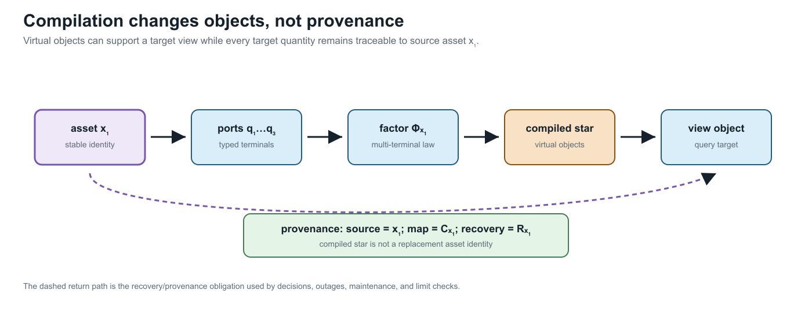

# [Executable running network](@id executable-running-network)

**Page status:** executable fixture, local solver evidence, and a derived
state-conditioned radiality witness; claims are versioned and
verification-scoped.

## Status and purpose

**Empirical artifact, version 0.1.0.** The semantic specification now has a
numerical realization in `data/running-network/v0.1.0.json`. The fixture is
synthetic. Its values are chosen to make representation choices observable, not
to recommend equipment ratings or a particular feeder design.

BMOPFTools is the first implementation platform because its model retains
ordered conductor terminals, full impedance matrices, explicit grounding,
parallel branches, switches, and an independent `n_winding` transformer model.
The book-level specification remains implementation independent.

## What is realized

| Object class | Source identities | Numerical feature under test |
| --- | --- | --- |
| buses | ``i_0,\ldots,i_6`` | nonuniform ordered terminal sets |
| switch | ``w_0`` | fixed closed state and per-conductor current limits |
| parallel lines | ``\ell_1,\ell_2`` | distinct full impedances and distinct limits |
| coupled line | ``\ell_3`` | full four-conductor series matrix |
| mapped line | ``\ell_4`` | ``[a,c,n]\mapsto[c,a,n]`` conductor permutation |
| grounding | ``h_n`` | finite neutral-to-earth admittance at ``i_2`` |
| transformer | ``x_1`` | WYE--WYE--DELTA three-winding model with winding limits |
| loads | ``d_1,d_2,d_3,d_4`` | unbalanced wye, single-phase, and delta demand |
| generator | ``g_1`` | bounded continuous active and reactive decisions |

BMOPFTools requires each single-phase load to be a two-terminal component. The
source load ``d_2`` is therefore compiled into `d2a` and `d2c`. That realization
is recorded explicitly rather than silently redefining a partial-wye object.

## Six views of the same source


The panels are not levels in a single hierarchy. The provenance artifact also
contains a non-visual simple-topology quotient used by the cycle and radiality
definitions:

1. the asset/property view retains stable physical identity;
2. the terminal view exposes ordered conductor mappings and grounding;
3. the bus--branch multigraph supports conventional network algorithms while
   retaining ``\ell_1`` and ``\ell_2`` separately. In the figure, ``x_1^*`` is
   an explicitly labelled compiled star used to draw the multi-terminal device;
   it is not a claim that the transformer is physically three two-terminal lines;
4. the port--factor view represents ``x_1`` as one factor of arity three;
5. the OPF graph makes variables, constraints, limits, and decisions explicit;
6. the sparsity graph records numerical coupling but does not claim that a
   nonzero is a physical branch.

Every generated view must retain a source map. A label such as `Phi_x1` is a
generated factor identity with `source = x1`; it is not a replacement asset ID.
The complete maps for the six illustrated views, together with the derived
simple-topology quotient, are generated in
`experiments/generated/view-source-maps.json`. Automated checks require every
generated object to identify an existing fixture source and bind the map to the
exact fixture and figure hashes.



The lineage is the operational companion to the view figure: virtual compiled objects are allowed, but source identity, map identity, and recovery remain available for limits, outages, maintenance, and decisions.

## Executed checks

The generation script parses the exported BMOPF JSON, runs JSON-schema and
model-conformance checks, solves a determined power flow, and solves an OPF with
``g_1`` dispatchable. The current artifact reports:

| Check | Result |
| --- | ---: |
| schema valid | yes |
| validation errors | 0 |
| validation warnings | 0 |
| expected map diagnostic | `I.TMAP.CROSS_PHASE_LINE` |
| expected map diagnostic | `I.TMAP.PERMUTED_ORDER` |
| power-flow termination | `LOCALLY_SOLVED` |
| power-flow active loss | 554.317 W |
| OPF termination | `LOCALLY_SOLVED` |
| OPF objective | -13.2000 |

The negative generator cost is a test device that drives ``g_1`` to its active
power bounds, making the continuous decision observable. The objective has no
economic interpretation. Both the cost and this interpretation must change
before the case is used for an economic study.

## Reproduce the recorded review case

The September review adds an isolated run with a recorded Julia environment,
case-source hashes, and an explicit BMOPFTools commit. From the repository root:

```sh
bash scripts/reproduce_clean_fixture.sh --check
bash scripts/reproduce_clean_fixture.sh
```

The first command validates recorded input hashes. The second requires the
Julia version recorded in the profile, clones the pinned dependency into a
fresh run directory, installs the locked environment, regenerates the fixture,
compares selected numerical outputs with declared tolerances, and runs the
verification lesson. The recorded export uses a different schema URI from the
August fixture; the workflow checks equality of all engineering fields and
records that metadata difference. Pinned replay additionally checks the exact
recorded export hash. It prints the run directory and retains its inputs,
resolved environment, results, and execution log. It never replaces the
maintained evidence. Add `--offline` when the pinned Julia packages are cached.
Use `--output /path/to/a/new/run` to choose a new directory outside the repository.

The profile is in `experiments/reproduction/review-2026-09-06/`. It binds the
specific case sources by hash because this is an author-review working-tree
snapshot, not a newly published book commit. It is a new recorded run; it does
not repair missing metadata in an earlier experiment. Profile validation fails
if a bound input changes. For a fresh development check instead, use:

```sh
bash scripts/reproduce_clean_fixture.sh --mode current
```

Current mode uses the dependency repository's HEAD and resolves dependencies
afresh. It tests the fixture and scoped verification but does not claim the
pinned numerical comparison. Readers should use these isolated commands when
comparing evidence; direct `run_*.jl` generators are maintainer commands that
can replace artifacts in the working tree.

### Historical August record

The preserved August fixture record at BMOPFTools commit
`b7aa9a1bb48bcc8b790d3bcf5417d6a32036352a` remains under
`experiments/generated/clean-reproduction`. Its complete resolved environment
was not recorded. Its original `generated_at` date was emitted as a constant
by the old generator and must not be treated as authenticated execution time.
The current generator separates fixture definition date from the actual UTC
run timestamp. New run metadata is separate from deterministic fixture identity.

An explicitly requested historical reconstruction can use the old dependency
revision with freshly resolved dependencies:

```sh
bash scripts/reproduce_clean_fixture.sh --mode historical-reconstruction
```

That operation does not reconstruct the missing historical environment, does
not run newer verification APIs unavailable at the old revision, and makes
no full historical numerical-replay claim. It writes to a fresh directory.

## Check the returned solution

The current verification exercise can also run directly, without writing files:

```sh
julia --project=experiments experiments/lessons/verify_running_network.jl
```

It calls BMOPFTools `profile_solution` for supported voltage, device-limit,
load-law, and network power-balance checks. It also calls the package's
`line_yprim` for every line, evaluates each terminal-current map at the
returned complex voltages, and compares the recovered currents with the
reported currents. The comparison includes the `l4` conductor permutation.
The declared absolute tolerances are ``10^{-5}`` A for line-current
consistency and ``10^{-3}`` W/var for the reported network power balances.
They are numerical acceptance tolerances for this fixture, not measurement
accuracy or a global optimality guarantee.

A second result adds 1000 V to the real part of terminal `i2.a`, updates its
magnitude and angle consistently, and leaves the reported currents untouched.
It must trigger a voltage-limit finding and fail line-current recovery.
The original result remains unchanged. Active-bound and initialization findings
are retained in the report rather than treated as execution failures.

**Evidence boundary.** Post-solve evaluation is separate from the JuMP
constraints, but the inputs and package primitive construction are shared.
The profile's network power balance uses reported device powers/losses; the
additional line recovery independently checks consistency with line primitives.
This does not independently recalculate every transformer/device equation or
nodal KCL from the original physical specification.

Accordingly, calling `check_solved_network_feasibility` on this result returns
`indeterminate`: its required full independent residual bundle is absent.
The lesson asserts that refusal. Supplying zeros for missing residuals would
be an invalid way to obtain a pass. Full all-device/KCL verification remains
a package-owned extension, and physical model adequacy requires other evidence.

### Version 0.1.0 realization boundary

The versioned fixture is the current numerical contract, not a silent completion
of every object in the semantic specification. It includes the declared ``d_4``
delta demand and ``h_{\mathrm{ref}}`` tertiary reference shunt, and it retains
``w_0`` as a fixed closed switch. It does not add an undeclared ``g_2`` generator
or any other convenience object merely to make a continuous solve look more
complete. Future fixture versions may promote semantic-only controls, but must
change the version, source hashes, and provenance together.

### Derived running-network topology states

The generated
`experiments/generated/running-network-radiality-witness.json` lifts the
topology predicates to this same fixture without changing version 0.1.0's
continuous PF/OPF contract. It retains the four line identities, the ``w_0``
switch, the two compiled transformer winding connections, and every ordered
terminal map. Four derived states are compared: base switch closed, switch
open, ``l_2`` outage, and the combined switch-open/``l_2``-outage state.

The base and switch-open states remain member-nonradial because ``l_1`` and
``l_2`` are parallel members, even though their simple adjacency projection is
radial. Removing ``l_2`` removes that member cycle. The witness therefore
reports both predicates and preserves transformer-factor provenance rather
than treating the bus quotient as the source topology.

## What remains semantic-only

The fixture currently treats ``w_0`` as fixed closed. Discrete switching,
contingency selection, investment choices, measurements, and protection zones
remain in the semantic specification but are not claimed as executable in
version 0.1.0. This boundary prevents a successful continuous OPF from being
mistaken for validation of the full decision model.
