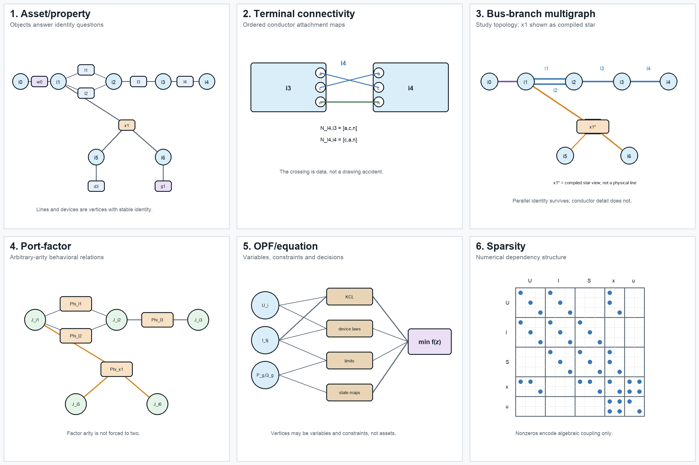

# Executable running network

## Status and purpose

**Empirical artifact, version 0.1.0.** The semantic specification now has a
numerical realization in `data/running-network/v0.1.0.json`. The fixture is
synthetic. Its values are chosen to make representation choices observable, not
to recommend equipment ratings or a particular feeder design.

BMOPFTools is the first implementation platform because its model retains
ordered conductor terminals, full impedance matrices, explicit grounding,
parallel branches, switches, and an independent `n_winding` transformer model.
The book-level specification remains implementation independent.

## What is realized

| Object class | Source identities | Numerical feature under test |
| --- | --- | --- |
| buses | ``i_0,\ldots,i_6`` | nonuniform ordered terminal sets |
| switch | ``w_0`` | fixed closed state and per-conductor current limits |
| parallel lines | ``\ell_1,\ell_2`` | distinct full impedances and distinct limits |
| coupled line | ``\ell_3`` | full four-conductor series matrix |
| mapped line | ``\ell_4`` | ``[a,c,n]\mapsto[c,a,n]`` conductor permutation |
| grounding | ``h_n`` | finite neutral-to-earth admittance at ``i_2`` |
| transformer | ``x_1`` | WYE--WYE--DELTA three-winding model with winding limits |
| loads | ``d_1,d_2,d_3,d_4`` | unbalanced wye, single-phase, and delta demand |
| generator | ``g_1`` | bounded continuous active and reactive decisions |

BMOPFTools requires each single-phase load to be a two-terminal component. The
source load ``d_2`` is therefore compiled into `d2a` and `d2c`. That realization
is recorded explicitly rather than silently redefining a partial-wye object.

## Six views of the same source



The panels are not levels in a single hierarchy. The provenance artifact also
contains a non-visual simple-topology quotient used by the cycle and radiality
definitions:

1. the asset/property view retains stable physical identity;
2. the terminal view exposes ordered conductor mappings and grounding;
3. the bus--branch multigraph supports conventional network algorithms while
   retaining ``\ell_1`` and ``\ell_2`` separately. In the figure, ``x_1^*`` is
   an explicitly labelled compiled star used to draw the multi-terminal device;
   it is not a claim that the transformer is physically three two-terminal lines;
4. the port--factor view represents ``x_1`` as one factor of arity three;
5. the OPF graph makes variables, constraints, limits, and decisions explicit;
6. the sparsity graph records numerical coupling but does not claim that a
   nonzero is a physical branch.

Every generated view must retain a source map. A label such as `Phi_x1` is a
generated factor identity with `source = x1`; it is not a replacement asset ID.
The complete maps for the six illustrated views, together with the derived
simple-topology quotient, are generated in
`experiments/generated/view-source-maps.json`. Automated checks require every
generated object to identify an existing fixture source and bind the map to the
exact fixture and figure hashes.

## Executed checks

The generation script parses the exported BMOPF JSON, runs JSON-schema and
model-conformance checks, solves a determined power flow, and solves an OPF with
``g_1`` dispatchable. The current artifact reports:

| Check | Result |
| --- | ---: |
| schema valid | yes |
| validation errors | 0 |
| validation warnings | 0 |
| expected map diagnostic | `I.TMAP.CROSS_PHASE_LINE` |
| expected map diagnostic | `I.TMAP.PERMUTED_ORDER` |
| power-flow termination | `LOCALLY_SOLVED` |
| power-flow active loss | 554.317 W |
| OPF termination | `LOCALLY_SOLVED` |
| OPF objective | -13.2000 |

The negative generator cost is a test device that drives ``g_1`` to its active
power bounds, making the continuous decision observable. The objective has no
economic interpretation. Both the cost and this interpretation must change
before the case is used for an economic study.

## Reproducibility boundary

Run the complete slice from the repository root:

```sh
julia --project=experiments experiments/run_vertical_slice.jl
julia --project=experiments experiments/test/runtests.jl
```

The generated provenance record includes Julia and package versions, the local
BMOPFTools commit, a tracked-diff hash, and hashes of untracked files. The normal
development run records local modifications accurately.

An isolated reproduction now clones the committed BMOPFTools revision into a
temporary directory, runs the fixture and all tests there, and verifies that the
exported fixture is byte-identical to the canonical artifact:

```sh
bash scripts/reproduce_clean_fixture.sh
```

Fixture version 0.1.0 passes at clean BMOPFTools commit
`b7aa9a1bb48bcc8b790d3bcf5417d6a32036352a`. The clean provenance, validation,
PF, and OPF outputs are retained under
`experiments/generated/clean-reproduction`. This establishes a pinned local
reproduction at that commit; it is not a tagged BMOPFTools release, a guarantee
of bit-identical nonlinear solver iterates, or an independent-solver result.

### Version 0.1.0 realization boundary

The versioned fixture is the current numerical contract, not a silent completion
of every object in the semantic specification. It includes the declared ``d_4``
delta demand and ``h_{\mathrm{ref}}`` tertiary reference shunt, and it retains
``w_0`` as a fixed closed switch. It does not add an undeclared ``g_2`` generator
or any other convenience object merely to make a continuous solve look more
complete. Future fixture versions may promote semantic-only controls, but must
change the version, source hashes, and provenance together.

## What remains semantic-only

The fixture currently treats ``w_0`` as fixed closed. Discrete switching,
contingency selection, investment choices, measurements, and protection zones
remain in the semantic specification but are not claimed as executable in
version 0.1.0. This boundary prevents a successful continuous OPF from being
mistaken for validation of the full decision model.
