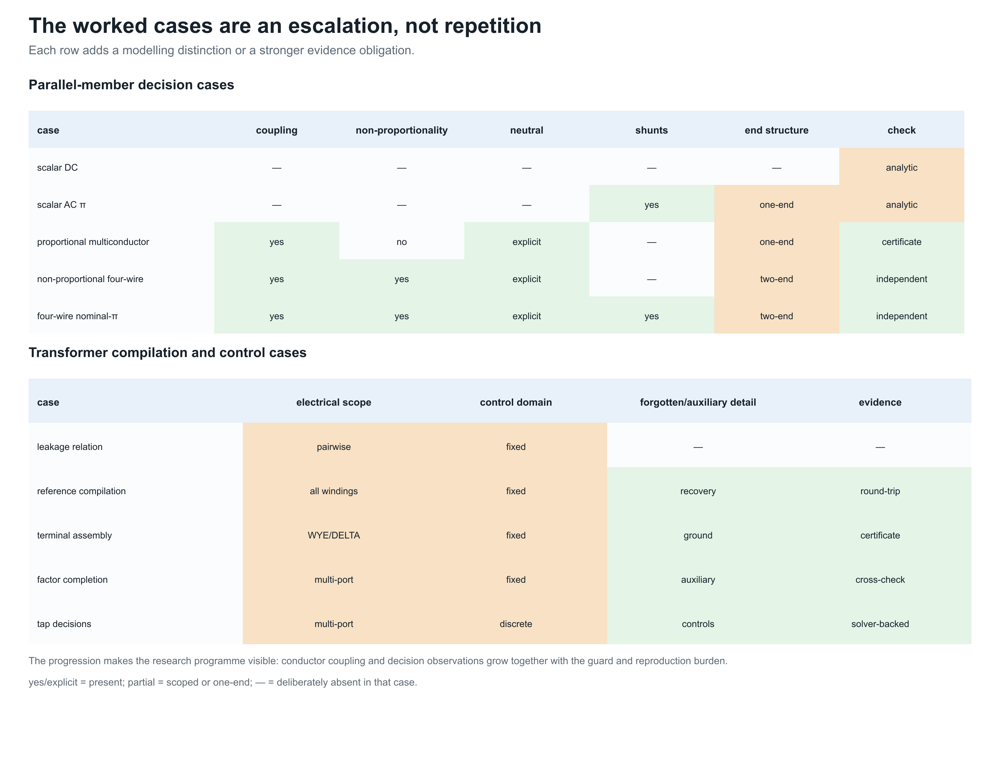
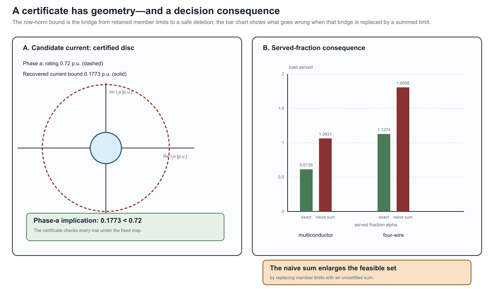

# [Multiconductor parallel AC decision case](@id multiconductor-parallel-ac-case)

**Page status:** guarded multiconductor decision case with executable
redundancy certificates; general state-dependent classification remains open.

This is the multiconductor specialization of the canonical parallel-member
failure in [the first scalar counterexample](@ref first-failure-parallel-branches).
That chapter owns the general warning: an aggregate terminal relation does not
automatically preserve member-constrained decisions. The present chapter adds
coupling, complex voltages, and AC power balance without restating that warning
as a separate modelling claim.

The scalar parallel example shows the feasible-set mechanism with almost no
algebra. This case retains complex conductor voltages, mutual impedance,
phase-to-neutral power, voltage bounds, and nonlinear AC power balance. Its
purpose is to test whether the same representation failure changes an AC
decision optimum.



The grid explains why the later cases are not repetitions of the scalar
example. Coupling, explicit neutrals, end shunts, two-end observations, and
control decisions are added deliberately; the evidence obligation grows with
the model rather than being hidden behind a larger diagram.




## Source model

Two buses ``i`` and ``j`` have ordered conductor set ``(a,n)``. The sending
voltage is fixed at

```math
\mathbf U_i=(1,0)^{\mathsf T}\ \mathrm{p.u.}
```

and two parallel members satisfy

```math
\mathbf I_{\ell i j}
=\mathbf Y_\ell(\mathbf U_i-\mathbf U_j),
\qquad \ell\in\{1,2\}.
```

The full, coupled series impedances are

```math
\mathbf Z_{\ell_1}=
\begin{bmatrix}
0.04+0.08\mathrm j&0.01+0.02\mathrm j\\
0.01+0.02\mathrm j&0.04+0.08\mathrm j
\end{bmatrix},
\qquad
\mathbf Z_{\ell_2}=10\mathbf Z_{\ell_1}.
```

Every member and conductor has limit
``|I_{\ell i j,c}|\le0.6`` p.u. Receiving-end conservation requires

```math
\sum_{\ell}I_{\ell i j,a}
+\sum_{\ell}I_{\ell i j,n}=0.
```

The decision ``\alpha\ge0`` scales a constant-power direction across phase and
neutral:

```math
S_j=\alpha(1+0.2\mathrm j)
=(U_{j,a}-U_{j,n})
 \left(\sum_\ell I_{\ell i j,a}\right)^{\!*}.
```

The phase-to-neutral voltage magnitude is restricted to ``[0.70,1.05]`` p.u.,
and the objective maximizes ``\alpha``.

## Four formulations

The **source** formulation retains each ``\mathbf I_{\ell i j}`` as a variable
and enforces every member limit. The **naive aggregate** uses

```math
\mathbf Y_{\mathrm{eq}}=\mathbf Y_{\ell_1}+\mathbf Y_{\ell_2}
```

and assigns each aggregate conductor the summed limit ``1.2`` p.u. The
**exact lifted aggregate** uses the same aggregate terminal relation but
recovers

```math
\mathbf I_{\ell i j}
=\mathbf Y_\ell(\mathbf U_i-\mathbf U_j)
```

inside the target model and applies the original ``0.6`` p.u. limits.

The **exact pruned aggregate** first observes that
``\mathbf Z_{\ell_2}=10\mathbf Z_{\ell_1}``, and hence

```math
\mathbf Y_{\ell_2}=0.1\mathbf Y_{\ell_1},\qquad
\mathbf I_{\ell_2 i j}=0.1\mathbf I_{\ell_1 i j}.
```

Because the members have equal componentwise limits, every ``\ell_2`` current
circle is implied by the corresponding ``\ell_1`` circle. The formulation
therefore keeps both recovery maps but enforces only the certified
nonredundant ``\ell_1`` limits. This is the multiconductor proportional special
case of the constraint-pruning idea; it does not assume that the general
scalar quadratic test in [Molzahn2018](@cite) automatically extends to
arbitrary matrix-valued conductor models.

## General linear-current containment test

The proportional proof is now implemented as a special case of a reusable
linear-current certificate. Let ``A_r`` map the stacked complex endpoint
voltages to a retained current group, and let ``A_c`` define a candidate
constraint. For any complex matrix ``A``, define its realification

```math
\mathcal R(A)=
\begin{bmatrix}
\Re(A)&-\Im(A)\\
\Im(A)& \Re(A)
\end{bmatrix}
```

and the normalized quadratic form

```math
Q(A,I^{\max})=
\frac{\mathcal R(A)^{\mathsf T}\mathcal R(A)}{(I^{\max})^2}.
```

The retained constraint implies the candidate constraint exactly when

```math
Q(A_r,I_r^{\max})-Q(A_c,I_c^{\max})\succeq0.
```

To see this, write the constraints as ``x^{\mathsf T}Q_rx\le1`` and
``x^{\mathsf T}Q_cx\le1``. Positive-semidefinite dominance gives the forward
implication immediately. Conversely, homogeneity lets any ``x`` with
``x^{\mathsf T}Q_rx>0`` be scaled to the retained boundary; directions in the
nullspace can be scaled without bound and therefore must also lie in the
candidate nullspace. Thus implication requires ``x^{\mathsf T}Q_cx\le
x^{\mathsf T}Q_rx`` for every ``x``. The argument includes singular cylinders,
not only bounded ellipsoids.

For componentwise multiconductor limits, the implementation applies this test
to every aligned conductor at both terminal ends. A non-proportional test uses
different row factors, ``0.2`` and ``0.4``, so the member admittance matrices
are not scalar multiples even though every candidate current circle is
certifiably implied. A second test is safe at ``ij`` and unsafe at ``ji`` and
is correctly rejected. This establishes claim `TR-PAR-005`.

The test is necessary and sufficient for each individual centered Euclidean
norm implication. The current member-level algorithm is only a pairwise
certificate: it does not yet detect a constraint implied jointly by several
other limits, nor does it cover affine offsets, non-Euclidean thermal regions,
or decision-dependent line, tap, outage, and switching states.

## Results

| Formulation | Served fraction | Receiving voltage magnitude | Largest recovered member current | Variables / constraints |
|:--|--:|--:|--:|--:|
| source members | 0.6138908 | 0.9485579 | 0.6000000 | 13 / 19 |
| naive aggregate | 1.0630833 | 0.9034471 | 1.0909091 | 5 / 9 |
| exact lifted | 0.6138908 | 0.9485579 | 0.6000000 | 5 / 11 |
| exact pruned | 0.6138908 | 0.9485579 | 0.6000000 | 5 / 9 |

The naive target serves about 73% more load than the source by violating the
stronger member's current limit. The exact lifted formulation reproduces the
source optimum while using the aggregate current relation and eight fewer
real current variables in this implementation (four fewer complex member
currents). This is claim
`TR-PAR-004`. The exact pruned formulation has the same variable and constraint
counts as the naive target but the source optimum: model size alone therefore
does not establish fidelity.

## Solver-independent check

For the chosen proportional matrices, a phase-to-neutral current sees loop
impedances

```math
z_\ell=Z_{\ell,aa}+Z_{\ell,nn}-Z_{\ell,an}-Z_{\ell,na}.
```

The equivalent loop impedance is
``z=0.05454545+0.10909091\mathrm j`` p.u. If ``C`` is the limiting total-current
magnitude, ``s=1+0.2\mathrm j``, and ``v`` is the receiving voltage magnitude,
then

```math
1=v^2+2Cv\frac{\Re(z)\Re(s)+\Im(z)\Im(s)}{|s|}+|z|^2C^2,
\qquad
\alpha=\frac{Cv}{|s|}.
```

The source member limit gives ``C=0.66`` p.u.; the summed aggregate gives
``C=1.2`` p.u. The served-power derivative on the high-voltage branch remains
positive at both limits, so each current cap is binding. The positive quadratic
roots reproduce both Ipopt objectives to better than ``10^{-7}``. These are
values on the traced high-voltage branch: Ipopt supplies local solves here, not
a global-optimality certificate. The exact pruning conclusion also relies on
the deliberately exact proportionality ``\mathbf Z_{\ell_2}=10\mathbf Z_{\ell_1}``;
near-proportional data require the general quadratic-containment test.

## Scope and reproducibility

This is a deliberately minimal nonlinear AC case, not a three-phase benchmark.
It includes conductor coupling and an explicit return path, but uses
proportional member matrices and one scalable load direction so that a closed
form check remains possible. Its proportional current map supplies a complete
redundancy proof for this example. The [non-proportional three-phase four-wire
case](@ref four-wire-parallel-ac-case) is the next extension: it breaks
proportionality inside the solved decision problem, adds all three phases plus
neutral, certifies joint componentwise implication, and cross-checks the line
primitives with BMOPFTools.

Run:

```sh
julia --project=experiments experiments/run_multiconductor_parallel_ac.jl
julia --project=experiments experiments/test/multiconductor_parallel_ac.jl
```

The generated AC certificate contains all four solutions, the proportional
cross-check, the two-end quadratic-containment certificate, recovered member
currents, model sizes, residuals, and closed-form differences. An automated
independent re-derivation reproduces the reported figures and the binding
constraint interpretation; it is not human peer review. The generic checker is in
`experiments/transformations/MulticonductorFlowLimitRedundancy.jl`.
