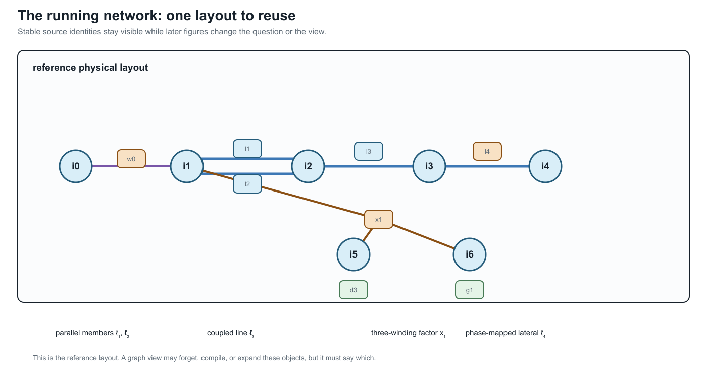

# The running multiconductor network

**Page status:** semantic specification; numerical realization is versioned separately.

The book uses one synthetic reference network to compare representations and transformations. The
network is deliberately small enough to draw and solve repeatedly, but it contains the features
that disappear in a conventional balanced bus--branch diagram.

This page is the **semantic specification**. Its first numerical realization is
the [executable running network](executable-running-network.md), version 0.1.0.
The semantic contract remains authoritative where that fixture explicitly lists
an unimplemented feature.

The layout below is the reference drawing for the rest of the book. Later
figures should be read as views or overlays of this same source object set,
not as unrelated replacement networks.



## Design requirements

The running network must contain:

- ordered, nonuniform bus terminal sets;
- a four-conductor line with full mutual coupling;
- an explicit neutral and impedance grounding;
- a conductor permutation or phase discontinuity;
- heterogeneous parallel branches with distinct limits and states;
- an ideal switch represented as an object rather than merged buses;
- a genuinely multiwinding transformer;
- at least one continuous control and one discrete decision;
- measurements and operational limits;
- stable source identities and provenance for every generated object.

## Source objects

The provisional bus set is

```math
\mathcal B^{\mathrm R}
=\{i_0,i_1,i_2,i_3,i_4,i_5,i_6\}.
```

The superscript ``\mathrm R`` denotes the running case, not an electrical quantity. Bus terminal
vectors are:

| Bus | Ordered terminals | Role |
| --- | --- | --- |
| ``i_0`` | ``[a,b,c,n]`` | source-side substation bus |
| ``i_1`` | ``[a,b,c,n]`` | switched feeder head and transformer primary |
| ``i_2`` | ``[a,b,c,n]`` | grounded junction and parallel-corridor receiving bus |
| ``i_3`` | ``[a,b,c,n]`` | downstream four-wire bus |
| ``i_4`` | ``[a,c,n]`` | phase-discontinuous lateral bus |
| ``i_5`` | ``[a,b,c,n]`` | secondary winding bus |
| ``i_6`` | ``[a,b,c]`` | delta tertiary winding bus |

These labels are stable source identifiers. A compiled view may create virtual buses but must not
reuse or renumber these identities without a reversible map.

## Two-terminal topology

The declared forward topology includes

```math
w_0i_0i_1\in\mathcal T^{W\rightarrow},
```

where ``w_0`` is an ideal switch, and

```math
\ell_1i_1i_2,\ \ell_2i_1i_2,\
\ell_3i_2i_3,\ \ell_4i_3i_4
\in\mathcal T^{L\rightarrow}.
```

Lines ``\ell_1`` and ``\ell_2`` are a heterogeneous parallel pair. They have distinct full
impedance matrices, conductor ratings, construction records, outage states, and candidate
investment decisions. An aggregated admittance may be a valid terminal-behaviour view while being
invalid for the decision problem.

The generated line-identity witness makes the graph consequence explicit. In
the scalar line projection of this multiconductor fixture, the four lines have
one cycle-space dimension: the chord is ``\ell_2`` against the declared tree
``\{\ell_1,\ell_3,\ell_4\}``, so the cycle is the two-member parallel fibre.
Collapsing unordered bus pairs to a simple graph gives cycle rank zero. The
switch and the three-winding transformer are deliberately excluded from this
line-only calculation; their terminal and factor incidences belong to the
port--factor view rather than being silently treated as scalar edges. The
executable record is `experiments/generated/running-network-cycle-space-witness.json`.

Line ``\ell_3`` is a four-conductor section with nonzero mutual impedance and shunt admittance.
Line ``\ell_4`` is a three-conductor lateral. Its terminal maps make the phase selection explicit:

```math
\mathbf N_{\ell_4 i_3}=[a,c,n],
\qquad
\mathbf N_{\ell_4 i_4}=[c,a,n].
```

The deliberate permutation tests whether an implementation compares conductor coordinates before
composing matrices or merging sections.

## Grounding

The neutral terminal at ``i_2`` is connected to earth through grounding element ``h_n`` with
finite admittance ``y_{h_n}``. It is neither a perfect voltage reference nor an annotation on the
bus:

```math
I_{h_n}=y_{h_n}U_{i_2,n}.
```

The source establishes the network voltage reference through a separately declared grounding
condition at ``i_0``. The fixture also contains a small reference shunt ``h_{\mathrm{ref}}`` on
tertiary terminal ``a`` at ``i_6``; it is retained as an explicit object rather than folded into
the transformer. These distinctions make the neutral-grounding counterexample observable:
eliminating ``i_2`` as a zero-injection degree-two junction is invalid if the grounding relation is
forgotten.

## Multiwinding transformer

Transformer ``x_1`` has three winding ports

```math
\mathcal K_{x_1}=\{1,2,3\},
\qquad
\beta_{x_1}(1)=i_1,
\quad
\beta_{x_1}(2)=i_5,
\quad
\beta_{x_1}(3)=i_6.
```

The provisional connections are grounded wye, grounded wye, and delta. Each winding has its own
ordered terminal map, reference voltage, current limit, and winding identity. Leakage data are
specified as pairwise short-circuit impedances referred to a declared winding base. No derivation
may silently replace the transformer by three independent two-winding devices.

A compiled loss network may introduce an internal virtual bus and two-terminal branches. Its
certificate must map every generated object to ``x_1`` and the relevant winding, preserve the
terminal relation, state how winding limits are enforced, and provide a round-trip test.
The first exact compilation of the fixture's pairwise leakage data is developed in
[Multiwinding leakage reference compilation](@ref multiwinding-leakage-reference-compilation).
Its connection to all eleven external winding terminals is developed in
[Multiwinding terminal leakage assembly](@ref multiwinding-terminal-leakage-assembly).
An explicitly marked illustrative extension then exercises excitation,
transformer-internal grounding, and fixed transfer serialization in
[Fixed-linear transformer factor completion](@ref
fixed-linear-transformer-factor-completion) without changing the canonical
BMOPFTools fixture.
The associated [parameterized transformer tap decision](@ref
parameterized-transformer-tap-decisions) case then adds an explicitly
illustrative discrete winding control and tests decision recovery without
altering the fixture.
The [transformer tap AC decision case](@ref transformer-tap-ac-decision-case)
then embeds that factor in explicit network voltage, neutral-KCL,
power-balance, and recovered-current constraints.

## Nodal elements and controls

The case includes:

- a voltage source ``s_0`` at ``i_0``;
- an unbalanced controllable generator ``g_1`` at ``i_3``;
- an unbalanced four-wire demand ``d_1`` at ``i_3``;
- phase-discontinuous demands ``d_{2a}`` and ``d_{2c}`` at ``i_4``;
- a secondary demand ``d_3`` at ``i_5``;
- a delta demand ``d_4`` at ``i_6``;
- voltage and current measurements at selected terminals;
- conductor-current limits on every line and winding.

Element connection configurations and terminal maps are explicit. A nodal attachment does not
imply balanced three-phase or phase-to-neutral connection.

## Decision problems

### Continuous base problem

The first executable problem is a fixed-topology multiconductor AC OPF:

```math
\min_{z\in\mathcal F_{M^{\mathrm R}}}
c_0(P_{s_0})+c_1(\mathbf P_{g_1})
+c_{\mathrm loss}P_{\mathrm loss}
+c_{\mathrm shed}P_{\mathrm shed}.
```

The feasible set includes terminal KCL, full conductor-coupled branch relations, transformer
winding relations, grounding, voltage limits, per-conductor current limits, device capabilities,
and any fixed equipment state.

### Discrete extension

A later extension makes selected states decisions:

- open or close ``w_0``;
- remove one member of the parallel pair as a contingency;
- choose a reinforcement or switching action;
- select a discrete transformer or regulator state where the device model supports it.

The continuous problem should be established first so that failures caused by representation are
not confused with failures of a mixed-integer solver.

## Required views

The case will be published in at least these forms:

| View | Mandatory retained facts |
| --- | --- |
| Asset/property | stable element and winding identity, provenance, construction, state ownership |
| Terminal connectivity | ordered terminals, grounding, phase discontinuity, switch state |
| Port--factor | device relations, arbitrary winding arity, limits, controls |
| Bus--branch multigraph | parallel identity and compiled virtual-object provenance |
| Simple graph | explicitly documented forgotten distinctions |
| OPF model | variables, equations, feasible set, objective, source map |
| Sparsity graph | variable/constraint blocks with no unsupported physical interpretation |

## Counterexample variants

Small variants isolate one failure at a time:

1. **R-PAR:** retain only ``\ell_1`` and ``\ell_2`` and their endpoint buses; compare aggregate
   admittance with member current limits and outage decisions.
2. **R-GND:** retain the chain through ``i_2`` and its grounding element; test degree-two
   elimination with and without the shunt relation.
3. **R-PERM:** retain ``\ell_4`` and its endpoint terminal maps; test conductor-coordinate
   normalization.
4. **R-XFMR:** retain ``x_1`` and boundary injections; test multiwinding compilation, winding-limit
   recovery, and round trips.
5. **R-SW:** retain ``w_0`` and neighbouring connectivity nodes; compare a fixed-state quotient
   with a model that preserves switching as a decision.

Each variant must be small enough for an independent analytic or exhaustive check.

## Preservation questions

Every transformation applied to the running case must answer:

- Are terminal voltages and currents exact over the declared operating domain?
- Are per-conductor and per-winding limits preserved or lifted?
- Are switch, outage, tap, and investment choices retained?
- Is the target feasible set exact, inner, outer, or scenario approximate?
- Is the objective identical after lifting?
- Do optimal target decisions map to admissible source decisions?
- Can eliminated currents, voltages, losses, and active constraints be recovered?
- Are every generated object and parameter traceable to source identities?

## BMOPFTools realization

BMOPFTools is the preferred first implementation platform where its component and decision models
fit the case. The book-level source specification remains implementation independent. Any
BMOPFTools fixture must record:

- the exact repository commit;
- input data and augmentation or conversion steps;
- terminal ordering and units;
- solver and environment;
- the source-to-implementation object map;
- known differences between the semantic specification and implemented model.
