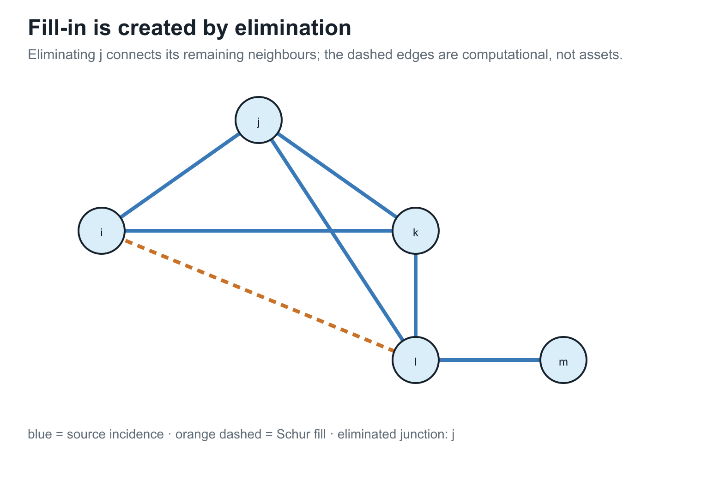
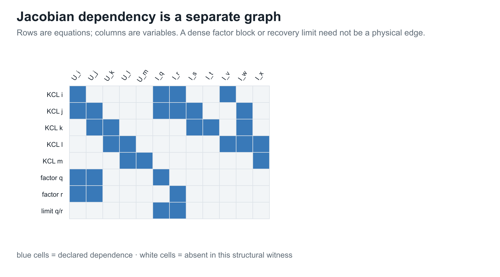
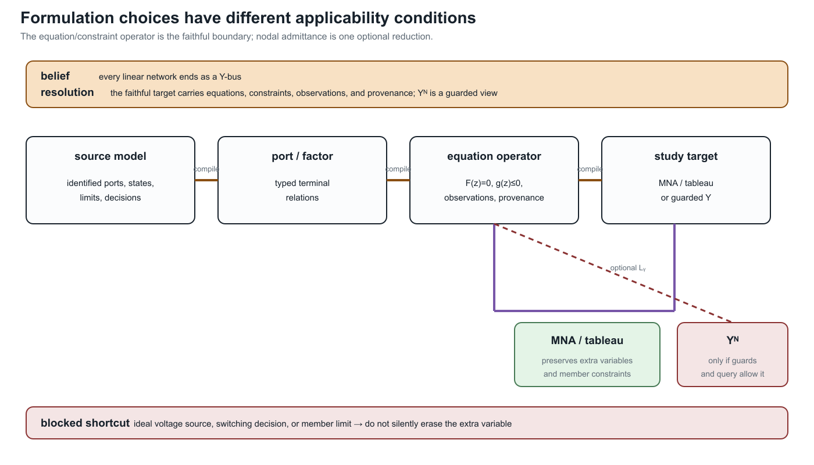

# [Circuit formulations and the lowering boundary](@id circuit-formulations-and-lowering)

**Page status:** formulation guide and equivalence contract; the definitions
and guards below are book conventions supported by circuit and power-system
precedents. General equivalence theorems beyond the declared linear scopes
remain future work.

The same power network can be compiled into several equation systems. A nodal
admittance matrix is one particularly useful target, but it is not a universal
representation of general *power networks*. A numerical ``\mathbf Y`` may be
available while asset identity, switch states, branch currents, grounding,
multi-terminal behaviour, controls, limits, or decisions have already been
discarded. Conversely, a faithful source model may require a tableau, modified
nodal system, branch-current variables, or an unevaluated port--factor relation.

Start with the worked assembly in [From source data to a canonical network
model](@ref source-to-canonical-model). This chapter then asks which equation
systems can express the devices and observations a study needs, and when
elimination preserves them. Further graph constructions are in [From source
graphs to views and graph surgery](@ref compiled-views-and-graph-surgery).

## Formulation families

Let ``\mathcal M`` be a declared power-network model with voltage, current,
power, control, state, and parameter variables. A formulation is a choice of
unknowns ``x``, equations ``F(x;u,\theta)=0``, inequalities ``g(x;u,\theta)\le
0``, and an observation map ``h``. The formulation is therefore more than a
matrix: the variable ownership, limits, state domain, and recovery map are
part of its contract.

| Formulation | Primary unknowns | Strong use | Typical loss or guard |
| --- | --- | --- | --- |
| nodal admittance | retained node voltages | fixed linear network stamping and PF linear subproblems | requires admittance-form branch relations; hides branch variables and asset identity |
| modified nodal analysis | node voltages plus selected branch currents | ideal voltage sources, current-controlled elements, switches, and mixed devices | larger saddle-point system; source provenance still has to be attached |
| sparse tableau | node, branch, port, and device variables | OPF limits, node--breaker models, multiport factors, and fixed sparsity | more variables and equations; elimination is a separate transformation |
| branch-current or branch-flow | voltages, currents, and often powers on identified members | explicit ratings, radial identities, and device-level constraints | equations depend on chosen branch model and orientation conventions |
| hybrid/port parameters | selected boundary efforts and flows | multiport composition and boundary equivalents | a representation is local to declared ports and may be singular at some frequencies or states |
| general port--factor relation | ordered typed ports and behavioural relations | nonlinear, controlled, dynamic, and multi-terminal equipment | not itself a single sparse matrix or ordinary graph |

The circuit literature distinguishes nodal analysis from modified and tableau
extensions precisely because some elements do not admit a convenient
admittance-only branch relation [HoRuehliBrennan1975, HachtelBraytonGustavson1971](@cite).
Power-system work makes the same boundary operational: sparse tableau
formulations retain multi-port element variables and node--breaker actions that
would otherwise require changing ``Y_{\mathrm{bus}}`` between states
[ParkHolzerDeMarco2019](@cite).

These formulations may be mathematically equivalent after elimination on a
restricted domain. They are not interchangeable source models: eliminating a
current variable can remove the direct place to attach a thermal limit, a
switch state, or a protection relation.

## Numerical footprint of the formulation choice

The choice of equation target also changes the symbolic problem seen by a
solver.  Schur elimination can add fill edges, while a Jacobian dependency
graph records equation--variable relations rather than physical incidence.
These are formulation-level effects, so they belong here beside the lowering
boundary rather than only in the later executed numerical witnesses.





The figures are conceptual structural views.  The pinned numerical export and
nonlinear KKT witnesses remain in [Numerical consequences of representation and
reduction](@ref numerical-consequences), where their fixture-specific counts,
residuals, and solver limitations are recorded.

## When an exact nodal admittance target exists

For a declared set ``\Phi_{\mathrm{lin}}`` of fixed linear factors, choose a
retained voltage vector ``\mathbf U``. If each factor has an admittance-form
terminal relation

```math
\mathbf i_\phi=\mathbf Y_\phi\mathbf A_\phi\mathbf U
```

and its current injection maps back through ``\mathbf A_\phi^{\mathsf T}``,
then assembly gives

```math
\mathbf Y^{\mathrm N}
 =\sum_{\phi\in\Phi_{\mathrm{lin}}}
   \mathbf A_\phi^{\mathsf T}\mathbf Y_\phi\mathbf A_\phi,
\qquad
\mathbf i^{\mathrm{inj}}=\mathbf Y^{\mathrm N}\mathbf U.
```

### Coupled branches and the equivalent lattice

Mutually coupled two-terminal sections are an instructive exact lowering. The
source relation is not a sum of independent branch factors: the complete
coupling group first supplies a joint impedance ``\mathbf Z_\Gamma``. When it
is invertible, ``\mathbf Y_\Gamma=\mathbf Z_\Gamma^{-1}`` and one incidence map
for all participating section drops gives

```math
\mathbf Y^{\mathrm N}_\Gamma
=\mathbf A_\Gamma^{\mathsf T}
 \mathbf Y_\Gamma
 \mathbf A_\Gamma.
```

For two scalar sections on four distinct terminals, this stamp admits an exact
six-edge lattice realization. Four of those edges cross between the two source
endpoint pairs and two can carry the negative of the mutual admittance under
the stored orientation. The lattice is therefore an ordinary weighted graph,
but not a physical bus--branch inventory: its cross-voltage edges are generated
couplings and its source line currents require the recovery map
``\mathbf i_\Gamma=\mathbf Y_\Gamma\mathbf A_\Gamma\mathbf U``.

The [coupled multi-voltage corridor case](@ref
coupled-multivoltage-corridor) derives the full sign pattern, per-unit scaling,
partial-overlap sections, and state guards. If the joint primitive is singular
or the target edge library cannot carry the generated weights, the compiler
must retain a direct factor or tableau rather than forcing this lattice.

Here ``\Phi_{\mathrm{lin}}`` is a formulation subset, not the entire source
inventory. It contains factors whose parameters and states are fixed for the
declared solve. A factor carrying an unfixed tap, switching state, control law,
or other decision remains in the equation/constraint operator unless the
target is explicitly rebuilt pointwise over that decision domain.

This is an assembly identity, not a claim that ``\mathbf Y^{\mathrm N}`` is a
canonical factorization or a complete power-network model. A useful sufficient
guard for exact nodal stamping is:

The important degenerate case is covered in [Multigraphs for expert modelers](@ref
multigraphs-for-modelers): identifying the two terminals of a fixed linear
π factor can leave an exact one-terminal shunt stamp, but only after the factor
has been assembled through its terminal map. Deleting a graph self-loop before
that compilation is not an equivalent operation in general.

1. the retained variables are node-voltage coordinates sufficient for the
   declared observation and decision queries;
2. every included factor has a well-defined linear relation in those voltage
   coordinates, or has already been exactly eliminated with a declared Schur
   complement and recovery map;
3. voltage-source, current-controlled, dynamic, and algebraic-constraint
   variables that cannot be eliminated are retained elsewhere in the target;
4. the topology and device state used for assembly are fixed, or the target is
   rebuilt for each declared state;
5. grounding, reference, terminal maps, and coordinate order are declared; and
6. every limit, control, and decision that the study queries has a surviving
   variable or an explicit recovery/constraint map.

### Source factors versus study-specific nodal splits

The source model and the matrix used by an iterative solver are related but
are not the same object. Let ``\mu`` denote a study mode, ``\sigma`` an active
equipment state, and ``k`` an operating point or iteration. A current-injection
solver may use the split

```math
\mathbf Y_{\mathrm{lin}}^{(\mu,\sigma,k)}\mathbf V^{k+1}
 =\mathbf I_{\mathrm{src}}^{(\mu,\sigma)}
  +\mathbf I_{\mathrm{comp}}^{(\mu,\sigma)}(\mathbf V^k).
```

The linear operator may contain passive delivery elements, fixed shunts,
constant-admittance load or generator parts, or a declared Norton equivalent.
The compensation term carries the remaining nonlinear or operating-point
dependent current. A constant-impedance load can therefore appear in the
diagonal of ``\mathbf Y_{\mathrm{lin}}`` while a constant-power load at the
same bus appears through ``\mathbf I_{\mathrm{comp}}``. A generator may be a
PV/PQ constraint, a Norton source, a dynamic equivalent, or a current-limited
injection depending on the study.

This is not automatically a Newton--Raphson step. Newton's method forms a
residual Jacobian for an increment ``\Delta x``,

```math
\mathbf J(\mathbf x^k)\Delta\mathbf x
 =-\mathbf F(\mathbf x^k),
```

whereas a fixed-point current-injection method can keep
``\mathbf Y_{\mathrm{lin}}`` fixed and update only the compensation current.
Setting the compensation current to zero for a direct or initial solve is a
linear starting model, not proof that the nonlinear source model is itself
constant impedance.

OpenDSS documents this separation operationally: power-conversion elements use
a constant primitive-admittance part plus compensation currents, and its direct
or admittance solution can include load and generator equivalents in the
system matrix [OpenDSSSolutionTechniques, OpenDSSPowerConversionElements](@cite).
Its fault-study equations construct a mode-specific nodal model with source
and generator equivalents and the portion of load current not already included
in the matrix [OpenDSSFaultStudyEquations](@cite). These are legitimate
formulation targets, not competing definitions of the physical network graph.

The practical rule is to qualify every nodal matrix with its source class,
study mode, active state, coordinate order, and linearization or reduction
point. Prefer names such as ``\mathbf Y_{\mathrm{passive}}``,
``\mathbf Y_{\mathrm{direct}}``, ``\mathbf Y_{\mathrm{fault}}``, or
``\mathbf Y^{(k)}_{\mathrm{lin}}`` to an unqualified claim that the system has
one uniquely meaningful ``Y_{\mathrm{bus}}``.

### Rank and sign contract

Let ``\mathbf Y^{\mathrm N}(\sigma,\gamma)`` denote the assembled operator
after the declared active state ``\sigma`` and grounding/reference map
``\gamma`` have been applied, and let ``n_V`` be the retained voltage
dimension. A direct solve for all retained voltages from arbitrary retained
current injections requires an invertible square operator:

```math
\operatorname{rank}\!\left(\mathbf Y^{\mathrm N}(\sigma,\gamma)\right)=n_V.
```

A reference label, a nominal ground, or a removed datum does not establish this
rank by itself. An isolated component, a disconnected grounding element, a
singular shunt, or a state-dependent topology can leave a nontrivial nullspace.
The rank must be checked on the assembled compound operator for the declared
state and coordinates. This is the scoped diagnostic supported by
[KettnerPaolone2019](@cite), not a universal assertion that every grounded
power-system model is nonsingular. The executable witness records both a
disconnected network with a declared reference and a regular grounded case.

This condition concerns that direct solve, not the existence of an exact
nodal relation. A floating resistor with conductance ``g>0`` has

```math
\mathbf Y=g\begin{bmatrix}1&-1\\-1&1\end{bmatrix},\qquad
\mathbf Y\begin{bmatrix}1\\1\end{bmatrix}=0.
```

The singular matrix expresses the current relation exactly. Compatible
injections determine a voltage difference; a voltage datum selects a unique
representative of the common-offset family. After boundary conditions are
imposed, check the operator for the remaining unknowns. A zero eigenvalue of
an exported passive matrix is not automatically an error in the full model.
The [running-network numerical export](@ref numerical-consequences) illustrates
why this distinction matters.

Keep four questions separate: can the relation be assembled, does it have
gauge freedom, is the boundary-conditioned linear solve unique, and is the
complete nonlinear PF/OPF problem solvable? The last question involves more
than the passive matrix. Failure of an elimination or representation guard
may require retained current variables or constraints; singularity alone does
not imply lost physical information.

### A nodal matrix is not a complete power-network graph

The support of ``\mathbf Y^{\mathrm N}`` records nonzero coupling among the
retained voltage coordinates. It does not, by itself, record:

- which parallel assets contributed to one block;
- whether a coupling came from a line, transformer, grounding factor, or
  eliminated internal node;
- which switch or breaker state produced the assembled topology;
- branch currents and member-specific ratings;
- multi-terminal factor identity or internal winding variables; or
- the feasible-set and objective semantics of an OPF decision problem.

This is why [Two topology levels and the nodal projection](@ref
two-level-topology-and-nodal-projection) treats nodal support as a derived
computational view. A support graph can be useful and exact for one query while
being insufficient as the source of another.

## Modified nodal and sparse tableau targets

Modified nodal analysis augments node voltages with currents through elements
whose constitutive relation is not naturally an admittance injection. A common
linear schematic form is

```math
\begin{bmatrix}
\mathbf Y & \mathbf B\\
\mathbf C & \mathbf D
\end{bmatrix}
\begin{bmatrix}\mathbf U\\\mathbf I_{\mathrm e}\end{bmatrix}
=
\begin{bmatrix}\mathbf J\\\mathbf e\end{bmatrix}.
```

The blocks encode KCL, selected element currents, voltage-source or control
relations, and any declared algebraic coupling. The matrix can be sparse even
when eliminating ``\mathbf I_{\mathrm e}`` would create dense fill-in.

The sign convention is part of the formulation contract. With ``\mathbf B``
the signed incidence of selected element currents into the KCL rows, use

```math
\mathbf Y\mathbf U+\mathbf B\mathbf I_{\mathrm e}=\mathbf J,
\qquad
\mathbf C\mathbf U+\mathbf D\mathbf I_{\mathrm e}=\mathbf e.
```

Thus a positive component of ``\mathbf I_{\mathrm e}`` follows the stored
element/terminal orientation encoded by ``\mathbf B``; ``\mathbf J`` is the
positive KCL injection on the right-hand side, and ``\mathbf e`` is the
right-hand side of the selected voltage or device relation. Reversing an
element orientation changes the corresponding incidence signs and current
coordinate, not the physical factor. The witness uses this convention for its
ideal voltage source.

A sparse tableau keeps this idea at the factor boundary. Let ``\mathbf z``
collect node, terminal, branch-current, power, and device variables. A tableau
target records

```math
\mathbf F_{\mathrm{KCL}}(\mathbf z)=0,
\qquad
\mathbf F_{\mathrm{KVL}}(\mathbf z)=0,
\qquad
\mathbf F_{\mathrm{device}}(\mathbf z;\theta)=0,
\qquad
\mathbf g(\mathbf z;\theta)\le 0.
```

This is especially useful when the study needs branch currents, multi-port
device variables, switch constraints, or member-level limits. The sparse
tableau node--breaker precedent keeps breaker actions in component constraints
instead of silently replacing each action with a new fixed ``Y_{\mathrm{bus}}``
[ParkHolzerDeMarco2019](@cite).

The tableau is not automatically “more physical” or “more canonical.” It is a
better target only for the declared questions. If the study asks only for a
fixed linear boundary voltage relation, eliminating tableau variables may be
appropriate; if it asks for switching, protection, or member ratings, the
uneliminated variables are part of the preservation contract.

### Branch-current, branch-flow, and chain formulations

A branch-current formulation retains an oriented current for each identified
member and writes KCL together with the member constitutive equations. A
branch-flow or BFM formulation instead promotes selected complex powers,
voltage magnitudes, and current/power products to variables; its balance
equations and relaxations depend on the declared branch model and on whether
parallel member identities are retained. An aggregate branch-flow equation is
therefore not automatically equivalent to a member-current formulation.

For a two-port partition, a chain or ABCD representation may write a transfer
relation such as

```math
\begin{bmatrix}u_i\\i_{ij}\end{bmatrix}
=
\begin{bmatrix}A&B\\C&D\end{bmatrix}
\begin{bmatrix}u_j\\i_{ji}\end{bmatrix}.
```

This can be useful for cascading declared two-port sections, but it is a
coordinate choice with its own invertibility and termination guards. It is not
a universal substitute for a multi-conductor or multi-terminal factor. Hybrid
effort/flow variables and scattering variables can avoid a singular chosen
partition in some applications; they change the target coordinates and must
carry their own recovery and observation contracts.

### Structural solvability of ideal-source blocks

Ideal voltage-source loops and ideal current-source cutsets deserve a small
diagnostic before numerical solution. After declaring the branch ordering and
sign convention, write the affected KVL or KCL rows as an affine block
``Aq=b``. The scoped check used here compares
``\operatorname{rank}(A)`` with
``\operatorname{rank}([A\;b])``:

| rank result | interpretation |
| --- | --- |
| ``\operatorname{rank}([A\;b])>\operatorname{rank}(A)`` | contradictory source constraints; no solution for that state |
| equal ranks, but ``\operatorname{rank}(A)<`` number of rows | consistent redundant constraints; retain them or remove them with provenance |
| equal full row rank | consistent independent constraints |

The distinction matters for MNA/tableau assembly. A redundant ideal-source row
is not automatically an error, while a contradictory loop or cutset makes the
declared state infeasible. The generated witness
``experiments/generated/circuit-formulation-witness.json`` records both cases
for a voltage-source loop and a current-source cutset. This is a rank-
consistency diagnostic only; it is not a general statement about DAE index,
dynamic regularity, or every possible dependent-source formulation.

## Lowering from a source model

The formulation-aware compilation boundary is:

```math
\mathcal M
 \xrightarrow{C}
 \mathcal M_{\mathrm{port}}
 \xrightarrow{A}
 \mathcal E=(\mathbf F,\mathbf g,\operatorname{obs},\operatorname{prov}),
```

where ``\mathcal E`` is a declared equation/constraint operator. Optional
targets are then guarded lowerings:

```math
\mathcal E
 \xrightarrow{L_{\mathrm{MNA}}}
 \mathcal E_{\mathrm{MNA}},
\qquad
\mathcal E
 \xrightarrow{L_{\mathrm{Y}}}
 (\mathbf Y^{\mathrm N},\operatorname{recover})
 \quad\text{when the nodal guards hold.}
```

Direct factor stamping into ``\mathcal E`` is the default. ``L_Y`` is not an
automatic final pass after every factor compiler. It may fail because a factor
needs extra unknowns, because an elimination block is singular, because a
state-dependent switch changes the target structure, or because the resulting
matrix would omit a queried constraint. The compiler must return a diagnostic
and retain the source-to-target map rather than inventing a virtual admittance.

Every lowering record should state:

1. the source ports, factors, states, and coordinate order;
2. the target variables and equations;
3. the eliminated variables and the condition for elimination;
4. the preserved observations, constraints, and decisions;
5. the omitted semantics and unresolved guards; and
6. the recovery and provenance maps.



The diagram is intentionally asymmetric. The source model first lowers to an
equation/constraint operator that still has somewhere to attach observations,
limits, and decisions. MNA or a sparse tableau can retain those variables
directly. A nodal ``\mathbf Y`` target is a separate diagonal branch: it is
available only when the declared formulation guards and query contract permit
the extra variables and constraints to be eliminated. The crossed shortcut is
the common but unsafe mental model in which every linear factor is silently
turned into an admittance edge.

This is the formulation-specific instance of the general compiled-view
contract. It also explains why a compiler pipeline can legitimately stop at a
tableau or factor operator even when a smaller numerical matrix could be
constructed for a narrower query.

## Formulation equivalence is query-relative

Let ``\mathcal E_1`` and ``\mathcal E_2`` be two equation/constraint operators
with solution sets ``\mathcal S_1`` and ``\mathcal S_2``. A lowering map
``T:\mathcal S_1\to\mathcal S_2`` and a recovery map ``R`` are not sufficient to
call the formulations equivalent without saying what is observed. For an
observation family ``H`` (voltages, member currents, powers, states, or
decisions), we call the pair *equivalent for H* when the declared domains are
mapped consistently and

```math
H_1(x)=H_2(Tx),
\qquad\text{or, after recovery,}\qquad
H_1(x)=H_2(RTx).
```

For a decision problem, this contract must also map feasible sets, objective
values, and state domains. An algebraically eliminable variable may therefore
be harmless for a boundary-voltage query and load-bearing for a member-current
limit or switching decision. Approximate maps use the same vocabulary, but
must state the error measure, domain, and which observations are only bounded
or one-sided preserved.

The executable witness makes the distinction concrete. MNA and a plain nodal
description agree for ``H_{\mathrm{voltage}}`` in the ideal-source example, while
they are not equivalent for ``H_{\mathrm{voltage+source-current}}`` because the
source current is an additional retained unknown. Likewise, summing aligned
parallel admittances preserves the terminal voltage relation but not the
member-current-limit observation. The rank and sign guards above are part of
the domain of these equivalence statements; they are not optional annotations.
The rank claim is registered as ``FORMULATION-NODAL-003``.

## Scope collapses and literature alternatives

Several familiar power-flow models are valid collapses when their guards are
declared:

| Starting target | Collapse | What must be checked |
| --- | --- | --- |
| fixed linear port factors | ``\mathbf Y^{\mathrm N}`` | admittance-form relations, regular elimination, fixed grounding and state |
| MNA/tableau | nodal admittance | all retained extra variables are eliminable and unqueried |
| multiconductor model | scalar or positive-sequence ``Y`` | phase symmetry, balance, grounding, limits, and observations |
| node--breaker tableau | bus--branch ``Y_{\mathrm{bus}}`` | state fixed and switch/protection decisions outside the query |
| port--factor source | ordinary-edge graph | declared n-port realizability and retained provenance |

The alternatives are therefore not a contest for one universally best graph.
They are formulation choices indexed by the study's observations, constraints,
and decisions. The [representation taxonomy](@ref representation-taxonomy)
classifies their retained meanings; the [transformation semantics register](@ref
transformation-semantics-register) records the guards for moving among them.

!!! warning "Power-system shorthand"
    “The network has a Y-bus” usually means that one study formulation has
    assembled a nodal operator for one declared state and variable set. It does
    not mean that the full power-network source model is a simple graph, a
    two-terminal multigraph, or a lossless collection of admittance edges.

## Evidence boundary

The circuit and power-system precedents establish that nodal, modified-nodal,
and sparse-tableau formulations are established alternatives. The book's
stronger claim—that a formulation-aware lowering contract can preserve the
declared power-network decisions and provenance—is a proposed architecture.
The generated artifact
`experiments/generated/circuit-formulation-witness.json` supplies three minimal
failure cases:

1. an ideal voltage source whose source current requires an MNA variable;
2. a floating two-node network whose nodal operator is singular without a
   reference or shunt; and
3. aligned parallel members whose aggregate admittance is exact for the
   terminal relation but cannot carry their distinct current limits.

The first case solves two right-hand sides in MNA form, showing identical source
voltage but different source currents. The other cases separate numerical
singularity from semantic loss. These are scoped formulation witnesses, not a
universal impossibility result for every circuit or power-network model.
