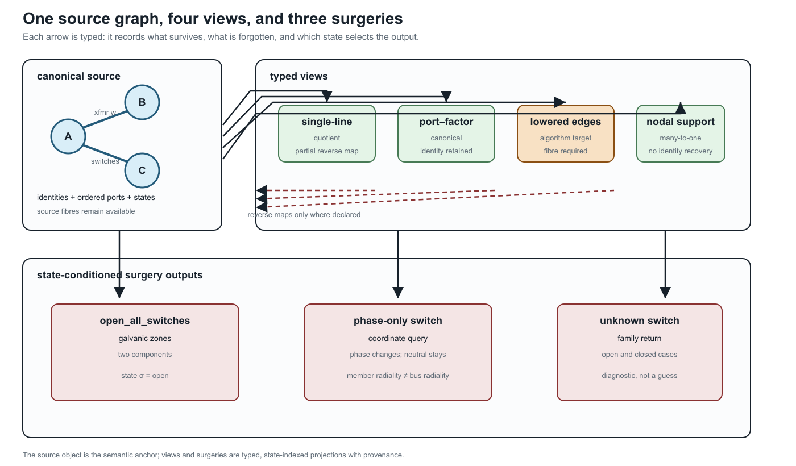

# [From source graphs to views and graph surgery](@id compiled-views-and-graph-surgery)

**Page status:** proposed architecture with a package-independent compiled-view,
degeneracy, phase-selective switching, and state-conditioned zone-surgery
witness; broader transformation algebra remains open.

This chapter makes one boundary explicit: a power-network model is not one
picture that is repeatedly relabelled. It is a typed source object together
with views and state-conditioned operations. The same asset may therefore
appear in a single-line diagram, a multi-line diagram, a port--factor graph, a
bus--branch quotient, and a nodal-support graph without those drawings having
the same semantics.

This chapter is the bridge between [formal representation frameworks](@ref
formal-representation-frameworks), [node--breaker topology processing](@ref
node-breaker-topology), [cycles and radial structure](@ref
cycles-parallelism-radiality), and the [transformation semantics
register](@ref transformation-semantics-register).

## 1. Identity-bearing source graphs

The canonical electrical source is the hierarchical port--factor model
``\mathfrak P`` defined in [Formal representation frameworks](@ref
formal-representation-frameworks). For this chapter only, use the following
view-level shorthand: ``\mathcal E`` names identified factors,
``P_e= f^{-1}(e)`` their ordered port sets, ``\iota`` is the canonical
attachment map ``j``, and ``\mathcal R`` collects the canonical containment,
coordinate, state, and factor relations. Thus the shorthand

```math
\mathcal M_{\mathrm{view}}
 =(\mathcal J,\mathcal E,\{P_e\}_{e\in\mathcal E},\iota,\sigma,\mathcal R)
```

is a notation convenience, not a second canonical tuple. A two-terminal line
has ``|P_e|=2``. A three-winding transformer has ``|P_e|=3`` (or more when
conductor ports are explicit). Its identity is not recovered by looking at
three pairwise edges after the fact.

An **identity fibre** is a set of source objects that a later view represents
by one object. For a view ``v`` write

```math
q_v:\mathcal M\longrightarrow \mathcal V_v,\qquad
\operatorname{fib}_v(x)=q_v^{-1}(x).
```

The fibre may be a singleton, a parallel family, or a mixed family of ports
and factors. The quotient is useful only when the query is invariant over the
fibre, or when the omitted distinctions are carried as guards and provenance.

This is why the book's ``\ell i j`` notation retains line identity: ``\ell``
labels the physical member while ``i`` and ``j`` describe its endpoints. A
quotient may forget ``\ell``; it must not pretend that the member never existed.

## 2. A visualisation registry

The six initial view classes are recorded in the artifact
`experiments/generated/compiled-views-surgery-witness.json`.

The same artifact carries four explicit source-to-view map records. These are
small contracts, not inferred drawing relationships: each names its source
and target object IDs, map kind, preserved and forgotten semantics, and
reverse-map status.

This registry is the book's scoped application of typed algebraic graph
transformation: maps have declared matching conditions, omitted structure, and
negative conditions such as “do not contract an unknown switch.” The broader
double-pushout theory, rewrite composition, and confluence vocabulary are
available in [Ehrig2006](@cite); this chapter does not claim to implement that
entire calculus.

Two views are equal only up to the equivalence declared for their framework:
an isomorphism may rename objects and coordinates, while a quotient or lowering
is equal only when its preservation contract and source fibres agree. This uses
the morphism/isomorphism distinction in [Maps between representation
frameworks](@ref representation-maps), rather than treating two drawings that
look alike as the same view.

| View | Typical purpose | What it can forget |
| --- | --- | --- |
| single-line | equipment-level communication and planning | conductor coordinates and internal factor equations |
| multi-line | identified conductors and phase/neutral paths | internal n-port equations |
| port--factor | canonical coupled electrical model | asset ownership if it is not attached |
| node--breaker | switching and connectivity decisions | compiled bus equations |
| nodal support | matrix coupling and ordering | factor identity, multiplicity, and switch decisions |
| reduced/Kron | retained-port equivalent | eliminated coordinates and unmapped member limits |

The registry is not merely a list of drawing conventions. Each view declares
its object level, preserved semantics, forgotten semantics, and reverse-map
status. A caption should therefore say “quotient view” or “lowered view” when
that is what the reader is seeing. A visually plausible single-line diagram
is not evidence that a neutral, grounding factor, switch state, or multiport
identity survived.

The map is often one-way. A nodal support graph can show that two terminal
coordinates couple, but it cannot identify which parallel members produced the
nonzero block. A reduced circuit can preserve a retained-port relation while
leaving no source-level current limit for an eliminated neutral. This is a
semantic limitation, not a rendering defect.

The industrial node--breaker, bus--breaker, and bus--branch progression in CIM
and PowSyBl is a useful precedent for this registry [CIMTopologicalNode,
PowsyblTopology](@cite). The present registry extends that idea to
multiconductor ports, n-terminal factors, grounding, and reduction provenance.



The upper row is a representative subset of the six-entry registry: the arrows
may be quotient, refinement, lowering, or many-to-one assembly maps. The
node--breaker and reduced/Kron entries are omitted from this compact figure.
The lower row is a surgery family: the same source can produce different
active graphs, and an unknown state produces a family rather than a silently
selected result.

## 3. Lowering as a typed compilation boundary

For a declared algorithm, use the following typed pipeline. Direct factor
stamping into a declared equation/constraint operator is the default; a nodal
admittance target and ordinary-edge lowering are optional guarded branches.
The formulation choices and exact-``\mathbf Y`` guards are developed in
[Circuit formulations and the lowering boundary](@ref
circuit-formulations-and-lowering).

```math
\mathcal M
  \xrightarrow{\;C\;}
\mathcal M_{\mathrm{port}}
  \xrightarrow{\;A\;}
\mathcal E=(\mathbf F,\mathbf g,\operatorname{obs},\operatorname{prov}),
\qquad
\mathcal M_{\mathrm{port}}
  \xrightarrow{\;L\;}
\mathcal G_{\mathrm{edge}}
  \xrightarrow{\;A_{\mathrm{edge}}\;}
\text{target algorithm}.
```

When the nodal guards hold, ``\mathcal E`` may additionally lower to a
nodal operator ``(\mathbf Y^{\mathrm N},\mathbf J)``. Otherwise the faithful
target may be MNA/tableau or a direct factor relation; the compiler must not
invent a ``\mathbf Y`` merely because a downstream library expects one.

``C`` completes the canonical port--factor representation. ``L`` lowers a
factor to the ordinary-edge or incidence objects expected by a graph
algorithm. ``A`` assembles equations or sparsity. Every arrow must record:

1. the source object and coordinate order;
2. the target object IDs and source fibres;
3. the relations and limits that are preserved;
4. the semantics intentionally omitted; and
5. whether a reverse map is total, partial, or unavailable.

For a three-port transformer, a lowerer may introduce three ordinary edges in
an incidence graph, but this is exact only under a declared realizability
condition. For a reciprocal terminal admittance ``\mathbf Y_\phi`` with
terminal-space all-ones vector ``\mathbf 1``, an edge-only realization requires
the floating/no-ground-path condition
``\mathbf Y_\phi\mathbf 1=0`` (together with the target library's reciprocity
and coordinate assumptions). Otherwise the exact complete-graph construction
needs the pairwise series blocks and residual shunts

```math
\mathbf Y^{\mathrm s}_{pq}=-\mathbf Y^{\mathrm K}_{pq},
\qquad
\mathbf Y^{\mathrm{sh}}_p
 =\mathbf Y^{\mathrm K}_{pp}
  -\sum_{q\ne p}\mathbf Y^{\mathrm s}_{pq}.
```

This is the realizability proposition in [Kron, Ward, and optimized network
equivalents](@ref kron-ward-opti-kron), not an automatic transformer-to-three-
lines rule. Magnetizing, grounding, or other retained shunt current must not
be silently dropped. Even when the expansion is exact, the ordinary-edge graph
is not the canonical equipment graph: removing its provenance fibre would make
later operations unable to distinguish a transformer from three unrelated
lines.

The analogy with compiler lowering is useful because it sets the right
expectation: lowering changes the representation so an algorithm can run. A
nanopass compiler similarly uses many small, typed intermediate passes rather
than one opaque rewrite [Nanopass2005](@cite). The analogy does not grant
permission to infer source semantics from the lowered code.

## 4. State-conditioned graph surgery

Graph surgery is a family of queries and transformations indexed by a declared
state ``\sigma``. For a surgery operation ``S`` write

```math
S(\mathcal M,\sigma)=(\mathcal V_\sigma,\mathcal D_\sigma,\operatorname{prov}_\sigma),
```

where ``\mathcal V_\sigma`` may be one graph or a finite family of graphs,
``\mathcal D_\sigma`` contains diagnostics, and ``\operatorname{prov}_\sigma``
maps each output node, edge, port, and zone to its source objects.

Useful operations include:

- open_all_switches, which removes switch conductance while retaining the
  switch assets as possible future actions;
- galvanic_zones, which computes connected components using only the declared
  zero-impedance or closed-switch relation;
- energized_subgraphs, which additionally uses sources and a declared
  energization rule. The term is intentionally inherited from the book's
  [terminology](../reference/terminology.md) and [translation-traps](@ref
  translation-traps) chapters; in a multiconductor model the query is
  port-indexed, so one phase may be energized while the neutral remains
  floating;
- active_radiality, which reports member, endpoint, conductor, and compiled
  bus predicates separately; and
- eliminate_switches, which is a lowering operation only after its state and
  zero-impedance assumptions are fixed.

An unknown switch state must return a family or an explicit unknown result. It
must not be silently treated as open. Two-terminal and n-terminal surgeries
also differ: a phase-only switch acts on phase ports without necessarily
opening the neutral or earth path. Consequently, a bus-level tree can coexist
with a disconnected phase-terminal graph, or with a neutral path that remains
connected.

For ``n`` binary unknown switches, explicit completion enumeration can contain
up to ``2^n`` active graphs. Enumeration is appropriate for small certificates,
but it is not the default representation for a large substation. The default
summary is three-valued for each queried pair or port set:

- **certainly connected** in every admissible completion;
- **certainly separated** in every admissible completion; or
- **undetermined**, connected in some completions and separated in others.

This summary is the intersection/union view of the state-conditioned quotient
``\pi_\sigma`` from [node--breaker topology processing](@ref
node-breaker-topology). A caller can request explicit completions when the
summary is insufficient.

For an n-terminal factor, the surgery result should name the active and
isolated port sets. Opening the ``lv`` port of a three-winding transformer is
not the same operation as deleting one of three pairwise lines: the factor
identity, the remaining ``hv``/``mv`` relation, and the isolated-port status
remain explicit. If the port state is unknown, the result is a family of port
sets.

## 5. Degenerate and under-determined models

Some modelling problems cannot be resolved from the graph alone. In the
generated witness, two identified ideal switches have identical terminals and
the same state domain. Electrically, their parallel closed quotient is perfectly
well-defined. The ambiguity is in the orthogonal asset/dependency model: the
quotient cannot say which device owns protection, maintenance, or failure
semantics. The correct result is therefore an **asset-attribution diagnostic**
with both source identities retained, not a claim that the electrical model is
ill-posed.

The same rule applies to duplicate factor/terminal sets, missing grounding or
reference declarations, and singular active-state maps. These are not
ordinary graph errors: they are model-quality findings that require a source
declaration, an additional observation, or a deliberately restricted query.

In particular, a four-wire coordinate list without a grounding or reference
declaration must not acquire one by convention. Likewise, a rank-deficient
active-state map must not be inverted merely because a downstream algorithm
expects an inverse. A restricted endpoint-voltage query, an explicit
pseudoinverse policy, or a source-level grounding declaration may make a
well-scoped operation possible; the default result is a diagnostic.

## 6. Executable scope

The package-independent witness
`experiments/generated/compiled-views-surgery-witness.json` checks six small
cases:

1. a three-port transformer lowered to ordinary edges with a retained source
   fibre;
2. two parallel ideal switches reported as under-determined rather than
   collapsed;
3. a four-wire phase-only switch whose phase connectivity changes while the
   neutral path remains connected; and
4. an open/closed/unknown switch surgery that returns one-zone, two-zone, or
   state-family results;
5. a port-selective n-terminal surgery that retains the isolated port; and
6. missing-reference and singular-active-map diagnostics.

These are architecture witnesses, not claims that every utility data model
uses the same view classes. The next extensions are richer n-terminal factors,
energization and protection semantics, and independently reviewed adapters to
external standards.

!!! note "Reader shortcut"
    When a diagram appears to contradict a familiar statement such as “the
    feeder is radial,” first ask: radial in which view, at which state, and
    with which conductor or member identities retained?
