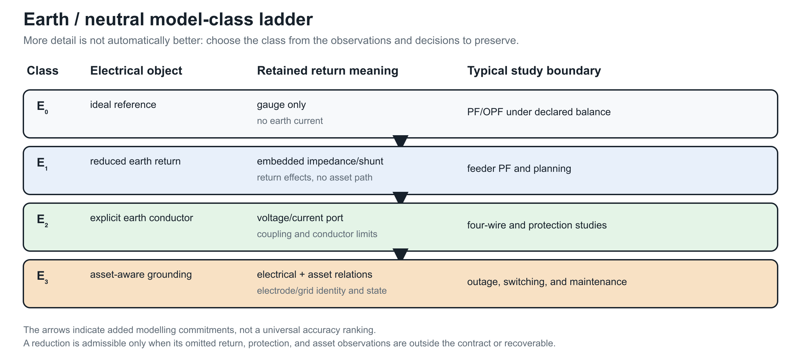

# [Earth, neutral, and reference model classes](@id earth-ground-models)

**Page status:** scoped model-class taxonomy; explicit-earth and protection
fixtures remain future work.

“Ground” is used for several different objects in power-system models. This
book distinguishes a mathematical voltage reference, a neutral conductor, an
earth-return path, and a physical grounding asset. A representation must state
which of these it contains before a reduction or fault claim is interpreted.

## Four distinct meanings

- **Reference:** a gauge choice such as ``U_0=0``. It fixes coordinates but does
  not carry current or represent soil impedance.
- **Neutral:** an explicit conductor or terminal with its own voltage, current,
  impedance, and limits. It may be grounded at one or more locations.
- **Earth return:** a conductive path through soil, ground wire, shield wire,
  or a reduced earth-impedance model. It can carry current and couple phases.
- **Grounding asset:** an electrode, grid, bond, transformer grounding point,
  or protection object with identity, state, and maintenance semantics.

Conflating these meanings can make a phase-to-neutral reduction appear exact
while deleting a ground-fault path or a neutral-to-earth constraint.

## Model classes

| Class | Electrical representation | Typical use | What it cannot answer by itself |
| --- | --- | --- | --- |
| ``E_0`` ideal reference | algebraic reference or gauge; no earth current variable | balanced transmission PF/OPF | earth-return current, grounding impedance, fault path |
| ``E_1`` reduced earth return | earth effects embedded in sequence, Carson, or fitted impedance/shunt blocks | feeder PF, planning, approximate fault studies | identity and state of the physical earth path unless linked |
| ``E_2`` explicit earth conductor | conductor or port with voltage/current and mutual coupling | four-wire, shield-wire, grounding, protection studies | soil detail beyond the selected conductor model |
| ``E_3`` asset-aware grounding | ``E_1`` or ``E_2`` plus electrodes, bonds, grids, protection and maintenance relations | switching, outage, protection, asset decisions | none beyond the declared physical and study model |

The classes are not a strict accuracy ladder. ``E_1`` may be the right model
for a study whose observations are terminal voltages, while ``E_3`` is required
for a grounding-asset outage decision even if both use the same external
admittance.

The ladder is generated by `experiments/render_earth_return_ladder.py`. Its
arrows indicate added modelling commitments, not a universal accuracy ranking.

## Scope contract for reductions

A transformation involving neutral or ground must record:

1. the reference convention and gauge;
2. whether neutral and earth are separate ports;
3. the earth-return class ``E_0``--``E_3``;
4. the number and location of ideal or finite grounding points;
5. whether line shunts, mutual coupling, and ground-fault currents are retained;
6. which voltage, current, protection, and asset observations are preserved;
7. a recovery map for eliminated neutral or earth quantities.

For example, the phase-to-neutral map in the circuit-coordinate chapter can
be exact for phase-to-neutral terminal behaviour under sparse compatible
grounding, while being insufficient for ``E_2`` neutral-to-earth voltage limits.
The Geth--Heidari--Koirala reduction is useful precisely because it states
grounding and radiality conditions rather than treating a three-wire picture as
an automatic physical deletion [GethHeidariKoirala2022](@cite).

!!! warning "Circuit-theory trap"
    Setting the reference potential to zero is not the same as setting a
    conductor voltage to zero, and neither operation removes an earth-return
    current. A reduced model must say which variable was fixed, eliminated, or
    merely not represented.

## Consequences for the running network

The running fixture is at least ``E_1`` and partly ``E_2``: ``h_n`` is a finite
neutral-to-earth shunt, the four-wire line retains a neutral terminal, and the
source reference is declared separately. The fixture does not claim a detailed
soil or electrode model, so grounding-asset decisions remain outside its
current numerical scope. Future explicit-earth cases should add a physical
earth conductor or grounding-grid factor and test recovery of ground currents,
neutral voltages, and protection observations.

## A useful comparative case

The BMOPFTools grounding tutorial suggests a compact experiment that fits the
book's preservation story. Hold the line matrix, load, and bus graph fixed and
vary only the customer-end grounding relation:

| State | Added relation | Observations that should change |
|:--|:--|:--|
| floating neutral | no local neutral-to-reference path | neutral-to-earth voltage and return-current allocation |
| impedance grounded | finite electrode shunt | electrode current, neutral displacement, and phase-to-neutral voltage |
| perfectly grounded | ideal voltage constraint | neutral voltage by construction and a different current path |
| explicit earth return | earth conductor or factor with its own impedance | earth current, neutral current, and grounding-asset limits |

This is not four different graphs in the simple-topology sense. It is one
asset/connectivity view with four electrical and decision models. A study that
only asks whether buses are connected sees no change; a study that asks for
neutral limits, touch voltage, fault current, or electrode maintenance does.
The comparison is therefore a natural future executable case for the
``E_0``--``E_3`` classes, not a reason to promote “grounded” to a single graph
attribute.
