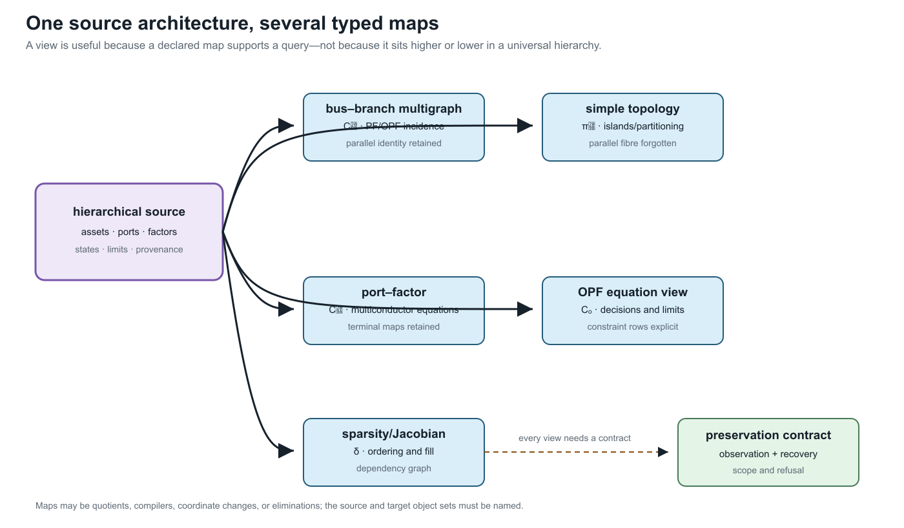
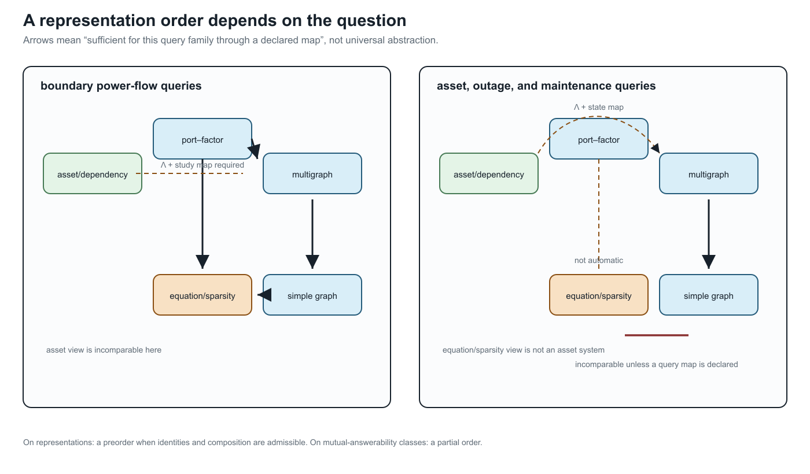

# [Formal representation frameworks](@id formal-representation-frameworks)

**Page status:** formal framework definitions with a checked structural
architecture witness; evaluated-factor coverage remains open.

## Purpose and status

This chapter gives a first mathematical specification of the principal
representation frameworks used in the book. The definitions are adopted book
conventions. The claim that the linked asset and hierarchical port--factor
models are an adequate common source remains a proposal to test.

The frameworks are not one chain from detailed to simple. Three describe
different electrical resolutions, one records orthogonal physical and
organizational relations, and another family is compiled for computation.

The companion [representation taxonomy](@ref representation-taxonomy) is the
reader-facing level map; this chapter is its normative mathematical
specification. In particular, equation and sparsity graphs are computational
projections, not a fifth semantic level, and the asset/dependency model is
linked to—but not nested inside—the electrical port--factor model.

| Framework | Primary purpose | Status |
|:--|:--|:--|
| simple topology graph | connectivity, islands, partitioning, and algorithms that cannot use parallel edges | derived quotient |
| oriented attributed multigraph | identified two-terminal equipment and conventional bus--branch models | derived engineering view |
| hierarchical port--factor incidence model | multiconductor, multi-terminal, coupled, ideal, constrained, and controlled equipment | proposed canonical electrical source model |
| asset/dependency relation model | structures, ownership, protection, failures, maintenance, and provenance | orthogonal companion source model |
| equation and sparsity graphs | algebraic coupling, ordering, decomposition, and solver structure | compiled computational views |

!!! warning "Power-system shorthand"
    There is no context-free *network graph*. Each row above defines a
    different object with different admissible queries. The
    [translation-traps chapter](@ref translation-traps) gives controlled
    replacements for this and other familiar shorthand.

!!! note "Graph-learning bridge"
    A node, edge, or message graph supplied to a learning architecture is a
    compiled computational view. It is not the source ontology unless its map
    from assets, ports, factors, states, limits, and provenance is declared.
    Heterogeneous node and edge types help express that map, but do not prove
    that parallel identity or n-port semantics survived compilation.

Here *canonical* means the selected source formalism for this book. It does not
mean that adequacy or uniqueness has already been established.





These two plates belong here as well as in the detailed map chapter. This is
the PDF-facing definition of the objects; the map chapter supplies the fuller
map vocabulary and proofs. The arrows are query- and contract-indexed, not a
single “more detailed” ordering.

The wider literature contains other valid graph and equation families. Their
selection and relationship to these rows is surveyed in the [literature map](@ref
literature-map) and the [circuit formulations and lowering boundary](@ref
circuit-formulations-and-lowering). The definitions below are therefore the
book's scoped source/view contract, not a claim that every power-network study
should use the same formalism.

## Simple topology graph

**Definition.** A loopless undirected simple topology graph is a pair

```math
G_{\mathrm{s}}=(\mathcal B,E),
\qquad
E\subseteq
\bigl\{\{i,j\}:i,j\in\mathcal B,\ i\ne j\bigr\}.
```

An optional weight map ``w:E\rightarrow\mathcal W`` does not restore the
identities of several source elements mapped to the same edge. Its codomain and
aggregation rule must be declared: a conductance, distance, capacity, and
binary adjacency have different semantics.

Let an identified multigraph have line set ``\mathcal L`` and unordered
endpoint map
``\partial:\mathcal L\rightarrow\binom{\mathcal B}{2}``, where the codomain
is the set of two-element subsets of ``\mathcal B``. Its simple
projection is

```math
\pi:\mathcal L\rightarrow E,
\qquad
\pi(\ell)=\partial\ell,
\qquad
E=\operatorname{im}\partial.
```

Thus ``\ell_1\sim_\pi\ell_2`` exactly when the two lines have the same
unordered endpoints.

**Proposition.** If the loopless multigraph has ``c`` connected components,
then its cycle rank and that of its simple projection satisfy

```math
\begin{aligned}
\mu_{\mathrm M}&=|\mathcal L|-|\mathcal B|+c,\\
\mu_{\mathrm s}&=|E|-|\mathcal B|+c,\\
\mu_{\mathrm M}-\mu_{\mathrm s}
&=\sum_{e\in E}\bigl(|\pi^{-1}(e)|-1\bigr).
\end{aligned}
```

**Proof.** Collapsing parallel identity does not change the vertex set,
adjacency relation, or connected components. Subtracting the two standard
cycle-rank identities gives ``|\mathcal L|-|E|``. Partitioning
``\mathcal L`` into the nonempty fibres of ``\pi`` gives the final sum.

The projection therefore preserves connectivity and islands, but not the
line-indexed cycle space, member states, or member constraints. A simple
topology graph is also not automatically a nodal-admittance sparsity graph:
after electrical stamping, cancellation or terminal-coordinate structure can
make the matrix support different from bare adjacency.

## Oriented attributed multigraph

**Definition.** An oriented attributed multigraph is

```math
G_{\mathrm M}
=
(\mathcal B,\mathcal L,\partial^-,\partial^+,o,a),
```

where ``\mathcal B`` and ``\mathcal L`` are finite sets of buses and
identified elements, ``\partial^-`` and ``\partial^+`` give the endpoints in
a selected reference orientation, ``o`` records that orientation, and ``a``
is a family of typed attribute maps. Parallel elements are distinct members of
``\mathcal L`` even when both endpoint maps agree.

The incidence matrix associated with the selected orientation is

```math
A_{i\ell}
=
\begin{cases}
-1,&i=\partial^-(\ell),\\
+1,&i=\partial^+(\ell),\\
0,&\text{otherwise}.
\end{cases}
```

Reorienting a line negates its incidence column. It does not change its
physical incidence or assert a change in operating-point power transfer. The
precise distinction between physical incidence, reference orientation,
terminal signs, and power direction is developed in
[Orientation, terminal quantities, and power transfer](@ref orientation-terminal-power).

Typical attributes include terminal maps, a symmetric element impedance
``\mathbf Z_\ell``, end-specific shunts
``\mathbf Y^{\mathrm{sh}}_{\ell ij}``, states, limits, and provenance. The
multigraph becomes a PF or OPF model only after constitutive relations,
injections, constraints, controls, and an objective or observation map are
attached. A genuinely multi-terminal device belongs here only after an
explicit two-terminal compilation with provenance.

## Hierarchical port--factor incidence model

**Definition.** A hierarchical port--factor incidence model is a tuple

```math
\mathfrak P
=
(\mathcal Q,\mathcal J,\Phi,j,f,\mathcal H,
\{\mathcal X_q\}_{q\in\mathcal Q},
\{\mathcal R_\phi\}_{\phi\in\Phi}).
```

Here:

- ``\mathcal Q`` is a finite set of typed, ordered ports;
- ``\mathcal J`` is a finite set of junctions;
- ``\Phi`` is a finite set of behavioural factors;
- ``j:\mathcal Q\rightarrow\mathcal J`` attaches each port to a junction;
- ``f:\mathcal Q\rightarrow\Phi`` assigns each port to its owning factor;
- ``\mathcal H`` is a rooted containment forest with declared subsystem
  boundaries;
- ``\mathcal X_q`` is the variable space carried by port ``q``;
- ``\mathcal R_\phi`` is the factor relation on the ordered ports
  ``\mathcal Q_\phi=f^{-1}(\phi)``.

A static factor relation may be written

```math
\mathcal R_\phi
\subseteq
\prod_{q\in\mathcal Q_\phi}\mathcal X_q
\times\mathcal U_\phi
\times\Theta_\phi,
```

where ``\mathcal U_\phi`` contains continuous or discrete decisions and
``\Theta_\phi`` contains fixed parameters. Equations, inequalities,
measurements, and uncertainty sets are all relations rather than new graph
edge types.


The circles in this figure are not decorative edge endpoints. They are the
typed ports in ``\mathcal Q``. The two incidence maps have different domains
and meanings: ``j`` attaches a port to a junction, while ``f`` assigns that
same port to its owning factor. The dashed ``\Lambda`` links are many-to-many
provenance relations to the asset model. This is the glyph vocabulary reused
by the later factor and lowering diagrams.

For junction ``k``, let ``\mathcal Q_k=j^{-1}(k)``. Its junction relation
``\mathcal R_k^{\mathrm J}`` enforces compatible effort variables after the
declared terminal-coordinate maps and conservation of signed flow variables.
For electrical phasor ports these are voltage compatibility and KCL.

Given boundary ports ``\partial\mathcal Q``, the external behaviour is

```math
\mathcal B(\mathfrak P)
=
\operatorname{proj}_{\partial\mathcal Q}
\left\{
z:\
z_{\mathcal Q_\phi}\in\mathcal R_\phi\ \forall\phi,
\quad
z_{\mathcal Q_k}\in\mathcal R_k^{\mathrm J}\ \forall k
\right\}.
```

This definition makes an ordinary two-terminal line one factor of arity two,
not the template for every device. A multiwinding transformer, coupled line
group, converter, grounding relation, or shared control can retain its natural
port arity. Hierarchy determines ownership of internal variables and the
boundary across which behavioural reduction is defined.

### Minimal executable witness

The first executable architecture slice is recorded in
`experiments/generated/port-factor-architecture.json`. It instantiates
``\mathfrak P`` for the two heterogeneous parallel lines, the three-port
transformer ``x_1``, and the neutral grounding factor ``h_n``. The validator
checks that every port has a declared junction and owning factor, that the
three winding ports remain one factor of arity three, and that the relation

```math
\Lambda\subseteq
(\mathcal V_A\cup\mathcal R_A)\times(\mathcal Q\cup\mathcal J\cup\Phi)
```

contains both one-to-one realizations and the four relations from asset
``x_1`` to its transformer factor and winding ports. This is a structural data
witness, not yet a numerical factor evaluator: the relation signatures are
declared strings and the electrical equations are tested by the existing
transformation artifacts.

This witness is the evidence object for `ARCH-PORT-001`, whose claim is that
the typed incidence, multiwinding factor, explicit grounding factor, and
many-to-many ``\Lambda`` link can be represented together without collapsing
their identities. The claim is deliberately limited: it validates the
structure and its declared link signatures, not the adequacy of the proposed
architecture for arbitrary asset models or a general evaluated-factor
semantics. The generated artifact is indexed in the
[knowledge-base evidence register](../reference/knowledge-base-index.md).

The same construction is now applied directly to the five-bus line-identity
multigraph in `experiments/generated/five-bus-port-factor-witness.json`. It
creates five bus junctions, fourteen endpoint ports, and seven distinct
two-port scalar line factors. In particular, ``q`` and ``r`` remain separate
factors even though their endpoints project to the same simple-graph edge.
This is claim `ARCH-PORT-002`: a structural fixture lift that preserves
identity and orientation, not a numerical factor evaluator or a new AC model.

The companion artifact
`experiments/generated/five-bus-conductor-terminal-lift-witness.json` makes
the scalar special case explicit: each of the seven identified lines has two
scalar endpoint ports attached to one of five terminal junctions. The ``q/r``
parallel fibre remains visible in the terminal incidence and retains the
extra line-identity cycle dimension. This is claim `ARCH-CONDUCTOR-002`; it is
a structural lift, not a multiconductor, switch, or transformer calculation.

## Asset and dependency relation model

**Definition.** An asset/dependency relation model is a typed attributed
multi-relational structure

```math
\mathfrak A
=
(\mathcal V_A,\mathcal R_A,\tau_V,\tau_R,\iota,\alpha).
```

The type maps ``\tau_V`` and ``\tau_R`` classify entities and relations,
``\alpha`` stores typed properties, and

```math
\iota:\mathcal R_A
\rightarrow
\bigcup_{n\ge1}\mathcal V_A^n
```

gives each relation an ordered finite incidence. Binary relations recover
ordinary source and target maps. The incidence defines relations
such as `contains`, `mounted_on`, `protected_by`, `owned_by`, `located_at`,
`shares_failure_mode_with`, and `derived_from`. Relations that are naturally
many-way therefore remain hyperrelations rather than being forced into one
untyped simple edge.

The link to the electrical model is generally a relation

```math
\Lambda
\subseteq
(\mathcal V_A\cup\mathcal R_A)
\times
(\mathcal Q\cup\mathcal J\cup\Phi),
```

not a function. One asset may generate several electrical factors, one factor
may depend on several assets, and generated factors may have no independent
physical-asset identity. The asset model has no electrical behaviour merely
because its relations are drawn as edges.

## Equation, incidence, and sparsity graphs

For an equation system ``F(x)=0`` and inequalities ``g(x)\le0``, a
variable--relation incidence graph has one vertex class for variables, another
for relations, and an edge whenever a relation depends on a variable. A matrix
sparsity graph instead follows the nonzero pattern of a declared matrix such
as the compound nodal operator ``\mathbf Y^{\mathrm N}``, a Jacobian, or a KKT
matrix.

The normative block- and scalar-support definitions are in
[Two topology levels and the nodal projection](@ref two-level-topology-and-nodal-projection).
These graphs need separate definitions because their vertices may be buses,
terminals, scalar variables, vector blocks, equations, or constraints. Schur
elimination can remove variables while adding fill edges. A nonzero-pattern
edge means algebraic coupling and is not evidence of a physical line.

## Typed maps rather than a ladder

The proposed source pair is ``(\mathfrak A,\mathfrak P,\Lambda)``. From it,
different guarded maps can produce

```math
(\mathfrak A,\mathfrak P,\Lambda)
\longrightarrow G_{\mathrm M}
\longrightarrow G_{\mathrm s},
```

while a study compiler produces

```math
\mathfrak P
\longrightarrow
\text{equations and constraints}
\longrightarrow
\text{sparsity graphs}.
```

Neither row is a universal abstraction order. The asset relation model remains
linked sideways because its ownership, protection, and failure questions are
incomparable with electrical boundary behaviour.

The relevant within-framework morphisms, orientation actions,
cross-framework transformations, and query-relative notion of expressiveness
are defined in [Maps between representation frameworks](@ref representation-maps).

## Remaining formal work

This first definition pass does not yet settle:

- categorical composition of hierarchical open systems;
- realizability of a general reduced multiport in a restricted device library;
- a type system for units, bases, conductor coordinates, and state spaces;
- the exact boundary between a factor relation and a study constraint;
- machine-checkable correspondence between the mathematical objects and data
  schemas.

Those are explicit foundation tasks, not assumptions hidden behind the word
*graph*.
