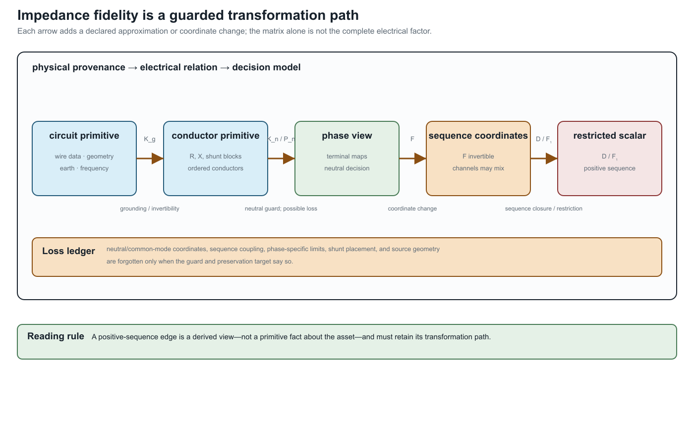

# [From conductor geometry to impedance fidelity](@id impedance-fidelity-ladder)

**Page status:** physical-fidelity reference chapter; a geometry-derived
running-network certificate remains future work.

The matrix attached to a line is not an arbitrary edge label. It is often the
result of a modelling ladder that starts with conductor geometry, earth-return
assumptions, frequency, and wire data. The ladder explains why a graph can
look unchanged while its electrical relation—and therefore its decisions—has
changed.

## The physical-to-matrix ladder

For a declared ordered conductor set, a typical steady-state construction is

```math
\text{wire data + geometry + earth model + frequency}
\longrightarrow
(\mathbf R_\ell,\mathbf X_\ell,\mathbf Y^{\mathrm{sh}}_\ell)
\longrightarrow
\text{terminal factor}
\longrightarrow
\text{network equations and decisions}.
```

The series matrix is

```math
\mathbf Z_\ell=\mathbf R_\ell+\mathrm j\mathbf X_\ell.
```

Diagonal entries describe self effects; off-diagonal entries describe mutual
coupling. Earth-return and grounding assumptions can affect both. A linecode
that contains only a scalar positive-sequence impedance has already forgotten
which conductor geometry and return path produced it.

The matrix is still not the complete factor. Terminal maps, from/to shunts,
connection factors, ratings, and state ownership determine how it enters the
network. This is why the book indexes intrinsic impedance by ``\ell`` and
terminal quantities by ``\ell ij``.

## A canonical impedance-data contract

Standardisation should make the source model richer than any one solver input.
For each oriented branch ``\ell i j``, the canonical record should retain:

- the asset identity, ordered conductor set, and endpoint terminal maps;
- geometry, conductor material, length, temperature, frequency, and earth
  model;
- the derivation method (for example Carson, Pollaczek, finite element, or a
  fitted matrix) and its source version;
- the series matrix ``\mathbf Z_\ell`` and endpoint shunt blocks
  ``\mathbf Y^{\mathrm{sh}}_{\ell i j}`` and
  ``\mathbf Y^{\mathrm{sh}}_{\ell j i}`` separately;
- units, base values, matrix ordering, coordinate convention, and reference
  ground semantics; and
- current, voltage, power, neutral, protection, and control observations that
  use the resulting coordinates.

The canonical record is therefore a source of derived views, not merely a
serialization of the values most convenient for one engine. A positive-
sequence scalar or a phase-only matrix can be exported, but it must retain a
pointer to the full record and the transformation path that produced it.

The first executable version of this contract is the generated
`experiments/generated/four-wire-impedance-model-ladder.json` fixture. It is a
small deterministic matrix example rather than a geometry-identification
claim. Its purpose is to make ordering, units, ground assumptions, shunts,
recovery maps, and risk tags testable before importing larger authored case
studies.

The source-backed follow-on is the [Australian Carson reproduction](@ref
australian-carson-reproduction). It lifts the construction fields that are
actually present in the `ImpedanceModels.jl` history, regenerates the primitive
and OpenDSS solve, and keeps the published Australian matrices in a separate
comparison channel until their original construction mappings are recovered.

## Symmetry and sequence coordinates

For three phase conductors, a perfectly transposed idealisation often has a
circulant phase block: equal self terms and equal mutual terms under cyclic
permutation. The Fortescue transform then diagonalizes that block into
sequence coordinates. This is a legitimate coordinate specialization when
the factor, grounding, boundary data, controls, limits, and observations all
preserve the same symmetry.

An untransposed geometry generally breaks circulance. The transform still
exists as a change of coordinates, but the transformed matrix is not diagonal;
sequence channels mix. The distinction is important:

- **transform available:** any compatible phase vector can be expressed in
  sequence coordinates;
- **sequence decoupling valid:** the constitutive matrices and the rest of the
  decision model preserve the sequence subspaces.

The existing [positive-sequence collapse](@ref positive-sequence-collapse)
chapter gives the exact restriction theorem. This chapter supplies the
physical provenance that theorem needs.

## Fidelity levels

| Level | Retains | Typical questions it can answer | Typical loss |
|:--|:--|:--|:--|
| geometry-derived conductor matrix | wire positions, mutual terms, earth model, frequency | unbalance, neutral shift, conductor currents | detailed geometry may be unavailable or uncertain |
| fitted full matrix | coupled ``\mathbf Z`` and shunt blocks | multiconductor PF/OPF and terminal limits | source geometry and identification uncertainty |
| diagonal phase matrix | separate phase self terms | decoupled approximations with explicit phase identity | mutual coupling and return-path effects |
| sequence matrix | zero/positive/negative sequence blocks | balanced or fault studies under closure assumptions | phase-specific geometry and many terminal decisions |
| scalar positive-sequence edge | one complex relation per bus pair | transmission-style balanced PF/OPF | neutral, phase, winding, and asset distinctions |

Moving down the ladder is not automatically wrong. It is a projection whose
admissibility depends on the study query. A scalar edge may be adequate for a
balanced transmission objective and inadequate for a neutral-current limit or
phase-specific protection observation.

## Conditioning is part of fidelity

Geometry-derived matrices can be ill-conditioned because conductors are close,
because a neutral is weakly grounded, or because the chosen coordinate basis
contains nearly redundant modes. Per-unit scaling and coordinate changes may
improve numerical conditioning without changing an invertible solution set;
they do not restore information that a projection discarded. A reduction that
removes a weakly observable neutral mode must report both its algebraic guard
and its decision-observation consequences.

## What the adapter must record

For every impedance matrix used in a transformation, record:

- conductor order and terminal maps;
- units, base values, frequency, and length convention;
- geometry or linecode provenance;
- earth-return and grounding assumptions;
- symmetry, reciprocity, passivity, and conditioning diagnostics;
- whether shunts are explicit or folded into a terminal primitive; and
- which limits and decisions use the resulting current coordinates.

This ledger connects the physical model to the graph model. It prevents a
sequence or scalar edge from being mistaken for a primitive fact about the
asset, and it gives a principled place to report uncertainty before an OPF
comparison is made.

## The model ladder is a transformation path

The common path is not a list of interchangeable names:

```math
\text{circuit primitive}
\xrightarrow{K_g}
\text{conductor primitive}
\xrightarrow{K_n\ \text{or}\ P_n}
\text{phase view}
\xrightarrow{\mathbf F}
\text{sequence coordinates}
\xrightarrow{D\ \text{or}\ \mathbf F_1}
\text{restricted scalar view}.
```



``K_g`` and ``K_n`` require declared grounding and invertibility assumptions;
``P_n`` can recover neutral current under its zero-ground-current guard but loses
common-mode voltage; ``\mathbf F`` is an invertible coordinate change; ``D`` deletes
sequence coupling; and ``\mathbf F_1`` retains only a positive-sequence subspace. The
last two are therefore not harmless formatting operations. Their admissibility
depends on the factor, boundary data, limits, controls, and observations.

The companion [transformation register](@ref
transformation-semantics-register) records these distinctions as typed edges.
The four-wire ladder fixture checks the exact current-recovery relation, exposes
nonzero sequence mixing for a non-circulant matrix, and keeps shunt deletion and
positive-sequence use visibly guarded.

## Relation to the running network

The running network deliberately retains full matrices, heterogeneous line
terminal maps, and a three-winding factor. Its positive-sequence specialization
is a derived view, not a replacement for the source. A future geometry-derived
fixture can populate this ladder numerically; until then, the book treats the
matrix provenance and symmetry assumptions as explicit contract fields rather
than claiming a geometry-to-OPF validation result.
