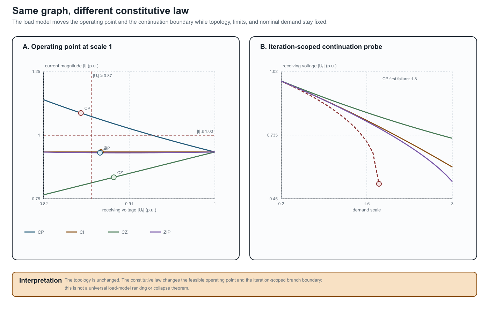

# [Load models and decision dependence](@id load-models-and-decision-dependence)

**Page status:** constitutive-model reference chapter with scoped numerical
load-model, connection-map, and continuation witnesses plus independent
reproduction; broader nonlinear and network-level certificates remain future
work.

Two networks can have identical buses, edges, terminals, and ratings while
defining different decision problems because their loads obey different
voltage laws. A graph representation does not identify a load model. The
constitutive relation belongs to the factor or asset layer and must be carried
through any preservation claim.

!!! note "Vocabulary bridge"
    *Electrical state* below means the continuous voltages and currents at an
    operating point. Equipment status, operating scenario, state-estimator
    metadata, load-model parameters, and a learned hidden state are separate
    objects even when software stores them in one state container.

## Five common voltage laws

Let ``v=|\Delta U|`` be the magnitude seen by one load connection and let
``v^{\mathrm{nom}}`` be its declared anchor. For active power, the standard
families can be written as

```math
\begin{aligned}
P_{\mathrm{CP}}(v)&=P^{\mathrm{nom}},\\
P_{\mathrm{CI}}(v)&=P^{\mathrm{nom}}\frac{v}{v^{\mathrm{nom}}},\\
P_{\mathrm{CZ}}(v)&=P^{\mathrm{nom}}\left(\frac{v}{v^{\mathrm{nom}}}\right)^2,\\
P_{\mathrm{ZIP}}(v)&=P^{\mathrm{nom}}\left(\alpha_Z\left(\frac{v}{v^{\mathrm{nom}}}\right)^2+\alpha_I\frac{v}{v^{\mathrm{nom}}}+\alpha_P\right),\\
P_{\mathrm{exp}}(v)&=P^{\mathrm{nom}}\left(\frac{v}{v^{\mathrm{nom}}}\right)^{\gamma_P}.
\end{aligned}
```

Reactive power may use its own coefficients or exponent. Constant power does
not need ``v^{\mathrm{nom}}``; the other laws do. ZIP is a convex combination
only when the declared coefficients are nonnegative and sum to one. Integer
exponents ``0,1,2`` make the exponential family coincide with a ZIP special
case, but arbitrary exponents do not.

At ``v=v^{\mathrm{nom}}`` the families agree by construction. Away from that
point they do not. The same topological graph can therefore produce different
currents, losses, voltage margins, active constraints, and optimal decisions.

## Why this belongs in a graph-model book

Consider a fixed two-bus graph with series impedance ``Z`` and a load at the
receiving bus. The power-flow relation is not just the graph incidence; it is

```math
U_s-U_r=ZI,\qquad S_r=U_r I^*,
```

together with a law for ``S_r`` as a function of ``U_r``. Replacing constant
power by constant impedance changes the equation graph and the feasible set
without changing the bus--branch multigraph. A transformation that preserves
only ``Y`` or connectivity has not preserved the decision problem unless it
also preserves the load relation and the observations that depend on it.

This is a useful counterweight to a common simplification: “the network graph
is unchanged, so the OPF is unchanged.” The graph is one layer of the model;
the load factor is another.

### When a load or generator enters the nodal operator

The factor layer and the nodal operator should not be confused. A constant-
impedance load is a one-terminal shunt factor, so a declared formulation may
stamp its admittance into a diagonal nodal block. A ZIP or constant-power load
may instead be represented by a fixed linear part plus a voltage-dependent
compensation current. The same distinction applies to generators: a fixed
Norton or dynamic equivalent may contribute a matrix block, while a PV/PQ
control, current limit, or inverter control law remains an injection or
constraint relation.

OpenDSS provides a useful engineering example. Its normal solution uses a
system nodal matrix together with compensation currents from nonlinear power-
conversion elements; its direct/admittance option solves with load and
generator equivalents included in the matrix. The documentation also notes
that loads may be switched to an admittance representation for fault studies
and that the fault-study matrix has its own source, generator, and load-current
composition [OpenDSSSolutionTechniques, OpenDSSPowerConversionElements,
OpenDSSLoad, OpenDSSFaultStudyEquations](@cite). This is a solver and study
choice, not a claim that the underlying load has become a line edge or that
the source graph has changed.

The supplied application-directed distribution equivalent illustrates the
same boundary at feeder scale. Its reduction first constructs a nodal
equivalent and then aggregates PVs and loads at an equivalent node, with
phase-shifting and shunt elements added to preserve the selected study
responses. The resulting model is validated for declared power-flow and EMT
observations; it is not presented as the unique graph of the original feeder
[IswaranThakarNekkalapuVittalKhorsand2026](@cite).

For this reason, a nodal matrix should be annotated with at least:

- the source factor inventory and terminal/attachment maps;
- the study mode and active device state;
- which load, generator, shunt, or source components were stamped into the
  matrix;
- which nonlinear or controlled parts remain in injection and constraint maps;
- the operating point or iteration used for any linearization; and
- the observations, limits, decisions, and recovery maps that remain valid.

## Decision consequences

Load-model choice becomes especially visible in three regimes:

1. **voltage regulation and CVR:** constant-power loads do not reduce demand
   when voltage is lowered, while impedance loads do;
2. **hosting capacity and voltage limits:** a voltage-dependent load can
   partially relieve a binding voltage constraint, changing the reported
   capacity; and
3. **weak feeders and collapse:** constant-power demand can create a nose
   point, so a local high-voltage solution may disappear as the load scale
   increases.

The relevant preservation contract must name the load family, its anchor,
phase or connection map, and whether the decision varies load scale,
voltage, or model parameters. A numerical result that changes after a load
model swap is not necessarily a solver error; it may be the intended change in
the physical problem.

## Per-conductor and connection semantics

For a multiconductor load, ``v`` is not automatically a bus-voltage scalar.
The factor must declare whether it uses phase-to-neutral, phase-to-phase,
sequence, or another terminal combination. A delta load and a wye load can
share the same bus terminals while seeing different voltage coordinates. The
load model therefore belongs beside the terminal map, not as an unqualified
attribute of a graph vertex.

Likewise, a three-phase load may be balanced in name but still have
phase-specific ``P_p`` and ``Q_p`` values. A balanced positive-sequence view
preserves it only when the load relation, grounding, limits, controls, and
observations close under the same phase symmetry.

### Executable connection-map probe (LOAD-CONNECTION-001)

The generated `connection_maps` witness in
`experiments/generated/load-grounding-witnesses.json` uses ordered terminals
``(a,b,c,n)`` and applies two explicit linear maps to the same balanced bus:

```math
T_Y\mathbf v = (V_a-V_n,V_b-V_n,V_c-V_n),
\qquad
T_\Delta\mathbf v = (V_a-V_b,V_b-V_c,V_c-V_a).
```

The wye observations have unit magnitude, while the delta observations have
magnitude ``\sqrt{3}`` for the recorded positive-sequence voltage. The bus and
graph are unchanged; only the factor's terminal map changes. This is a small
structural witness, not a complete unbalanced load-flow or rating model.

## Modelling checklist

Before comparing two graph views or deleting a factor, record:

- the load connection and ordered terminal map;
- the active and reactive voltage law;
- the nominal voltage anchor and units;
- phase-specific coefficients or exponents;
- whether the law changes with state, control, or time;
- the voltage and current quantities used in limits; and
- whether the study seeks feasibility, load delivery, hosting capacity,
  voltage regulation, or a different decision.

The book's existing parallel-line and transformer cases preserve their load
 equations explicitly. This chapter makes the reason general: constitutive
models are part of the representation contract, even when they are invisible
in a simple graph drawing.

## Scoped numerical witness

The generated artifact `experiments/generated/load-grounding-witnesses.json`
solves one fixed two-bus network under three load laws. With the same source,
series impedance, nominal demand, voltage limit ``|U_r|\ge0.87`` and current
limit ``|I|\le1.00``, the recorded high-voltage solutions are:

| Load law | ``\lvert U_r\rvert`` | ``\lvert I\rvert`` | Voltage limit | Current limit |
| --- | ---: | ---: |:---:|:---:|
| CP | 0.8592 | 1.0872 | fail | fail |
| CI | 0.8803 | 0.9341 | pass | pass |
| CZ | 0.8937 | 0.8348 | pass | pass |
| ZIP (active ``(0.4,0.3,0.3)``, reactive ``(0.2,0.3,0.5)``) | 0.8792 | 0.9310 | pass | pass |

This is a decision witness, not a universal ranking of load models. It shows
that a graph-preserving change of constitutive law can change both feasibility
and the active constraint set.



The left panel places the recorded operating points against the same voltage
and current limits. The right panel is the finite continuation probe: CP is
the first family to fail the declared iteration test, while the other three
families remain traceable through scale 3.0. Neither panel is a universal
voltage-collapse or load-model-ranking theorem.

The artifact
`experiments/generated/load-model-independent-reproduction.json` repeats the
same damped fixed-point calculation with a separate standard-library Python
implementation. It reproduces all four recorded rows and their voltage/current
limit decisions. This supports reproducibility of the declared scalar fixture;
it does not establish global solvability, a universal ranking of load laws, or
the adequacy of CP/CI/CZ/ZIP for a particular utility study. The ZIP row uses
nonnegative active and reactive coefficients that each sum to one; the two
coefficient triples are deliberately distinct to expose that reactive demand
need not follow the active-power law.

### Continuation probe (LOAD-CONTINUATION-001)

The same scalar fixture also includes a demand-scale continuation in
`load_continuation`. It tracks the previous high-voltage iterate over scales
``0.2,0.3,\ldots,3.0`` with damping 0.5. The recorded CP branch converges
through scale 1.7 and fails the declared iteration/residual test at scale 1.8;
CI, CZ, and the ZIP branch remain converged through scale 3.0. This is useful
as a warning that a load-model change can move a numerical branch boundary, but
the boundary is solver- and continuation-specific. It is not a global voltage-
collapse theorem, and the artifact does not claim that the first failed iterate
is the exact saddle-node point.
