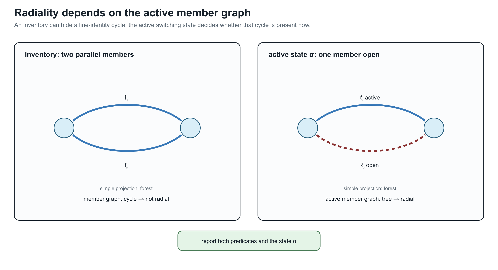
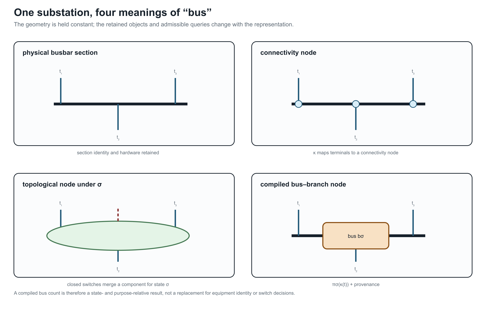

# [Node--breaker, bus--breaker, and topology processing](@id node-breaker-topology)

**Page status:** scoped topology-processing definitions with a generated
node--breaker switch-state and radiality witness; larger running-network
topology lifts remain future work.

This chapter specializes the general view and surgery contract in [From source
graphs to views and graph surgery](@ref compiled-views-and-graph-surgery). It is
authoritative for the node--breaker state processor and its concrete
``\kappa``/``\pi_\sigma`` quotient, while the general view registry, lowering
boundary, unknown-state family semantics, and degeneracy diagnostics are defined
there. The examples below therefore explain this specialization rather than
introducing a competing transformation vocabulary.

The general taxonomy in [Maps between representation frameworks](@ref
representation-maps) types ``\pi_\sigma`` as an edge-contraction quotient. In
particular it is not an ordinary homomorphism between loopless simple graphs,
because it deliberately identifies endpoints of closed switch edges.
The resulting parallel members and contraction-created loops use the normative
conventions in [Multigraphs for expert modelers](@ref
multigraphs-for-modelers).

Topology processing is a state-conditioned compilation. It is not the same as
deleting switches from a graph or replacing every closed switch by a zero
impedance line without recording the state that justified the replacement.

## Connectivity and topological nodes

Let ``\mathcal T`` be the set of conducting-equipment terminals and let
``\mathcal C`` be connectivity nodes. A connectivity model records a partial
incidence map

```math
\kappa:\mathcal T\rightharpoonup\mathcal C
```

for zero-impedance terminal connections. Switches, breakers, disconnectors,
busbar sections, and jumpers are separate objects with a state
``\sigma_e``. For a fixed active state ``\sigma``, form the graph

```math
G_{\mathrm{closed}}(\sigma)
 = (\mathcal C,\{e:\sigma_e=\mathrm{closed}\}).
```

The **topological nodes** are the connected components of
``G_{\mathrm{closed}}(\sigma)``. Write

```math
\pi_\sigma:\mathcal C\longrightarrow\mathcal N_\sigma
```

for the component quotient. A node--breaker bus--branch view is then compiled
by attaching each terminal to ``\pi_\sigma(\kappa(t))`` and retaining the
conducting equipment whose terminals are connected to distinct or equal
topological nodes. In the general registry this is a state-conditioned quotient
with provenance; here the notation makes the switch-connectivity relation
explicit.

This gives the state-resolved distinction:

| Object | Retained meaning |
| --- | --- |
| connectivity node | a zero-impedance connection point in the detailed model |
| switch/breaker | an identified asset with state, control, and protection semantics |
| topological node | a component of closed connectivity for one declared state |
| bus--branch bus | a compiled algorithmic node, often a topological node but not necessarily a physical bus |

An open switch remains an asset and a possible future action even though it is
not an edge of ``G_{\mathrm{closed}}(\sigma)``. A closed switch may disappear
from the compiled electrical equations for that state, but its provenance and
decision identity must remain recoverable.

## State-resolved compilation

Let ``M`` be a terminal or port--factor model with switch states. A topology
compiler is a partial map

```math
C_{\mathrm{top}}(M,\sigma)
 = (G_{\mathrm{bus}}(\sigma),\operatorname{prov}_\sigma,
    \operatorname{recover}_\sigma).
```

The compiler must declare:

1. the admissible state domain and whether unknown or failed states are
   allowed;
2. the zero-impedance relation used for contraction;
3. the component algorithm and treatment of isolated terminals;
4. the equipment classes that become bus--branch arcs;
5. the handling of loops, parallel members, multi-terminal factors, and
   grounding factors;
6. the map from each generated bus or arc to its source terminals and assets;
7. whether the compiled state is fixed, a scenario, or a decision variable.

For a fixed state, contracting closed ideal switches can preserve the declared
electrical connectivity relation. It does not preserve a switching decision,
protection boundary, maintenance identity, or an open-state contingency unless
those are carried by ``\operatorname{prov}_\sigma`` and the surrounding model.
The general surgery result may be a graph or a family with three-valued
connectivity summaries; the present compiler assumes a declared resolved state
when it constructs ``G_{\mathrm{bus}}(\sigma)``.

### Worked contraction state

Consider connectivity nodes ``a,b,c,d``, a switch ``s_{ab}``, and identified
non-switch members

```math
e_{ac},\quad e_{bc},\quad e_{ab},\quad e_{cd}.
```

When ``s_{ab}`` is open, ``\pi_{\mathrm{open}}`` leaves all four nodes
distinct. When it is closed, the quotient identifies ``a`` and ``b`` as the
topological node ``u=[a,b]``. The member images are then

```math
e_{ac}\mapsto\{u,c\},\qquad
e_{bc}\mapsto\{u,c\},\qquad
e_{ab}\mapsto\{\!\{u,u\}\!\},\qquad
e_{cd}\mapsto\{c,d\}.
```

Thus one state change simultaneously creates a parallel class
``\{e_{ac},e_{bc}\}`` and a graph loop ``e_{ab}``. A loopless simple target
would collapse the first pair and omit the loop, but those are two additional
information-losing maps after the connectivity quotient. A provenance-complete
compiler retains the three source-member identities and records whether the
loop image is electrically redundant, represented as another factor, or
rejected by the target formulation. It does not call the loop a shunt: both of
its source terminals belong to the same quotient node, whereas a shunt has a
declared reference or grounding relation.

If one of these source members is a two-terminal π factor, the contraction
does not authorize deleting it as a graph loop. Compile its two terminal maps
first; under the fixed linear assumptions in [Multigraphs for expert modelers](@ref
multigraphs-for-modelers), the series contribution may cancel while its endpoint
shunts combine into a one-terminal nodal stamp. Other factors may require
modified nodal or tableau variables and must remain explicit.

### Rooted feeder view after topology processing

After compiling a resolved state, a radiality check may construct a rooted
feeder hierarchy. This is a derived map, not a replacement for the
node--breaker model:

```math
H_\sigma=\bigl(\mathcal N_\sigma,E_\sigma,r_\sigma,
                \operatorname{par}_\sigma\bigr).
```

The root ``r_\sigma`` is a declared source topological node and
``\operatorname{par}_\sigma`` is defined only when each active component is a
tree with one root. If a switching candidate closes a tie, opens a parent
branch, creates an island, or introduces multiple sources, the hierarchy must
be recomputed or reported as undefined. A frozen parent map must not be used to
interpret the new state.

In a meshed candidate, retain a spanning forest and mark the remaining active
members as chords. The chords preserve cycle constraints and outage choices;
they are not downstream branches merely because an algorithm has assigned them
an orientation.

## Node--breaker and bus--branch are not competing truths

The node--breaker view is the natural source for topology decisions because it
retains switching equipment and detailed connectivity. The bus--branch view is
often the natural target for a solved PF or OPF instance because it has fewer
nodes and a conventional incidence matrix. The transformation between them is
state- and purpose-relative:

| Question | Node--breaker view | State-resolved bus--branch view |
| --- | --- | --- |
| Which breaker is open? | direct | only through provenance/state metadata |
| Are two terminals connected now? | component query | same query after ``\pi_\sigma`` |
| Can a switch be operated? | direct decision object | lost if the quotient is frozen |
| What is the branch admittance? | attached factor or equipment | compiled arc relation |
| Are parallel assets distinct? | yes | yes only in a multigraph target |
| Is a multiwinding transformer native? | terminal/factor object | requires a declared compilation |

The simple graph of topological nodes is a further quotient. It may be useful
for islands and partitioning, but it forgets member identity and should not be
used as the source of switching or protection decisions.

### Generated state witness

The artifact
`experiments/generated/node-breaker-state-witness.json` uses four
connectivity nodes, three fixed line members, and two switch assets. It
enumerates four declared states: both switches open, a closed parallel switch,
a closed chord, and an unknown switch. For each resolved state it reports
member-radiality, simple adjacency-radiality, compiled-bus radiality, the
closed-switch contraction components, and the surviving line members. For the
unknown state it enumerates both admissible realizations rather than silently
choosing open or closed.

The witness exposes a useful separation:

| State | Member-radial | Adjacency-radial | Interpretation |
| --- | --- | --- | --- |
| both switches open | yes | yes | resolved tree |
| parallel switch closed | no | yes | member cycle hidden by simple projection |
| chord switch closed | no | no | visible adjacency cycle |
| switch unknown | unknown | unknown | report both admissible realizations |

These are state-conditioned predicates, not properties of the equipment
inventory alone. The compiled bus quotient can be radial even when the
identified-member graph is not, because closed ideal switches contract
connectivity components and remove self-loops from the bus view.



The active-state panel makes the qualification explicit: report both the simple-projection predicate and the identified-member predicate, together with the state ``\sigma`` that selects open and closed members.



The same physical drawing is therefore not one graph with four labels: each overlay retains a different object set and answers different queries.

## Relation to CIM/CGMES and software topology views

CIM distinguishes equipment terminals and connectivity/topological nodes; the
topological-node layer is derived from the currently connected state rather
than being a replacement for equipment identity [CIMTopologicalNode,
CGMESLibrary](@cite). PowSyBl similarly describes topology views as a
state-dependent processing step [PowsyblTopology](@cite). These are useful
external precedents for ``\kappa`` and ``\pi_\sigma``; they do not by
themselves specify multiconductor factor equations, member-level ratings, or
decision-preserving reductions.

!!! warning "Decision-model consequence"
    A bus count that falls after switch contraction is not evidence that a
    switching problem has been preserved. The state and the contraction map
    are part of the model contract.

## Minimal running-case interpretation

In the running fixture, ``w_0`` is a switch between ``i_0`` and ``i_1``. The
fixed closed PF/OPF instance may compile it into a terminal connection, while
the discrete extension must retain ``w_0`` as an asset and state variable. The
parallel lines ``\ell_1`` and ``\ell_2`` remain separate identified factors
after topology processing; their common endpoint pair does not authorize
aggregation.
