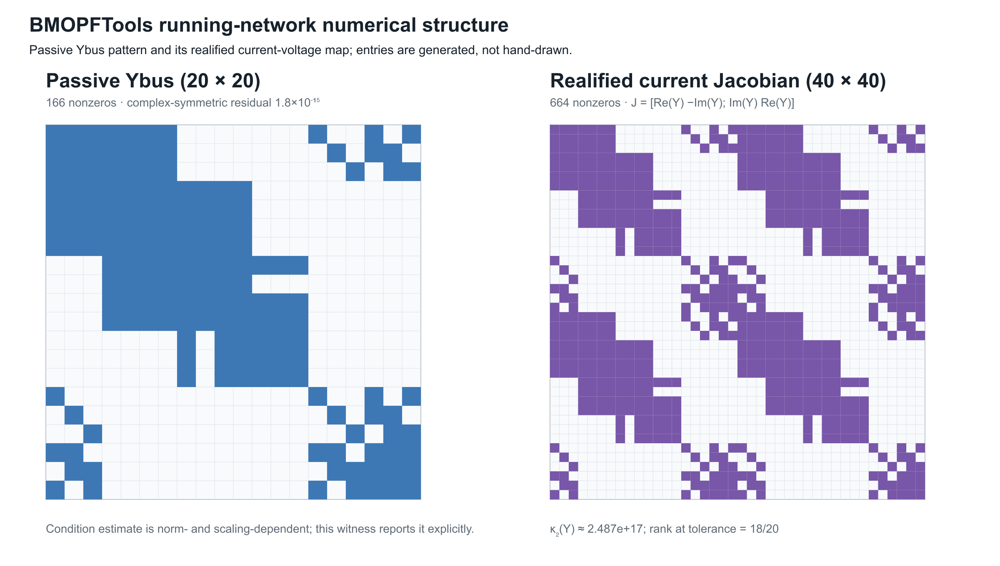
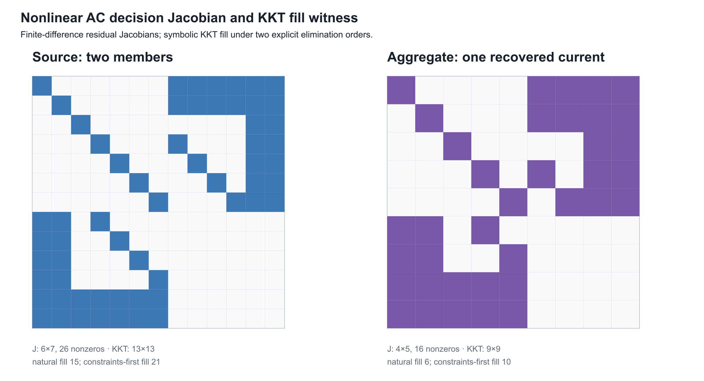

# [Numerical consequences of representation and reduction](@id numerical-consequences)

**Page status:** generated structural, linearized, symbolic KKT, and
package-level solver-diagnostics crosswalk witnesses; solver-internal
nonlinear exports remain future work.

## A graph choice is also a numerical choice

Two representations can describe the same declared electrical behaviour while
producing very different numerical problems. A quotient may reduce the number
of variables but worsen scaling; a Kron reduction may preserve a boundary
relation but introduce dense couplings; a factor model may expose physical
structure while a bus--branch compiler produces a smaller, more familiar
Jacobian. These are computational consequences, not afterthoughts.

The relevant comparison is therefore not only

```math
\text{same terminal map?}
```

but also

```math
\text{same feasible observations, with what conditioning, sparsity, and recovery cost?}
```

The statements below concern a declared operating point, coordinate system,
and solver tolerance. They do not claim that one representation is uniformly
better.

The federated `PSK-000011` guard makes one practical boundary executable:
`reference_singularity_validation` compares mapped connected-island reference
incidence and rank declarations before accepting a transformed model. A
successful import or solver termination is not an independent certificate of
full rank. The package pass remains declaration-level evidence; equation,
Jacobian, conditioning, and solver-specific checks still belong to the study.

!!! note "Vocabulary bridge"
    Electrical loss is power absorbed by a device model. Information loss is
    a failure of recovery under a representation map. An optimization or ML
    loss is an objective function. The shared word does not make these
    quantities comparable, and reducing one need not reduce either of the
    others.

## Scaling and conditioning

Let a linearized or linear subproblem be

```math
\mathbf A x = b.
```

Changing units or terminal coordinates is represented by nonsingular maps
``x=\mathbf D_x\widetilde x`` and ``b=\mathbf D_b\widetilde b``. The
coefficient matrix becomes

```math
\widetilde{\mathbf A}
 = \mathbf D_b^{-1}\mathbf A\mathbf D_x.
```

The solution set is unchanged, but the numerical condition number can change:

```math
\kappa(\widetilde{\mathbf A})
 = \|\mathbf D_b^{-1}\mathbf A\mathbf D_x\|
   \|\mathbf D_x^{-1}\mathbf A^{-1}\mathbf D_b\|.
```

This is why per-unit coordinates are a numerical convention as well as a
reporting convention. A declared base scales voltage, current, power, and
impedance together; it does not erase poor physical conditioning, singular
topology, or an omitted conductor. A coordinate transformation is safe to call
an exact rewrite only when its inverse and its power-dual action are retained,
as in [the coordinate-transformation chapter](@ref circuit-coordinate-transformations).

!!! warning "Circuit-theory trap"
    A dimensionless or per-unit matrix is not automatically well conditioned.
    The conditioning claim must name the norm, the bases, and the operating
    domain. A small residual in badly scaled coordinates can coexist with a
    large error in a physical voltage, current, or decision.

For a computed solution ``\widehat x`` define the residual
``r=b-\mathbf A\widehat x``. A backward-error measure is, for example,

```math
\eta(\widehat x)
 = \frac{\|r\|}{\|\mathbf A\|\,\|\widehat x\|+\|b\|}.
```

Forward error bounds require additional assumptions. In a nonsingular linear
problem, a standard normwise estimate has the form

```math
\frac{\|\widehat x-x\|}{\|x\|}
 \lesssim \kappa(\mathbf A)\,\eta(\widehat x),
```

up to higher-order terms and the chosen norm. Certificates should therefore
store both a residual/backward-error quantity and a conditioning estimate, not
just a solver termination flag.

## Jacobians: physical topology is not matrix sparsity

For a nonlinear decision model ``F(y,u)=0``, Newton or interior-point methods
use a Jacobian such as

```math
\mathbf J = \frac{\partial F}{\partial y}.
```

The physical graph predicts some nonzeros, but the Jacobian graph is a graph of
variable--equation dependence. A single multi-terminal factor can create a
dense block between all of its ports. A nominal-``\pi`` element can couple
endpoint voltages through series terms and endpoint currents through shunts.
Constraint rows for limits, controls, and recovery variables add edges that
have no corresponding physical line. Conversely, a physical asset may be
absent from a particular Jacobian block when its state is fixed or its
equation has been eliminated.

Write ``G_phys`` for a chosen physical incidence graph and ``G_J`` for the
bipartite Jacobian graph. In general there is no equality
``G_phys=G_J``. The useful statement is a declared dependency map

```math
\delta:\; (\text{factor},\text{terminal},\text{constraint})
\longmapsto (\text{equation rows},\text{variables}),
```

from which ``G_J`` is generated. This map is the numerical analogue of source
provenance: it explains why a fill-in or a dense block exists.

The five-bus structural witness makes the distinction concrete. Its source has
seven line identities but only six edges after simple projection because ``q``
and ``r`` are parallel. Eliminating ``j`` then adds the ``i``--``l`` fill edge
to the projected pattern. The fill argument and the dependency argument are
shown separately so that a reader does not confuse a Schur-complement edge
with a numerical derivative. The conceptual pair now appears in the
[formulation and lowering chapter](@ref circuit-formulations-and-lowering);
this chapter retains the executed witnesses and their fixture-specific
counts.

The data and checks are recorded in
`experiments/generated/numerical-structure-witness.json`; the renderer is
`experiments/generate_numerical_structure_views.py`. This separation is
intentional: both structural views can be checked without pretending that
either is a solver-exported Jacobian.

Fill is not inevitable. The
[two-level topology chapter](@ref two-level-topology-and-nodal-projection)
proves a positive structural case: dense two-terminal conductor stamps over a
bus-level tree form a chordal scalar-support graph, and eliminating leaf-bus
coordinate blocks inward is a perfect elimination order with zero symbolic
fill. The warning here concerns arbitrary orderings, meshes, reductions, and
factor libraries; it should not hide structure that a declared model makes
exploitable.

The numerical witness now carries a crosswalk to
`experiments/generated/five-bus-typed-kron-witness.json`. That crosswalk uses
the non-pendant ``\ell`` elimination, whose fill edges are ``j-m`` and
``k-m``, and records the small boundary residual together with the recovered
``u``-branch limit observation. This ties the Schur-complement example to the
numerical-structure discussion without conflating fill edges with physical
assets or solver-private factorization output.

## A pinned numerical export

The running fixture provides a second, numerical witness through BMOPFTools'
passive and constant-``Z`` linearized ``Y``-bus exporters. In the exporter's
node order, the passive matrix has 20 rows and 166 nonzeros. The constant-``Z``
linearized matrix agrees with that passive matrix for this fixture. Realifying
the complex current relation gives a 40-by-40 real matrix with 664 nonzeros.
This is a coordinate embedding, not a promise that every complex invariant is
preserved: the complex Ybus is transpose-symmetric to numerical precision,
whereas the realified current-Jacobian embedding has a large transpose
residual. That residual is expected for a nonzero imaginary part: the block
matrix ``\mathcal R(Y)`` with diagonal blocks ``\Re Y`` and off-diagonal blocks
``-\Im Y`` and ``\Im Y`` is generally not symmetric. This is not a
round-off failure. Realification preserves the coordinate support and the
current relation, but symmetry claims must be stated in the representation in
which they are checked (the witness residual is approximately ``448.79``):

```math
\begin{bmatrix}\Re I\\ \Im I\end{bmatrix}
=
\begin{bmatrix}
\Re Y&-\Im Y\\
\Im Y& \Re Y
\end{bmatrix}
\begin{bmatrix}\Re V\\ \Im V\end{bmatrix}.
```



The ordinary 2-norm condition estimates are approximately
``2.49\times10^{17}`` (unscaled) and ``2.36\times10^{16}`` (after simple
row/column equilibration). Because both matrices are numerically rank
deficient (rank 18 of 20 at the witness tolerance), those finite values should
not be read as meaningful condition numbers: they are dominated by singular
values below the modelling tolerance. The witness therefore also reports the
rank-aware effective estimates ``\kappa_{\mathrm{eff}}=\sigma_1/\sigma_{18}``
and its equilibrated counterpart. These are diagnostic, not universal
constants: they depend on units, node ordering, norm, rank tolerance, and the
chosen fixture. For this export the effective estimates are approximately
``6.50\times10^8`` and ``1.13\times10^7`` after equilibration. A solver must
account for reference and grounding structure rather than treating any of
these numbers as a graph invariant.

The complete export, including node order, nonzero entries, checks, and the
linearization convention, is recorded in
`experiments/generated/ybus-jacobian-witness.json`. The scripts
`experiments/run_ybus_jacobian_witness.jl` and
`experiments/render_ybus_jacobian_view.py` regenerate it. This is a pinned
linear current/Jacobian witness; it is not yet a nonlinear OPF KKT Jacobian or
an independent-solver comparison.

## Nonlinear decision Jacobian and KKT fill

The next witness adds the nonlinear term that makes the parallel-line warning
decision relevant. For a fixed complex endpoint voltage ``U`` and member
currents ``I_1,I_2``, the residual includes

```math
S(U,I_1,I_2)-\alpha S_0
  = U(I_1+I_2)^*-\alpha S_0.
```

The source formulation retains two explicit current laws and two current
vectors. The aggregate formulation replaces them by one summed current law.
At the recorded operating point both residuals are exactly zero, but their
finite-difference Jacobians and KKT patterns differ:

For avoidance of a common counting error, the source witness has two complex
member-current coordinates, represented as four real variables, in addition to
the three retained real coordinates. It therefore has seven real source
variables; the aggregate witness has five real variables. The reduction removes
two real variables (one complex current), not eight. The source KKT system has
13 rows and columns because it adds six residual/constraint multipliers; that
KKT dimension is a different count from the number of primal variables.



| formulation | residual Jacobian | KKT dimension | natural fill | constraints-first fill |
| --- | ---: | ---: | ---: | ---: |
| two explicit members | ``6\times7`` (26 nonzeros) | 13 | 15 | 21 |
| summed member current | ``4\times5`` (16 nonzeros) | 9 | 6 | 10 |

The fill counts are symbolic graph counts, not floating-point factorization
times. They show why an ordering is part of a numerical certificate: the same
KKT graph has different fill under different elimination orders. The source
and aggregate models also have different graphs, so a smaller KKT system does
not by itself establish decision equivalence.

The complete finite-difference and symbolic-fill artifact is
`experiments/generated/nonlinear-kkt-witness.json`, regenerated by
`experiments/run_nonlinear_kkt_witness.jl` and
`experiments/render_nonlinear_kkt_view.py`. It is deliberately labelled a
nonlinear decision witness rather than a solver-internal Ipopt KKT export. A
package-level crosswalk now binds it to the BMOPFTools Ybus witness, while
actual solver-internal factorization diagnostics remain a separate boundary.

### Package-level diagnostics crosswalk

The generated `solver-diagnostics-crosswalk.json` composes the two witnesses
without pretending that either is a production solver export. It retains the
physical node/terminal order, the BMOPFTools passive and constant-``Z`` Ybus,
the realified current Jacobian, the finite-difference nonlinear residual
Jacobian, and the symbolic KKT graph under two declared orders. In the source
formulation, for example, the natural and constraints-first orders produce
different fill counts, so the crosswalk records ordering as part of the
diagnostic identity.

The crosswalk also exercises the public
`BMOPFTools.opf_checked_kkt_factorization` callback on a staged OPF context. The
probe accepts a regular matrix and rejects a near-singular one. This is a
checked callback boundary. A minimal parameterized OPF now passes that callback
through DiffOpt: the forward sensitivity agrees with a central finite
difference to the recorded tolerance, and the KKT diagnostic is accepted. The
adapter also captures the matrix passed to the callback, recording its
dimension and nonzero count, alongside the JuMP variable and constraint order
used to account for its rows and columns. Four additional callback rows remain
outside that declared JuMP block, so they are retained as an explicit
DiffOpt/solver-internal boundary rather than silently assigned a physical
label. The crosswalk still records
`solver_internal_kkt_export = false` because solver-provided row labels,
scaling, linear-solver choice, pivot or inertia data, and factorization
statistics are not yet exported as a source/target comparison.

The same witness records BMOPFTools' differentiability report: inequality
counts, active, near-active, weakly-active, and violated labels, minimum
inactive slack, and qualifications. In this deliberately unconstrained
fixture the inequality count is zero. The report's `ready` flag is state
provenance for the selected local solve, not a proof of LICQ, strict
complementarity, second-order sufficiency, global optimality, or branch
stability.

The crosswalk now also builds a regular JuMP mirror and records its native
affine/quadratic variable-support count alongside a separate
`JuMP.NLPEvaluator` view. This gives an executable constraint-row/nonzero
summary for the model-level derivative graph (23 supported variable entries in
the current 19-row fixture), while leaving
`native_nlp_export_is_solver_internal = false`: it is not Ipopt's private KKT
ordering, pivoting, inertia, or factorization export.

For a deliberately narrow parallel-line fixture, the crosswalk also compares a
two-member source against a single 0.25 Ω equivalent member. The tested voltage
sensitivity is preserved, while the captured KKT matrix grows for the explicit
source. The native JuMP support count changes as well, so the distinction is
visible before any solver-private factorization. This is evidence that an exact
electrical scalar equivalent can still change solver structure; it is not a
general AC or multiconductor reduction certificate.

### Numerical evidence boundary

The three numerical artifacts answer different questions and should not be
collapsed into one solver claim:

| Artifact | What is measured | What it does not establish |
| --- | --- | --- |
| structural witness | incidence, dependency, and symbolic fill edges | numerical derivative values or solver performance |
| `Ybus`/Jacobian witness | pinned passive and constant-``Z`` matrix patterns, rank, and conditioning diagnostics | nonlinear OPF sensitivities, active-set stability, or factorization timings |
| nonlinear KKT witness | finite-difference residual structure and symbolic fill under two declared orders | Ipopt's internal derivative graph, linear-solver pivoting, or global optimality |
| solver-diagnostics crosswalk | shared node/order provenance, a checked-KKT callback probe, a DiffOpt sensitivity cross-check, and JuMP ordering metadata | an exported source/target solver KKT comparison, solver-native row labels, or ordering/factorization metadata |

An actual solver diagnostic would need to bind the exported derivative rows and
columns to the source/target variable order, record scaling and tolerances,
identify the linear solver and ordering, and retain the factorization or
inertia report. Until that export exists, the chapter's KKT language is a
symbolic comparison, not an implementation claim about a production solver.

## Elimination and fill-in

Partition a sparse matrix by retained variables ``B`` and eliminated variables
``I``. The Schur complement is

```math
\mathbf S
 = \mathbf A_{BB}
   -\mathbf A_{BI}\mathbf A_{II}^{-1}\mathbf A_{IB}.
```

Even when ``\mathbf A`` is sparse, ``\mathbf S`` can be dense on the neighbours
of ``I``. In the symbolic graph, eliminating a vertex connects its remaining
neighbours into a clique. The extra nonzeros are **fill-in**. The same
mechanism appears in [Kron reduction](@ref kron-ward-opti-kron): preserving a
boundary relation does not preserve sparsity, asset identity, or the cost of a
subsequent solve.

The order of elimination matters. For a fixed matrix, two orders can have the
same exact Schur complement but different intermediate fill, memory use, and
factorization time. A certificate that reports a reduction should therefore
record at least:

| numerical field | required meaning |
| --- | --- |
| `ordering` | symbolic elimination or factorization order |
| `nnz_input`, `nnz_factor`, `nnz_fill` | structural nonzero counts under that order |
| `rank_guard` | rank/invertibility test for eliminated blocks |
| `conditioning` | estimate for the retained and eliminated solves |
| `recovery_cost` | work/storage needed to reconstruct omitted variables |

These fields are properties of a compiled numerical problem, not of a simple
graph in isolation.

## Solver behaviour and decision margins

For a constrained decision problem, solver behaviour is part of the evidence
but not the preservation theorem. A reduced model may converge faster because
it has fewer variables, or slower because it has denser and more ill-conditioned
blocks. A feasible point can also be numerically ambiguous when a constraint
margin is comparable with the estimated forward error.

A termination label such as `LOCALLY_SOLVED` or `OPTIMAL` records what the
algorithm reports under a particular solver interface and tolerance. It is not
an independent recomputation of the returned primal point. A scientific use of
that result must separately name and check the relevant evidence: finite
numeric values, model equations, declared bounds, device and network residuals,
recovery obligations, and the level of optimality actually supported. Missing
checks remain missing even when the status string sounds successful.

This separation also works in the other direction. A status that does not
claim feasibility is not evidence that a candidate primal point passed an
independent validator, and a narrowly validated primal point does not upgrade a
local solver result into a global optimum. Status, primal validation, and
optimality evidence are distinct fields of a solution certificate.

For a scalar inequality ``g_k(y,u)\le 0``, define the signed margin

```math
m_k = -g_k(\widehat y,\widehat u).
```

If ``e_k`` is a declared bound or estimate for the error in that constraint,
classify the result as:

```math
\begin{array}{ll}
\text{certified feasible} & m_k>e_k,\\
\text{numerically ambiguous} & |m_k|\le e_k,\\
\text{certified violated} & m_k<-e_k.
\end{array}
```

This is deliberately stronger than reporting ``g_k\le 0`` at printed
precision. The same classification applies to decision comparisons: if two
objectives or tap choices differ by less than the propagated numerical error,
the certificate should not claim a unique optimum.

!!! warning "Decision-model consequence"
    A reduction that preserves a boundary voltage to tolerance may still change
    the active member limit, the selected switch state, or the winning discrete
    decision. Record the decision margin and the recovery error for every
    claimed decision-preservation result.

## What a transformation certificate should expose

The numerical fields extend the general [preservation contract](@ref preservation-contracts):

```math
\mathcal N = (
\text{coordinates},\text{scaling},\kappa,\eta,\text{dependency graph},
\text{ordering},\text{fill},\text{recovery cost},\text{decision margins}
).
```

An exact electrical map may therefore be computationally unattractive, while
an approximate map may be useful if its error and decision domain are explicit.
The running network's six generated views should eventually carry this record
alongside their source maps; the current fixture records the source maps and
solver outcomes but does not yet claim a complete cross-solver conditioning
study.

## Scope and open work

This chapter gives definitions and reporting requirements, not a universal
solver benchmark. The next executable tranche should compare the running
multiconductor network and its five-bus quotient under a pinned ordering and
coordinate convention, report ``Y``/Jacobian sparsity and fill-in, and test
whether recovered current and rating margins remain decisive after reduction.
