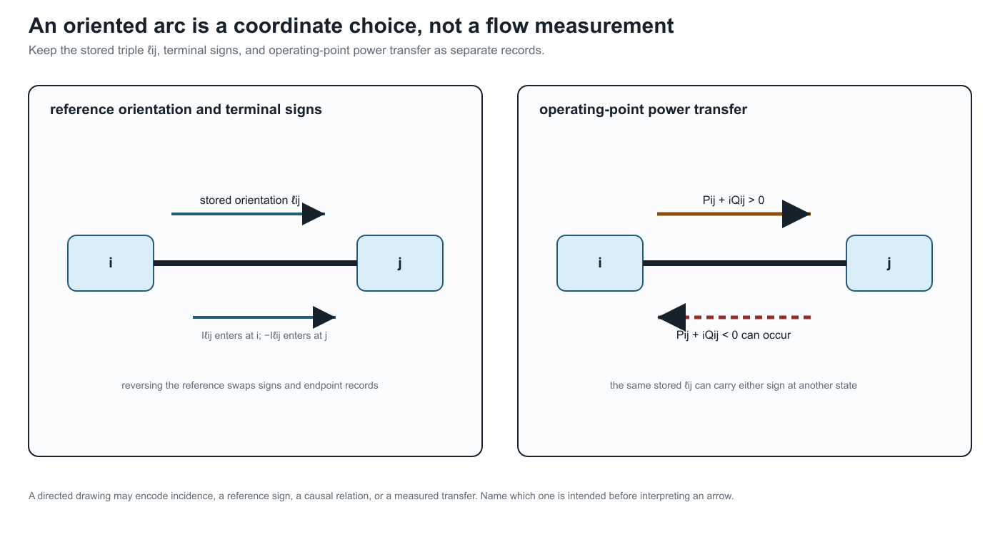

# [Orientation, terminal quantities, and power transfer](@id orientation-terminal-power)

**Page status:** foundational definitions and terminology.

## Why an arrow is ambiguous

Power-system diagrams, data formats, and optimization models use arrows for
several different purposes. A line drawn from ``i`` to ``j`` can mean an
arbitrary stored orientation, a terminal-current sign convention, a positive
reference direction for active power, an observed operating-point transfer,
or a genuinely one-way admissible action. These meanings must not be inferred
from one another.

| Direction concept | Mathematical data | Dependence |
|:--|:--|:--|
| physical incidence | unordered endpoints ``\partial\ell=\{i,j\}`` | equipment model |
| reference orientation | one selected arc ``o(\ell)=\ell ij`` | arbitrary coordinate choice |
| terminal-current sign | current defined into or out of each terminal | modelling convention |
| operating-point transfer | sign of ``P_{\ell ij}`` at a solution | voltage, state, and controls |
| causal or permitted direction | asymmetric control or feasible relation | physical or study semantics |

A conventional passive AC line is therefore an undirected physical connection
with an orientation, not intrinsically a directed physical edge.

!!! warning "Power-system shorthand"
    An arrow on a passive branch normally fixes storage order, terminal names,
    or a positive reference. It does not predict the sign of current or active
    power at a solution.

## The terminal-arc double cover

For every two-terminal element ``\ell`` with
``\partial\ell=\{i,j\}``, introduce the two terminal arcs

```math
\overrightarrow{\mathcal L}
=
\{\ell ij,\ell ji:\ell\in\mathcal L\}.
```

The reversal map

```math
\rho:\overrightarrow{\mathcal L}
\rightarrow\overrightarrow{\mathcal L},
\qquad
\rho(\ell ij)=\ell ji,
```

is an involution with no fixed points. A reference orientation chooses one arc
from each pair; the bidirected terminal-arc view retains both. The line remains
one member of ``\mathcal L``.

With the book's incidence convention, the selected arc ``\ell ij`` gives
``-1`` at ``i`` and ``+1`` at ``j``. Choosing ``\ell ji`` instead negates the
column. Incidence rank, the undirected cycle space, and physical solutions are
invariant under that coordinate change, while signed cycle coordinates change
accordingly.

## A stored orientation is not an operating direction

The stored triple ``\ell ij`` determines which endpoint is written first. It
does not imply any of the statements

```math
P_{\ell ij}\ge0,
\qquad
|P_{\ell ij}|\ge|P_{\ell ji}|,
\qquad
\text{or}\qquad
\ell\text{ can transfer only from }i\text{ to }j.
```

Those are operating or device claims requiring separate equations. Active
power can reverse between operating points, and in an unbalanced
multiconductor model its sign can differ by conductor.

Reversing the stored orientation swaps end-specific records:

```math
(\mathbf N_{\ell i},\mathbf N_{\ell j},
 \mathbf Y^{\mathrm{sh}}_{\ell ij},
 \mathbf Y^{\mathrm{sh}}_{\ell ji},
 \mathbf I_{\ell ij},\mathbf I_{\ell ji})
\longleftrightarrow
(\mathbf N_{\ell j},\mathbf N_{\ell i},
 \mathbf Y^{\mathrm{sh}}_{\ell ji},
 \mathbf Y^{\mathrm{sh}}_{\ell ij},
 \mathbf I_{\ell ji},\mathbf I_{\ell ij}).
```

It does not blindly negate both terminal currents. Antisymmetry belongs to a
particular internal series-current coordinate, not to every terminal quantity.

## Rooted-tree orientation is a derived view

When an active network is radial, practitioners often orient every branch from
the feeder source toward the leaves and call the resulting arcs *upstream* and
*downstream*. This is useful, but it is not the stored orientation ``\ell ij``
and it is not an intrinsic direction of a passive line.

For an active identified graph ``G_M^\sigma`` and a selected source root ``r``
in each component, a rooted-tree view adds a parent map

```math
\operatorname{par}_{\sigma,r}:V\setminus\{r\}\longrightarrow V
```

defined by the unique root-to-node path. The resulting parent-to-child arcs,
depths, ancestors and descendants are a **state- and root-dependent
algorithmic view**. They are appropriate for feeder recursions, backward/
forward sweeps and radial branch-flow notation, but they are not new asset
attributes.

!!! warning "Graph-theory trap"
    A parent-to-child arc is not an operating power-flow direction. Closing a
    tie can create a chord, reverse power can change the sign of ``P_{\ell ij}``,
    and a different source or spanning tree can change the parent map without
    changing any line asset.

If ``G_M^\sigma`` is meshed, choose a spanning forest only if an algorithm
needs one. Tree edges then receive parent-child roles, while chords retain
their cycle equations and must not be called upstream or downstream without a
separate convention. A spanning-tree orientation is therefore a coordinate or
algorithmic choice, not a claim that the physical network is radial.



The figure makes the sign discipline explicit: reversing ``\ell_{ij}`` changes the coordinate convention, while changing the operating point can reverse ``P_{\ell ij}`` without changing the stored asset orientation.

## Series current and terminal power

For a reciprocal scalar series element, use current into the element at each
terminal:

```math
I^{\mathrm s}_{\ell ij}
=Y_\ell(U_i-U_j),
\qquad
I^{\mathrm s}_{\ell ji}
=-I^{\mathrm s}_{\ell ij}.
```

The corresponding terminal complex-power injections are

```math
S_{\ell ij}=U_i(I^{\mathrm s}_{\ell ij})^*,
\qquad
S_{\ell ji}=U_j(I^{\mathrm s}_{\ell ji})^*.
```

Although series current is antisymmetric, terminal power is not conserved:

```math
S_{\ell ij}+S_{\ell ji}
=(U_i-U_j)(I^{\mathrm s}_{\ell ij})^*
=Z_\ell|I^{\mathrm s}_{\ell ij}|^2.
```

For ``Z_\ell=R_\ell+\mathrm jX_\ell`` with ``R_\ell\ge0``, the active-power
absorption is

```math
P_{\ell ij}+P_{\ell ji}
=R_\ell|I^{\mathrm s}_{\ell ij}|^2\ge0.
```

A lossy branch therefore owns two terminal powers and a loss relation, not one
conserved scalar flow. Calling ``S_{\ell ij}`` the *power flow from* ``i`` is a
useful shorthand only after its terminal sign convention is fixed.

The familiar single-flow picture is recovered in a declared lossless
approximation, where ``P_{\ell ij}=-P_{\ell ji}``. It should be presented as a
special collapse rather than the semantics of a general edge.

!!! warning "Circuit-theory trap"
    Opposite series currents do not imply opposite terminal powers. Voltage
    differs across the impedance, so the two terminal powers sum to the
    element's complex absorption. A nominal-``\pi`` factor can additionally
    have terminal currents that are not negatives because it contains shunts.

## Nominal-pi elements

For a scalar nominal-``\pi`` element, define

```math
\begin{aligned}
I_{\ell ij}
&=I^{\mathrm s}_{\ell ij}
  +Y^{\mathrm{sh}}_{\ell ij}U_i,\\
I_{\ell ji}
&=-I^{\mathrm s}_{\ell ij}
  +Y^{\mathrm{sh}}_{\ell ji}U_j.
\end{aligned}
```

Then

```math
I_{\ell ij}+I_{\ell ji}
=Y^{\mathrm{sh}}_{\ell ij}U_i
+Y^{\mathrm{sh}}_{\ell ji}U_j,
```

which is generally nonzero. Current has not been destroyed. It has been
diverted through shunt paths retained inside the composite line factor. A
conductive shunt absorbs active power, while inductive or capacitive shunts
exchange reactive power.

The terminal-power balance is

```math
\begin{aligned}
S_{\ell ij}+S_{\ell ji}
=\;&Z_\ell|I^{\mathrm s}_{\ell ij}|^2\\
&+|U_i|^2(Y^{\mathrm{sh}}_{\ell ij})^*
+|U_j|^2(Y^{\mathrm{sh}}_{\ell ji})^*.
\end{aligned}
```

For a multiconductor member the same distinction is expressed by the complete
two-end primitive

```math
\begin{bmatrix}
\mathbf I_{\ell ij}\\
\mathbf I_{\ell ji}
\end{bmatrix}
=
\begin{bmatrix}
\mathbf Y_\ell+\mathbf Y^{\mathrm{sh}}_{\ell ij}&-\mathbf Y_\ell\\
-\mathbf Y_\ell&\mathbf Y_\ell+\mathbf Y^{\mathrm{sh}}_{\ell ji}
\end{bmatrix}
\begin{bmatrix}
\mathbf U_i[\mathbf N_{\ell i}]\\
\mathbf U_j[\mathbf N_{\ell j}]
\end{bmatrix}.
```

Full coupling makes a story about independent power commodities travelling on
individual conductor edges still less reliable. The invariant object is the
declared multiport relation and its terminal power balance.

## Internal versus explicit shunts

The same fixed nominal-``\pi`` behaviour can be factorized in two ways:

1. one composite two-port line factor containing series and shunt terms;
2. one series factor plus two explicit shunt factors attached to the endpoint
   junctions.

In the second factorization the series currents are negatives, and the shunt
factors separately account for current to ground or neutral. In the first,
the composite line's terminal currents are not negatives. Moving between the
two is an exact compilation only when terminal coordinates, grounding scope,
parameters, limits, ownership, and provenance are mapped explicitly.

This is why statements such as *current is conserved on every edge* are
representation dependent. KCL is conserved at the complete network level;
which internal path is called an edge depends on the factorization.

## When a directed graph is physical

A directed edge is appropriate when order is intrinsic to the represented
relation, for example:

- a one-way communication or control dependency;
- a protection logic dependency;
- a device with a genuinely asymmetric admissible transfer set;
- a study graph of causal or optimization dependencies.

Even then, a multiport factor may be more faithful than a directed ordinary
edge. A controllable converter can have oriented information flow, terminal
power variables at several ports, losses, and bidirectional feasible operating
regions at the same time.

## Direction contract used here

An arrow in this book is interpreted through the five direction concepts above.
Unqualified phrases such as *directed line*, *power on the edge*, and *reverse
current* are therefore replaced by the physical incidence, stored orientation,
terminal quantity, or operating-point statement actually meant.
