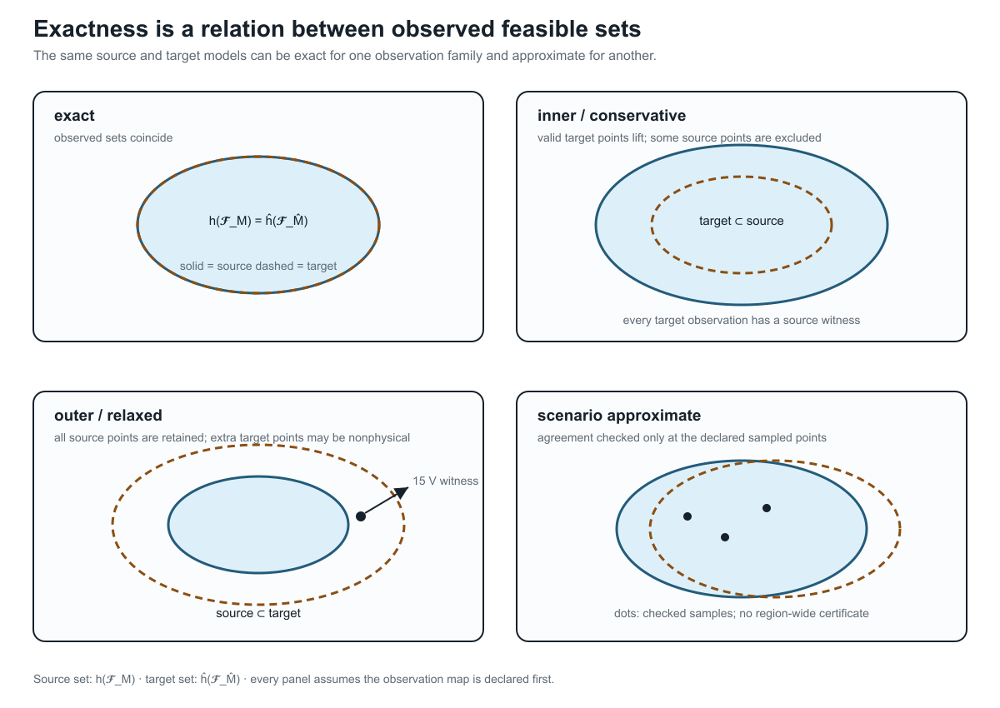
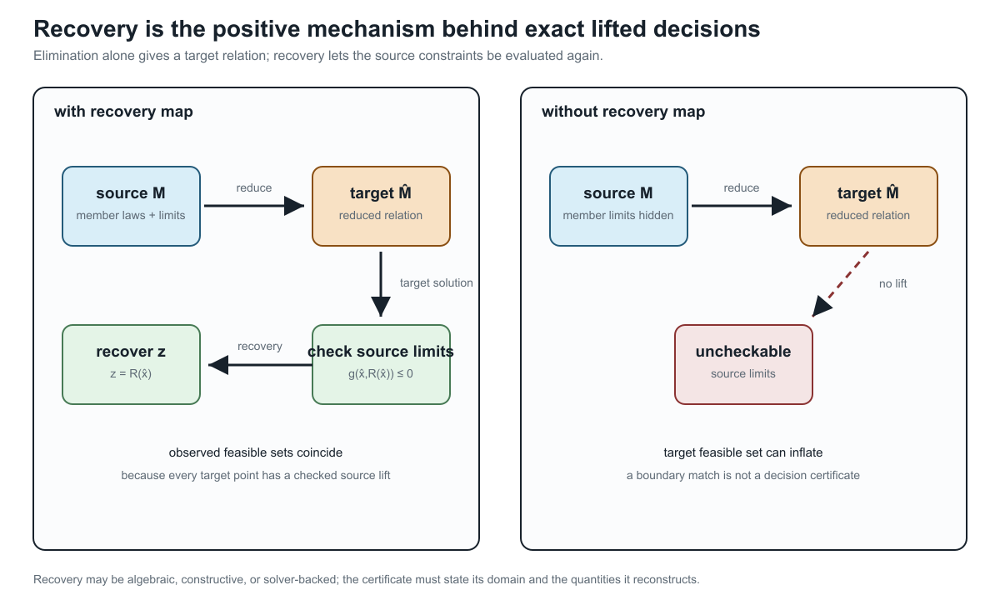

# [Preservation contracts](@id preservation-contracts)

**Page status:** foundational definitions; certificate requirements are normative proposals.

!!! note "Evidence boundary"
    **Scope:** observation-indexed feasible-set equivalence and preservation contracts for declared model classes.
    **Evidence:** definitions, linear recovery derivations, and scoped certificate examples.
    **Numerical optimality:** certificate examples are not global optimality proofs.
    **Unresolved boundary:** general nonlinear, mixed-integer, uncertainty-aware, or externally reviewed preservation theorems.

## Observation precedes equivalence

Let ``u\in\mathcal U`` be a fixed admissible input and let
``\mathcal F_M(u)`` and ``\mathcal F_{\widehat M}(u)`` be the source and
target feasible sets at that input. Their internal coordinates may differ.
Choose **joint** observation maps into the same observation space,

```math
O_M(x,z,u)=(h_1(x,z,u),\ldots,h_k(x,z,u)),\qquad
O_{\widehat M}(\widehat x,u)=(\widehat h_1(\widehat x,u),\ldots,
\widehat h_k(\widehat x,u)).
```

**Definition (`PRESERVE-001`).** The transformation is exact for these
observations and this input domain when

```math
\left\{O_M(x,z,u):(x,z)\in\mathcal F_M(u)\right\}
=
\left\{O_{\widehat M}(\widehat x,u):
\widehat x\in\mathcal F_{\widehat M}(u)\right\},
\qquad u\in\mathcal U.
```

The joint map retains relationships between observed quantities. Equality of
individual observation ranges is weaker. For example, the sets
``\{(0,0),(1,1)\}`` and ``\{(0,1),(1,0)\}`` have identical coordinate
ranges, yet maximizing the sum of their coordinates gives 2 and 1. A test of
each coordinate separately would miss that difference. A declared family of
maps may replace the single joint map only when it includes the joint
observations needed for the claim.

For a decision problem, include the decisions whose preservation is claimed
in the joint observation, and require the same objective function of those
observations (or include objective value as another joint coordinate).
Equal joint feasible images then give equal attainable observed decisions
and objective values. Equality of optimal values does not alone imply the
same decisions; existence of an optimizer and source-state recovery remain
separate obligations. If ``u`` is itself optimized, rather than supplied as
input, its admissible domain and source/target correspondence must also be
preserved. All statements concern the declared feasible models, not a solver's
ability to find their solutions.

!!! warning "Decision-model consequence"
    Matching terminal equations or separate voltage and current ranges does
    not establish equality of joint constrained feasible observations.
    Declare the input domain, jointly observed decisions and quantities,
    objective correspondence, and required recovery map.


The card is generated by `experiments/render_preservation_contract_card.py`.
It is a compact reading aid for the certificate fields below; it is not a
replacement for the quantified definition or the machine-readable schema.

The book now separates four layers that are often collapsed under the word
“preservation”: typed structure, constitutive behaviour, decision semantics,
and provenance/ownership. See [Transformation semantics and register](@ref
transformation-semantics-register) for the definitions, closure rules and
anti-pattern register. A certificate should be explicit when it preserves only
one of these layers.

## Preservation dimensions

A transformation certificate should identify which dimensions it preserves:

```math
\begin{aligned}
\Sigma=\{\,&\text{connectivity},\ \text{terminal behavior},\
             \ \text{phase/neutral behavior},\\
           &\text{asset identity},\ \text{limits},\
             \ \text{switching states},\ \text{measurements},\\
           &\text{protection},\ \text{spatial provenance},\
             \ \text{dynamics}\}.
\end{aligned}
```

This is not a binary checklist. Each item needs a precise scope. For example,
"terminal behavior" might mean:

- linear phasor behavior at one frequency;
- nonlinear steady-state behavior;
- an impedance function over a frequency interval;
- time-domain behavior for a specified initialization class;
- a scenario-bounded approximation to voltage magnitudes only.

## Proposed certificate schema

The field table in this section is a **non-normative v1.2 proposal**. The
machine-checked repository schema remains version 1.1.0 and deliberately does
not yet require an ``error_bound`` field or a normalized numerical-evidence
object. Implementations must validate against the versioned JSON schema; the
proposal below is a compatibility target for a future schema revision, not an
implicit requirement on current certificates.

Every transformation record should contain:

| Field | Meaning |
| --- | --- |
| `source_type`, `target_type` | model categories and schema versions |
| `rule_id` | stable identifier for the rewrite or compiler rule |
| `scope` | source objects affected |
| `preconditions` | structural, physical and state assumptions |
| `preserves` | formal or testable preservation claims |
| `forgets` | questions no longer answerable |
| `provenance` | source-to-target and target-to-source object maps |
| `recovery_map` | reconstruction of eliminated variables where possible |
| `constraint_map` | exact, conservative or approximate lifting of limits |
| `error_bound` **(v1.2 proposal)** | norm, domain and bound for approximate transformations |
| `evidence` | theorem, derivation, test suite, or external reference |

## Compact BMOPFTools decision-manifest gate

Cross-repository object `PSK-000007` connects the observation-indexed
definition above to BMOPFTools contract
`decision_preservation_manifest_completeness`. The package does not attempt to
re-prove the general equivalence definition. It checks a narrower declaration
boundary for version `0.1.0` manifests that explicitly claim exact
`decision_equivalence`.

Such a manifest must name the transformation, source model, and target model,
then give admissible domain, terminal behavior, observations, constraints,
decision variables, objective, and recovery an explicit disposition. A
`verified` disposition needs an evidence reference; `not_required` needs a
justification. An omitted dimension creates an evidence gap, while
`not_preserved` or `unassessed` contradicts the exact decision-equivalence
claim. A terminal-only or conservative claim lies outside the gate and is not
treated as a failure.

The minimized package fixture claims exact decision equivalence after citing
only a terminal-relation certificate. The gate rejects that overclaim. Its
evidence-complete companion passes only at the manifest layer: the package has
not authenticated the references, checked the constraint or recovery maps,
compared feasible sets or objectives, or established optimizer or solver
equivalence. Those remain case-specific scientific and executable obligations.

The same boundary applies to the compact Kron guardrail. Cross-repository
object `PSK-000008` connects the tutorial warning that Kron reduction is an
assumption—not a free simplification—to BMOPFTools contract
`kron_boundary_recovery_preservation`. Its four-wire-to-three-wire check
requires perfect grounding of the eliminated neutral at both endpoints,
ordered phase coordinates, the neutral Schur complement, and an explicit
recovery declaration. A floating or finite-grounded neutral fails the
precondition even when the target matrix matches numerically; a pass says
nothing about internal limits, protection, full feasible sets, objectives, or
solver results.

## Exact, conservative, and approximate maps

Operational constraints deserve a classification independent of the equations:

- **Exact:** reduced and original feasible observable sets coincide.
- **Inner/conservative:** every reduced feasible point lifts to an original
  feasible point, possibly excluding valid original points.
- **Outer/relaxed:** every original feasible observation is retained, but the
  reduced model may admit nonphysical points.
- **Scenario approximate:** accuracy is measured over a specified sample or
  uncertainty distribution.

A claim that a reduction "preserves limits" is incomplete without identifying
which of these meanings applies.



This is the visual version of the classification. The sets are observed sets,
not raw internal state spaces: the observation map ``h`` is part of the
contract. The ``15 V`` point is the scalar parallel-line witness from the
[first failure case](@ref first-failure-parallel-branches); it lies in the
outer target's extra region and therefore cannot be called a preserved member
limit.

## Recovery maps are first-class

If internal variables are eliminated by a Schur complement, their recovery is
often available algebraically. For a partitioned linear nodal model,

```math
\begin{bmatrix}i_B\\i_I\end{bmatrix}
=
\begin{bmatrix}Y_{BB}&Y_{BI}\\Y_{IB}&Y_{II}\end{bmatrix}
\begin{bmatrix}v_B\\v_I\end{bmatrix},
```

and ``i_I=0``, the internal voltage is

```math
v_I=-Y_{II}^{-1}Y_{IB}v_B.
```



The left panel is the positive mechanism behind an exact lifted decision:
solve or reduce in the target variables, reconstruct ``z=R(\widehat x)``, and
evaluate the source constraints on the recovered quantities. The right panel
is the failure mode. A target boundary relation can still be correct while
the source member limits are uncheckable, so the target feasible set may be an
outer relaxation.

The reduced admittance is

```math
Y_{\mathrm{red}}=Y_{BB}-Y_{BI}Y_{II}^{-1}Y_{IB}.
```

Kron reduction preserves the selected boundary relation, and is well
characterized for loopy Laplacians [DorflerBullo2013](@cite). It does not by
itself preserve equipment identity, sparsity, protection zones, or individual
branch limits. Storing the recovery operator permits evaluation of some
original quantities without pretending the reduced branches are physical
assets.

## Compositionality requirement

A strong preservation framework should be compositional: replacing a subsystem
by a certified equivalent should remain valid when that subsystem is connected
to an admissible environment through its declared ports. The black-box functor
for passive linear networks formalizes this principle for terminal
current--potential relations [BaezFong2018](@cite).

For power systems, the open problem is to extend this idea to typed conductors,
nonlinear devices, discrete controls, limits, uncertainty, and decision
variables without losing useful computational structure.
