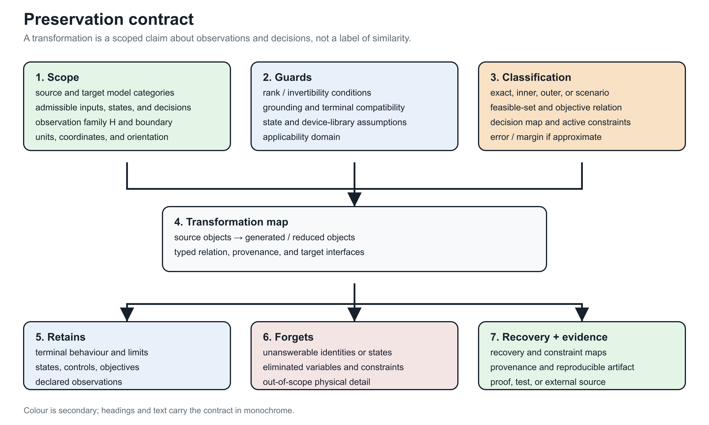

# [Preservation contracts](@id preservation-contracts)

**Page status:** foundational definitions; certificate requirements are normative proposals.

## Observation precedes equivalence

Two models are not simply "equivalent." They are equivalent with respect to a
chosen observation map and admissible input set.

Let model ``M`` define feasible internal and boundary variables
``(x,z)\in\mathcal F_M`` and let ``H`` be a declared family of observation
maps. A reduction from ``M`` to ``\widehat M`` is exact for ``H`` if, for every
admissible input or decision ``u\in\mathcal U`` and every observation
``h\in H``, the observable feasible sets agree:

```math
\left\{h(x,z,u):(x,z,u)\in\mathcal F_M\right\}
=\left\{\widehat h(\widehat x,u):(\widehat x,u)\in
\mathcal F_{\widehat M}\right\},
\qquad h\in H,\ u\in\mathcal U.
```

This definition deliberately includes feasible sets, not only an unconstrained
terminal map. It can therefore distinguish electrical equivalence from
optimization equivalence.

!!! warning "Decision-model consequence"
    Equality of a nodal admittance, a boundary voltage relation, or a sampled
    state trajectory does not establish equality of constrained feasible sets.
    Limits, controls, discrete states, objectives, and recovery are separate
    observation families.



The card is generated by `experiments/render_preservation_contract_card.py`.
It is a compact reading aid for the certificate fields below; it is not a
replacement for the quantified definition or the machine-readable schema.

## Preservation dimensions

A transformation certificate should identify which dimensions it preserves:

```math
\begin{aligned}
\Sigma=\{\,&\text{connectivity},\ \text{terminal behavior},\
             \ \text{phase/neutral behavior},\\
           &\text{asset identity},\ \text{limits},\
             \ \text{switching states},\ \text{measurements},\\
           &\text{protection},\ \text{spatial provenance},\
             \ \text{dynamics}\}.
\end{aligned}
```

This is not a binary checklist. Each item needs a precise scope. For example,
"terminal behavior" might mean:

- linear phasor behavior at one frequency;
- nonlinear steady-state behavior;
- an impedance function over a frequency interval;
- time-domain behavior for a specified initialization class;
- a scenario-bounded approximation to voltage magnitudes only.

## Proposed certificate schema

Every transformation record should contain:

| Field | Meaning |
| --- | --- |
| `source_type`, `target_type` | model categories and schema versions |
| `rule_id` | stable identifier for the rewrite or compiler rule |
| `scope` | source objects affected |
| `preconditions` | structural, physical and state assumptions |
| `preserves` | formal or testable preservation claims |
| `forgets` | questions no longer answerable |
| `provenance` | source-to-target and target-to-source object maps |
| `recovery_map` | reconstruction of eliminated variables where possible |
| `constraint_map` | exact, conservative or approximate lifting of limits |
| `error_bound` | norm, domain and bound for approximate transformations |
| `evidence` | theorem, derivation, test suite, or external reference |

## Exact, conservative, and approximate maps

Operational constraints deserve a classification independent of the equations:

- **Exact:** reduced and original feasible observable sets coincide.
- **Inner/conservative:** every reduced feasible point lifts to an original
  feasible point, possibly excluding valid original points.
- **Outer/relaxed:** every original feasible observation is retained, but the
  reduced model may admit nonphysical points.
- **Scenario approximate:** accuracy is measured over a specified sample or
  uncertainty distribution.

A claim that a reduction "preserves limits" is incomplete without identifying
which of these meanings applies.

## Recovery maps are first-class

If internal variables are eliminated by a Schur complement, their recovery is
often available algebraically. For a partitioned linear nodal model,

```math
\begin{bmatrix}i_B\\i_I\end{bmatrix}
=
\begin{bmatrix}Y_{BB}&Y_{BI}\\Y_{IB}&Y_{II}\end{bmatrix}
\begin{bmatrix}v_B\\v_I\end{bmatrix},
```

and ``i_I=0``, the internal voltage is

```math
v_I=-Y_{II}^{-1}Y_{IB}v_B.
```

The reduced admittance is

```math
Y_{\mathrm{red}}=Y_{BB}-Y_{BI}Y_{II}^{-1}Y_{IB}.
```

Kron reduction preserves the selected boundary relation, and is well
characterized for loopy Laplacians [DorflerBullo2013](@cite). It does not by
itself preserve equipment identity, sparsity, protection zones, or individual
branch limits. Storing the recovery operator permits evaluation of some
original quantities without pretending the reduced branches are physical
assets.

## Compositionality requirement

A strong preservation framework should be compositional: replacing a subsystem
by a certified equivalent should remain valid when that subsystem is connected
to an admissible environment through its declared ports. The black-box functor
for passive linear networks formalizes this principle for terminal
current--potential relations [BaezFong2018](@cite).

For power systems, the open problem is to extend this idea to typed conductors,
nonlinear devices, discrete controls, limits, uncertainty, and decision
variables without losing useful computational structure.
