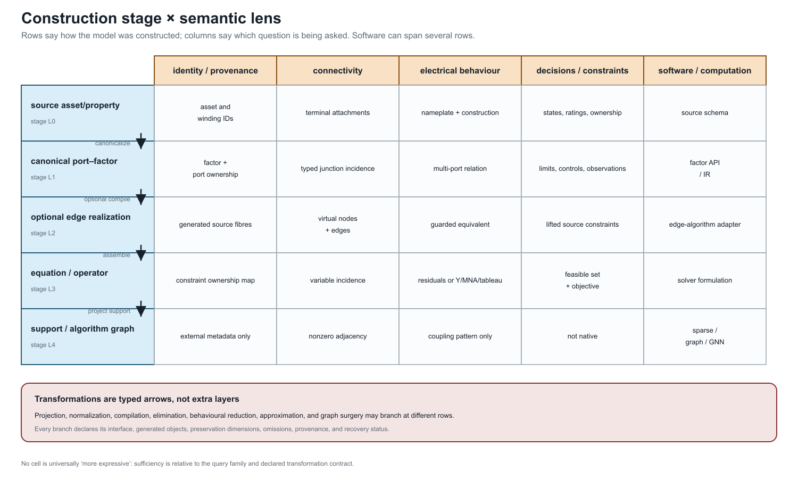

# [Maps between representation frameworks](@id representation-maps)

**Page status:** formal vocabulary and scoped map definitions.

## Why the arrows need types

The book uses several mathematical structures, so an arrow between two models
cannot be called a *graph map* without further qualification. A renaming inside
one framework, a quotient that forgets parallel identity, a compiler that
introduces virtual objects, and a behavioural elimination have different
domains, codomains, and proof obligations.

This chapter fixes a first map vocabulary. It distinguishes:

- **morphisms**, which preserve the declared structure inside one framework;
- **isomorphisms**, which are reversible morphisms and therefore express a
  change of names or coordinates rather than a loss of meaning;
- **cross-framework transformations**, which carry an explicit preservation
  contract and need not be morphisms in either endpoint category.

The definitions below are book conventions. They are intentionally strong for
isomorphism and deliberately modest for general morphisms; later chapters may
specialize them for particular data standards or equation languages.


The map-of-maps view is the practical reading rule for this chapter: a quotient, compiler, coordinate change, or elimination is justified by the query and contract attached to its arrow.

## Simple-topology maps

Let ``G=(\mathcal B,E)`` and ``G'=(\mathcal B',E')`` be loopless undirected
simple graphs.

**Definition.** A simple-graph homomorphism is a vertex map
``h_{\mathcal B}:\mathcal B\rightarrow\mathcal B'`` such that

```math
\{i,j\}\in E
\quad\Longrightarrow\quad
\{h_{\mathcal B}(i),h_{\mathcal B}(j)\}\in E'.
```

It is an isomorphism if ``h_{\mathcal B}`` is bijective and adjacency is
preserved in both directions. Because both graphs are loopless, a homomorphism
may identify **nonadjacent** vertices, but it cannot identify the endpoints of
an edge: their image would be a singleton rather than an edge of ``G'``. An
isomorphism only renames vertices.

This restriction matters in power-system topology processing. Let
``F_\sigma\subseteq E`` be the closed ideal-switch edges in a resolved state,
and let ``\sim_\sigma`` be the equivalence relation generated by their endpoint
pairs. The component map

```math
\pi_\sigma:\mathcal B\longrightarrow
\mathcal B/{\sim_\sigma},
\qquad i\longmapsto[i]_\sigma,
```

is an **edge-contraction quotient**, not a loopless simple-graph homomorphism of
the preceding type. Each retained identified edge ``\ell i j`` maps to an edge
between ``[i]_\sigma`` and ``[j]_\sigma`` when those classes differ. An edge
whose endpoints enter the same class becomes a loop under raw contraction; a
loopless bus view deletes that loop while recording its source fibre. Parallel
retained members remain parallel unless the separate quotient
``Q_{\mathrm{MS}}`` is subsequently applied. In ordinary graph language,
contracting ``F_\sigma`` and deleting the induced loops is a minor-type
operation. In this book it is additionally typed by switch state, equipment
class, and provenance. The complete power-system contract is given in
[Node--breaker, bus--breaker, and topology processing](@ref
node-breaker-topology).

## Oriented-multigraph maps

Consider oriented multigraphs ``G_{\mathrm M}`` and ``G'_{\mathrm M}`` with
bus sets ``\mathcal B,\mathcal B'`` and identified element sets
``\mathcal L,\mathcal L'``.

**Definition.** An orientation-aware structural morphism consists of maps

```math
h_{\mathcal B}:\mathcal B\rightarrow\mathcal B',
\qquad
h_{\mathcal L}:\mathcal L\rightarrow\mathcal L',
```

and a sign ``\epsilon_\ell\in\{-1,+1\}`` for each ``\ell\in\mathcal L``.
For every stored triple ``\ell i j``, its image has endpoints

```math
\begin{cases}
h_{\mathcal L}(\ell)\,h_{\mathcal B}(i)\,h_{\mathcal B}(j),
&\epsilon_\ell=+1,\\
h_{\mathcal L}(\ell)\,h_{\mathcal B}(j)\,h_{\mathcal B}(i),
&\epsilon_\ell=-1.
\end{cases}
```

Typed attributes must be carried by declared attribute maps. Reversal acts on
end-specific quantities, for example by interchanging the ``\ell ij`` and
``\ell ji`` terminal data, but leaves element-intrinsic data such as
``\mathbf Z_\ell`` attached to the same element identity.

The morphism is an isomorphism when the bus and element maps are bijective,
the attribute maps are invertible, and the inverse obeys the same incidence
and reversal rules. This definition makes an arbitrary reversal of reference
orientation an isomorphism. It does **not** identify parallel elements: doing
so is a quotient transformation, not a multigraph isomorphism.

## Port--factor maps

Let ``\mathfrak P`` and ``\mathfrak P'`` be hierarchical port--factor models.
A structural map contains functions

```math
h_{\mathcal Q}:\mathcal Q\rightarrow\mathcal Q',\qquad
h_{\mathcal J}:\mathcal J\rightarrow\mathcal J',\qquad
h_{\Phi}:\Phi\rightarrow\Phi'
```

that commute with attachment and ownership:

```math
h_{\mathcal J}\circ j=j'\circ h_{\mathcal Q},
\qquad
h_{\Phi}\circ f=f'\circ h_{\mathcal Q}.
```

It must also preserve port types and the declared ancestor relation in the
containment forest. A port-coordinate map
``T_q:\mathcal X_q\rightarrow\mathcal X'_{h_{\mathcal Q}(q)}`` accompanies
each port.

**Definition.** A port--factor isomorphism has bijective object maps,
invertible coordinate maps, and exact transport of every factor and junction
relation. If ``T_\phi`` is the product of the coordinate maps over the ordered
ports of factor ``\phi``, then

```math
T_\phi(\mathcal R_\phi)
=
\mathcal R'_{h_\Phi(\phi)},
```

with the same condition for junction relations, decisions, and parameter
types. Equality of relation images is important: merely mapping feasible
source points into the target would establish refinement, not isomorphism.

Factor compilation, factor aggregation, and hidden-variable elimination are
therefore not silently admitted as port--factor isomorphisms. They are typed
transformations with their own behavioural claims.

## Asset/dependency maps

For asset structures ``\mathfrak A`` and ``\mathfrak A'``, a typed relation
morphism consists of entity and relation maps ``h_V,h_R`` that preserve types
and ordered incidence:

```math
\tau'_V\circ h_V=\tau_V,
\qquad
\tau'_R\circ h_R=\tau_R,
\qquad
\iota'(h_R(r))=h_V^{\times n}(\iota(r))
```

for each ``n``-ary relation ``r``. Attribute translation must be declared
field by field. An isomorphism requires bijective maps and invertible attribute
translation.

The electrical link ``\Lambda`` is relational, so compatibility means

```math
(a,e)\in\Lambda
\quad\Longrightarrow\quad
(h_A(a),h_E(e))\in\Lambda'.
```

It does not require one asset per electrical factor. That requirement would
exclude compilations, shared assets, and multi-asset factors by definition.

## Equation-incidence and sparsity maps

An equation-incidence graph is bipartite. Its morphisms must preserve the
variable and relation vertex classes as well as incidence. An isomorphism may
rename or reorder variables and relations, but it cannot turn a variable into
a constraint.

For a square matrix ``\mathbf M``, simultaneous reordering by a permutation
matrix ``\mathbf P`` gives

```math
\mathbf M'=\mathbf P^{\mathsf T}\mathbf M\mathbf P.
```

This is a sparsity-graph isomorphism. Schur elimination is not: it removes a
block and can create fill. Algebraically equivalent equation systems can also
have non-isomorphic incidence graphs after auxiliary variables are introduced.

## The principal cross-framework transformations

The most important arrows used in the book are consequently named rather than
folded into one generic graph homomorphism.

| Map | Domain and codomain | Required declaration |
|:--|:--|:--|
| ``Q_{\mathrm{MS}}`` | identified two-terminal multigraph to simple topology | edge fibres and forgotten member data |
| ``\pi_\sigma`` | connectivity-node graph to the state-conditioned component quotient | resolved switch state, contracted edge set, loop policy, retained-member fibres, and isolated-node policy |
| ``C_{\mathrm{PM}}`` | port--factor model to oriented bus--branch model | supported factor library, virtual objects, and provenance |
| ``C_{\mathrm{PE}}`` | port--factor model to equations/constraints | study formulation, variable coordinates, and constraint ownership |
| ``S_{\mathrm{EM}}`` | equation system to a matrix or sparsity graph | matrix choice, blocking, ordering, and numerical-zero policy |
| ``R_{\partial}`` | open port--factor model to boundary behaviour | boundary, eliminated variables, internal-injection model, admissible inputs, and recovery |
| ``\Lambda`` | asset/dependency structure to electrical structure | a many-to-many relation, not a compulsory function |

For the simple quotient,

```math
Q_{\mathrm{MS}}(\ell)=\{i,j\}
\quad\text{for every}\quad \ell ij,
```

so the fibre ``Q_{\mathrm{MS}}^{-1}(\{i,j\})`` is precisely the set of
parallel source members. The fibre is part of the provenance record even
though it is absent from the simple graph itself.

The compiler ``C_{\mathrm{PM}}`` is partial. A two-terminal line maps directly,
but a multiwinding transformer requires either a target that supports a
multi-terminal object or a declared compilation into two-terminal factors.
There is no canonical clique expansion.

The boundary map ``R_{\partial}`` is likewise relative to an internal-injection
model. For example, a Schur complement with fixed ``i_I`` gives an exact affine
boundary relation under that assumption; replacing the eliminated injection by
a voltage-dependent or constant-power law defines a different source relation.
Naming only the eliminated variables and admissible boundary inputs is
therefore insufficient to establish exactness.

## Construction stages crossed with semantic lenses

The preceding maps should not be rearranged into one universal ladder. It is
more precise to separate two axes:

1. a **construction stage**, which records how the present object was derived;
2. a **semantic lens**, which records the question being asked of that object.



The five construction stages used by this book are:

```math
L_0=\text{source asset/property},\quad
L_1=\text{canonical port--factor},\quad
L_2=\text{optional edge realization},\quad
L_3=\text{equation/operator},\quad
L_4=\text{support/algorithm graph}.
```

The columns ask about identity/provenance, connectivity, electrical behaviour,
decisions/constraints, and software/computation. A software package may expose
objects in several rows, so package names are annotations in this matrix rather
than representation levels.

Projection, normalization, compilation, elimination, behavioural reduction,
approximation, and state-conditioned surgery are typed arrows. They may branch
from different rows and need not pass through ``L_2``. In particular, direct
factor stamping ``L_1\to L_3`` is the default route for an arbitrary-arity
factor; ``L_1\to L_2\to L_3`` is an optional compatibility path for an
edge-only algorithm.

For each arrow ``T:L_a\to L_b``, record an interface ledger

```math
\mathcal I_T
=
(\mathcal B_T,\mathcal X_T,\mathcal S_T,
 \mathcal O_T,\mathcal C_T,
 \operatorname{prov}_T,R_T),
```

where the entries declare boundary quantities, coordinate spaces, state,
observations, constraints, provenance, and recovery. This is an editorial
interface schema, not a claim that every representation category has the same
morphisms. Its purpose is to prevent a target that preserves terminal equations
from silently inheriting asset, constraint, or decision semantics it does not
contain.

The [five-bus multi-port lowering](@ref five-bus-transformer-lowering) applies
the matrix to one three-winding transformer and shows why an acyclic star and a
cyclic terminal support graph can both be valid derived structures.

### Concrete interface smoke test

The generated
`experiments/generated/layer-lens-api-witness.json`
provides a small, executable crosswalk for claim `ARCH-LENS-001`. It keeps the
construction stages and the semantic lenses separate:

| Interface | Construction stages | What the smoke test demonstrates | What it does not infer |
|:--|:--|:--|:--|
| Versioned JSON3 data | ``L_0``--``L_1`` | asset, terminal, and source-fibre fields can be read from a versioned object | equation coefficients or solver variables |
| JuMP model | ``L_0`` and ``L_3`` | a decision variable, bounds, an explicit constraint, and an objective remain visible in an optimization model | asset provenance unless a map supplies it |
| `SparseArrays.SparseMatrixCSC` | ``L_3``--``L_4`` | operator nonzeros expose a support relation that can be used by sparse algorithms | the source factor decomposition or ownership of an edge |
| Graph-learning tensor contract | ``L_4`` | `node_features`, `edge_index`, and `edge_attr` have declared shapes and labels | physical, circuit, or feasibility semantics without explicit features and maps |

The test deliberately does not import a particular graph-learning package: the
tensor names are an interface vocabulary, not a claim that every package uses
the same data model. Likewise, a JuMP model is an optimization interface that
can consume a compiled equation view; it is not itself a new graph layer. The
preferred path for an arbitrary-arity factor remains direct ``L_1\to L_3``
stamping. The ordinary-edge row ``L_2`` is an optional compatibility route and
must retain a source fibre when it is used. A support graph can therefore be
useful for algorithms while remaining unable to recover asset identity,
terminal behaviour, or a feasible decision set on its own.

## Expressiveness relative to questions

There is no useful total ordering of these frameworks. Let ``T:M\rightarrow N``
be a transformation and let ``\mathcal Q`` be a family of queries on ``M``.

**Definition (exact query sufficiency).** The target ``N`` is exactly sufficient
for ``\mathcal Q`` through ``T`` if every ``q\in\mathcal Q`` factors through
``T``: there is a query
``\widehat q`` on ``N`` such that

```math
q=\widehat q\circ T.
```

Connectivity queries factor through ``Q_{\mathrm{MS}}``. A query for the
rating of ``\ell_1`` generally does not. Boundary-current queries can factor
through exact Kron reduction, whereas an ownership query does not. This
factorization is the exact case of the book's query-relative meaning of *fit
for purpose*.

Approximate and one-sided contracts require different statements. On a declared
domain ``\mathcal D`` with an observation metric ``d_q``, a
scenario-approximate target may instead satisfy

```math
\sup_{m\in\mathcal D}
d_q\!\left(q(m),\widehat q(T(m))\right)
\leq\varepsilon_q
\qquad(q\in\mathcal Q).
```

For a feasible-set query, inner and outer status is expressed by containment,
not by factorization. After applying the declared recovery or embedding map
``R``, an inner approximation satisfies
``R(\mathcal F_N)\subseteq\mathcal F_M`` and an outer relaxation satisfies
``\mathcal F_M\subseteq R(\mathcal F_N)`` in the common comparison space. The
domain, norm or set map, tolerance, and containment direction are therefore
part of sufficiency. [Preservation contracts](@ref preservation-contracts)
defines the exact, inner, outer, and scenario-approximate classes used
throughout the book.


The two panels make the non-ladder claim concrete. Under boundary power-flow
queries, a typed port--factor view can compile to an oriented multigraph and a
simple projection, while an equation/sparsity view answers a different
compiled question. Under asset, outage, and maintenance queries, the
asset/dependency view is primary and any electrical compilation requires an
explicit ``\Lambda`` and state map. The arrows therefore change with the
query family; they are not a universal “more detailed” order.

## The running network through the maps

The fixture provides a concrete test of the distinctions.

| Source object or relation | Port--factor view | Multigraph view | Simple quotient | Equation/sparsity view |
|:--|:--|:--|:--|:--|
| ``\ell_1 i_1 i_2`` and ``\ell_2 i_1 i_2`` | two factors with separate limits | two parallel identified edges | one adjacency with a two-member provenance fibre | separate device and limit blocks; possible shared voltage columns |
| ``\ell_4 i_3 i_4`` | one factor with unequal endpoint terminal maps | one oriented attributed edge | one adjacency, with conductor map forgotten | crossed terminal selection appears in coefficients |
| three-winding ``x_1`` | one factor with three winding-port bundles | not an ordinary edge without compilation | outside this quotient's domain until compilation | one high-arity block or several compiled blocks |
| grounding ``h_n`` | a shunt factor at the neutral junction | an attribute or explicit shunt, depending on target vocabulary | normally invisible | a nodal stamp and corresponding nonzeros |

The generated provenance artifact now includes a seventh, non-visual
`simple_topology` map in addition to the six illustrated views. Its edge
``i1--i2`` maps back to both `line/l1` and `line/l2`; `x1` is explicitly
outside that quotient until a transformer compilation is chosen.

## What remains open

These definitions still leave substantive work:

- composition and equivalence of compilers that introduce different virtual
  objects;
- compositional laws for unresolved or decision-dependent families of
  state-conditioned contractions;
- refinement orders between nonlinear factor relations with decisions;
- machine-checked commutative diagrams tying fixture schemas to the
  mathematical maps;
- categorical boundary gluing for typed multiconductor open systems.

Those questions now have named objects and arrows on which later results can
operate.
