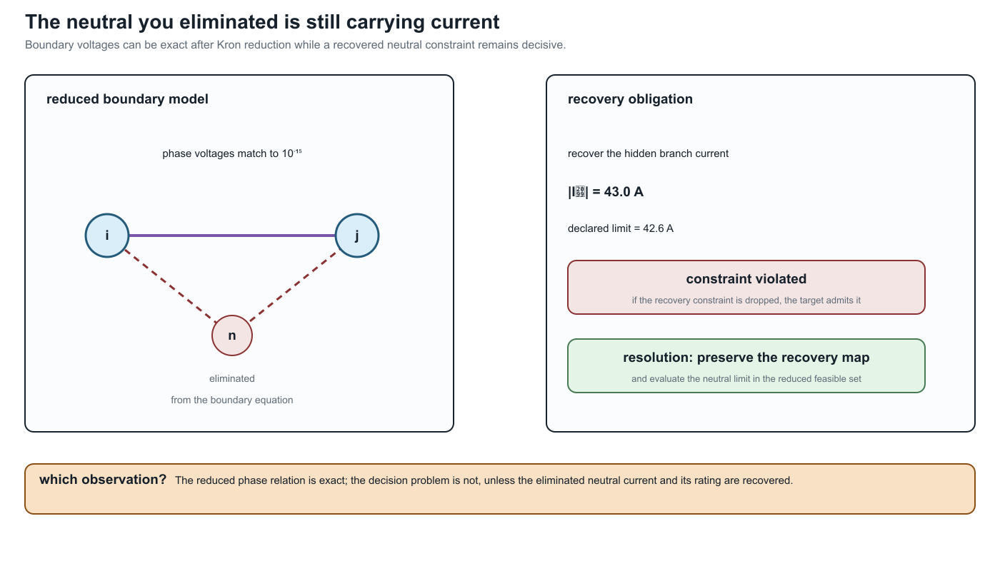

# [Scope and thesis](@id scope-and-thesis)

**Page status:** reader-facing scope contract and methodological thesis.

!!! note "Evidence boundary"
    **Scope:** the book's proposed representation and preservation vocabulary for steady-state and quasi-steady power-network models.
    **Evidence:** definitions, scoped derivations, and repository-level executable witnesses.
    **Numerical optimality:** not applicable to the thesis; local solver witnesses do not establish global decision equivalence.
    **Unresolved boundary:** a universal representation theorem and external validation of the proposed architecture.

## The problem

Much power-system analysis starts from a bus--branch graph

```math
G=(V,E),
```

Here ``V`` and ``E`` are semantic vertex and edge sets; they are not assumed to
be the integer positions of a stored adjacency matrix. An implementation may
choose enumerations ``\kappa_V`` and ``\kappa_E`` later. Where buses are
vertices and lines or transformers are edges, this is useful, especially when the
network and study satisfy the assumptions of a balanced transmission model. It is not a universal
physical or decision model.

A simple graph cannot distinguish parallel circuits. A scalar-weighted edge cannot retain full
conductor coupling. An ordinary edge cannot directly express a three-winding transformer, a
coupled multi-circuit corridor, or a device with several electrical and control ports. A topology
graph alone does not state which variables, limits, decisions, and constitutive relations are
attached to its incidence structure.

!!! warning "Power-system shorthand"
    In this book, *the graph* is never a complete model by itself. The intended
    graph, active state, terminal quantities, and retained constraints must be
    named before a connectivity or reduction claim is interpreted.

The most consequential omissions are often constraints on quantities that were
eliminated algebraically. In the running four-conductor Kron witness, the
retained phase relation is exact to numerical precision, but the recovered
neutral current is ``43.0\ \mathrm{A}`` against a declared ``42.6\ \mathrm{A}``
limit:



The resolving phrase is **what must be recovered?** A reduced equation is not a
decision certificate until every eliminated current, voltage, limit, and
observation required by the study has a recovery or preservation map.

The limitations become consequential in decision problems. Suppose parallel branches ``\ell``
have terminal relation

```math
\mathbf I^{\mathrm s}_{\ell ij}
=\mathbf Y_\ell\Delta\mathbf U
```

and individual feasible current sets ``\mathcal C_\ell``. Their aggregate admittance

```math
\mathbf Y_{\mathrm{eq}}=\sum_\ell\mathbf Y_\ell
```

preserves aggregate terminal current, but the original feasible voltage-difference set is

```math
\left\{\Delta\mathbf U:\
\mathbf Y_\ell\Delta\mathbf U\in\mathcal C_\ell
\quad\forall\ell\right\}.
```

There need not be one conventional edge rating that reproduces this set. Independent switching,
contingency, maintenance, and investment variables make the loss still more apparent.
Line-limit-preserving equivalents have been studied precisely because ordinary equivalents do not
automatically retain these decision constraints [Jang2013](@cite).

## The general baseline

The book treats the general steady-state network as multiconductor and multi-terminal. A source
model may contain:

- buses with different ordered terminal sets;
- explicit phases, neutrals, voltage references, and grounding impedances;
- full series and shunt coupling matrices;
- conductor permutations and phase discontinuities;
- parallel assets with separate identity, state, and limits;
- multiwinding transformers and other arbitrary-port devices;
- continuous controls and discrete switch, tap, outage, or investment decisions;
- measurements, protection boundaries, hierarchy, and provenance.

This is not synonymous with a distribution feeder. It is a modelling baseline that does not assume
away distinctions before the study question is known.

## When transmission models are sufficient

Much of the complexity collapses under conditions common in transmission studies: compatible phase
sets, approximate balance, transposition or sequence symmetry, negligible or externally resolved
neutral behaviour, predominantly two-terminal equipment, and study questions insensitive to
per-conductor or internal-device constraints.

Under a declared contract, a positive-sequence bus--branch model may then be exactly the right
representation. The methodological error is not using such a model; it is treating its assumptions
as universal power-network semantics. A central task of this book is to state the map from the
general model to the simpler one and identify what makes the map admissible.

## Central thesis

**Proposal.** A graph transformation for a power network is meaningful only relative to declared
observations, constraints, and decisions. No representation is universally correct or universally
minimal. Source data should retain typed physical and terminal structure, and simpler graphs should
be generated as traceable, purpose-specific views.

The book investigates a linked reference architecture with three semantic layers:

1. **Identity:** what physical, logical, and generated objects exist?
2. **Interconnection:** which ordered terminals share variables or obey conservation relations?
3. **Behaviour and decisions:** which constitutive, limit, control, measurement, objective, and
   discrete-state relations connect the terminal variables?

A typed asset/property model records the first layer. A typed hierarchical port--factor incidence
model is the principal candidate for the second and third. This architecture is a research proposal
to be tested against actual representation families, software mappings, counterexamples, and
decision problems—not an assumed canonical truth.

## Not one hierarchy

There is no single total order from *most expressive* to *least expressive*. The asset and
electrical views can be incomparable: an asset graph can retain ownership and construction history
while omitting virtual electrical nodes; a compiled electrical graph can contain virtual
transformer buses that have no physical asset identity.

The meaningful order is relative to a query or observation family ``Q``. Write

```math
M_1\succeq_Q M_2
```

when every question in ``Q`` answerable from ``M_2`` can also be answered from ``M_1`` through a
declared transformation. The order can change when ``Q`` changes from power flow to protection,
asset management, fault location, optimal switching, or expansion planning.

This produces a **partial order of representations relative to preservation contracts**. The
[Representation taxonomy](@ref representation-taxonomy) makes the independent comparison axes explicit.

## Decision preservation

A transformation can preserve selected voltages while changing the feasible set or optimum. The
book therefore evaluates, where relevant:

- equality and inequality feasibility;
- per-conductor, per-asset, and per-winding limits;
- continuous controls;
- discrete switching, tap, outage, contingency, and investment choices;
- objective values and active constraints;
- optimal or admissible decisions;
- recovery of eliminated source quantities;
- source-to-target provenance.

Claims such as *equivalent*, *limit preserving*, or *decision preserving* are incomplete unless the
interface, operating domain, observation map, and recovery obligations are stated.

## Boundaries of the first edition

The first edition concentrates on:

- steady-state and quasi-steady electrical networks;
- arbitrary multiconductor and explicit-neutral models;
- transmission and distribution topology processing;
- multi-terminal and multiwinding devices;
- projections used in power flow, OPF, state estimation, selected fault studies, and planning;
- exact and approximate reductions;
- preservation of operational constraints and decisions;
- typed normalization rules, provenance, and recoverability.

EMT, harmonics, thermal dynamics, communications, markets, protection logic, geographic asset
systems, and graph learning initially appear as boundary cases. Later editions can develop them
where the core language proves useful.

### Study-family coverage boundary

The vocabulary is broader than the executable evidence. The current status is:

| Study or exchange family | Current treatment | Explicitly not claimed yet |
| --- | --- | --- |
| steady-state PF and OPF | executable multiconductor fixtures, decision cases, and compiled views | global optimality or universal solver performance |
| topology processing and switching | formal node--breaker/state-resolved quotient definitions | an executable mixed-integer switching study on the running fixture |
| state estimation | observation-map and preservation vocabulary; measurement fields in the source model | a solved estimator, bad-data detector, or covariance-preserving reduction |
| fault and grounding studies | grounding taxonomy, terminal-current relations, and selected reduction guards | a complete short-circuit/protection calculation across all fault classes |
| contingency and maintenance | semantic asset/state/provenance requirements and parallel-member counterexamples | a validated N-1/N-k engine or maintenance scheduler |
| protection | protection boundaries and relay/limit ownership are retained as dependencies | relay coordination, zone reach, or protection-operation equivalence |
| data exchange | CIM/CGMES, PowerModelsDistribution, OpenDSS, and MATPOWER crosswalk with adapter obligations | conformance to every profile, round-trip guarantee, or standards certification |

This table is a scope contract for the first edition. A future executable claim in one of these
families must add a versioned fixture or source-backed result rather than silently upgrading a
conceptual crosswalk into an implementation claim.

## Intended contribution

The proposed contribution is not another isolated reduction algorithm. It is a common language for
stating:

- source and target model categories;
- whether a transformation is a projection, compilation, normalization, exact behavioural
  reduction, or approximation;
- what is preserved and what is forgotten;
- which assumptions make the transformation valid;
- how original quantities, limits, objectives, and decisions are recovered;
- which questions become unanswerable afterward.

That language should support both scientific results and an implementable transformation system.
The [Notation and modelling conventions](@ref reference-notation-conventions) and [The running multiconductor network](@ref running-network)
provide the common vocabulary and adversarial case on which the proposal will first be tested.
