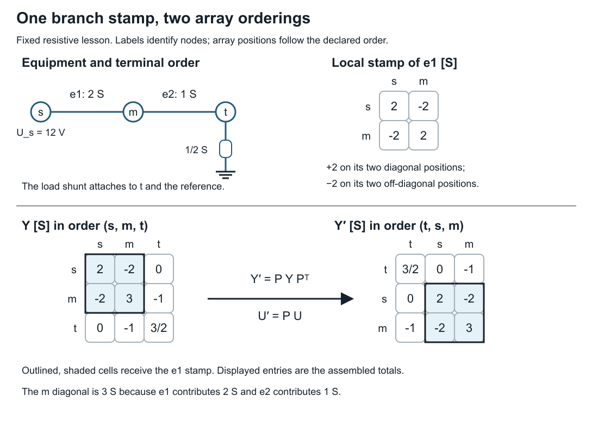
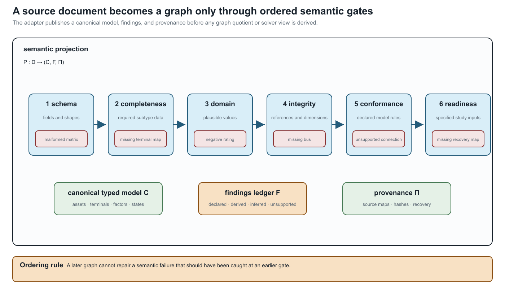

# [From source data to a canonical network model](@id source-to-canonical-model)

**Page status:** worked exact resistive assembly lesson, followed by source-conversion guidance.

By the end of this lesson, you will be able to assemble a small nodal matrix
from named equipment, impose a voltage boundary, solve for the remaining
voltages, and check the result against the original equipment. Only Ohm's law,
KCL, and a two-equation linear solve are needed. All values below are exact
for a fixed resistive model; this first construction has no phasor, transformer,
load-control, or thermal dynamics.

## Start with equipment and terminals

An ideal source fixes node `s` at 12 V relative to a reference terminal `0`.
Two series resistors connect it to a resistive load. The equipment table is
the input; the array positions will be chosen afterward.

| Equipment | Ordered terminals | Constitutive data |
| --- | --- | --- |
| `e1` | `s`, `m` | conductance 2 S |
| `e2` | `m`, `t` | conductance 1 S |
| `d` | `t`, `0` | load conductance 1/2 S |
| source | `s`, `0` | fixed voltage 12 V |

Before calculating, predict which of `m` and `t` has the higher voltage and
whether the two series currents differ. Current into the load must return
through the reference connection; the source supplies it. The symbol `0`
identifies that connection and its chosen voltage datum in this circuit.
A voltage datum alone would not create a physical grounding path.

Use node order ``(s,m,t)`` and voltage vector
``\mathbf U=(U_s,U_m,U_t)^{\mathsf T}``. Store branch orientation from the
first terminal to the second. With the book's incidence convention (tail
``-1``, head ``+1``),

```math
\mathbf A=\begin{bmatrix}-1&1&0\\0&-1&1\end{bmatrix},\qquad
\mathbf I=-\operatorname{diag}(2,1)\mathbf A\mathbf U.
```

The minus sign matters: ``\mathbf A\mathbf U`` gives head-minus-tail voltage,
whereas the stored current follows tail-to-head voltage drop. Branch currents
leaving nodes are ``-\mathbf A^{\mathsf T}\mathbf I``.

## Stamp one component at a time

A conductance ``g`` between nodes ``i`` and ``j`` contributes ``+g`` to
``Y_{ii}`` and ``Y_{jj}``, and ``-g`` to ``Y_{ij}`` and ``Y_{ji}``.
The load to the fixed reference adds ``1/2`` to ``Y_{tt}``. Thus

```math
\mathbf Y
=\mathbf A^{\mathsf T}\operatorname{diag}(2,1)\mathbf A
 +\operatorname{diag}(0,0,1/2)
=\begin{bmatrix}2&-2&0\\-2&3&-1\\0&-1&3/2\end{bmatrix}\ \mathrm S.
```



The outlined entries receive the `e1` stamp; their displayed values include
all contributions. In particular, the `m` diagonal includes both branches.
The lower panels use the same permutation for equation rows and voltage
coordinates, so ``\mathbf Y'=\mathbf P\mathbf Y\mathbf P^{\mathsf T}`` and
``\mathbf U'=\mathbf P\mathbf U``. The source boundary remains at node `s`.

This matrix relates passive-device currents leaving the nodes to their
voltages. The ideal source is a voltage boundary with an unknown supplied
current, not a finite admittance stamped into this matrix.

At `m` and `t` there is no separate injected current. Substituting ``U_s=12``
gives the retained system

```math
\begin{bmatrix}3&-1\\-1&3/2\end{bmatrix}
\begin{bmatrix}U_m\\U_t\end{bmatrix}
=\begin{bmatrix}24\\0\end{bmatrix},\qquad
U_m=72/7\ \mathrm V,\quad U_t=48/7\ \mathrm V.
```

The source current follows from its row afterward. Deleting the source row
without moving its voltage contribution to the right-hand side would solve
a different problem.

## Recover and check the equipment

Use the original terminal records, not the assembled matrix, to calculate

```math
I_{e1}=2(U_s-U_m)=24/7\ \mathrm A,\quad
I_{e2}=U_m-U_t=24/7\ \mathrm A,\quad I_d=U_t/2=24/7\ \mathrm A.
```

Check KCL separately at `m` and `t`. Check power using source delivery
``12I_{e1}`` and resistor absorption
``I_{e1}^2/2+I_{e2}^2+U_t^2/2``; both equal ``288/7`` W. These are
complementary checks. An aggregate power check alone does not test each node's
balance, and small residuals for a wrongly assembled matrix do not validate
its terminal maps.

```sh
python3 experiments/lessons/assemble_network.py
python3 experiments/lessons/assemble_network.py --check
python3 experiments/lessons/assemble_network.py --misattach-load
```

The first command prints the matrix, rational voltages and currents, passing
source-equipment KCL, and zero power mismatch. The last command deliberately
stamps the load at `m` instead of `t`. It solves its own equations, giving
``U_m=U_t=48/5`` V, but fails KCL evaluated against the original equipment.
The code also checks a node permutation, reversed branch orientations, an
altered voltage, and a changed load. It never writes an artifact.

This verification separates stamping from equipment evaluation but shares the
input conductances and laws. It can catch a mapping or solve error; it does
not prove those conductances describe real equipment.

## Change the construction

1. Change the load conductance to 1/4 S. Derive both voltages and currents
   before calling `solve(load=Fraction(1, 4))` in the lesson module.
2. Store nodes in order `(t,s,m)`. Explain how the matrix and the voltage
   array change while voltages attached to named nodes remain the same.
3. Remove the load. Explain the null vector of the full passive matrix and
   why fixing the source voltage still determines the other two voltages.
4. Replace the resistive data by fixed complex admittances. Which assembly
   identities survive, and which power expression requires conjugation?

**Answer guidance.** For the changed load, ``U_t=96/11`` V,
``U_m=120/11`` V, and both series currents are ``24/11`` A. A node
permutation acts on rows, columns, and the voltage vector consistently; it
cannot change a named-node voltage. Without the load, all voltages equal
12 V after imposing the source boundary; the full matrix has common-offset
gauge freedom. For complex admittances and real incidence maps the stamp
still uses ``A^{\mathsf T}YA``. Terminal complex power is ``UI^*``.
A complex voltage-coordinate map instead needs its conjugate-transpose
power-dual current map; see [Circuit coordinate transformations](@ref
circuit-coordinate-transformations).

A satisfactory solution shows the stamp, boundary substitution, recovered
currents, and source checks. A table of final voltages alone is insufficient.

## From this example to source conversion

A utility export, OpenDSS deck, CIM profile, or solver dictionary can hide
choices that the small table made explicit: units, terminal order, defaults,
connection types, and state. The remainder of this chapter describes how to
record those choices. Here *canonical* means the declared internal source
model for this workflow; it does not claim a unique mathematical representation
of every power system.

## The projection contract

Let ``D`` be a source document and ``C`` a canonical network model. An adapter
is a partial map

```math
P:D\longrightarrow (C,F,\Pi),
```

where ``F`` is a finding ledger and ``\Pi`` is a provenance manifest. The map
is partial because an input may be malformed, incomplete, or outside the
supported factor library. A successful parse means only that ``P`` returned a
candidate model; it does not mean that every study question supported by ``D``
is preserved in ``C``.

The canonical model should make at least these objects explicit:

| Source concern | Canonical object | Why it matters for graphs |
|:--|:--|:--|
| stable equipment identity | asset/property record | keeps parallel and replacement assets distinct |
| endpoint and conductor names | ordered terminal maps | prevents phase/neutral permutations from hiding in matrices |
| connectivity and switching | state-resolved incidence | separates inventory topology from active topology |
| constitutive relation | line, shunt, transformer, load, or factor relation | prevents an edge from standing in for unknown physics |
| ratings and owners | typed constraint observations | keeps limits attached to the object they constrain |
| defaults and inferred meanings | finding with confidence/provenance | makes assumptions auditable |

The book's preferred identifiers retain the BMOPFTools-style ownership rule:
``\ell`` identifies an element, while ``\ell ij`` identifies an oriented
terminal attachment. A converter may reorder arrays or create virtual objects,
but it must publish the map that explains the change.

## Validation gates before graph construction

The following gates are deliberately ordered. A later graph cannot repair a
failure that should have been caught at an earlier semantic layer.

| Gate | Question | Typical failure |
|:--|:--|:--|
| schema | are fields and shapes structurally recognised? | malformed matrix or unknown component block |
| completeness | are required fields present for this factor subtype? | transformer winding lacks a terminal map |
| domain | are values physically and numerically plausible? | negative rating, impossible tap, invalid angle unit |
| integrity | do references and dimensions agree? | line points to a missing bus or mismatched conductor count |
| conformance | does the object satisfy the declared model and implementation rules? | a winding connection missing a return path required by its declared subtype |
| readiness | are the chosen study's inputs, unknowns, equations, and constraints specified? | a queried member limit has no identified current or recovery map |

An implementation can reject a valid circuit outside its supported model
class. Multiple compatible voltage sources are not inherently invalid; their
equations and the implementation's supported source configuration matter.
Missing explicit voltage bounds or an objective involving only slack injection
does not alone make a mathematical problem ill posed. Equations may determine
voltages, and slack injection may be a meaningful objective. Conversely, bounds
do not establish feasibility, uniqueness, or stability. Readiness checks identify
specified obligations; mathematical well-posedness needs a study-specific argument.

These checks should return stable finding codes and machine-readable details,
not only prose warnings. A graph quotient may be mathematically valid while
the input is semantically unfit for the intended decision problem.



The ordering is semantic, not cosmetic: a later graph view cannot repair a
missing terminal map, an invalid domain value, or an ownerless limit that
should have been rejected earlier.

## Inference is not identity

Practical formats often encode meaning positionally or through defaults. An
adapter may infer that terminal ``4`` is a neutral, that two named objects are
parallel members, or that a regulator is a transformer with a control loop.
Such inferences can be useful, but recording them with provenance does not turn
them into declared source facts or establish their truth. Retain the inference
rule, its assumptions, and its evidence. A declared source value can also be
wrong: origin and correctness are separate attributes. The canonical record
should distinguish:

1. **declared** values copied from the source;
2. **derived** values computed from declared data;
3. **inferred** values introduced by an adapter rule; and
4. **unsupported** values that could not be represented.

This distinction is essential when a later transformation claims preservation.
An inferred terminal permutation may be harmless for a scalar connectivity
query but fatal for a conductor-current limit.

## What a safe adapter publishes

For every source-to-canonical map, record:

1. source format, profile, and version;
2. stable asset and terminal identifiers;
3. units, bases, phase, neutral, earth, and grounding conventions;
4. state, scenario, and control treatment;
5. factor, rating, and objective mappings;
6. generated objects and their source parents;
7. unsupported or lossy fields;
8. validation findings and their severity; and
9. round-trip or recovery checks for the declared observations.

The [practical import exercise](@ref building-and-changing-models) tests these
obligations on a rating sentinel. A number-preserving round trip can still
change its constraint meaning; an unknown value must remain unknown.

Impedance data need one additional discipline: the canonical record should
retain the full derivation context even when an adapter exports only a solver-
friendly matrix. Geometry or linecode provenance, frequency, earth model,
ordered conductors, series/shunt blocks, and matrix diagnostics belong to the
source record; Kron, phase-to-neutral, sequence, and positive-sequence matrices
are derived views with their own guards. The [four-wire impedance-model ladder](@ref
four-wire-impedance-model-ladder) is the first executable example of this
source-to-view contract.

## Consequences for the graph views

An adapter that collapses two assets, loses a neutral, or silently grounds a
terminal changes the source from which every subsequent view is built. Retain
the equipment and terminal identities needed to check the derived equations;
the [many-graphs lesson](@ref one-network-many-graphs) develops the graph views.

## Running-network application

The running fixture is intentionally small enough to audit. Its canonical
record declares four lines, a three-winding transformer, a switch, ordered
conductor sets, explicit neutral semantics, ratings, and state ownership.
The generated adapter crosswalk checks those obligations against the pinned
CIM/CGMES, PowerModelsDistribution, OpenDSS, and MATPOWER descriptions. That
crosswalk is not an import claim: it is a checklist of what an actual adapter
would have to preserve or mark unsupported.

The field-level example and this larger checklist serve different purposes:
the former executes a small semantic check; the latter identifies obligations
still required for a complete running-network adapter.
