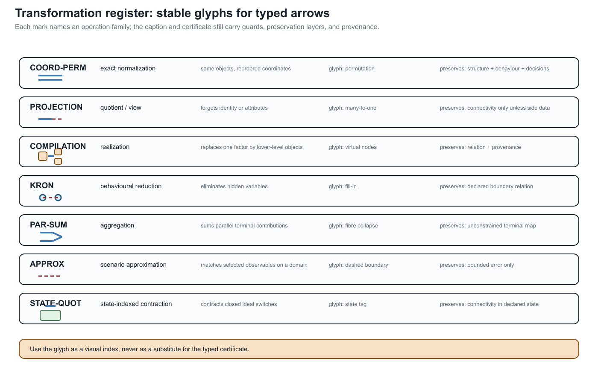

# [Transformation semantics and register](@id transformation-semantics-register)

**Page status:** normative vocabulary and first reader-facing transformation register.

The word *equivalent* is too small for the transformations in this book. A
rewrite can preserve a terminal equation while deleting an asset, changing a
relaxation, or losing a current limit. This chapter gives the vocabulary used
to say exactly what survived.

!!! note "Vocabulary bridge"
    Graph coarsening and learned pooling belong in this register when their
    outputs are used to answer a physical or decision query. Permutation
    equivariance can preserve the effect of renaming source objects; it does
    not by itself preserve member identity, equipment states, limits, feasible
    decisions, or recovery after a many-to-one pooling map.

## Four preservation layers

Write a model as

```math
M=(\mathsf S,\mathsf R,\mathsf C,\mathsf P),
```

where ``\mathsf S`` is typed structure (objects, ports and incidence), ``\mathsf
R`` is the constitutive and control relation, ``\mathsf C`` is the constraint
and decision contract, and ``\mathsf P`` is provenance and ownership.

A transformation ``T:M\to\widehat M`` should state which of these layers it
preserves:

| Layer | The question a certificate must answer |
| --- | --- |
| Structure | Are object sorts, terminal identities, incidence, orientation and hierarchy preserved up to a declared map? |
| Behaviour | Do the declared terminal, current, voltage, power or dynamic relations agree? |
| Decision | Do feasible decisions, objectives, active limits and recoverable source quantities agree? |
| Provenance | Can the target still answer which source asset, winding, terminal or owner a quantity belongs to? |

These layers are independent. A Kron reduction can preserve a boundary
relation while changing structure and provenance. A coordinate permutation can
preserve all four layers. A summed parallel limit can preserve an unconstrained
terminal relation while changing the decision layer.

## Structure-preserving versus structure-changing

Call ``T`` **structure-preserving** on a declared structure signature when
there are maps on each object sort and port set that are bijective on the
retained objects and commute with typed incidence, terminal maps and hierarchy.
In other words, the diagram of objects and relations commutes after a change of
names or coordinates. A permutation of conductors, for example, is a
structure-preserving normalization when the matrices, terminal maps, limits and
inverse permutation are transformed together.

An identification, elimination, aggregation or asset composition is instead
**structure-changing**. It may still be exact for a smaller observation family,
but it must name what was forgotten and what target factor class is allowed.
The following distinctions are therefore deliberate:

| Classification | Meaning | Typical example |
| --- | --- | --- |
| Exact normalization | Same typed object, different coordinates or names | conductor permutation |
| Exact compilation | Different vocabulary, same declared relation and mapped constraints | a fixed multiwinding factor compiled into terminal factors |
| Exact behavioural reduction | Hidden variables or objects removed, with a recovery/observation contract | guarded pure-series elimination |
| Inner restriction | Target lifts to the source, but some valid source points are removed | fixing a tap or retaining only a conservative limit |
| Outer relaxation | Every source observation remains, but target may admit non-liftable points | summing member thermal ratings |
| Scenario approximation | Agreement is bounded only on a declared scenario or operating domain | operating-point Ward equivalent |
| Invalid composition | No declared factor class or a precondition is false | absorbing an external ground into a line or transformer without a contract |

The last row is important: an algebraic matrix product is not automatically a
well-typed network transformation.

## Closure is part of the theorem

Suppose ``\mathcal L`` is the library of physical line factors. A series
relation may be exact in a larger library ``\mathcal F`` of generic passive
two-ports while failing to lie in ``\mathcal L``. The correct statement is

```math
T:\mathcal L\times\mathcal L\longrightarrow\mathcal F,
\qquad
T(\ell_1,\ell_2)\notin\mathcal L\ \text{in general}.
```

For a nominal-``\pi`` section, cascading two sections generally produces a
general two-port rather than the naive nominal-``\pi`` parameter sum. For a
transformer, the target must retain turns ratio, winding incidence, grounding,
excitation, taps and ratings. For an external grounding impedance, the target
must retain the ground asset and its current observation unless the study
explicitly declares those facts out of scope.

## The first transformation register

This table is the reader-facing view of the certificate schema. It is kept
small and explicit; generated certificates remain the evidence source.

| Rule | Source → target | Preserves | Forgets or changes | Target closure / status |
| --- | --- | --- | --- | --- |
| `COORD-PERM` | conductor-labelled factor → permuted factor | structure, behaviour, decisions, provenance | only the original ordering as a presentation choice | same factor class; exact normalization |
| `SERIES-PURE` | ``\ell_1 i b`` + ``\ell_2 b j`` → composite two-port | pure-series terminal relation; recovered currents; intersected current limits | junction and separate asset identities | generic series factor; exact only under guards |
| `SERIES-LINE` | two line assets → one homogeneous line | only when construction, model, ratings and ownership are closed under concatenation | otherwise deletes physical boundaries | conditional physical merge; normally reject |
| `PAR-SUM` | parallel members → summed terminal admittance | unconstrained terminal relation | member currents, member limits, outages, ownership | generic aggregate; outer if member constraints are summed |
| `KRON` | retained/internal port factor → Schur complement | selected boundary relation; recoverable internal states | internal assets, sparsity, unlifted limits and protection | general factor; exact for declared boundary observations |
| `XFMR-COMPOSE` | transformer plus connected factor → completed multiport | declared terminal relation and mapped winding limits | compact transformer identity if flattened | completed transformer factor; exact only with provenance |
| `GROUND-ABSORB` | external grounding factor + device → device-only factor | perhaps a fixed linear terminal relation | ground asset, neutral current, ownership, protection and topology dependence | not canonical by default; reject unless explicitly scoped |
| `STAR-DELTA` / `DELTA-STAR` | scalar floating three-terminal star ↔ delta | linear terminal relation under non-singular scalar guards | internal node, branch identities, grounding and branch limits unless mapped | exact behavioural circuit transform; not a general multiconductor matrix rule |
| `SHUNT-ABSORB-ENDPOINT` | explicit bus shunt + factor → endpoint-augmented factor | fixed linear terminal relation at the declared state | shunt asset, switching decision, ownership, protection and placement | exact only as a generic factor; reject for a narrower line/transformer class unless encoded |
| `SHUNT-SYMMETRIZE` | unequal from/to shunts → one shared shunt parameter | only if equality or a proved observation-specific approximation holds | endpoint asymmetry and from/to current semantics | approximate or invalid by default; never infer from tool field names |
| `BIM/BFM-INDEX` | formulation with branch index → formulation with shared/branch variables | only the declared projection or relaxation relation | branch identity or relaxation-tightness information | formulation change, not a graph isomorphism |
| `ROOTED-TREE` | active radial graph → rooted feeder hierarchy | parent/child and ancestor queries for the declared state and root | mesh chords, alternate paths, future switch states and root-independent meaning | derived algorithmic view; recompute after topology changes |

Every row should eventually be backed by a certificate with `preconditions`,
`preserves`, `forgets`, `constraint_map`, `recovery_map`, `target_type` and
`evidence`. The register is therefore a navigation layer over the existing
certificate system, not a competing schema.



The glyphs are deliberately low-bandwidth. A solid or dashed arrow, a split
factor, a fill edge, or a state tag helps the reader find the relevant row, but
it never carries the guard or preservation theorem by itself. Those remain in
the register and in the executable certificate.

## Narrow circuit transformations: star--delta and shunt placement

The register also covers transformations that power engineers routinely use
inside a line, load, or feeder model without calling them *graph
transformations*. They still change the factorization and therefore need the
same preservation language.

### Scalar floating star--delta

For three scalar impedances ``z_a,z_b,z_c`` connected from terminals
``a,b,c`` to a **floating** internal star point, the terminal behaviour can be
represented by a delta with

```math
z_{ab}=z_a+z_b+\frac{z_a z_b}{z_c},
\qquad
z_{bc}=z_b+z_c+\frac{z_b z_c}{z_a},
\qquad
z_{ca}=z_c+z_a+\frac{z_c z_a}{z_b}.
```

The inverse uses the corresponding nonzero delta-sum denominators, for
example

```math
z_a=\frac{z_{ab}z_{ca}}{z_{ab}+z_{bc}+z_{ca}}.
```

These are exact terminal-equation transforms for a linear scalar network when
the required impedances and sums are nonsingular. They are not automatically
exact for a constant-power load, a switched capacitor bank, a grounded star
point, branch-specific current limits, or a protection/measurement boundary.
Those quantities either need recovery maps or remain explicit factors.

The familiar formulas also do not lift by replacing each scalar with an
arbitrary coupled matrix: matrix products need not commute, and a matrix star
point may have a different terminal coordinate space at each arm. Use a block
Schur complement or a typed port--factor relation instead. A commuting or
scalar-block specialisation can be declared separately.

Star and delta have different graph shapes: a star is a tree through an
internal point, while a delta contains a three-edge cycle. That cycle can be a
compilation artefact, not evidence of an additional physical corridor cycle.
Conversely, eliminating a floating star point can hide a source identity or a
grounding location. `STAR-DELTA` therefore preserves a declared terminal
relation, not the source topology or asset semantics by default.

### Endpoint shunts and tool asymmetry

For a two-terminal series factor with distinct endpoint shunts, write

```math
\begin{aligned}
I_{ij}&=Y_s(U_i-U_j)+Y^{\mathrm{sh}}_{i}U_i,\\
I_{ji}&=-Y_s(U_i-U_j)+Y^{\mathrm{sh}}_{j}U_j.
\end{aligned}
```

The endpoint shunts may be unequal. A reciprocal primitive can therefore have
different diagonal endpoint blocks while its off-diagonal blocks remain
transpose paired. Endpoint asymmetry is not the same thing as
non-reciprocity. Replacing ``Y^{\mathrm{sh}}_i`` and
``Y^{\mathrm{sh}}_j`` by their average because a software line object has one
shared shunt field is an approximation (or an invalid encoding), not a
coordinate change.

Absorbing a capacitor bank, a neutral grounding point, a magnetizing branch,
or another explicit shunt into a line or transformer can preserve a fixed
linear terminal equation. It can nevertheless delete the shunt's switching
state, rating, owner, protection boundary, frequency dependence, or neutral/
earth-current observation. A safe lowering target is either an endpoint-
augmented generic two-port with both shunts retained in provenance, or separate
explicit shunt factors. If the target tool cannot represent unequal from/to
shunts, retain the richer source and report the adapter limitation; do not
silently symmetrize.

!!! warning "Power-system shorthand"
    “Put the capacitor/grounding into the line” can mean an exact fixed-state
    assembly of a nodal operator, or it can mean changing the equipment model.
    State which one is intended, and keep the shunt asset and recovery map when
    its state, limit, protection, or neutral-current meaning is in scope.

The same warning applies when a delta load is replaced by a wye load: the
linear floating terminal relation may be preserved, while grounded-neutral
current, phase-specific limits, unbalance, and switching semantics are not.

The executable companion at
experiments/generated/narrow-circuit-transformations-witness.json checks the
floating scalar identity, rejects a grounded-star use of that rule, and
quantifies the residual introduced by an adapter that replaces unequal
endpoint shunts with one shared field.

## Risk-aware impedance paths

The four-wire impedance ladder provides a compact example of how the register
should be used. Starting from a coupled conductor primitive, a path may contain
the following edges:

```math
\hat{\mathbf Z}^{\mathrm{circ}}_{\ell}
\xrightarrow{K_g}
\bar{\mathbf Z}^{\mathrm{cond}}_{\ell}
\xrightarrow{K_n\ \text{or}\ P_n}
\mathbf Z^{\mathrm{phase}}_{\ell}
\xrightarrow{F}
\mathbf Z^{012}_{\ell}
\xrightarrow{D\ \text{or}\ F_1}
\mathbf Z^{\mathrm{restricted}}_{\ell}.
```

The path should carry a *risk vector*, not a single score. For each of the four
preservation layers, record one of `exact`, `guarded`, `bounded`,
`not-preserved`, or `unknown`. For example:

| Edge | Typical structural status | Typical decision risk |
| --- | --- | --- |
| ``K_g`` | guarded compilation | earth-return and ground-potential observations may be lost |
| ``K_n`` | guarded reduction | neutral voltage and neutral-current limits need recovery constraints |
| ``P_n`` | guarded coordinate/recovery map | common-mode voltage and shunt-to-ground effects are out of scope |
| ``F`` | exact coordinate change | phase-specific constraints need a mapped coordinate contract |
| ``D`` | structure-changing approximation | sequence coupling and cross-channel limits are dropped |
| ``F_1`` | restricted approximation | unbalance, neutral and phase-specific decisions are not represented |

This makes transformation sequences auditable. A later rule may not silently
upgrade an earlier `not-preserved` layer to `exact`; composition must carry the
weakest status and the union of unresolved guards. The generated
`experiments/generated/four-wire-impedance-model-ladder.json` artifact records
this path and checks that every edge has explicit risk tags.  It also composes
the main ``K_g\to K_n\to F\to D\to F_1`` route and the phase-to-neutral
branch.  The composition record carries the weakest exactness label, the
union of guards that have not been discharged, and the union of forgotten
observations and risk tags.  A deliberately mismatched source/target pair is
rejected by the same executable helper, so a visually plausible chain cannot
silently become a proof.

## Anti-patterns worth showing explicitly

### Adding different lines in series

Different impedances are not by themselves a counterexample. With a
zero-injection, shunt-free junction and compatible conductor coordinates,

```math
\mathbf Z_{\mathrm{eq}}
=\mathbf Z_{\ell_1}
 +\mathbf P^{\mathsf T}\mathbf Z_{\ell_2}\mathbf P
```

is an exact behavioural composite. Calling that composite a longer instance of
one physical line class is a separate claim. A different construction code,
frequency basis, terminal map, rating owner, splice or protection boundary
blocks that stronger claim.

### Folding a line into a transformer

A fixed line--transformer cascade can be compiled into a generic multiport, but
the result is not a line merely because it has two external buses. The voltage
ratio, vector group, galvanic boundary, winding limits and control ownership are
not decoration. If they matter to the study, flattening them into a line is a
semantic loss.

### Folding external grounding into a transformer

An internal transformer neutral branch belongs to the transformer model. An
external grounding reactor or shunt belongs to the bus/grounding model. Combining
them may be algebraically convenient, but it hides where neutral current flows
and who owns the limit. The canonical transformation should refuse the merge or
emit a composite factor with an explicit ground-port and recovery ledger.

### Treating a formulation change as a graph proof

The BIM/BFM parallel-line example is a formulation-level warning. Replacing a
shared ``W_{ij}`` by a branch-wise ``W_{\ell ij}`` restores an index but weakens
the BIM relaxation; omitting the BFM consistency relation admits flows that do
not satisfy Kirchhoff's voltage law across the parallel members. Neither change
is a graph isomorphism.

The executable negative cases are collected with the book's translation-trap
witnesses. They are useful regression tests for the register: a proposed rule
must either satisfy the named guard or be classified as a structure-changing,
outer, inner, or scenario transformation.

## Review checklist

Before calling a transformation safe, ask:

1. What are the source and target object sorts?
2. Which ``\ell i j`` identities and terminal maps remain addressable?
3. Which constitutive relation is preserved, and on what domain?
4. Where do every current, power, voltage, thermal and protection limit go?
5. Can eliminated quantities be recovered for every feasible target decision?
6. Does the result remain in the claimed physical factor class?
7. Which asset, ownership, measurement and grounding questions are no longer
   answerable?
8. Does the proof concern the physical model, a relaxation, an objective value,
   or a particular optimizer?

If any answer is missing, the result is a candidate reduction, not a certified
equivalence.
