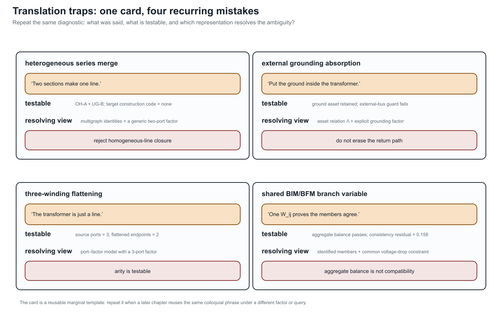

# [Translation traps: graphs, circuits, and power-system language](@id translation-traps)

**Page status:** reviewed explanatory synthesis and controlled vocabulary.

## Why familiar words become dangerous

Graph theory, circuit theory, power-system practice, software and data
modelling, mathematical optimization, and graph machine learning each have
internally useful vocabularies. Trouble begins when a statement is moved from
one vocabulary to another without also moving its assumptions. The short
[five-community vocabulary bridge](@ref one-network-five-languages) introduces
the communities and their characteristic false friends; this chapter develops
the failures that matter for power-network models.

For example, *the line is directed from ``i`` to ``j``* may be harmless data
shorthand for the stored triple ``\ell ij``. It is false if it is read as a
claim that active power must be nonnegative at that terminal. Similarly, *the
feeder is radial* may describe the simple bus projection while the identified
line multigraph contains a two-edge cycle formed by parallel circuits.

This chapter is an early warning map. Later chapters give the detailed
definitions and proofs. Here the objective is to replace an underspecified
phrase by a statement whose representation, variables, and study meaning are
testable.

## A disciplined translation pattern

When a familiar sentence carries mathematical weight, ask four questions:

1. **Which representation?** Name the simple graph, identified multigraph,
   port--factor incidence model, equation graph, asset relation, or another
   declared object.
2. **Which quantity?** Name the terminal current, terminal power, internal
   series current, voltage, state, constraint, or decision.
3. **Which state and domain?** State switch status, outage scenario, frequency,
   approximation, and admissible operating set.
4. **Which consequence?** State whether the claim concerns connectivity,
   equations, feasible sets, limits, objectives, or physical assets.

The controlled replacement for *power flows on edge ``\ell ij``*, for
example, is: *at this operating point, ``P_{\ell ij}`` is the active-power
injection into terminal ``i`` of member ``\ell``, using the stored orientation
``\ell ij``*. That sentence remains valid if the operating transfer reverses.



The card is a deliberate template rather than a summary of four isolated
mistakes. When a later chapter reuses a colloquial phrase, it should be able to
repeat the same three fields in a margin or caption: quote the phrase, name a
checkable quantity or guard, and identify the graph or factor model that makes
the distinction visible.

## Highest-priority translations

- *The network graph* becomes **the named graph derived for the stated
  query**.
- *Line ``\ell`` is directed ``i`` to ``j``* becomes **``\ell ij`` is its
  stored orientation**, unless direction is an intrinsic admissibility
  relation.
- *Power on line ``\ell``* becomes **the terminal-power pair
  ``(\mathbf S_{\ell ij},\mathbf S_{\ell ji})`` and its sign convention**.
- *Current is conserved on the edge* becomes **KCL holds at junctions;
  terminal-current antisymmetry depends on the device factorization**.
- *Power is conserved at the bus* becomes **terminal power balance follows
  from compatible voltages and KCL; device losses appear in sums over device
  terminals**.
- *The network has a cycle* becomes **the named representation has a specified
  cycle or cycle-space element**.
- *These lines are parallel* becomes **state whether parallelism is
  topological, terminal, electrical, operational, or homogeneous**.
- *This feeder is radial* becomes **the named active simple graph or identified
  multigraph is a forest**.
- *This bus is a leaf* becomes **its degree is one in the named graph; this
  alone does not authorize elimination**.
- *The reduced branch is equivalent* becomes **the reduced factor preserves a
  declared boundary observation and may not represent a physical asset**.

These replacements are deliberately a little longer. The cost is small
compared with an invalid reduction, a missing terminal limit, or a topology
claim made on the wrong graph.

## Flows, signs, and conservation

### An arrow is not an operating direction

An ordinary passive line has unordered physical incidence
``\partial\ell=\{i,j\}``. Selecting ``\ell ij`` fixes a reference orientation
and terminal order. It does not imply

```math
P_{\ell ij}\ge 0
\quad\text{or}\quad
\ell\text{ permits transfer only from }i\text{ to }j.
```

The sign of ``P_{\ell ij}`` is an operating-point result. A genuinely directed
relation instead needs asymmetric physics or admissibility, such as a one-way
control dependency. The complete distinction is developed in
[Orientation, terminal quantities, and power transfer](@ref orientation-terminal-power).

!!! warning "Power-system shorthand"
    A branch arrow in a one-line diagram, data record, or optimization model
    often means *stored first end and second end*. Do not infer the sign of
    current or power from it.

### A lossy branch has terminal powers, not one conserved flow

With currents defined into a two-terminal series element,

```math
I^{\mathrm s}_{\ell ji}=-I^{\mathrm s}_{\ell ij},
\qquad
S_{\ell ij}=U_i(I^{\mathrm s}_{\ell ij})^*,
\qquad
S_{\ell ji}=U_j(I^{\mathrm s}_{\ell ji})^*.
```

For ``Z_\ell=R_\ell+\mathrm jX_\ell``, these statements imply

```math
S_{\ell ij}+S_{\ell ji}
=Z_\ell|I^{\mathrm s}_{\ell ij}|^2,
\qquad
P_{\ell ij}+P_{\ell ji}
=R_\ell|I^{\mathrm s}_{\ell ij}|^2.
```

Thus opposite series currents do not produce opposite terminal powers unless
the relevant loss is neglected. A nominal-``\pi`` factor is more subtle:
currents at the two composite terminals need not be negatives because the
factor also contains paths through its shunts. The missing current has not
vanished; it is accounted for inside the composite factor.

!!! warning "Circuit-theory trap"
    *A branch carries one flow* is a commodity-flow abstraction, not the
    semantics of a general AC multiport. Report both terminal observations and
    the device balance. A single antisymmetric active-power variable is a
    declared lossless approximation.

### KCL is a junction statement; power balance needs voltage compatibility

Let currents be defined into all factors attached to a junction ``i``. KCL is

```math
\sum_{q\in\operatorname{ports}(i)}\mathbf I_q=\mathbf 0,
```

after every port current has been mapped into the junction's conductor
coordinates. If those ports also share the compatible junction voltage
``\mathbf U_i``, multiplication by that common voltage yields the corresponding
complex-power balance,

```math
\sum_{q\in\operatorname{ports}(i)}
\mathbf 1^{\mathsf T}
\bigl(\mathbf U_i\circ\mathbf I_q^*\bigr)=0.
```

This does not say that power is conserved *through each edge*. At a junction,
power balance is derived from KCL plus voltage compatibility and consistent
terminal maps. In a device, the sum of terminal powers records absorption,
generation, or storage according to the constitutive model.

Branch ratings reinforce the terminal view. Sending-end current, receiving-end
current, series-conductor current, thermal state, and apparent power are not
interchangeable limits, especially for nominal-``\pi`` and multiconductor
models.

## Topology is not an operating story

### A cycle is not a loop flow

A cycle is a property of a declared graph or incidence structure. It may
support a cycle-space coordinate, but topology alone does not assert a
nonzero circulating current or power transfer at an operating point. Parallel
members form a two-edge line-identity cycle even though their simple projection
has a single adjacency. Conversely, a cycle produced by the clique projection
of one multi-terminal factor need not be an alternative physical path.

!!! warning "Graph-theory trap"
    Separate the existence of a cycle, a chosen cycle basis, a nonzero cycle
    coordinate, and a physical circulating flow. These are four different
    claims.

### Radiality, leaves, and bridges depend on the graph and state

A feeder may be adjacency-radial in its simple projection and not
member-radial in its identified multigraph. It may also be meshed in the asset
inventory and radial in one active switching state. The terms *leaf*,
*degree-two bus*, *bridge*, and *radial tail* likewise require a graph and an
active state.

None of those predicates alone authorizes elimination:

- a leaf can own a load, grounding factor, measurement, control, or boundary
  observation;
- a degree-two junction can have a shunt, phase change, or terminal mismatch;
- a bridge can be essential to service, protection, reliability, or an
  investment decision;
- an open line can remain an asset with maintenance, restoration, and future
  state semantics even when it is absent from the active electrical graph.

### Adjacency does not imply direct electrical coupling

A physical connection can be open in the active state, or its terminal maps
can leave some conductors unconnected. Conversely, mutual impedance, a shared
neutral, a multiwinding factor, or eliminated internal variables can couple
nodal equations whose bus vertices are not adjacent in a selected topology
graph. Connectivity, energization, constitutive coupling, and matrix nonzero
patterns must therefore be tested separately.

In particular, *connected* does not mean *energized*. Energization requires a
state-dependent path to an admissible source, together with the device and
grounding semantics used by the study.

## Equivalence is always relative to a question

### The same nodal admittance is not the same decision problem

Two models can have the same unconstrained terminal admittance while differing
in member ratings, outages, switches, controls, ownership, measurements, or
investment choices. They then need not have the same feasible set or optimum.
The parallel-line examples in this book make this failure executable.

Likewise, small voltage error on a scenario set is evidence about one
observation metric. It is not, by itself, a bound on feasibility error,
objective error, active-limit error, or discrete-decision error.

!!! warning "Decision-model consequence"
    Never promote equality of ``Y``-bus matrices, a small state error, or a
    correct base-case power flow into decision equivalence without a constraint
    map and the relevant feasible-set or error certificate.

### An equivalent branch need not be a line

Kron elimination produces a boundary relation. A Ward construction adds a
realization of the eliminated external system for a specified study. Either
can introduce dense couplings, shunts, sources, or general multiport factors.
Calling each off-diagonal block a *line* can accidentally assign physical
meaning, ratings, failures, or ownership that the reduced object does not
possess.

A recovery map can still evaluate source quantities from retained variables.
That is often more faithful than inventing limits on artificial reduced
branches. [Kron, Ward, and optimized network equivalents](@ref kron-ward-opti-kron)
separates boundary reduction from target-library realization.

### Equality of matrices is coordinate- and model-dependent

Matrix properties need precise names. Reciprocal multiconductor impedance or
admittance matrices are commonly **complex symmetric**,
``\mathbf Y^{\mathsf T}=\mathbf Y``. They are not generally Hermitian,
``\mathbf Y^{\mathsf H}=\mathbf Y``. Positive-real or passivity conditions
concern the Hermitian part ``\operatorname{He}(\mathbf Y)`` and should not be
replaced by a vague symmetry claim.

Similarly, a per-unit conversion is a coordinate transformation only when the
voltage, current, power, impedance, transformer, and terminal bases are moved
consistently. A neutral reduction is an elimination or grounding operation,
not the graph-theoretic deletion of a spare vertex. Both transformations need
typed maps and stated domains.

## Devices that resist the ordinary-edge picture

An ideal transformer, a phase-shifting transformer, and a multiwinding
transformer are not adequately described as an ordinary lossy edge with one
impedance. They can impose voltage and current coordinate actions, grounding
relations, winding constraints, and controllable ratios. Compiling a
multi-terminal factor into pairwise edges or a virtual star may create or
remove apparent graph cycles while preserving a declared terminal relation.

The canonical electrical object in this book is therefore the hierarchical
port--factor incidence model. The directed attributed bus--branch multigraph is
an important engineering view, and the simple graph is a useful quotient, but
neither is asked to carry facts that it cannot represent.

## Recurring callouts used in the book

Later chapters use four controlled callout labels:

- **Graph-theory trap:** a correct graph concept has been applied to an
  unnamed or inappropriate representation.
- **Circuit-theory trap:** a conservation or device statement has been applied
  outside its factorization or constitutive assumptions.
- **Power-system shorthand:** a familiar phrase is useful in context but
  mathematically underspecified.
- **Decision-model consequence:** a representation or reduction changes what
  can be constrained, chosen, observed, or recovered.

These callouts do not replace definitions or proofs. Each should give a
precise replacement statement and link to the chapter that establishes it.

## Scope and controlled vocabulary

The current controlled vocabulary makes these ten translations explicit:

1. one physical system can have several legitimate graphs;
2. a branch arrow does not determine operating flow direction;
3. a lossy branch owns a pair of terminal powers;
4. KCL is not a claim that one power commodity is conserved on every edge;
5. a graph cycle is not an operating loop flow;
6. topological parallelism is weaker than electrical or operational
   aggregability;
7. radiality, leaves, and bridges require a representation and active state;
8. *bus* must distinguish physical, connectivity, topological, and reporting
   objects;
9. equal admittance or small voltage error does not establish decision
   equivalence;
10. a reduced equivalent factor is not automatically a physical asset.

Further scope questions remain for connectivity versus energization,
neutral elimination, per-unit coordinates, ideal transformations, and cycles
created by multi-terminal compilation; the enacted definitions and witnesses
in the current sections delimit what is established so far.

## First executable witnesses

The first three distinctions now have package-independent executable witnesses.
They are intentionally small: each isolates one translation rather than
pretending to validate a complete power-system solver.

### Connectivity versus energization

The inventory contains the path
``source--bus_a--bus_b--load``, but the ``bus_a--bus_b`` member is open in the
active state. The load is connected in the asset graph and not energized in
the active electrical graph. This is the minimum counterexample to treating
inventory connectivity as an operating-state claim.

### Complex symmetry versus Hermitian structure

The witness uses a reciprocal complex matrix ``\mathbf A`` satisfying
``\mathbf A^{\mathsf T}=\mathbf A`` but not
``\mathbf A^{\mathsf H}=\mathbf A``. Its Hermitian part is positive
semidefinite. This separates reciprocity, conjugate symmetry, and passivity
tests without relying on a particular network package.

### Terminal-specific ratings

For a scalar nominal-``\pi`` factor, the series current is
``I^{\mathrm s}=Y^{\mathrm s}(U_i-U_j)`` while the composite terminal currents
also include their respective shunts. The witness chooses a voltage pair for
which the two terminal current magnitudes differ, then places an illustrative
rating between them. One terminal therefore violates the rating while the
other does not. This is not a proposed rating rule; it is a guard against
silently replacing terminal-specific limits with one edge scalar.

## Executable anti-pattern witnesses

The same distinctions can be tested rather than left as warnings. The extended
translation-trap witness records four negative cases in
`experiments/generated/translation-trap-witnesses.json`:

| Anti-pattern | Executable observation | Correct interpretation |
| --- | --- | --- |
| heterogeneous series merge | pure-series elimination succeeds, but the target is marked outside the homogeneous physical-line class | keep the generic two-port composite and its source identities, or prove stronger line-class guards |
| external grounding absorption | the transformer compiler rejects a grounding object whose scope is `external_bus` | retain the grounding relation as a separate bus/grounding object |
| line--transformer flattening | a three-port factor is projected to two line endpoints | the two-terminal view loses winding incidence and cannot stand in for the transformer factor |
| BIM/BFM index loss | aggregate branch balance holds while the member consistency residual is nonzero | branch identities or the common-voltage-drop relation must remain in the formulation |

These are deliberately *negative* witnesses: they do not show that every
composition is impossible. They show that a tempting shorthand fails a named
guard, or changes the model class, even when a smaller behavioural statement
still looks plausible.

Run the witness and its tests from the repository root:

```sh
julia --project=experiments experiments/run_translation_traps.jl
julia --project=experiments experiments/test/runtests.jl
```

The generated result is
`experiments/generated/translation-trap-witnesses.json`. The source module is
`experiments/transformations/TranslationTraps.jl`; the anti-pattern extensions
are implemented in `experiments/transformations/AntiPatternWitnesses.jl`.
