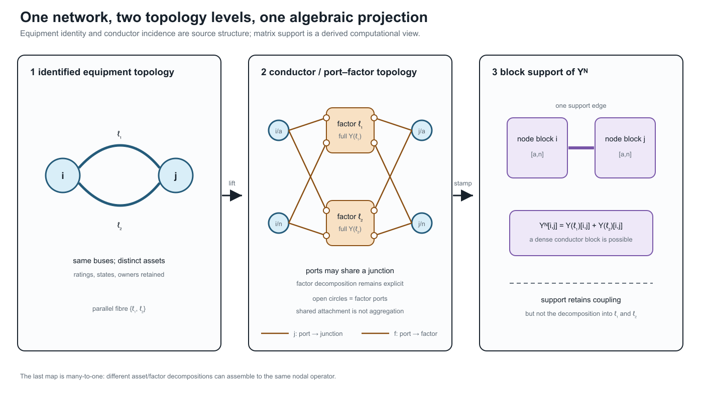
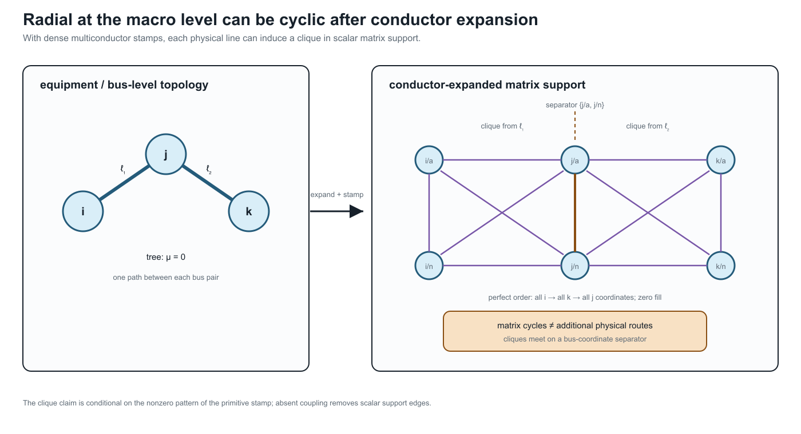

# [Two topology levels and the nodal projection](@id two-level-topology-and-nodal-projection)

**Page status:** literature-backed definitions with executable structural and
recovery witnesses; inverse recovery is reported by explicit identifiability
status and remains non-canonical without additional structure.

## The missing middle between a one-line diagram and ``\mathbf Y^{\mathrm N}``

Power engineers routinely move between a bus--branch diagram, a
multiconductor circuit, and a nodal admittance matrix. Those three objects are
related, but they do not have the same vertices, edges, or cycles. Calling all
three *the network graph* hides two distinct topology levels and a many-to-one
algebraic projection:

1. the **equipment/terminal topology** records identified equipment and its
   high-level attachments;
2. the **conductor/port--factor topology** records the electrical terminals,
   junctions, conductor coordinates, and constitutive factors;
3. the **nodal-operator support graph** records which retained voltage
   coordinates are coupled by the assembled matrix.

The first two are retained source structure in this book. The third is a
derived computational view. The asset/dependency model remains an orthogonal
companion to both: ownership, protection, common-mode failure, and maintenance
are not entries of a nodal admittance matrix.

The same boundary applies to formulation choice. A compound ``\mathbf
Y^{\mathrm N}`` is an exact target for a declared class of fixed linear factors,
but it is not a universal representation of a power network. General
power-network studies may need modified nodal or sparse-tableau variables,
branch currents, multi-terminal factor relations, switch states, controls, and
limits that are not recoverable from nodal support alone. See [Circuit
formulations and the lowering boundary](@ref circuit-formulations-and-lowering)
for the guarded compilation alternatives.



The figure uses parallel lines because they expose the loss immediately. Both
identified factors attach to the same electrical junction coordinates, and
their matrix contributions occupy the same nodal block. The assembly preserves
their combined linear boundary relation but forgets how that contribution was
split between assets.

The middle panel is a port--factor incidence view, not a bare bipartite graph:
the small open circles are ports, the junction bars are the codomain of ``j``,
and the factor boxes are the codomain of ``f``. The labelled ``j`` and ``f``
families are intentionally distinct. A later compilation may replace this
structure by ordinary edges, but that is a new target view with a provenance
obligation rather than an identity of the source object.

## Level 1: identified equipment and high-level attachments

For the two-terminal subset of a network, let

```math
G_{\mathrm M}=(\mathcal B,\mathcal L,\partial),
\qquad
\partial(\ell)=\{i,j\}.
```

This is an identified multigraph: ``\ell_1`` and ``\ell_2`` remain distinct
when ``\partial(\ell_1)=\partial(\ell_2)``. A stored reference orientation is
written ``\ell ij`` and does not make the physical line a directed edge. The
element-intrinsic impedance or primitive matrix keeps the symmetric element
index ``\mathbf Z_\ell`` or ``\mathbf Y_\ell``; terminal observations use
``\ell ij`` and ``\ell ji``.

The multigraph is only a high-level skeleton. A transformer ``x`` with winding
set ``\mathcal K_x`` is naturally multi-terminal, and a jointly coupled line
group may own more than two port bundles. Such objects belong in an
port--factor incidence structure, not in ``G_{\mathrm M}`` unless an explicit
two-terminal compilation has been selected. The orthogonal asset/dependency
model links equipment records to this electrical structure through
``\Lambda``; it is not this multigraph. Consequently, *radial at equipment
level* must name both the selected object class and any
multi-terminal compilation used to obtain an ordinary graph.

At this level, parallelism means repeated high-level attachment. It says
nothing yet about terminal order, phase availability, grounding, mutual
coupling, state, or whether currents may be added in a common coordinate
space.

## Level 2: conductor junctions and electrical factors

The canonical electrical model is the hierarchical port--factor object
``\mathfrak P`` defined in [Formal representation frameworks](@ref formal-representation-frameworks).
For the present discussion, its important incidence maps are

```math
j:\mathcal Q\rightarrow\mathcal J,
\qquad
f:\mathcal Q\rightarrow\Phi,
```

where ``j`` attaches a typed port to an electrical junction and ``f`` assigns
the port to its owning factor. A junction may represent a scalar conductor
coordinate such as ``i/a`` or a typed bundle such as ``i/[a,b,c,n]``. The
factor relation retains the full conductor coupling, terminal maps, internal
variables, limits, state, and decisions.

Two distinct ports may attach to the same junction; indeed, the map ``j`` is
deliberately many-to-one because that is how KCL composes devices. A different
relation is needed for construction detail. Let

```math
c:\mathcal C_{\mathrm{phys}}\rightarrow\mathcal Q
```

map physical conductors or sub-conductors to their electrical ports. This map
need not be injective: bundled conductors, paralleled cables landing on one
terminal, and other construction-level multiplicities can share a port. The
distinction is therefore precise: ``j`` composes electrical ports at a
junction; ``c`` realizes a port from physical conductor objects.

**Implementation note.** A particular importer or line-constant tool may use
a narrower source schema. The current BMOPFTools line-geometry compiler, for
example, checks one geometry conductor per terminal label. That is a boundary
of that adapter's present primitive, not a definition of ``c``. A richer
source must remain expanded or pass through a declared bundle-compilation rule
before entering the adapter.

This level has its own notions of parallelism:

- factors can be parallel because all of their boundary port spaces and
  attachment maps coincide;
- physical conductors can be parallel inside one factor while sharing an
  electrical terminal at one or both ends;
- two factors can share high-level buses but fail to be terminal-parallel
  because their phase sets, neutral connections, or terminal maps differ;
- mutual coupling can place two nominal assets in one joint factor, so they
  are not independent edges even when the asset inventory lists them
  separately.

The high- and low-level decompositions are therefore related by an explicit
lineage/refinement relation, not by an assumed one-edge-to-one-wire rule.

## From factors to a compound nodal operator

Stack the retained junction-voltage coordinates into ``\mathbf U``. Let
``\Phi_{\mathrm{lin}}`` be the declared subset of fixed linear unconstrained
electrical factors. Loads with nonlinear constitutive laws, generators,
limits, controls, objectives, and discrete states do not enter this set merely
because they attach to the same network. The nodal operator is therefore
exactly the part of the model from which most decision semantics have already
been omitted.

For each ``\phi\in\Phi_{\mathrm{lin}}``, let ``\mathbf A_\phi`` be a real
select/permute/sign matrix for its ordered terminal voltages, so

```math
\mathbf u_\phi=\mathbf A_\phi\mathbf U,
\qquad
\mathbf i_\phi=\mathbf Y_\phi\mathbf u_\phi.
```

After mapping terminal currents back to the junction coordinates, linear
assembly has the form

```math
\mathbf Y^{\mathrm N}
=
\sum_{\phi\in\Phi_{\mathrm{lin}}}
\mathbf A_\phi^{\mathsf T}
\mathbf Y_\phi
\mathbf A_\phi.
```

The factor primitive ``\mathbf Y_\phi`` may already contain series, shunt,
ideal-connection, transformer, or multiport structure. Incidence-matrix
assembly of compound polyphase networks is developed by Kettner and Paolone
[KettnerPaolone2019](@cite); nested primitive, winding, and connection maps for
general multiphase transformers provide a particularly clear device-level
example [Coppo2017](@cite).

The transpose in this assembly is intentional. Because ``\mathbf A_\phi`` is
real, the power-dual current map is
``\mathbf A_\phi^{\mathrm H}=\mathbf A_\phi^{\mathsf T}``. If a voltage map
contains complex ratios or phase actions outside ``\mathbf Y_\phi``, its
current map uses the conjugate transpose instead. This is the same distinction
used for transformer maps elsewhere in the book.

The equation is an **assembly identity**, not a unique factorization of
``\mathbf Y^{\mathrm N}``. For two electrically aligned parallel factors
``\ell_1ij`` and ``\ell_2ij``, the same off-diagonal nodal block contains

```math
\mathbf Y^{\mathrm N}_{ij}
=
\mathbf Y_{\ell_1,ij}
+
\mathbf Y_{\ell_2,ij}
+
\sum_{\phi\notin\{\ell_1,\ell_2\}}
\mathbf Y_{\phi,ij}.
```

Even when the last sum is empty, ``\mathbf Y^{\mathrm N}_{ij}`` does not
identify its two summands. Let ``\mathcal D`` be the linear difference space
admitted by the declared aligned factor class. Every admissible ``\Delta``
gives the same assembled block through

```math
(\mathbf Y_1,\mathbf Y_2)
\longmapsto
(\mathbf Y_1+\Delta,\mathbf Y_2-\Delta).
```

For reciprocal factors, ``\mathcal D`` may require
``\Delta^{\mathsf T}=\Delta``. Adding passivity constraints such as
``\operatorname{He}(\mathbf Y_k)\succeq0`` intersects the affine family with a
convex feasible set, but does not generally make it bounded: reactive or other
unconstrained parameter directions can remain unbounded. Bounded ambiguity
needs catalog limits, sign restrictions, measurements, or another coercive
guard. Ratings, outage states, investment variables, owners, and the two-edge
line-identity cycle are absent unless retained separately.

This is the central many-to-one result registered as `ARCH-NODAL-001`. The
companion executable witness constructs two distinct passive reciprocal
parallel splits with an identical assembled operator.

### When is assembly injective?

Let ``\Theta`` be the admissible family of typed factor collections and define

```math
\mathcal S(\{\mathbf Y_\phi\})
=
\sum_\phi
\mathbf A_\phi^{\mathsf T}\mathbf Y_\phi\mathbf A_\phi.
```

The exact criterion is

```math
\mathcal S\vert_\Theta\text{ is injective}
\quad\Longleftrightarrow\quad
\ker\mathcal S\cap(\Theta-\Theta)=\{0\}.
```

This criterion matters more than a blanket claim that nodal data are or are
not recoverable. A practical sufficient special case is available when:

1. topology, factor types, terminal coordinates, and active state are known;
2. at most one two-terminal factor occupies each unordered junction-block
   pair;
3. that factor's off-diagonal block uniquely determines its complete local
   stamp within the declared class; and
4. after subtracting those stamps, the remaining diagonal residual has a
   unique decomposition among the declared shunt and grounding classes.

Then the source primitives are recoverable from ``\mathbf Y^{\mathrm N}``
within that model class. Familiar line-impedance extraction is an instance of
this support-separated case, not a contradiction of `ARCH-NODAL-001`.

The principal failures are now named: **multiplicity**, when parallel or
overlapping stamps share support; **elimination**, when internal coordinates
have already been removed; and **over-parameterization**, when different
factor parameters produce the same terminal stamp. Recoverability from a
boundary response can nevertheless hold for restricted classes; circular
planar critical resistor networks are a major positive theory
[CurtisMorrow2000](@cite). The model class and injectivity proof are therefore
part of any recovery claim.

### A scoped recovery vocabulary

The inverse question should return a status, not just a matrix. For an
observed operator ``\mathbf Y^{\mathrm N}`` and declared model class ``\Theta``,
classify the preimage of the restricted assembly map as follows:

The three statuses are:

- **identifiable** — one admissible source primitive and declared residual
  decomposition are recovered. A typical case has known support, one
  two-terminal factor per block pair, and a unique local stamp map.
- **set-identifiable** — the terminal primitive is fixed, but internal
  parameters or construction records remain an equivalence class. This is the
  expected result for an over-parameterized local construction with the same
  terminal stamp.
- **non-identifiable** — distinct source primitives or topologies remain
  observationally indistinguishable. Parallel multiplicity and eliminated
  internal coordinates are the basic examples.

This vocabulary is deliberately relative to ``\Theta``. Tightening the class
with catalog bounds, switch state, measurements, construction metadata, or
grounding declarations can turn a non-identifiable class into an identifiable
one; silently assuming those facts does not. Conversely, a numerically unique
optimizer solution is not evidence that the source map is injective.

The recovery contract is therefore:

1. validate the coordinate order, factor class, active state, and admissible
   parameter domain before attempting inversion;
2. return a unique recovered primitive only for the identifiable class;
3. return a representative together with an explicit equivalence or affine
   ambiguity for set-identifiable and non-identifiable classes; and
4. retain the source/provenance record as the authority for asset identity.

The generated
`experiments/generated/nodal-source-recovery-witness.json` exercises all four
statuses. Its support-separated scalar case recovers a series primitive and
declared diagonal shunts. Its parallel case exhibits two distinct member
splits with the same operator; its elimination case matches a hidden
three-node chain to a direct two-node boundary factor; and its
over-parameterized case fixes the terminal primitive while leaving two local
parameter vectors indistinguishable. These are deliberately finite witnesses,
not a claim that every practical line or transformer belongs to one class.

This scoped classification is registered as `ARCH-RECOVERY-001`. It turns the
warning “do not invert ``\mathbf Y^{\mathrm N}`` canonically” into a usable
engineering interface: declare the model class, report the recovery status,
and preserve the ambiguity whenever the data do not identify the source.

### Which guards actually lift the ambiguity?

Extra information should be treated as an additional observation map, not as
an informal reason to choose one reconstruction. If ``\mathcal M`` records
member currents, grounding metadata, state observations, or another declared
measurement, define the augmented map

```math
\mathcal F(\theta)=\bigl(\mathcal S(\theta),\mathcal M(\theta)\bigr).
```

The same restricted-kernel test applies:

```math
\mathcal F\vert_\Theta\text{ is injective}
\quad\Longleftrightarrow\quad
\ker\mathcal F\cap(\Theta-\Theta)=\{0\}.
```

Four small cases make the distinction operational:

- **Catalog bounds** can make a parallel-split ambiguity compact without making
  it unique. A bounded interval is still a set of admissible source models.
- **Member-current observations** can lift parallel ambiguity when the voltage
  drop is nonzero and each member current is observed in the same coordinates.
  The total nodal operator and the member observations then jointly determine
  the scalar member admittances in that restricted class.
- **Grounding declarations** can resolve a diagonal residual only when the
  declaration identifies the grounding contribution and its terminal. A
  finite grounding impedance and an unspecified local shunt otherwise remain
  an attribution ambiguity.
- **Transformer or switch states** must be part of the declared state space.
  A known tap lets a state-conditioned primitive be recovered; an unknown tap
  can trade off against the primitive parameter and produce multiple
  state--parameter pairs with the same effective terminal relation.

The generated
`experiments/generated/nodal-recovery-guards-witness.json` records these four
outcomes. Its statuses are deliberately more informative than a binary
“recoverable” flag: `bounded-non-identifiable`, `identifiable`,
`identifiable-with-declaration`, and `identifiable-with-state`. The witness is
scalar and finite; it establishes the guard logic, not a general theorem for
all multiconductor transformers, nonlinear grounding, or state-dependent AC
models. This extension is registered as `ARCH-RECOVERY-002`.

### Matrix-valued observations need excitation rank

The scalar member-current example does not generalise automatically to a
multiconductor factor. For a factor ``\ell`` with an ``m\times m`` primitive,
voltage snapshots ``V\in\mathbb C^{m\times r}``, and member-current snapshots
``I_\ell``, the observation equation is

```math
I_\ell=Y_\ell V.
```

Full primitive recovery from this relation requires ``\operatorname{rank}(V)=m``
and observation of every row of ``I_\ell``. In the square full-rank case,
``Y_\ell=I_\ell V^{-1}``; more generally the declared experiment must span the
retained conductor space. If ``r<m``, any nonzero admissible ``\Delta`` with
``\Delta V=0`` gives the same member currents. If only selected current rows
are observed, a nonzero ``\Delta`` can instead satisfy ``P\Delta V=0`` for the
row-selection map ``P``. Reciprocal symmetry does not remove these directions
by itself.

The generated
`experiments/generated/multiconductor-recovery-witness.json` makes all three
cases explicit: two independent voltage snapshots with complete current
vectors recover two reciprocal two-conductor factors; one complete snapshot
leaves a nonzero reciprocal ambiguity; and full-rank snapshots with only one
measured current phase still leave the unmeasured phase ambiguous. This is a
linear identifiability witness, not a claim about nonlinear measurement
design, noise, or estimator consistency. It is registered as
`ARCH-RECOVERY-003`.

### Noise changes recovery into a certified uncertainty set

With noisy current snapshots

```math
I_\ell=Y_\ell V+E,
\qquad \|E\|_{\mathrm F}\le\varepsilon,
```

the full-rank pseudoinverse estimate ``\widehat Y_\ell=I_\ell V^\dagger`` is
an estimator, not an exact source recovery. For square invertible ``V`` (and,
with the corresponding qualification, for a full-row-rank snapshot matrix),

```math
\|\widehat Y_\ell-Y_\ell\|_{\mathrm F}
\le
\varepsilon\,\|V^\dagger\|_2.
```

Thus experiment conditioning is part of the recovery certificate. The same
noise radius can produce a tight uncertainty set for well-conditioned voltage
snapshots and a much larger set for nearly dependent snapshots. Physical
symmetry or passivity constraints may intersect that set, but they should be
reported as additional guards rather than used to hide the measurement
uncertainty.

The generated
`experiments/generated/noisy-multiconductor-recovery-witness.json` compares
well-conditioned and nearly collinear two-conductor voltage snapshots under
the same Frobenius noise radius. Both estimates satisfy the deterministic
bound; the ill-conditioned experiment amplifies the bound by more than two
orders of magnitude. This is a finite error certificate, not a statistical
consistency or estimator-optimality result. It is registered as
`ARCH-RECOVERY-004`.

## Rank, reference, and grounding

The nodal operator is not automatically invertible. Under the connectivity,
common polyphase-coordinate, and passive-component hypotheses of Kettner and
Paolone, a connected shunt-free compound network has the common-mode nullspace
and rank

```math
\operatorname{rank}(\mathbf Y^{\mathrm N})
=(|\mathcal B|-1)m.
```

Under their corresponding grounded/shunted hypotheses, an effective nonzero
shunt removes that gauge freedom and the compound nodal operator is full rank
[KettnerPaolone2019](@cite). For several galvanic components, absent references
can contribute separate nullspaces. Ideal devices, singular terminal maps,
missing phases, and more general factors require their own rank analysis.

This is why *choose a voltage reference* and *model physical grounding* must
remain distinct instructions. Deleting a coordinate to fix a numerical gauge
does not add a grounding asset; conversely, a finite grounding impedance is a
physical factor. The running-network numerical export illustrates the
conditional case: its passive ``20\times20`` operator has reported numerical
rank 18 at the declared tolerance, not because every nodal operator must be
singular but because reference and grounding structure remain in that model.

## Is nodal admittance a simple-graph concept?

Not in the physical sense. A nodal admittance matrix is a linear operator on
a chosen ordered voltage space. From it one can derive simple support graphs
at several granularities.

**Definition (block support).** Given bus blocks
``\mathbf Y^{\mathrm N}_{ij}``, define

```math
G_Y^{\mathrm{blk}}=(\mathcal B,E_Y^{\mathrm{blk}}),
\qquad
\{i,j\}\in E_Y^{\mathrm{blk}}
\Longleftrightarrow
\mathbf Y^{\mathrm N}_{ij}\ne\mathbf 0.
```

**Definition (scalar support).** Given retained coordinates
``\mathcal C=\{(i,p)\}``, define

```math
G_Y^{\mathrm{sc}}=(\mathcal C,E_Y^{\mathrm{sc}}),
\qquad
\{(i,p),(j,q)\}\in E_Y^{\mathrm{sc}}
\Longleftrightarrow
Y^{\mathrm N}_{(i,p),(j,q)}\ne0.
```

These support graphs are simple by construction: a matrix position is either
zero or nonzero. But that does not make the source network a simple graph.
Several factor stamps sum into one position, and their decomposition is not
encoded in matrix support. If an algorithm needs the decomposition, it can use
a **stamp multigraph** whose identified members are the separate
``\mathbf A_\phi^{\mathsf T}\mathbf Y_\phi\mathbf A_\phi`` contributions.
That multigraph is extra data; it cannot generally be recovered from the sum.
This separation is registered as `ARCH-SUPPORT-001`.

The support relation also requires qualifications:

- a dense off-diagonal block can be produced by mutual conductor coupling
  inside one physical line;
- several contributions can occupy one block, including parallel factors and
  multi-terminal compilations;
- exact cancellation can make a matrix entry zero even though source factors
  touch both coordinates;
- a diagonal block combines incident series terms, local shunts, grounding,
  and possibly several compiled factors;
- changing coordinates can change scalar support without changing the
  underlying external relation.

Thus ``G_Y^{\mathrm{blk}}`` is often an excellent sparsity and decomposition
view, while ``G_Y^{\mathrm{sc}}`` exposes within-block coupling. Neither is an
asset register.

## Why a radial network can acquire cycles

Gan and Low show that a multiphase radial network can be represented as an
equivalent scalar network that is radial at the macro level but has a clique
associated with each line [GanLowChordal2014](@cite). Their companion
multiphase BIM/BFM work similarly treats each bus--phase pair as a coordinate
of an equivalent scalar circuit [GanLowMultiphase2014](@cite). The observation
is valuable here because it makes the level distinction impossible to ignore.



For an ``m``-conductor two-terminal factor with a dense ``2m\times2m``
terminal stamp, its scalar support can contain a clique on the ``2m`` endpoint
coordinates. A triangle or larger cycle inside that clique is an algebraic
coupling cycle. It is not evidence that operators can open an alternative
physical route, that power is circulating, or that the bus-level feeder is
meshed. If some primitive entries are structurally zero, the clique loses the
corresponding support edges; the matrix pattern, not the word
*multiconductor*, decides the scalar support.

There is also a constructive counterpart. Let the simple bus-level graph be a
tree, give every bus the same ``m`` retained coordinates, and suppose each
tree edge has one structurally dense two-terminal stamp whose support is the
clique on its two endpoint blocks. Assume the assembled nonzeros do not cancel.

**Proposition (tree of dense stamps).** The resulting scalar support graph is
chordal. Eliminating all coordinates of a leaf-bus block and proceeding inward
is a perfect elimination ordering and creates zero structural fill.

**Proof.** At a leaf bus ``i`` with parent ``j``, every later neighbour of a
coordinate ``(i,p)`` lies in
``(\{i\}\times\mathcal P)\cup(\{j\}\times\mathcal P)``. The dense edge stamp
makes that set a clique, so ``(i,p)`` is simplicial. Eliminating the entire leaf
block removes one leaf from the bus tree and leaves the same construction on a
smaller tree. Induction gives a perfect elimination ordering. A perfect
elimination ordering adds no fill.

The line-stamp cliques meet on bus-coordinate separators. Their clique tree is
inherited from the bus tree, but is not literally isomorphic to it in general:
a tree with ``n`` buses has ``n-1`` line cliques before any maximal-clique
coalescence. The two-line figure, for example, has two cliques joined through
the separator ``\{j/a,j/n\}``.

This result, registered as `ARCH-CHORDAL-001`, explains why the cycles are
benign for the declared sparse computation and why Gan and Low can exploit
chordal structure in multiphase radial OPF. It is conditional: multi-terminal
factors, missing coupling entries, cancellation, or a meshed bus graph can
change the support and its elimination properties.

This produces several useful apparent paradoxes:

| Statement | Resolution |
|:--|:--|
| a radial feeder has cycles | equipment topology can be a tree while conductor-expanded matrix support contains cliques |
| two parallel lines become one edge | their stamps add in one block-support edge; asset identity has been projected away |
| one line becomes many edges | one dense multiconductor factor produces many scalar nonzeros |
| a transformer creates a triangle | a clique compilation of one multi-terminal factor creates a support cycle, not three transformer assets |
| a new edge appears after reduction | Kron fill-in is an equivalent boundary coefficient, not a discovered line |
| a physical relation has no matrix edge | cancellation, coordinate choice, or eliminated variables can hide the relation |

These are not contradictions. Each sentence changes the graph without saying
so.

## Three cycle questions, not one

The [cycles and radiality chapter](@ref cycles-parallelism-radiality) defines
the corresponding graph objects in detail. The practical crosswalk is:

| Cycle question | Graph or incidence object | What it can support |
|:--|:--|:--|
| Is there an alternative route through identified two-terminal members? | equipment/bus multigraph | switching, outages, member radiality, line-identity cycle bases |
| Is there repeated incidence through conductor junctions and factors? | conductor/port--factor graph or a declared compilation | terminal connectivity, factor decomposition, conductor-resolved equations |
| Does the assembled or reduced operator have cyclic sparsity? | block or scalar matrix-support graph | chordal decomposition, ordering, fill, sparse numerical algorithms |

A cycle basis computed in one row is not automatically a basis for another.
In particular, a parallel pair gives a two-member cycle in the identified
multigraph but one edge in block support, while a dense line stamp can give
many scalar-support cycles without any asset-level cycle.

## Executable projection and elimination witness

The generated
`experiments/generated/topology-projection-witness.json` checks the two central
mechanisms without relying on a power-flow solver.

- Two distinct reciprocal passive two-conductor splits assemble to a
  byte-identical ``4\times4`` nodal operator. Both have zero normalized
  Frobenius assembly error, so the consistency certificate cannot identify the
  source attribution. The small negative minimum passivity eigenvalues
  (approximately ``-1.4\times10^{-16}`` at worst) are recorded as floating-
  point roundoff against a ``10^{-12}`` tolerance.
- A three-bus two-conductor bus-level tree has macro cycle rank zero and scalar
  structural-support cycle rank six. The declared leaf-block perfect order
  produces zero fill, while eliminating the separator block first produces
  four fill edges.

The source is
`experiments/transformations/TopologyProjectionWitness.jl`; the focused test is
`experiments/test/topology_projection_witness.jl`. These finite witnesses test
`ARCH-NODAL-001`, `ARCH-SUPPORT-001`, and `ARCH-CHORDAL-001`; they do not claim
that every factor library is passive, identifiable, or chordal.

## Kron reduction adds a fourth source of apparent adjacency

Partition retained boundary coordinates ``B`` and eliminated internal
coordinates ``I``. When ``\mathbf Y_{II}`` is invertible, Kron reduction gives

```math
\widehat{\mathbf Y}_{BB}
=
\mathbf Y_{BB}
-
\mathbf Y_{BI}\mathbf Y_{II}^{-1}\mathbf Y_{IB}.
```

The Schur-complement term can introduce a nonzero retained block between two
boundary nodes that shared no source factor. This fill edge belongs to the
reduced operator support. It does not belong retrospectively to the source
asset or conductor topology. Dörfler and Bullo characterize this graph effect
for electrical-network Kron reduction [DorflerBullo2013](@cite), while the
compound polyphase setting requires the relevant block-rank conditions
[KettnerPaolone2019](@cite).

Any eliminated current, voltage, or limit that still matters to a decision
problem must be evaluated through a recovery map. This includes neutral-
conductor current limits: the disappearance of the neutral coordinate from
the retained operator does not remove the conductor's thermal constraint.

## Maintain the decomposition; do not promise inversion

The canonical record should retain at least:

- stable asset and factor identities;
- ordered ports, junction attachments, and conductor/terminal maps;
- factor class and full primitive relation or a reproducible construction
  record;
- active-state, rating, grounding, control, and decision ownership;
- each assembly, compilation, coordinate, and reduction map;
- provenance from every matrix block or generated object back to its source
  factors;
- recovery maps for eliminated quantities that remain observable or
  constrained.

For a supplied nodal operator and claimed source decomposition, define each
assembled stamp
``\mathbf S_\phi=\mathbf A_\phi^{\mathsf T}\mathbf Y_\phi\mathbf A_\phi``
and the Frobenius-norm assembly backward error

```math
\eta_{\mathrm{asm}}
=
\frac{
\left\|\mathbf Y^{\mathrm N}-\sum_\phi\mathbf S_\phi\right\|_{\mathrm F}
}{
\left\|\mathbf Y^{\mathrm N}\right\|_{\mathrm F}
+\sum_\phi\left\|\mathbf S_\phi\right\|_{\mathrm F}
}
\le \tau_{\mathrm{asm}}.
```

The denominator makes the test dimensionless and remains informative when
large stamps nearly cancel; the all-zero case is handled separately. The
certificate must also record the coordinate order, units, states, factor
types, norm, and threshold.

This test verifies **assembly consistency**, not **source attribution**. It is
invariant under every admissible regrouping in ``\ker\mathcal S`` and is
therefore structurally blind to the parallel-split ambiguity established
above. Two decompositions can both achieve zero backward error while assigning
different primitives, ratings, or identities to the members. Attribution
requires provenance or independent identifying information.

Recovery from ``\mathbf Y^{\mathrm N}`` alone is an inverse problem. It is
non-identifiable whenever the restricted assembly criterion above fails.
Additional catalog constraints, construction priors, measurements, switch
states, or asset records can narrow the candidate set, but an estimator must
report the remaining affine or constrained ambiguity rather than inventing
line identity. The safe engineering objective is therefore:

> preserve the two-level source structure through compilation, and validate
> every derived nodal operator against it; attempt recovery only as a
> separately scoped inference problem.

That direction supports both rigorous proofs and practical data
standardisation. Power engineers can work with familiar bus blocks and line
triples, while the retained maps make clear which topology, constraints, and
physical meanings survive each transformation.
