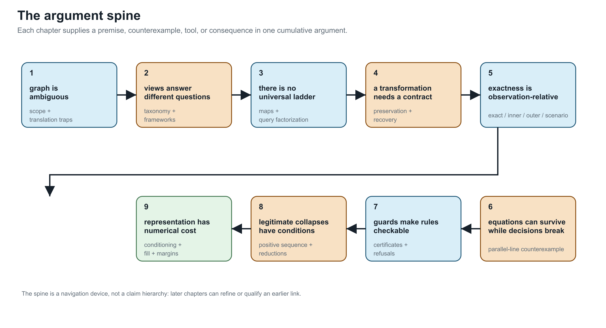
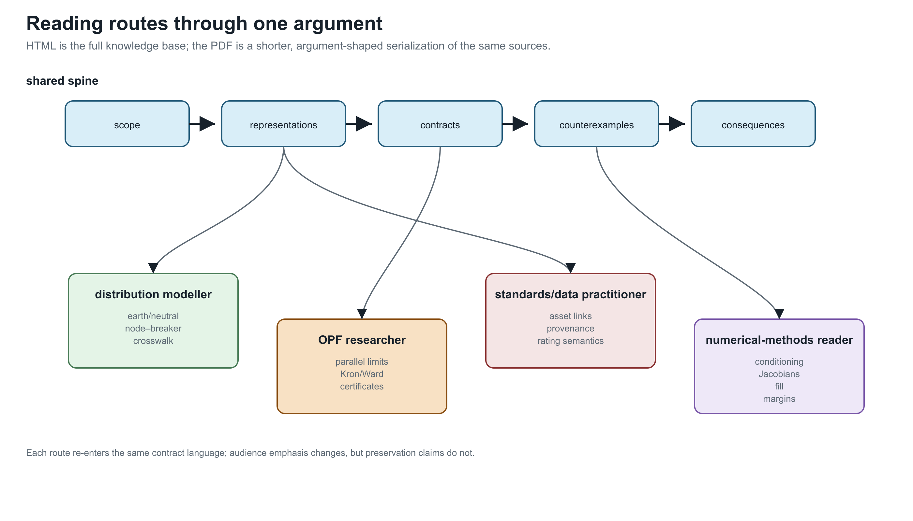

# Structure-Preserving Graph Models for Power Networks

**Page status:** reader-facing overview and navigation map.

This knowledge base develops graph models for power-network decision problems,
starting with the general multiconductor case: explicit terminals and neutral/
grounding, coupled line factors, switching states, multiwinding transformers,
limits, controls, and recoverable decisions. Balanced transmission models are
derived specializations, not the starting ontology.

The central thesis is simple:

> A graph transformation is meaningful only relative to declared observations,
> constraints, and decisions. Simpler graphs should be derived, traceable views
> with preservation and recovery contracts.

## A short reading route

Start with [One network, many graphs](@ref one-network-many-graphs), read [How
to read diagrams and equations](@ref how-to-read-diagrams-and-equations), then choose the
[graph and transmission reading guide](@ref reading-guide-graph-and-transmission).
Cross the
[five-community vocabulary bridge](@ref one-network-five-languages), then
follow the five-bus cycle example and [A first failure: heterogeneous parallel
branches](@ref first-failure-parallel-branches), then unpack the same topology
kernel in [Five buses through a multi-port lowering](@ref
five-bus-transformer-lowering). These
chapters establish the recurring pattern: a representation may preserve a
terminal equation while changing a decision-feasible set. Continue through
[Formal representation frameworks](@ref formal-representation-frameworks),
[Translation traps: graphs, circuits, and power-system language](@ref
translation-traps), and [Preservation contracts](@ref preservation-contracts)
and [Transformation semantics and register](@ref
transformation-semantics-register) before reading the guarded transformations
and worked cases.

For the complete retrieval surface, use the generated [knowledge-base index](@ref
knowledge-base-index), which lists claims, artifacts, chapters, open items, and
their evidence. The generated [cross-community vocabulary indexes](@ref
vocabulary-indexes) translate in both directions between familiar community
phrases and the book's maintained terms. The [chapter-status table](@ref
chapter-status) records the scope and verification boundary of each page.

The HTML route is the primary product. The PDF is a shorter argument-shaped
serialization: it keeps the definitions, counterexamples, contracts,
transformations, and numerical consequences needed to follow the thesis, while
the HTML index remains the place for exhaustive lookup.

The audience map is a route selector, not another taxonomy. Power engineers,
software and data experts, mathematical modellers, graph theorists, and graph
machine-learning experts enter through different questions, but every route
returns to the same preservation-contract and evidence language.

## What to read by question

- **I recognize the words but not their use here.** Read [One network, five
  languages](@ref one-network-five-languages), then use the maintained
  [Terminology](@ref) page for compact definitions or the [cross-community
  vocabulary indexes](@ref vocabulary-indexes) for bidirectional lookup.
- **I know simple graphs or balanced transmission models.** Start with the
  [graph and transmission reading guide](@ref
  reading-guide-graph-and-transmission), then follow the route for your
  background into the shared four-wire and preservation examples.
- **Which graph is this?** Read [Representation frameworks](@ref
  formal-representation-frameworks), [Representation taxonomy](@ref
  representation-taxonomy), and [Maps between representation frameworks](@ref
  representation-maps).
- **What does an arrow, cycle, parallel line, or radial feeder mean?** Read
  [Translation traps](@ref translation-traps), [Orientation, terminal
  quantities, and power transfer](@ref orientation-terminal-power), and [Cycles,
  parallelism, and radial structure](@ref cycles-parallelism-radiality).
- **How did this graph get made?** Read [From source data to a canonical
  network model](@ref source-to-canonical-model), then [From conductor geometry
  to impedance fidelity](@ref impedance-fidelity-ladder).
- **Why is a Y-bus not always enough?** Read [Circuit formulations and the
  lowering boundary](@ref circuit-formulations-and-lowering), then [Two
  topology levels and the nodal projection](@ref
  two-level-topology-and-nodal-projection).
- **Why can the same graph produce different decisions?** Read [Load models and
  decision dependence](@ref load-models-and-decision-dependence), followed by
  the parallel-line decision cases.
- **Can I reduce or compile a model?** Read [Preservation contracts](@ref
  preservation-contracts), [Projection, compilation, and reduction](@ref), and
[Kron, Ward, and optimized network equivalents](@ref kron-ward-opti-kron),
  then follow the [four-wire impedance-model ladder](@ref
  four-wire-impedance-model-ladder).
- **What does a transformation preserve, and what does it erase?** Read
  [Transformation semantics and register](@ref
  transformation-semantics-register), then [Degree-two series elimination](@ref
  degree-two-series-rule) and [BIM/BFM parallel lines: an expressiveness audit](@ref
  bim-bfm-parallel-lines).
- **What survives a decision problem?** Read the parallel-line cases, the
  transformer-tap case, [Certificate schema and composition](@ref
  certificate-schema-composition), and [Guarded normalization rules](@ref).
- **What changes numerically?** Read [Numerical consequences of representation
  and reduction](@ref numerical-consequences).

## Scope and conventions

The book uses the BMOPFTools-style index discipline: ``\ell ij`` denotes the
stored reference orientation and terminal order for line ``\ell``; it does not
assert the operating direction of power. An element-intrinsic impedance is
``\mathbf Z_\ell``. Multiwinding devices retain device and winding indices until
an explicit compilation creates two-terminal arcs.

The target is stronger than matching voltages. A valid transformation may need
to preserve or map conductor and winding limits, continuous and discrete
controls, switching and outage choices, feasible sets, objectives, active
constraints, eliminated quantities, and source provenance.

The current text is a research draft. Claims, generated witnesses, citations,
and unresolved boundaries are tracked explicitly in the generated indexes.
