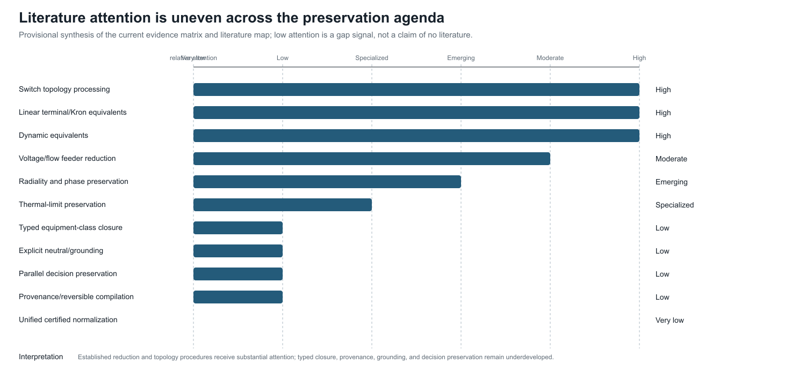

# [Literature map](@id literature-map)

**Page status:** research record; coverage is provisional and not an exhaustive systematic review. Current matrix counts, checksums, search coverage, and coding status are published in the generated [review protocol and evidence status](@ref review-protocol-evidence-status) page.

The current seed matrix spans several communities. No included record in that
matrix supplies the full combination of typed physical assets,
multiconductor terminal structure, exact/approximate behavioral maps,
decision-constraint preservation, provenance, and executable normalization
rules.

## Circuit and graph theory

### A landscape of graph models

The literature does not converge on one graph class because different models
answer different questions. Simple undirected graphs support connectivity,
cuts, and generic algorithms; identified multigraphs retain parallel-member
identity; oriented incidence graphs supply sign conventions for conservation
equations; and hypergraph or factor representations retain relations whose
arity exceeds two. Port-based and compositional circuit work gives a rigorous
language for multi-terminal behaviour [BaezFong2018](@cite), while
port-Hamiltonian graph models emphasize interconnection, energy, and passivity
[vanderSchaftMaschke2013](@cite). Typed graph-transformation theory adds
matching, negative conditions, and rewrite composition [Ehrig2006](@cite).

Power-system information models add a different axis: equipment, terminals,
connectivity nodes, topological nodes, ownership, protection, and provenance.
CIM/CGMES and engineering compilers such as PowerModelsDistribution therefore
provide typed data and state-processing views rather than a single electrical
graph [CIMTopologicalNode, CGMESLibrary, PMDEngineering, PMDConversion](@cite).
Equation and sparsity graphs then project a chosen formulation onto variables,
constraints, or nonzero blocks. These models are alternatives or companions,
not successive rungs of one universal refinement ladder.

The book selects a linked asset/dependency model and hierarchical port--factor
electrical model as its source pair because they jointly retain the identities,
terminal structure, behavioural relations, limits, states, and provenance
needed by the declared multiconductor decision problems. Simple graphs,
oriented multigraphs, nodal-support graphs, and tableau/MNA systems remain
important derived views or formulation targets. This is a scoped canonicality
claim—canonical for the book's source contract—not a claim that these are the
only valid graph models or that the literature has a unique standard.

Kron reduction gives the foundational boundary-variable elimination through a
Schur complement. Dörfler and Bullo analyze the resulting topology, algebra,
spectrum, effective resistance, and sensitivity for loopy Laplacians
[DorflerBullo2013](@cite). This is the right reference for exact linear
terminal reduction, but its retained graph is an equivalent network rather than
a physical asset model.

Caliskan and Tabuada extend Kron ideas to generalized electrical networks in
the time domain and identify homogeneity conditions under which compatible
network structure survives [CaliskanTabuada2014](@cite). This is one of the
closest theoretical precedents for construction-aware closure rules.

Circular planar resistor-network theory studies response matrices, local
electrical transformations and recoverability. Curtis and Morrow provide a
book-length treatment [CurtisMorrow2000](@cite). This literature teaches that
boundary equivalence, internal identifiability, minimality, and a unique normal
form are different questions.

Baez and Fong separate circuit syntax from external behavior through a
compositional black-box construction [BaezFong2018](@cite). Port-Hamiltonian
systems similarly emphasize energy, ports, interconnection and passivity
[vanderSchaftMaschke2013](@cite). These frameworks are strong foundations for
multiport composition but do not by themselves encode utility asset semantics
or OPF decision constraints.

### Multiphase topology and nodal assembly

Gan and Low make an important distinction between macro- and scalar-level
topology: a radial multiphase feeder has an equivalent scalar support graph
with a clique associated with each densely coupled line
[GanLowChordal2014](@cite). Their BIM/BFM treatment likewise identifies each
bus--phase pair with a scalar coordinate while continuing to exploit radiality
at the bus level [GanLowMultiphase2014](@cite). This is direct precedent for
keeping bus-level radiality separate from conductor-expanded matrix cycles.

Kettner and Paolone assemble the compound nodal admittance matrix from a
polyphase branch incidence matrix and block-diagonal primitive admittances,
then derive rank conditions relevant to Kron reduction
[KettnerPaolone2019](@cite). Coppo, Bignucolo and Turri expose nested primitive,
winding, and connection maps for general multiphase transformers
[Coppo2017](@cite). Together these works support the book's factor-stamping
view. They do not make the inverse decomposition unique: asset identity,
limits, states, and primitive lineage still have to be retained outside the
assembled nodal operator.

A software-facing companion makes the same bridge explicit for four-wire
unbalanced power flow: matrix-valued series and shunt data feed a nodal
current-injection method, while a radial backward--forward sweep uses an
element-wise impedance view [GethClaeysHeidari2023](@cite). The primary
three-phase distribution methods of Cheng and Shirmohammadi and of Zimmerman
and Chiang provide complementary precedents for unbalanced feeder equations
and radial solution structure [ChengShirmohammadi1995,
ZimmermanChiang1995](@cite). These sources establish method-specific modelling
and solution results, not a universal four-wire, grounding, or decision-
preservation contract.

### Ground-return impedance and earth modelling

Carson's original ground-return treatment derives overhead-wire propagation
under a homogeneous half-space idealization [Carson1926](@cite). It is an
important physical anchor for earth-return impedance, but it does not identify
the earth conductor, grounding topology, protection state, or uncertainty
semantics of a modern multiconductor network. The book therefore treats
Carson-style impedance as one possible reduced-earth factor and keeps explicit
earth conductors, bonds, and grounding observations as separate model objects.

### Circuit formulations beyond nodal admittance

The circuit literature supplies several established equation targets rather
than one universally correct matrix. Classical nodal analysis is compact when
each retained element contributes a voltage-to-current relation. Modified
nodal analysis augments node voltages with selected branch currents, making
ideal voltage sources and current-controlled elements explicit
[HoRuehliBrennan1975](@cite). Sparse tableau formulations retain branch- and
device-level variables and equations, with sparsity and elimination treated as
separate design choices [HachtelBraytonGustavson1971](@cite).

This distinction is directly relevant to power-network models. Sparse-tableau
OPF and node--breaker work keeps multi-port elements, breaker actions, and
member-level constraints in the formulation instead of rebuilding a different
fixed ``Y_{\mathrm{bus}}`` matrix for every state [ParkHolzerDeMarco2019](@cite).
The lesson is not that tableau is always preferable: it is that a nodal
admittance target is a guarded lowering for a declared variable set and query
family, not a universal representation of a power network.

The book therefore treats nodal support, MNA/tableau systems, branch-current
models, hybrid port parameters, and general port--factor relations as related
but non-identical formulation families. A formulation may be equivalent after
regular elimination for one boundary-voltage observation while failing to
preserve switching decisions, asset identity, grounding paths, current limits,
or multi-terminal behaviour. The new [circuit formulations and lowering
boundary](@ref circuit-formulations-and-lowering) chapter records these guards
as part of the representation choice rather than as an implementation detail.

## Power-system network reduction

The cited power-system reduction literature emphasizes external-system equivalents,
Kron/Ward/REI methods, coherency, and dynamic model reduction. "Structure
preserving" has several meanings.

Ward's original construction treats suppressed loads and generation as
approximately constant current, retains tie terminals, and realizes the
external network as a boundary mesh with equivalent terminal injections
[Ward1949](@cite). The operating-state extended Ward construction addresses
boundary-bus designation, external shunts, and contingency use from a single
estimated state [Monticelli1979](@cite). Ward--PV instead retains external
generator buses after load-node elimination and may then aggregate coherent
generator groups [Machowski1988](@cite). These sources support a family
taxonomy, not one universal `Ward` operator.

Grudzien and coauthors use topology-guided reductions of lines, trees and
triangular subgraphs while preserving power-flow behavior for their model class
[Grudzien2018](@cite). Sistermanns and coauthors seek to avoid artificial
entities and maintain physical correspondence for selected transmission-grid
features [Sistermanns2019](@cite). These works are directly relevant, although
they do not establish a general typed asset-preservation framework.

The line-limit-preserving equivalent work demonstrates that thermal transfer
constraints require special treatment beyond ordinary network equivalencing
[Jang2013](@cite). This should be regarded as a prototype of a broader theory
of decision-set preservation.

Molzahn studies a complementary operation for parallel scalar AC lines:
delete a flow-limit constraint only after a positive-semidefinite quadratic
containment test proves that another parallel member implies it at both line
ends [Molzahn2018](@cite). This is especially important for the book's
taxonomy. It is exact presolve on an unchanged physical model, not parallel
asset aggregation. The result gives a concrete decision-feasible-set
certificate and a useful transmission special case, while leaving open the
multiconductor, state-dependent, and asset-decision generalizations.
In the reported PEGASE cases, the method identified between 203 and 650
redundant parallel-line limits, with MIPS OPF runtime reductions of 2.0% to
5.7%; these are useful presolve results, not evidence for replacing the lines.

## Distribution feeder reduction

Pecenak and coauthors address multiphase unbalance, mutual coupling and spatial
variation while targeting accuracy at selected critical buses
[Pecenak2018](@cite). Opti-KRON work targets voltage reproduction, phase
connectivity [Mokhtari2027](@cite) and restored radiality
[MokhtariRadial2025](@cite). This literature is
more sensitive than classical transmission equivalents to phase availability
and feeder topology, but explicit neutral grounding, physical line codes,
parallel-asset decisions, protection and provenance remain underdeveloped.

OpenDSS implements practical reduction options including unloaded-intermediate
bus elimination, short-line merging, parallel-line merging and lateral
aggregation [OpenDSSReduction](@cite). These procedures are important test
cases for formalization: their operational usefulness is clear, while their
preservation domains and failure cases deserve explicit certificates.

## Topology processing and information models

CIM's connectivity/topological-node distinction and software such as PowSyBl
document state-dependent topology processing [CIMTopologicalNode,
PowsyblTopology](@cite). Its limitation for this agenda is not correctness but
scope: connectivity quotienting is only one of the transformations needed.
An automated topology-processor study makes the EMS boundary concrete: breaker
and substation configuration data are converted into network topology for state
estimation, with implementation and timing evaluated on test systems
[FarrokhabadiVanfretti2014](@cite). That is prior evidence for a topology-
processing function, not evidence that the book's typed quotient preserves all
electrical, asset, or decision semantics.
The evidence rows for CGMES and PowSyBl describe this same underlying
connectivity-node-to-topological-node map, while remaining separate records:
one is a standards/building-process source and the other is an implementation
and API source. They are therefore related evidence, not duplicate citations.

PowerModelsDistribution provides a concrete engineering-to-mathematical
compiler and supports conductor terminals, grounding and multiwinding
transformers [PMDEngineering, PMDConversion](@cite). It offers an excellent
implementation case study for provenance-aware compilation.

## Graph transformation and model-driven engineering

Typed algebraic graph transformation supplies formal rule matching, negative
application conditions, rewrite composition, critical-pair analysis and
confluence [Ehrig2006](@cite). These ideas are well-developed in formal
software and systems model-transformation literature but have not been deeply integrated with power-system
network equivalents. The W3C PROV-DM recommendation supplies a separate
provenance vocabulary for entities, activities, agents, and derivations
[W3CPROVDM2013](@cite). The book combines these as conceptual anchors for
transformation traces and source-to-target lineage; it does not claim that
either source already defines the proposed electrical certificate calculus.

## Literature-position table

The table records the boundary between prior work, the book's synthesis, and
repository evidence. “Repository demonstrates” refers to the checked fixtures
and generated artifacts in this project; it is not independent validation of
the cited literature or external review of the book's assumptions.

## Source-type legend

The literature map keeps source authority separate from the book's own
evidence. The same topic may therefore appear in several rows without those
rows being interchangeable.

| Source class | What it can establish here | What it cannot establish here |
| --- | --- | --- |
| Peer-reviewed primary paper | A published method, theorem, derivation, or reported case under its stated assumptions | That the book's broader model, implementation, or claims are equivalent to the paper's scope |
| Standard or information-model specification | Normative vocabulary, profile structure, exchange requirements, or documented semantics | Electrical behaviour, solver convergence, or preservation of omitted asset/decision detail |
| Official software documentation | Intended API, data model, topology operation, or documented implementation behaviour | A peer-reviewed theorem, universal semantics, or independent validation of the current version |
| Author-derived result or repository reproduction | A traceable computation, fixture result, or independent reimplementation when its method is declared | External review, source-faithful utility validation, or global optimality unless separately demonstrated |
| Project proposal or synthesis | The book's definitions, taxonomies, research questions, and proposed certificates | Prior-art status or evidence that the proposed calculus is already established |

| Chapter or foundation | Literature establishes | Book synthesizes | Repository demonstrates | Open boundary |
| --- | --- | --- | --- | --- |
| When the general model collapses | Symmetrical coordinates and sequence analysis [Fortescue1918](@cite) | Exact positive-sequence restriction requires operator, grounding, decision, and observation invariance | Circulant/non-circulant sequence witnesses and balanced transmission fixture | Unbalanced controls, phase-specific limits, and external mathematical review |
| Circuit coordinate transformations | Ground-return physics [Carson1926](@cite) and multiphase power-flow methods [ChengShirmohammadi1995, ZimmermanChiang1995](@cite) | Phase-to-neutral and phase-to-phase maps are distinct from neutral deletion and Kron elimination | Four-wire ladder, grounding guards, and coordinate-action tests | Typed four-wire/three-wire certificates and standards-aligned validation |
| Kron, Ward, and optimized equivalents | Kron, Ward, and feeder-reduction families [DorflerBullo2013, Ward1949, Pecenak2018](@cite) | Boundary behavior, calibration-point approximation, decision preservation, and physical realizability are separate objects | Typed Kron covariance, Ward/scenario probes, and recovery witnesses | Source-faithful Opti-KRON validation and global nonlinear claims |
| Node--breaker and topology processing | Connectivity/topological-node models and EMS topology processors [CIMTopologicalNode, FarrokhabadiVanfretti2014, PowsyblTopology](@cite) | Topology processing is a state-conditioned quotient with provenance, not a complete electrical reduction | Active-state connectivity, two-level topology, and graph-surgery witnesses | Full state-estimation/protection integration and utility-model validation |
| Data model crosswalk and provenance | CIM/CGMES information models, engineering compilers, graph transformation, and PROV [CGMESLibrary, PMDEngineering, Ehrig2006, W3CPROVDM2013](@cite) | Source-to-canonical maps must expose losses, inferences, identities, and recovery obligations | Version-pinned crosswalks, certificates, provenance manifests, and schema checks | Round-trip adapters, profile conformance, and independent domain review |
| Parallel-member and decision cases | Scalar exact constraint-pruning theory [Molzahn2018](@cite) and multiphase OPF formulations [GanLowChordal2014, GanLowMultiphase2014](@cite) | Preserving a feasible set is not the same as aggregating assets or preserving topology | Multiconductor, four-wire, nominal-π, and joint implication witnesses | Broader contingencies, protection, uncertainty, and external case validation |

## Current assessment

| Topic | Attention | Main limitation relative to this agenda |
| --- | --- | --- |
| Switch topology processing | High | state quotient, not general physical normalization |
| Linear terminal/Kron equivalents | High | artificial edges; limits and assets usually omitted |
| Dynamic equivalents | High | preservation is input--output/dynamic, not asset semantic |
| Voltage/flow-oriented feeder reduction | Moderate | scenario/application dependent |
| Radiality and phase preservation | Emerging | limited device and neutral detail |
| Thermal-limit preservation | Specialized | not generalized to arbitrary decision constraints |
| Typed equipment-class closure | Low | few formal rewrite guards |
| Explicit neutral/grounding preservation | Low | often eliminated or treated as an implementation detail |
| Parallel-asset decision preservation | Low | exact scalar constraint pruning exists, but aggregation and multiconductor/state-dependent cases remain open |
| Provenance and reversible compilation | Low | implemented inconsistently, weakly theorized |
| Unified certified normalization | Very low | central research gap |

This table is a provisional assessment to be replaced by a systematic review
with a reproducible search protocol and coded evidence matrix.

The figure is a synthesis aid, not a bibliometric score or prevalence claim.
Its attention labels are the book's provisional assessment of the coded seed
matrix; they identify where the cited record is more developed for this agenda
and where the book's proposed typed-closure, grounding, decision-preservation,
provenance, and certified-normalization questions remain weakly represented.

## Current evidence-matrix snapshot

The versioned matrix in `review/evidence-matrix.csv` is a single-coded snapshot;
its generated status page reports the current included/excluded counts. The
records cover parallel-line constraint pruning,
graph-aware Kron/power-flow reductions, multiphase OPF formulations,
structure-preserving feeder and transmission reduction, CGMES topology
processing, and circuit/graph formulation precedents. The rows intentionally preserve
different exactness labels and limitations; they are not merged into a single
claim about “network reduction.”

The 2026-08-14 seed search and its limitations are archived in
`review/search-runs/2026-08-14-seed-batch.md`; the targeted 2026-08-16
multiphase/practical-reduction pass is archived in
`review/search-runs/2026-08-16-multiphase-and-practical-reductions.md`.
Database exports, duplicate resolution beyond the coded seed, full-text
screening, and independent double-coding remain open tasks.
