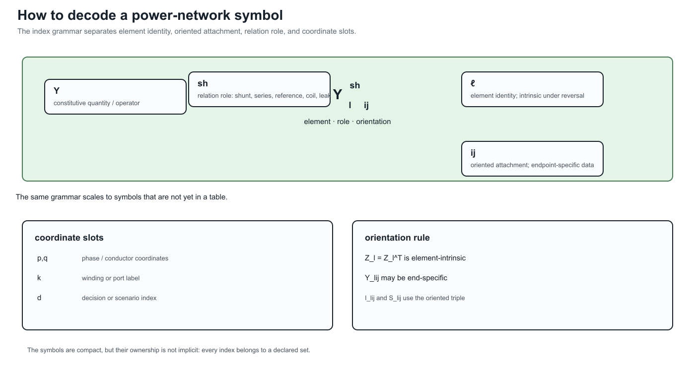
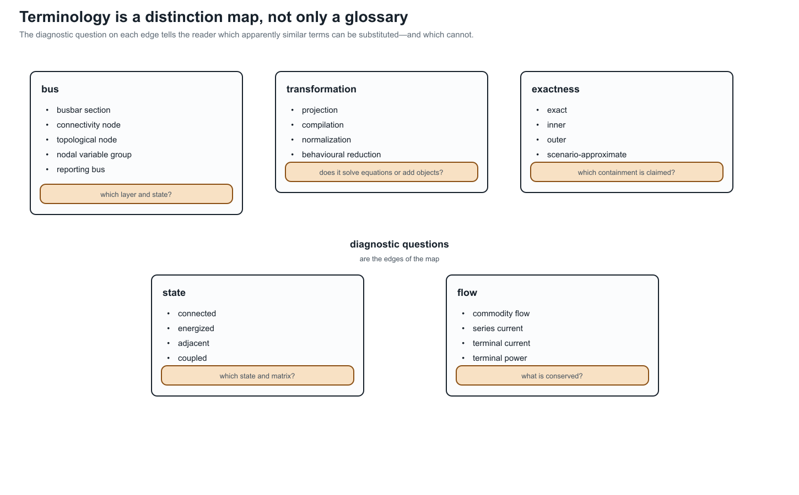
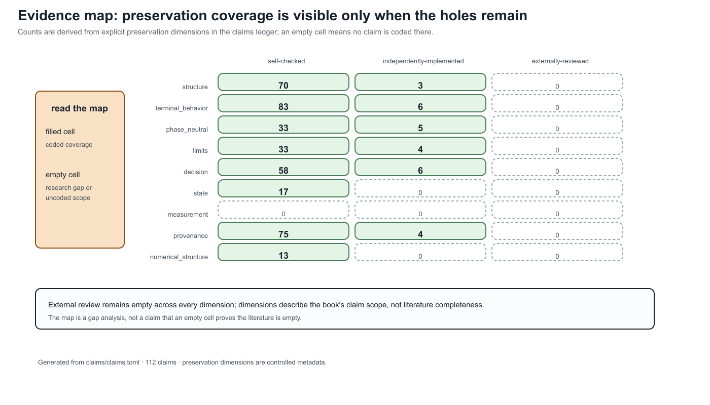
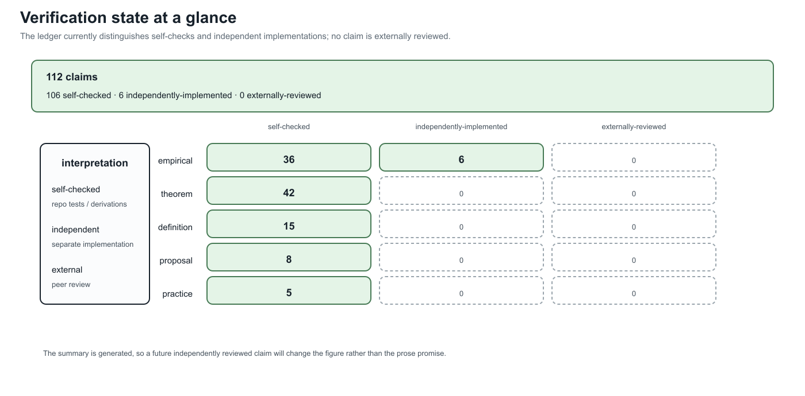

# [Evidence map and verification summary](@id reference-evidence-map)

**Page status:** generated reference navigation and evidence-gap summary.

This page is generated from `claims/claims.toml`. It is a retrieval aid and gap analysis, not a replacement for the claims ledger or the evidence matrix. Empty cells are intentionally visible.

<!-- generated-evidence-summary:start -->
The largest named gaps in this snapshot are measurement (no coded claims at any verification state), state and numerical-structure claims without independent implementations, and external review (zero claims across all nine preservation dimensions). These are gaps in the current evidence record, not evidence that the corresponding literature or engineering practice is empty. The verification summary reports 106 self-checked, 6 independently implemented, and 0 externally reviewed claims out of 112; self-checking and independent implementation are useful but are not external peer review.
<!-- generated-evidence-summary:end -->
