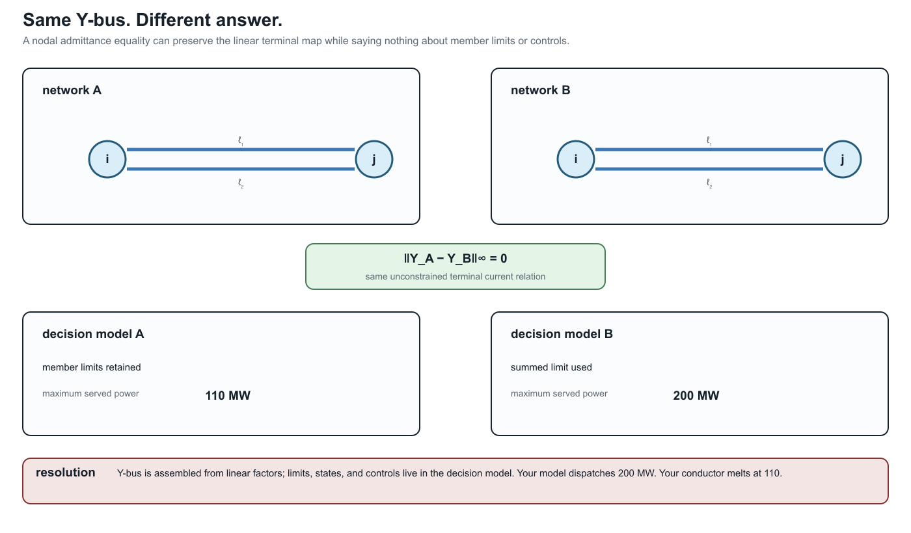
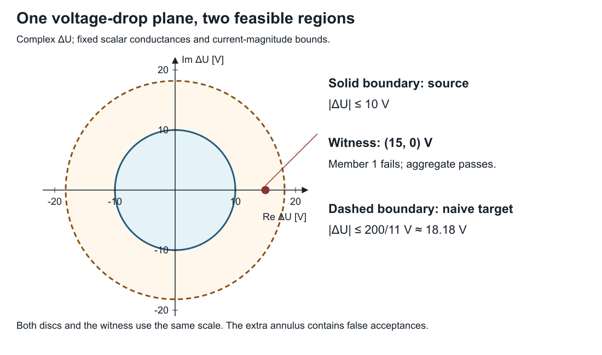

# [A first failure: heterogeneous parallel branches](@id first-failure-parallel-branches)

**Page status:** introductory counterexample with executable scalar and
multiconductor evidence; independent mathematical review remains open.

## The tempting replacement

Here is the decision-level version of the same trap. Two models can have the
same assembled nodal admittance and still answer a dispatch question
differently:



The resolving phrase is **which observations and constraints?** The equality
of the unconstrained terminal map is real; it simply does not include member
ratings, outage states, or independent controls.

Consider two scalar resistive branches ``\ell_1 i j`` and ``\ell_2 i j`` with
intrinsic impedances

```math
Z_{\ell_1}=0.1\ \Omega,\qquad Z_{\ell_2}=1.0\ \Omega,
```

and member current limits

```math
I^{\max}_{\ell_1}=I^{\max}_{\ell_2}=100\ \mathrm{A}.
```

Writing ``\Delta U=U_i-U_j`` and ``Y_{\ell}=Z_{\ell}^{-1}``, the terminal
currents are

```math
I_{\ell_k i j}=Y_{\ell_k}\Delta U,\qquad k\in\{1,2\}.
```

Replacing the pair by one branch with

```math
Y_{\mathrm{eq}}=Y_{\ell_1}+Y_{\ell_2}=11\ \mathrm{S}
```

is exact for the unconstrained total terminal-current relation. It does not
follow that the replacement is exact for a decision problem with member limits.

## The feasible sets differ

The source model requires both inequalities

```math
|Y_{\ell_1}\Delta U|\le I^{\max}_{\ell_1},\qquad
|Y_{\ell_2}\Delta U|\le I^{\max}_{\ell_2}.
```

Hence its admissible voltage-drop magnitude is

```math
|\Delta U|\le
\min\left\{\frac{I^{\max}_{\ell_1}}{|Y_{\ell_1}|},
            \frac{I^{\max}_{\ell_2}}{|Y_{\ell_2}|}\right\}
=10\ \mathrm{V}.
```

A common aggregate construction assigns the equivalent branch the summed
rating, ``I^{\max}_{\mathrm{eq}}=200\ \mathrm{A}``. It admits

```math
|\Delta U|\le \frac{200}{11}=18.18\ \mathrm{V}.
```

At the witness ``\Delta U=15\ \mathrm{V}``, the equivalent branch carries
``165\ \mathrm{A}`` and satisfies its aggregate limit. Recovery gives

```math
I_{\ell_1 i j}=150\ \mathrm{A},\qquad
I_{\ell_2 i j}=15\ \mathrm{A},
```

so the source violates the ``\ell_1`` limit. The target feasible set is
therefore an outer relaxation of the source feasible set.



The figure is generated by `experiments/render_parallel_feasible_set_card.py`.
For the scalar witness, the retained and aggregate regions are discs in the
complex ``\Delta U`` plane; the ellipse is the corresponding visual reminder
for weighted or coupled quadratic limits.

## Preservation contract

| Contract field | Value |
| --- | --- |
| source | two identified parallel branches with individual limits |
| target | one equivalent branch with summed admittance and rating |
| preconditions | common endpoints and voltage coordinates; linear branch laws |
| preserves | unconstrained total terminal current as a function of ``\Delta U`` |
| does not preserve | the member-constrained feasible set |
| forgets | member identity and independent outage, maintenance, or investment state |
| recovery | ``I_{\ell_k i j}=Y_{\ell_k}\Delta U`` if member admittances remain available |
| classification | outer/relaxed for this rating construction |

This counterexample does not say that parallel aggregation is never useful. It
says that an aggregate rating needs its own derivation relative to the intended
observation or decision set. Choosing a tighter equivalent limit can reproduce
this one scalar voltage-drop bound, but it still does not recreate independent
member states or arbitrary member-wise constraints.

## Certified redundancy is different from aggregation

Some member limits can be removed exactly without replacing the physical
members. For a fixed scalar AC ``\pi``-line, write the endpoint-voltage state as

```math
x=
\begin{bmatrix}
\Re(U_i)&\Re(U_j)&\Im(U_i)&\Im(U_j)
\end{bmatrix}^{\mathsf T}.
```

After normalization by the applicable current or apparent-power rating, a flow
limit at the ``ij`` end has a positive-semidefinite quadratic feasible set

```math
\mathcal E_{\ell i j}=\{x:x^{\mathsf T}M_{\ell i j}x\le1\}.
```

If ``\mathcal E_{\ell_k i j}\subseteq\mathcal E_{\ell_r i j}``, satisfying
member ``\ell_k``'s limit implies member ``\ell_r``'s limit at that end.
Molzahn gives an eigenvalue-based containment test that also handles singular
quadratic forms, whose feasible sets are cylinders rather than bounded
ellipsoids [Molzahn2018](@cite). A complete line-limit removal requires the
implication at both ``ij`` and ``ji`` ends.

This is exact constraint pruning, not asset aggregation: both line laws,
parameters, identities, and recovered flows remain in the model. Failure to
identify redundancy is also not proof that a limit is essential; the test is a
sufficient certificate. Its stated scope is fixed scalar AC transmission
``\pi``-models, including fixed complex transformer ratios and shunts. It does
not by itself cover arbitrary multiconductor constraint sets, switching,
outages, investment states, or other state-dependent parameters. Claim
`LIT-PAR-001` records that boundary.

## Multiconductor form

For multiconductor branches,

```math
\mathbf I_{\ell_k i j}=\mathbf Y_{\ell_k}\Delta\mathbf U,
```

and the source feasible set is the intersection of the inverse images of every
member constraint set:

```math
\mathcal D_{\mathrm{src}}=
\bigcap_k\left\{\Delta\mathbf U:
\mathbf Y_{\ell_k}\Delta\mathbf U\in\mathcal C_{\ell_k}\right\}.
```

The summed terminal map
``\mathbf Y_{\mathrm{eq}}=\sum_k\mathbf Y_{\ell_k}`` does not, by itself,
encode that intersection. Mutual coupling and per-conductor limits make a
single conventional rating still less likely to be an exact representation.

The generation script emits the numerical witness and its machine-readable
contract as claim `TR-PAR-001`.

## A decision problem exposes the gap

The same mechanism changes an optimum in a two-bus maximum-served-load model.
Let the parallel members have

```math
(b_{\ell_1},b_{\ell_2})=(1000,100)\ \mathrm{MW/rad},\qquad
(F^{\max}_{\ell_1},F^{\max}_{\ell_2})=(100,100)\ \mathrm{MW},
```

with ``F_{\ell i j}=b_\ell\delta_{ij}``, nonnegative
``\delta_{ij}``, and served power equal to total flow. The source model keeps
both member laws and both limits. The naïve target uses
``b_{\mathrm{eq}}=1100`` MW/rad and
``F^{\max}_{\mathrm{eq}}=200`` MW.

| Formulation | Maximum served power | ``\delta_{ij}`` | Active restriction |
|:--|--:|--:|:--|
| source members | 110 MW | 0.1 rad | ``F_{\ell_1 i j}\le100`` MW |
| naïve aggregate | 200 MW | ``2/11`` rad | summed 200 MW rating |
| aggregate relation with exact lifted member constraints | 110 MW | 0.1 rad | recovered ``F_{\ell_1 i j}\le100`` MW |

The displayed exact lifted formulation retains every member law and both
member limits:

```math
F_{\ell i j}=b_\ell\delta_{ij},\qquad
F_{\ell i j}\le F^{\max}_\ell \quad\text{for every }\ell,
```

alongside the aggregate terminal relation. It therefore reproduces the source
feasible set and optimum without pretending that a summed scalar rating is
exact. This computed comparison is claim `TR-PAR-003`. JuMP and Ipopt produce
the machine-readable result in
`experiments/generated/parallel-opf-comparison.json`; the analytic values above
also provide a solver-independent check.

Here ``b_{\ell_2}=0.1b_{\ell_1}`` and the ratings are equal, so the
``\ell_2`` limit is actually implied by the ``\ell_1`` limit and can be
certifiably pruned. Keeping both in the table isolates the lifting argument
from presolve; the next case implements the pruned formulation explicitly.

The [Multiconductor parallel AC decision case](@ref multiconductor-parallel-ac-case)
extends this comparison to coupled complex conductor equations, phase-to-neutral
constant power, and voltage-magnitude constraints.
