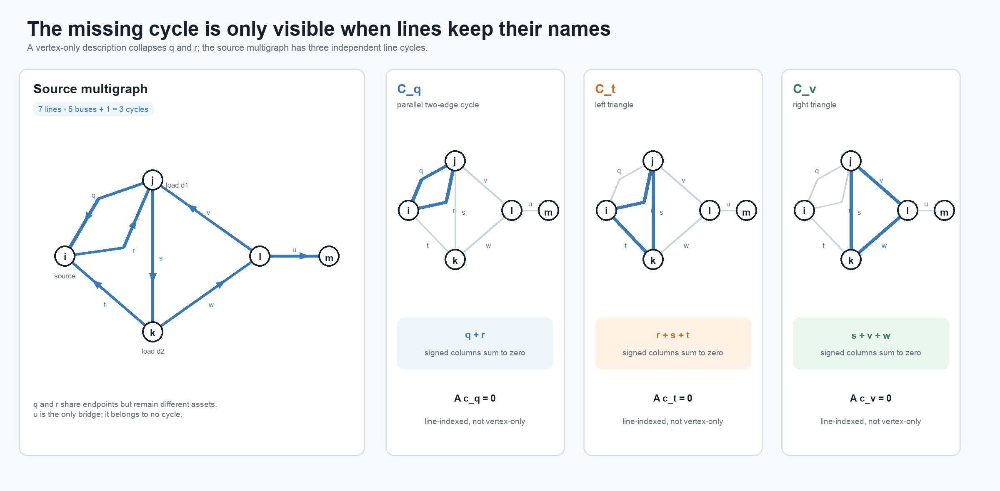
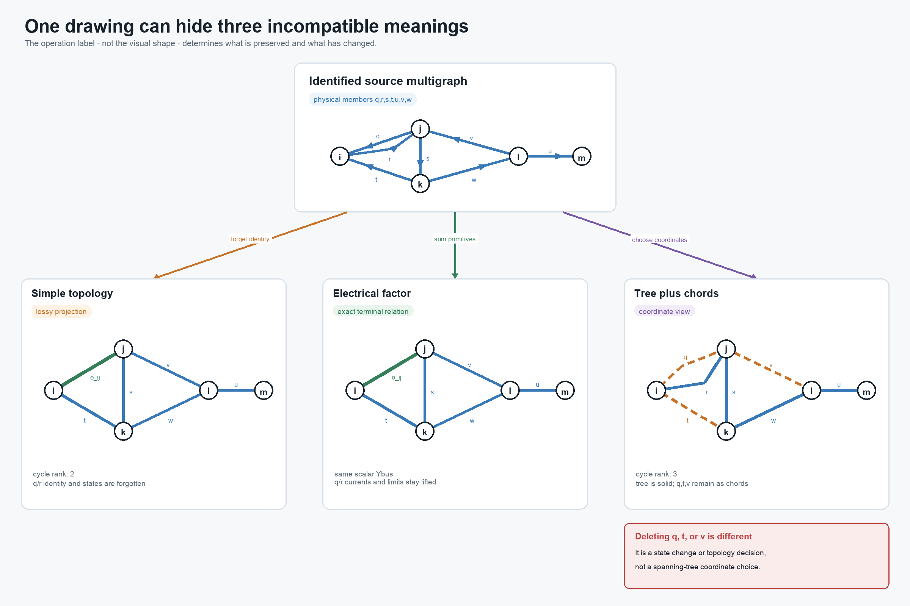

# [A five-bus multigraph: identities, cycles, and tree coordinates](@id five-bus-cycle-spaces)

**Page status:** generated worked graph example with hash-bound figures,
BMOPFTools cross-checks, and companion conductor-terminal and multi-port
lowering witnesses.

## Purpose and status

This worked example separates four operations that are often drawn as if they
formed one reduction chain: forgetting parallel identity, constructing an
electrical aggregate, eliminating internal variables, and selecting a spanning
tree. They do not have the same source, target, or preservation contract.

The general definitions of simple cycles, line-identity cycles, parallel
fibres, bridges, leaves, and adjacency- versus member-radiality are given in
[Cycles, parallelism, and radial structure](@ref cycles-parallelism-radiality).
This chapter supplies the running numerical witness for those definitions.

The graph identities below are standard finite-dimensional results. The
line-indexed calculations, nodal-admittance comparison, decision witness, and
BMOPFTools topology cross-check are executable. The figures are generated from
that same analysis record rather than maintained as independent sketches. The
scalar values are chosen to make the distinctions visible; the final section
lifts the construction to the book's multiconductor and multi-terminal scope.

## Source bus--branch multigraph

Let the buses and identified lines be

```math
\mathcal B=\{i,j,k,l,m\},
\qquad
\mathcal L=\{q,r,s,t,v,w,x\}.
```

Using the book's element--endpoint convention, declare

```math
\mathcal T^{L\rightarrow}
=\{qji,\ rij,\ sjk,\ tki,\ vlj,\ wkl,\ xlm\}.
```

Thus ``q`` and ``r`` are distinct parallel lines even though their declared
orientations are opposite. Reversing either arrow changes signs in oriented
coordinates but does not change the underlying undirected multigraph.

With bus order ``(i,j,k,l,m)`` and line order ``(q,r,s,t,v,w,x)``, take ``-1``
at the declared from bus and ``+1`` at the declared to bus. The incidence
matrix is

```math
\mathbf A=
\begin{bmatrix}
 1&-1& 0& 1& 0& 0& 0\\
-1& 1&-1& 0& 1& 0& 0\\
 0& 0& 1&-1& 0&-1& 0\\
 0& 0& 0& 0&-1& 1&-1\\
 0& 0& 0& 0& 0& 0& 1
\end{bmatrix}.
```

The connected graph has ``\operatorname{rank}(\mathbf A)=4``. Its real cycle
space therefore has dimension

```math
\mu=\dim\ker\mathbf A
=|\mathcal L|-\operatorname{rank}(\mathbf A)
=7-4=3.
```

More generally, a loopless undirected multigraph with ``c`` connected
components has

```math
\mu=|\mathcal L|-|\mathcal B|+c.
```

This count uses identified lines. Deduplicating endpoint pairs before counting
cycles gives a different graph and can give a different answer.

## A line-indexed fundamental cycle basis

Choose the spanning tree

```math
\mathcal T_{\mathrm{tree}}=\{r,s,w,x\}.
```

Its chords are ``q``, ``t``, and ``v``. Adding each chord to the tree gives

```math
\mathcal C_q=\{q,r\},\qquad
\mathcal C_t=\{r,s,t\},\qquad
\mathcal C_v=\{s,v,w\}.
```



The small multiples make the missing dimension visible. The cycle
``\mathcal C_q`` has only two buses but two distinct line columns; it disappears
as soon as ``q`` and ``r`` are represented by one adjacency.

The first cycle is the two-edge cycle made by the parallel pair. With the
declared orientations, the signed edge--cycle matrix is

```math
\mathbf C=
\begin{array}{c|ccc}
 &\mathcal C_q&\mathcal C_t&\mathcal C_v\\\hline
q&1&0&0\\
r&1&1&0\\
s&0&1&1\\
t&0&1&0\\
v&0&0&1\\
w&0&0&1\\
x&0&0&0
\end{array},
\qquad
\mathbf A\mathbf C=\mathbf 0.
```

Cycle bases are not unique. A *minimum* cycle basis additionally requires
nonnegative edge weights and minimizes total basis weight
[Kavitha2008](@cite). A list of vertex tuples alone is insufficient for the
source multigraph: replacing ``q`` by ``r`` produces a different line cycle,
and the two-edge cycle cannot be represented without member identity.

Line ``x`` is the only **bridge**: removing it increases the number of connected
components. Calling ``x`` a radial edge is less precise, and calling ``m`` a
radial bus does not generalize well. A cycle-core bus can also be the attachment
point of a bridge and a pendant tree. Bridges, the graph ``2``-core, and
block--cut structure express those roles without assigning radiality to an
individual vertex.

## Projection is not electrical aggregation

Let ``\pi`` forget line identity and retain only a canonical unordered endpoint
pair. Then

```math
\pi(q)=\pi(r)=e_{ij}.
```

The resulting simple graph has six edges and cycle rank

```math
6-5+1=2.
```

This is a topology projection. It loses the ``q``--``r`` two-cycle, member
orientations, ratings, states, ownership, and provenance. Under the standard
definition it also has neither parallel edges nor self-loops.



The first two lower panels intentionally have the same graph shape. One means
only that member identity was forgotten. The other carries a summed electrical
factor while the source-member recovery maps and limits remain available. The
third panel has not removed anything: it merely draws the selected tree solid
and the three source chords dashed.

An electrical aggregate is a separate construction. For reciprocal scalar
series branches on common endpoint coordinates,

```math
I_{ij}^{\mathrm{total}}
=\left(Y_q+Y_r\right)(U_i-U_j),
\qquad
Y_{ij}^{\mathrm{eq}}=Y_q+Y_r.
```

If both impedances are invertible, this means

```math
Z_{ij}^{\mathrm{eq}}
=\left(Z_q^{-1}+Z_r^{-1}\right)^{-1},
```

not ``Z_q+Z_r``. With the oriented incidence matrix and diagonal series
admittance matrix,

```math
\mathbf Y^{\mathrm N}
=\mathbf A\operatorname{diag}(Y_\ell)\mathbf A^{\mathsf T}.
```

The executable example verifies that stamping the seven source members and
stamping the six-edge weighted projection produce identical
``\mathbf Y^{\mathrm N}``. In an explicitly expanded scalar matrix, the
``m,m`` entry is ``+Y_x``; the off-diagonal ``l,m`` entries are ``-Y_x``.

That equality is only a terminal-current statement. In the recorded witness,
``Y_q=10`` S, ``Y_r=1`` S, and each member has a 100 A limit. At
``|U_i-U_j|=15`` V,

```math
|I_q|=150\ \mathrm A,
\qquad
|I_r|=15\ \mathrm A.
```

The source is infeasible, while the summed check

```math
|I_q+I_r|=165\ \mathrm A\leq 200\ \mathrm A
```

passes.

The same source-versus-aggregate feasible-set geometry is shown in the
complex-plane figure in [A first failure: heterogeneous parallel branches](@ref
first-failure-parallel-branches). This five-bus chapter keeps the network
topology and recovery discussion local rather than repeating the scalar card.

The weighted simple graph can still be used exactly if the member recovery
maps and nonredundant source constraints remain lifted. This is the same
decision-preservation mechanism developed in
[A first failure: heterogeneous parallel branches](@ref first-failure-parallel-branches).

## A spanning tree is a coordinate choice

The chosen tree gives a unique parent--child relation after selecting a root.
It does so even though the source graph is meshed. What is nonunique is the
choice of tree, not the possibility of constructing a hierarchy.

Let the vector of oriented branch-voltage drops be

```math
\mathbf u_L=\mathbf A^{\mathsf T}\mathbf U.
```

Then every source cycle satisfies

```math
\mathbf C^{\mathsf T}\mathbf u_L
=\mathbf C^{\mathsf T}\mathbf A^{\mathsf T}\mathbf U
=\mathbf 0.
```

Tree paths can parameterize voltage differences, while chord equations impose
the remaining cycle consistency. Similarly, the nullspace term in a
branch-current description is indexed by cycle coordinates. Lines ``q``, ``t``,
and ``v`` remain physical members with constitutive equations, limits, states,
and provenance.

Deleting a chord is therefore not a graph-coordinate operation. It changes the
network unless the line is already open, a decision selects it open, or a
separate certificate proves the relevant relation and constraints redundant.
For a radial-topology decision, the active identified lines must form a tree or
forest under the declared connectivity contract. Counting only simple
adjacencies would miss the two-edge cycle created when both ``q`` and ``r`` are
active.

## Why the apparent reductions are guarded

In the projected simple graph, bus ``i`` has degree two, but it is also the
source/injection bus. The degree-two series rule must reject its elimination:
topological degree alone does not establish a common series current. The exact
guards are given in [Degree-two series elimination](@ref degree-two-series-rule).

Line ``x`` is a dangling bridge, but it cannot be removed merely because it is
outside every cycle. If bus ``m`` carries a load, generator, measurement,
bound, contingency, or retained voltage, pruning ``x`` changes the study.
Pendant-tree removal is valid only under an observation and decision contract
that either excludes that subtree or replaces it with a certified boundary
model.

These distinctions classify the useful constructions as follows:

| Construction | Classification | What must remain explicit |
|:--|:--|:--|
| identified multigraph to unweighted simple graph | projection | forgotten member data if recovery is required |
| parallel primitive summation | exact terminal normalization under guards | member recovery and nonredundant constraints |
| guarded junction elimination | exact behavioral reduction | recovery, residual constraints, and provenance |
| spanning-tree selection | coordinate or algorithmic view | every chord and its source equations |
| chord opening | fixed state or topology decision | switch/line identity and connectivity contract |

The same distinctions survive when scalar branches are expanded into
conductor-terminal relations and multi-terminal factors.

## Multiconductor and multi-terminal lift

For a multiconductor line, the scalar relation becomes

```math
\mathbf I^{\mathrm s}_{\ell ij}
=\mathbf Y_\ell
\left(
\mathbf U_i[\mathbf N_{\ell i}]
-\mathbf U_j[\mathbf N_{\ell j}]
\right).
```

Parallel primitives can be added only after orientations, ordered conductor
coordinates, terminal maps, units, and base quantities are aligned. For a
nominal-``\pi`` or general fixed linear two-terminal member, the object to stamp
is its complete terminal primitive, not only ``\mathbf Y_\ell``. Component,
grouped, and both-end limits remain member-indexed unless a separate
implication certificate removes them.

The asset-level cycle space still records line identity, but it need not equal
a conductor-resolved cycle space. Missing phases, explicit neutrals, grounding,
and conductor permutations can give different connectivity by terminal. A
cycle-based formulation must say whether its incidence describes buses,
conductor terminals, galvanic zones, factors, or algebraic variables.

A genuinely multiwinding transformer has no canonical representation as one
ordinary bus--branch edge. Its natural cycle participation belongs to the
port--factor or terminal-incidence view. Any cycle basis of a compiled
two-terminal realization is relative to that compilation and must retain a map
back to the source transformer and windings.

The companion [Five buses through a multi-port lowering](@ref
five-bus-transformer-lowering) keeps this chapter's line-induced graph
unchanged and adds a symbolic three-port transformer extension. It compares
factor incidence, a generated star, and the terminal clique produced by
internal elimination, with a separate cycle rank for every declared graph.

## Executable evidence

The package-independent implementation constructs ``\mathbf A``, the
fundamental basis, bridges, simple projection, and both nodal admittances.
BMOPFTools independently analyzes the same seven identified line records.

The recorded checks give seven source lines on five buses, source incidence
rank four, source cycle rank three, and simple-projection cycle rank two. They
also give

```math
\|\mathbf A\mathbf C\|_\infty=0,
\qquad
\|\mathbf Y_{\mathrm{source}}^{\mathrm N}
-\mathbf Y_{\mathrm{projected}}^{\mathrm N}\|_\infty=0.
```

BMOPFTools reports three extra physical edges, and the independently computed
bridge set is ``\{x\}``.
