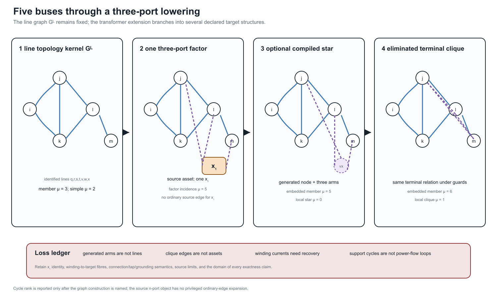
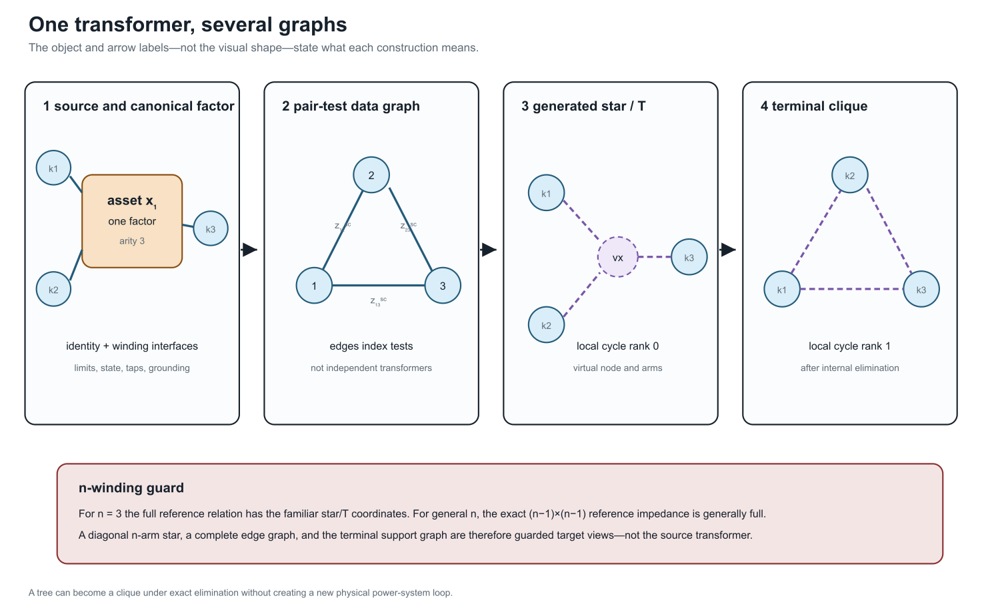

# [Five buses through a multi-port lowering](@id five-bus-transformer-lowering)

**Page status:** generated structural lowering example composed from the stable
five-bus topology fixture and the checked three-winding transformer contract;
it is not a complete transformer power-flow model.

The preceding [five-bus multigraph](@ref five-bus-cycle-spaces) deliberately
uses only identified two-terminal lines. That restriction makes its incidence
matrix, cycle space, simple projection, and spanning-tree coordinates
unambiguous. This chapter keeps that line graph unchanged and adds a second,
orthogonal question:

> What happens when one genuinely three-port transformer must be presented to
> representations and algorithms with different device vocabularies?

The answer is not one longer reduction ladder. The source asset, its electrical
factor, an optional ordinary-edge realization, an assembled operator, and the
operator's support graph are different objects. Each has a different interface,
and the valid targets branch according to the intended study.

## The unchanged topology kernel

Retain the line-induced multigraph

```math
G_L=(\mathcal B,\mathcal L,\partial),
\qquad
\mathcal B=\{i,j,k,l,m\},
\qquad
\mathcal L=\{q,r,s,t,v,w,x\}.
```

Its member cycle rank remains ``\mu_L=3`` and its simple projection remains at
``\mu_{L,s}=2``. Adding another asset to the source inventory does not alter
those statements because their domain is explicitly the line-induced graph
``G_L``.

Now introduce transformer ``x_1`` with winding set

```math
\mathcal K_{x_1}=\{1,2,3\},
\qquad
\beta_{x_1}(1)=j,
\quad
\beta_{x_1}(2)=l,
\quad
\beta_{x_1}(3)=m.
```

These attachments form a pedagogical structural extension. The electrical
data and winding-interface semantics are inherited from the checked running
transformer contract; this page does not pretend that moving that factor onto
the five-bus drawing creates a new validated power-flow case.



The first panel is still ``G_L``. The second adds one factor of arity three,
not three source lines. The third and fourth are generated targets. Their
different cycle ranks do not contradict one another because their edge sets do
not have the same semantics.

## One transformer, several legitimate graphs



Four constructions must be separated.

### Identified asset and three-port factor

At the source level, ``x_1`` is one asset with three identified windings. At
the canonical electrical level it is one factor ``\phi_{x_1}`` with three
ordered port bundles

```math
\mathcal Q_{x_1}
=\{p_{x_1 1},p_{x_1 2},p_{x_1 3}\}.
```

Each port carries its own voltage/current space, terminal order, connection
map, limit observations, and winding identity. WYE and DELTA ports need not
have the same terminal dimension. Factor arity is therefore not the number of
scalar conductor terminals.

### Pair-test data graph

Complete three-winding short-circuit input supplies the three pair-indexed
quantities ``z_{12}^{\mathrm{sc}}``, ``z_{13}^{\mathrm{sc}}``, and
``z_{23}^{\mathrm{sc}}``. Drawing these as the edges of ``K_3`` is a useful
**data-incidence graph**. Its edges index tests; they are not three independent
two-winding transformers and do not acquire independent outage states.

### Generated star

For three windings, the familiar referred leakage coordinates may be drawn as
three generated arms meeting at a virtual point ``\nu_{x_1}``. Locally, this
ordinary graph has four vertices, three edges, and cycle rank zero. Its arms
are coordinate objects owned by ``x_1``. Treating them as physical lines would
invent asset identities, states, and permissible decisions.

### Terminal clique after elimination

Eliminating ``\nu_{x_1}`` can produce direct pairwise terminal coupling. If all
three off-diagonal blocks are structurally nonzero, its support graph is
``K_3`` and has cycle rank one. The cycle is an algebraic coupling cycle. It is
not evidence that a new circulating power-system route appeared inside the
transformer.

!!! warning "Graph-theory trap"
    *The transformer is a tree* and *the transformer contains a cycle* can both
    describe exact target structures. Neither sentence is meaningful until it
    names the star realization, factor-incidence graph, terminal support graph,
    or another declared construction.

## A general cycle-count statement

Let an ``n``-port factor have distinct boundary attachments. Its local
factor-incidence or star expansion has ``n+1`` vertices and ``n`` edges, hence

```math
\mu_{\mathrm{star}}=n-(n+1)+1=0.
```

If elimination yields a structurally complete terminal support graph, its
local clique has ``n`` vertices and ``\binom n2`` edges, hence

```math
\mu_{\mathrm{clique}}
=\binom n2-n+1
=\frac{(n-1)(n-2)}{2}.
```

For ``n=3``, the two counts are zero and one. This is a statement about two
graph constructions, not a claim that elimination changes the physical asset.
If a coupling block is structurally absent or cancels numerically, the support
graph is a subgraph of the clique and the corresponding count must be
recomputed.

Embedding the transformer into an already connected graph makes the same point
more forcefully. A generated star attached at ``n`` existing vertices adds
``n`` member edges and one virtual vertex, increasing member cycle rank by
``n-1``. A complete generated clique adds ``\binom n2`` identified member
edges. A simple projection may add fewer adjacencies where the source already
contains an edge between two attachment buses. Therefore the phrase *the
transformer adds two cycles* is no safer than *the network is radial* without a
representation qualifier.

The recorded five-bus extension gives:

| Declared graph | Member cycle rank | Simple cycle rank | Interpretation |
|:--|--:|--:|:--|
| line-induced ``G_L`` | 3 | 2 | seven identified source lines |
| subdivided line factors plus one three-port factor | 5 | 5 | bipartite factor-incidence graph |
| line members plus generated star | 5 | 4 | optional edge target with ``\nu_{x_1}`` |
| line members plus generated terminal clique | 6 | 3 | eliminated terminal-coupling target |

The numerical values are useful diagnostics only when the row label travels
with them.

## Interfaces along the lowering branches

The source-to-target construction uses five stages, but the arrows need not
visit all five:

```math
\mathcal M_{\mathrm{asset}}
\xrightarrow{C_{x_1}}
\mathfrak P
\begin{cases}
\xrightarrow{A_{x_1}} \mathcal E, & \text{direct factor stamping},\\
\xrightarrow{L_{x_1}} G_{\mathrm{edge}}
\xrightarrow{R_{\mathrm{internal}}} \mathcal E,
& \text{guarded ordinary-edge branch},
\end{cases}
\qquad
\mathcal E\xrightarrow{S}G_{\mathrm{support}}.
```

Direct stamping is the default. The edge branch exists for a target algorithm
that genuinely requires ordinary incidence. It is not an obligatory
intermediate representation.

| Stage | Declared interface |
|:--|:--|
| source asset/property | transformer and winding identity, attachment relation, state, ratings, ownership, provenance |
| canonical port--factor | ordered winding voltage/current ports, constitutive relation, limits, controls, observations |
| ordinary-edge realization | boundary buses, generated IDs, source and winding fibres, current/constraint recovery |
| equation or operator | variable coordinates, residuals, constraint ownership, feasible set, recovery operator |
| support graph | block ordering and numerical-zero policy; no automatic asset or decision meaning |

An implementation should serialize this interface record beside the generated
objects. The important question is not merely whether a reverse graph map
exists, but whether the source quantities needed by the study can be evaluated
from the target solution.

## Where power-system structure is lost

The representation can remain electrically exact while becoming structurally
unsafe. The following omissions are especially important:

| Boundary | Structure at risk if it is not carried separately |
|:--|:--|
| asset to factor | ownership, maintenance, common-mode failure, source nameplate meaning |
| factor to generated edges | one-device identity, winding identity, connection and tap semantics, excitation, grounding, winding limits |
| generated edges to assembled operator | internal current recovery, virtual-object provenance, source constraint ownership |
| operator to support graph | coefficients, signs, constitutive meaning, feasible set, decisions and objectives |

!!! note "Decision-model consequence"
    An exact terminal leakage relation does not authorize independent switching,
    outage, investment, or rating decisions on generated star or clique edges.
    Those target objects remain in the provenance fibre of ``x_1``. Winding and
    coil limits remain source constraints evaluated through a recovery map.

Grounding and shunts are a particularly dangerous case. Magnetizing branches,
core loss, neutral grounding, and connection-specific shunts may attach at a
particular winding or internal coordinate. A target line model that permits
only identical from/to shunts cannot silently absorb these objects into
symmetrical generated edges.

## Three windings do not define the general case

For ``n_x=3``, complete pairwise leakage data have the familiar star/T
coordinates

```math
z_1=\tfrac12(z_{12}+z_{13}-z_{23}),
\quad
z_2=\tfrac12(z_{12}+z_{23}-z_{13}),
\quad
z_3=\tfrac12(z_{13}+z_{23}-z_{12}).
```

This special case should not become the ontology for an arbitrary
multiwinding transformer. For general ``n_x``, the exact reference-coordinate
matrix is ``(n_x-1)\times(n_x-1)`` and is generally full. A diagonal
``n_x``-arm star is therefore a restricted target model, not the automatic
meaning of complete pairwise data. The full derivation and its round-trip test
are in [Multiwinding leakage reference compilation](@ref
multiwinding-leakage-reference-compilation).

Even for three windings, a star arm can have negative reactance while the
reference reactance matrix remains positive semidefinite. Reinterpreting the
arm as a conventional line can consequently trigger an invalid componentwise
passivity check. The invariant guard belongs to the compiled matrix relation,
not to the visual intuition of three ordinary lines.

## Executable composition and evidence boundary

The generated artifact
`experiments/generated/five-bus-transformer-lowering-witness.json` is
registered as `ARCH-FIVEBUS-XFMR-001`. It hash-binds and composes three
existing evidence objects:

- the five-bus cycle-space analysis;
- the ordered three-winding terminal lift; and
- the exact pairwise-leakage reference compilation.

Its checks verify the local and embedded cycle counts, one-factor/three-port
identity, the declared three-winding special case, winding identity, and the
continued presence of grounding and current-limit observations. This is direct
evidence for the structural maps and loss ledger. It is not a new AC solve, a
general ``n``-port realizability theorem, or permission to compile every
transformer into ordinary edges.

The detailed terminal connection and current-recovery equations remain in
[Multiwinding terminal leakage assembly](@ref
multiwinding-terminal-leakage-assembly). The broader formulation alternatives
remain in [Circuit formulations and the lowering boundary](@ref
circuit-formulations-and-lowering).
