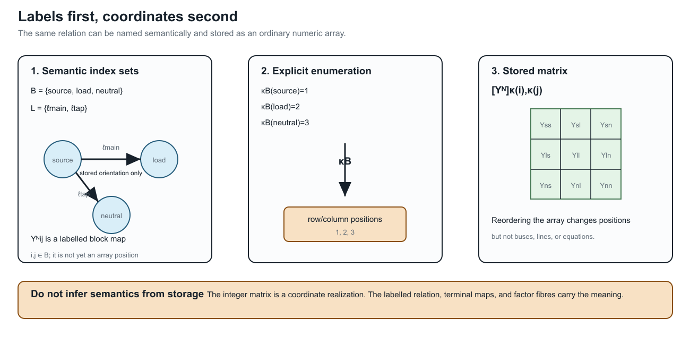
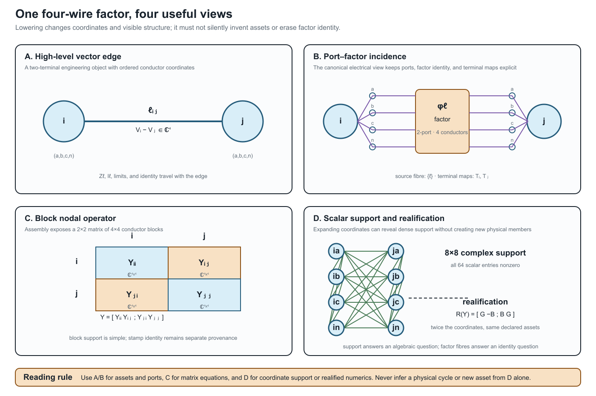

# [How to read power-network diagrams and equations](@id how-to-read-diagrams-and-equations)

**Page status:** introductory translation bridge; the examples are deliberately
small, while the terminology is used throughout the multiconductor chapters.

A power-network diagram is not a circuit equation, and a circuit equation is
not automatically a graph. Before interpreting an arrow, edge, node, or matrix
entry, ask three questions:

1. **What object is drawn?** An asset, a terminal, a port, a factor, a retained
   voltage coordinate, or an algebraic support relation?
2. **What quantity is attached to it?** A voltage, current, complex power,
   impedance, admittance, limit, state, or provenance identifier?
3. **What has already been compiled away?** Parallel-member identity, conductor
   coordinates, an internal transformer node, a neutral, or a decision state?

The same physical feeder can therefore have several faithful diagrams. The
diagram is a view with a declared semantic level, not an unqualified picture of
the network.

## A visual legend before the equations

The book uses familiar electrotechnical symbols where possible, but the symbol
does not carry the entire model. IEC 60617 is a symbol library and IEC 61082 is
a document-presentation standard; neither one determines the semantics of a
book-specific lowering or reduction. Read each maintained figure with this
legend:

| Mark | House meaning | Do not infer |
|:--|:--|:--|
| solid electrical connector | declared attachment in the displayed view | that the attachment is a physical conductor in every other view |
| double or bundled stroke | several ordered conductors | that phases or neutral may be discarded |
| dashed arrow | refinement, quotient, decomposition, or compilation map | physical power-flow direction |
| separate control arrow | tap, switch, protection, or decision relation | an extra series branch |
| grounding branch | explicit neutral/earth/reference connection | that the grounding can be absorbed without a guard |
| ``x_1`` or ``\ell i j`` label | persistent source identity | an array coordinate or a flow sign |
| pole/state label such as ``\sigma_a`` | per-conductor or per-pole operating state | one scalar open/closed state for the whole asset |
| ``\lambda_{ij}`` factor label | computational coupling with declared provenance | a physical line, outage asset, or ownership edge |

Single-line diagrams answer “which equipment and terminal-level connections are
present?” Multi-line diagrams answer “which conductors, neutral paths, and
terminal connections are present?” A factor or equation view answers “which
constitutive relation is being assembled?” A compiled graph answers “what does
this particular algorithm receive?” These are related views, not successive
truth values.

When a figure expands a transformer, line, regulator, or switch, look for the
identity fibre and the omitted-semantics note before interpreting a new edge.
For example, a complete graph of pairwise transformer leakage factors may be a
faithful equation decomposition while still being the wrong graph for asset
outages or ownership. The same warning applies to a nodal-support graph whose
edges record algebraic coupling rather than physical lines.

The high-risk cases are collected in the [special semantic overlays](@ref
special-semantic-overlays) plate in the foundations section: neutral grounding,
nominal-``\pi`` shunts, phase-selective switching, and ``n``-winding leakage
factors. When one of these appears compressed into a single-line symbol, look
for the state scope and edge provenance in the caption or map certificate.

## The scalar circuit in one minute

For a scalar branch stored from ``i`` to ``j``, write the voltage difference

```math
\Delta v_{\ell ij}=v_i-v_j.
```

Ohm's law, or the branch constitutive relation, is

```math
i_{\ell ij}=y_\ell\Delta v_{\ell ij},
\qquad y_\ell=z_\ell^{-1}.
```

This equation says how the branch responds to its terminal voltages. It does
not say that current must flow from ``i`` to ``j`` in operation: the computed
complex current may have either sign or phase. The stored order ``\ell ij`` is
an index convention, consistent with the BMOPFTools-style notation used in
this book.

Kirchhoff's current law (KCL) is a balance at a node. With currents defined as
entering the node, one possible convention is

```math
\sum_{e\in\delta(i)} i_{e\to i}+i_i^{\mathrm{inj}}=0.
```

The signs change if the convention changes; the physical balance does not.
Kirchhoff's voltage law (KVL) says that the oriented voltage differences sum
to zero around a compatible closed circuit path. In a nodal formulation this
is usually enforced indirectly by assigning one voltage to each retained node
and deriving every branch drop from endpoint voltages. A cycle in a matrix
support graph is not automatically such a physical circuit path.

These three statements have different jobs:

| Statement | Role | What it does not define |
|:--|:--|:--|
| Ohm/constitutive law | element behaviour | asset identity or operating direction |
| KCL | balance at a junction | which graph view produced the junction |
| KVL | compatible voltage differences around a circuit loop | a cycle in every derived support graph |

## Labels are not coordinates

The subscripts in a power-network equation are semantic labels first and array
positions second. A bus may be named ``source``, ``load``, or ``i_\mathrm{north}``,
and a line may be identified by ``\ell_\mathrm{main}``; neither name is required
to be a consecutive integer. Software normally enumerates those labels so that
it can store an ordinary array. That enumeration is a coordinate chart, not a
change in the network.

For example, begin with the labelled bus set

```math
\mathcal B=\{\text{source},\text{load},\text{neutral}\},
\qquad
\kappa_{\mathcal B}:\mathcal B\overset{\sim}{\longrightarrow}\{1,2,3\}.
```

The semantic nodal blocks are ``\mathbf Y^{\mathrm N}_{ij}``, with
``i,j\in\mathcal B``. After choosing ``\kappa_{\mathcal B}``, a software array
stores the same block as

```math
\bigl[\mathbf Y^{\mathrm N}\bigr]_{\kappa_{\mathcal B}(i),\kappa_{\mathcal B}(j)}
 =\mathbf Y^{\mathrm N}_{ij}.
```

The familiar integer-indexed matrix is therefore a realization of a
label-indexed operator family. Reordering the array changes positions, not
the buses or the physical relation. The same rule applies to the signed
edge--cycle matrix: its semantic entries are ``A_{i\ell}`` and
``C_{\ell\gamma}`` for ``i\in\mathcal B``, ``\ell\in\mathcal L``, and
``\gamma\in\Gamma``; an implementation may enumerate all three sets before
performing ordinary matrix multiplication.



This is why ``\mathbf Y_\ell`` (an element-intrinsic matrix),
``\mathbf Y^{\mathrm N}_{ij}`` (a bus-to-bus block), and
``[\mathbf Y^{\mathrm N}]_{\kappa(i),\kappa(j)}`` (an array position) should
not be read as interchangeable notation. In the scalar case a block may be
one number; in the multiconductor case it is generally a matrix.

## The same line with multiple conductors

For a four-wire line, the scalar voltage and current become ordered vectors:

```math
\mathbf U_i=[U_{i,a},U_{i,b},U_{i,c},U_{i,n}]^{\mathsf T},
\qquad
\mathbf I_{\ell ij}
=\mathbf Y_\ell
\left(
\mathbf U_i[\mathbf N_{\ell i}]
-
\mathbf U_j[\mathbf N_{\ell j}]
\right).
```

The matrix ``\mathbf Y_\ell`` may be dense. Its off-diagonal entries represent
mutual coupling between conductor coordinates; they are not extra physical
lines. A vector-valued edge is therefore a useful bridge phrase for a
two-terminal multiconductor factor, but it is not a new canonical graph class.
The precise source object remains a typed attributed multigraph edge with
vector terminal spaces and matrix-valued constitutive data.

When a device has three or more ports, the bridge phrase stops being adequate:
retain a typed port--factor relation. A multiwinding transformer is one factor
with several port bundles until a guarded compilation explicitly creates a
two-terminal realization.



The four panels are deliberately paired. Panels A and B are the useful places
to ask *which asset or factor is present*; panel C is the natural place to write
the assembled block equation; panel D is a coordinate-level support or solver
view. The dense lines in D are algebraic coupling, not a claim that the source
contains that many physical branches. This scoped correspondence is checked by
the executable witness registered as `ARCH-BLOCK-001`.

## What a lossy edge looks like

Power engineers often draw an edge and imagine power flowing through it as one
quantity. A circuit model normally computes terminal currents first, then
complex power at each terminal, for example

```math
S_{\ell ij}=\operatorname{diag}(\mathbf U_i[\mathbf N_{\ell i}])
\mathbf I_{\ell ij}^{*}.
```

Series impedance, endpoint shunts, mutual coupling, and grounding can all make
the two terminal powers differ. Even the terminal currents need not be simple
negatives when shunts are present. A lossy edge is not a violation of graph
theory; it is a constitutive factor with nonzero dissipation or local exchange.
If a diagram shows one line with a ``\pi`` model, decide whether its shunts are
inside the factor or drawn as separate factors before comparing currents or
limits.

## Reading scalar, vector, and block notation

The following translation is safe only when the qualifiers are retained:

| Diagram or phrase | Mathematical reading | Main qualifier |
|:--|:--|:--|
| scalar edge ``i--j`` | one voltage coordinate at each endpoint | positive-sequence or single-conductor scope |
| vector-valued edge | ``\mathbf Z_\ell`` or ``\mathbf Y_\ell`` acts on ordered conductor coordinates | still a two-terminal factor |
| vector-valued node | bus ``i`` owns an ordered terminal space ``\mathbf U_i`` | terminals may be missing, permuted, or grounded |
| block nodal matrix | ``\mathbf Y^{\mathrm N}_{ij}`` maps one bus-terminal block to another | block support is not an asset multigraph |
| scalar-expanded support graph | each conductor coordinate is a vertex | cycles mean algebraic coupling, not necessarily physical loops |
| realified model | real and imaginary coordinates are stacked | doubled coordinates are not doubled assets |

The report by Geth, Claeys, and Heidari gives a practical four-wire example of
this translation: series impedances and shunts are matrices, current-injection
methods are centered on a nodal-admittance representation, and radial
backward--forward sweep uses a different impedance-oriented computational
view [GethClaeysHeidari2023](@cite). Those are alternative formulations of the
same declared circuit model, not competing definitions of what a bus or line
is.

## A diagram-reading checklist

Before using a graph in a proof, algorithm, or optimisation model, annotate it
with:

- **level:** asset, equipment/terminal, port--factor, equation, block support,
  or scalar support;
- **coordinates:** scalar, phase/neutral vector, sequence, rectangular real,
  or another declared basis;
- **orientation:** stored terminal order, sign convention, or actual control
  direction;
- **constitutive scope:** series only, nominal-``\pi``, transformer, shunt,
  grounding, nonlinear load, or an n-port relation;
- **preservation:** identities, KCL/KVL/terminal behaviour, limits, decisions,
  and provenance that remain available;
- **loss:** what has been summed, eliminated, projected, realified, or made
  implicit.

This checklist is the short route into the longer [two topology levels and the
nodal projection](@ref two-level-topology-and-nodal-projection) chapter. There
the same distinctions are stated as maps between typed objects and block
operators rather than as visual intuition alone.
