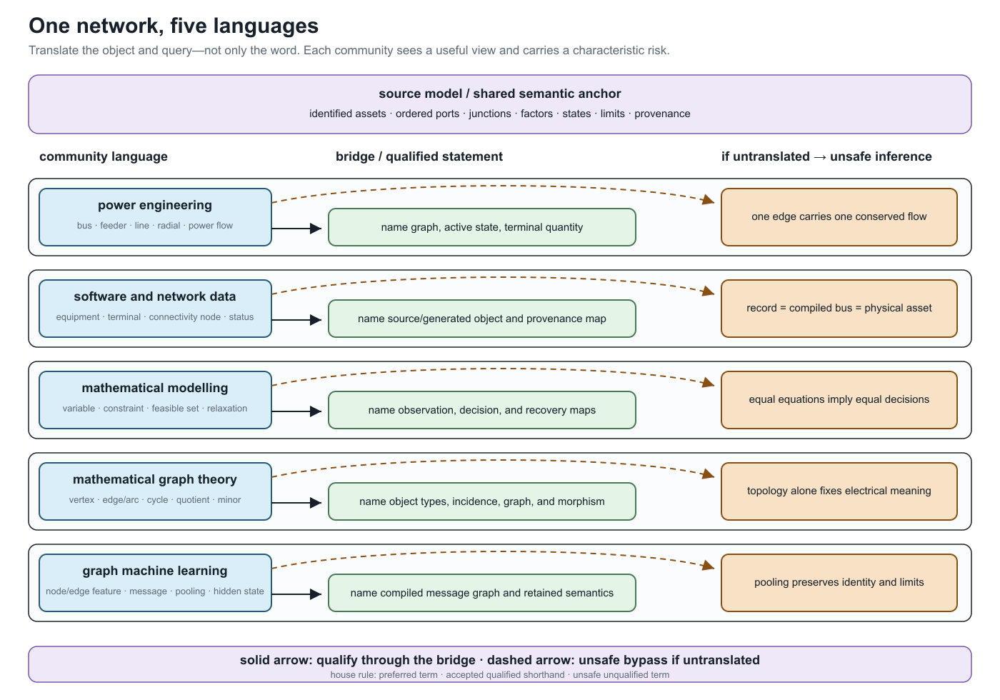

# [One network, five languages](@id one-network-five-languages)

**Page status:** explanatory cross-community vocabulary bridge; not a standards crosswalk.

The communities that work on power networks often use the same word for
different objects, and different words for nearly the same object. This is
more than a stylistic inconvenience. If *edge*, *state*, *flow*, or
*equivalent* changes meaning halfway through an argument, a correct statement
about one representation can become a false statement about another.

This book therefore uses a **bridge vocabulary**. It does not ask readers to
abandon familiar language. It asks them to qualify a familiar term when that
term carries mathematical, physical, software, or decision meaning.

## The running network in five dialects

Consider the same multiconductor network with parallel circuits, explicit
neutral and grounding, phase-selective switches, limits, and a multiwinding
transformer. Each community has a useful description of it:

- **Power engineering:** buses, feeders, lines, transformers, radial operation,
  and power flow support physical interpretation and operating practice. The
  graph, terminal sign, device boundary, and active state may remain implicit.
- **Power-system software and data:** equipment records, terminals,
  connectivity nodes, statuses, profiles, and compiled buses support exchange,
  topology processing, and provenance. A record may represent a physical
  asset, generated object, or equation object.
- **Mathematical modelling and optimization:** variables, constraints,
  parameters, feasible sets, objectives, and relaxations support decision
  semantics and formal comparison. Source identity and physical recovery may
  be outside the formulation.
- **Mathematical graph theory:** vertices, edges, arcs, multigraphs,
  incidence, cycles, quotients, and minors support structural theorems and
  algorithms. The physical referent and load-bearing attributes must be added.
- **Graph machine learning:** heterogeneous nodes and edges, features, message
  passing, pooling, embeddings, and hidden states support learned computation.
  Parallel identity, n-port structure, limits, and physical state survive only
  when the compiled graph and feature maps retain them.

None of these descriptions is the universal one. The bridge is the typed map
from a community's phrase to the object and query meant in this book.

Circuit theory is not counted as a sixth target community in this route. Its
language of nodes, branches, ports, multiports, incidence, tableau equations,
and equivalents is a shared technical inheritance of power engineering and
mathematical modelling, and part of the precise target vocabulary used here.
Its own translation failures remain important; they are developed in
[Translation traps](@ref translation-traps) and [Circuit formulations and the
lowering boundary](@ref circuit-formulations-and-lowering).

## Translation is not word substitution

For each community term, the relation to the book's term should be classified
before it is reused:

- **Exact alias:** interchangeable under the declared scope. For example,
  `Ybus` can be an alias for the declared nodal operator after its coordinate
  order and model class are fixed. The alias is to that operator, not to the
  source network or factor decomposition that assembled it.
- **Scoped alias:** conventional shorthand that is safe only with a qualifier.
  The sentence *branch ``\ell`` has stored reference orientation ``\ell ij``*
  is safe; *branch ``\ell`` is directed from ``i`` to ``j``* is not safe if it
  can be read as an operating-flow or one-way-admissibility claim.
- **Broader or narrower term:** one term contains distinctions omitted by the
  other. A physical line can contain several homogeneous model sections.
- **Representation-dependent term:** its referent changes with the selected
  view. *Node*, *edge*, *cycle*, and *radial* are the leading examples.
- **False friend:** the words coincide but the concepts do not. Electrical
  loss is not an ML loss; a GNN message is not a conserved power flow.

These labels are deliberately asymmetric. A term can be acceptable when
reading a source and still be too weak to use in a preservation claim.

## The collision set to learn first

### Objects

**Bus, node, vertex, junction, terminal, and port** must not be collapsed into
one noun. A bus may mean a busbar section, a connectivity node, a
state-dependent topological node, a group of nodal variables, or a reporting
aggregate. A graph vertex is whatever the declared graph makes a vertex. A
port is a typed component interface; a junction supplies interconnection and
conservation semantics.

Likewise, **line, branch, edge, arc, relation, and matrix nonzero** do not share
one identity. A line ``\ell`` owns intrinsic equipment or model data. The
oriented triple ``\ell ij`` orders its terminals. An edge in a support graph
records algebraic coupling and may have no one-to-one physical asset.

An especially important collision is **factor**. Here it means a typed
constitutive, control, measurement, limit, or decision relation over ports. It
does not mean power factor or matrix factorization, although the same factor
may become a node in a factor graph.

### Electrical coordinates and reference

**Ground, earth, neutral, grounding impedance, and voltage reference** are not
names for one zero-voltage node. Earth can be a physical return medium; a
neutral is a conductor with a state and current; a grounding impedance is a
factor between declared terminals; and a voltage reference removes gauge
freedom. Eliminating a neutral coordinate does not eliminate its recovered
current or a limit on that current.

**Phase, conductor, terminal coordinate, and sequence** also name different
structures. A conductor is a physical or modelled path, a terminal coordinate
is one ordered component of an interface vector, and a sequence component is
a transformed coordinate. *Phase ``a``* may refer to an asset label, a bus
terminal, a voltage coordinate, or a phase-domain component; the terminal and
coordinate maps decide whether those uses coincide.

### Structure and state

**Graph, topology, adjacency, parallel, cycle, tree, and radial** require a
named representation and usually an active state. A simple bus projection, an
identified asset multigraph, a conductor-coordinate support graph, and a GNN
message graph can give different answers for the same source network.

**State** is also overloaded. It can mean continuous electrical state
variables, discrete equipment status, an operating scenario, an estimator
state, or an ML hidden representation. The book uses a modifier whenever two
of these meanings are in scope.

### Quantities and computation

**Direction** may mean stored orientation, terminal-current sign, observed
power transfer, rooted-tree order, causal dependence, one-way admissibility,
or message direction. None implies the others.

**Flow** may mean a conserved commodity variable, internal series current,
terminal current, terminal complex power, an operating transfer, or a learned
message. A lossy AC device generally exposes a tuple of terminal powers rather
than one antisymmetric edge-flow scalar.

**Limit, rating, and constraint** occupy different layers. A rating is an
equipment or operational datum; a mathematical constraint is a particular
encoding of admissibility; whether that constraint binds belongs to an
operating point or solution.

### Transformations and evidence

**Projection, compilation, lowering, elimination, aggregation, reduction,
coarsening, and pooling** are not interchangeable ways of saying *make the
graph smaller*. Compilation can make a graph larger. Elimination can create
fill. Pooling can erase member identities required by a decision problem.

**Equivalent, exact, and structure preserving** are incomplete until their
object is named. The relevant claim may concern an algebraic identity,
boundary behaviour, topology, feasible decisions, objective value, limits,
measurements, numerical sparsity, or provenance.

Two cross-community false friends deserve permanent warnings:

- **normalization** can mean per-unit conversion, conductor-coordinate
  canonicalization, schema normalization, or ML feature scaling;
- **loss** can mean electrical dissipation, information discarded by a map,
  or an ML training objective.

## [House policy: familiar words with explicit qualifiers](@id vocabulary-house-policy)

The five relation classes above classify the **map between vocabularies**. The
three statuses below classify **how a term may be used in this book**. They are
orthogonal: a false friend is often unsafe, but a representation-dependent
term can be accepted shorthand once its representation is named.

The book uses three vocabulary statuses (`VOCAB-BRIDGE-001`):

1. A **preferred house term** is used in definitions, claims, contracts, and
   executable artifacts.
2. An **accepted qualified shorthand** is retained when it helps a community
   read naturally and its scope is stated nearby.
3. An **unsafe unqualified term** is accompanied by the missing
   representation, quantity, state, or preservation object.

For example, *radial feeder* remains useful prose. A load-bearing statement is
written as *the active simple bus projection is a tree in state ``\sigma``*.
Similarly, *power flow on line ``\ell``* is replaced in an equation or limit
claim by the relevant terminal observation ``\mathbf S_{\ell ij}`` or
``\mathbf S_{\ell ji}`` and its sign convention.

The recurring **Vocabulary bridge** callout belongs to this policy. It marks a
local crossing between community language and the house vocabulary; it must
name the missing object or qualifier and the inference that would otherwise be
unsafe.

## Three worked translations

> **Community phrase:** Power flows downstream on each edge of the radial
> feeder.

A testable translation names (i) the active bus-level graph, state, and root
that define the parent relation; (ii) the oriented terminal at which active
power is measured; and (iii) the fact that its sign is an operating result.
It does not infer member-radiality, losslessness, or permanent upstream and
downstream asset labels.

> **Community phrase:** Pool the parallel edges and run message passing on the
> network graph.

A testable translation names the computational graph and pooling map, then
asks whether line identity, outage state, member limits, conductor
coordinates, and recovery are inputs to the downstream query. If they are,
the pooled graph needs side information or is not a sufficient representation
for that task.

> **Community phrase:** Ground the neutral, then remove the neutral node.

A testable translation separates the neutral conductor, its connections, each
grounding impedance or earth-return factor, and the gauge reference. It then
names whether *remove* means a topological projection, a fixed linear Kron
elimination, or omission from the source model. If the neutral is eliminated,
the recovery map must still evaluate every retained neutral-current,
grounding, protection, and decision constraint in the declared domain.

## Where to go next

The [Translation traps](@ref translation-traps) chapter develops the most
dangerous false inferences. [Representation taxonomy](@ref
representation-taxonomy) defines the graph families, [Notation and modelling
conventions](@ref) fixes semantic ownership and indices, and the maintained
[Terminology](@ref) page provides the compact lookup vocabulary. The generated
[cross-community vocabulary indexes](@ref vocabulary-indexes) support both
community-to-book and book-to-community lookup. The later preservation-contract
chapters turn these linguistic qualifications into mathematical obligations.
