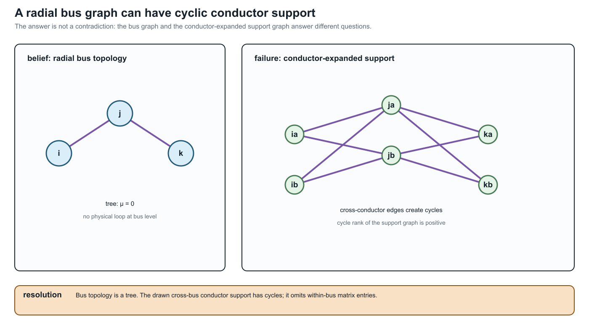

# [One network, many graphs](@id one-network-many-graphs)

**Page status:** explanatory synthesis introducing the representation landscape.

Calling something *the network graph* hides the modelling decision that produced it. The same
physical power network can yield several non-isomorphic structures, each correct for some questions
and inadequate for others.

!!! warning "Power-system shorthand"
    Treat *the network graph* as an omitted noun phrase. Ask whether the
    sentence means an asset graph, active topology, terminal-connectivity
    graph, bus--branch multigraph, factor incidence graph, or equation/sparsity
    graph.

## A deliberately difficult network

The running network for this book contains ordered conductor terminals, an explicit neutral and
grounding impedance, heterogeneous parallel lines, switchgear, and a genuinely multiwinding
transformer. It also contains limits and controls used in a decision problem. Its complete semantic
specification is given in [The running multiconductor network](@ref).
Its first numerical realization and the six illustrated views described below are given in
the [Executable running network](@ref).

The representation-scoped meanings of cycles, parallelism, bridges, leaves,
and radial ends are developed in
[Cycles, parallelism, and radial structure](@ref cycles-parallelism-radiality).

The first surprise is not a new device; it is a change of graph. At the bus
level the feeder can be radial, while dense multiconductor stamps create
cliques—and therefore cycles—in the scalar support graph used by a matrix
algorithm:



The resolving phrase is **which graph?** Bus-level radiality is a statement
about equipment connectivity. Support-graph cycles are a statement about
algebraic coupling. The latter can still be chordal and admit useful leaf-clique
elimination; it is not evidence of an additional physical loop.

Nothing exotic is required to create representational disagreement. Parallel lines already show
the issue. If two branches ``\ell_1`` and ``\ell_2`` connect buses ``i`` and ``j``, a multigraph
retains both triples

```math
\ell_1ij,\ \ell_2ij\in\mathcal T^{L\rightarrow}.
```

A simple graph retains only the adjacency ``i\sim j``. A weighted simple graph might store

```math
\mathbf Y_{ij}^{\mathrm{eq}}
=\mathbf Y_{\ell_1}+\mathbf Y_{\ell_2},
```

but this does not by itself retain individual current limits, outages, maintenance states,
ownership, or investment choices.

## Six useful views

### Asset view

The asset graph distinguishes each line, winding, switch, grounding device, measurement, and owner.
It supports questions such as *which circuit is unavailable?* and *which construction record
produced this impedance?* It need not contain the virtual buses introduced by an OPF formulation.

### Terminal-connectivity view

This view records ordered bus terminals and the maps by which element conductors attach to them. It
can distinguish phase ``a`` from a neutral and can represent a conductor permutation between the
ends of a line. It is the natural place to resolve switchgear and grounding connectivity.

### Bus--branch multigraph

Buses are vertices and identified two-terminal elements are edges. Parallel circuits remain
distinct. This view is effective when the device vocabulary is genuinely two-terminal or when
multi-terminal devices have been compiled into an equivalent network with explicit provenance.

### Port--factor view

Ports carry terminal variables and factors impose constitutive, limit, control, or measurement
relations. A multiwinding transformer can remain one factor with one port bundle per winding. The
number of ports is not forced to two.

### Equation or optimization view

Variables and constraints form a bipartite graph, or blocks form a computational dependency graph.
This view exposes separability, coupling, and decomposition opportunities. An auxiliary variable
created for numerical convenience becomes a graph vertex even though it is not a physical object.

### Matrix sparsity view

The nonzero pattern of an admittance, Jacobian, KKT, or Schur-complement matrix defines another
graph. Elimination may reduce the number of variables while making this graph denser. A sparsity
edge means algebraic coupling, not necessarily a physical branch.

## Different questions select different views

| Question | Required retained meaning | A useful view |
| --- | --- | --- |
| Are two assets independently switchable? | member identity and switch state | asset graph or multigraph |
| Which conductors share a junction? | ordered terminals and terminal maps | terminal-connectivity model |
| What is the boundary current response? | constitutive relation at retained ports | port--factor or admittance model |
| Which constraints determine the OPF optimum? | feasible set, controls, objective | optimization model |
| Which variables should be eliminated first? | numerical nonzero structure | sparsity graph |
| Can a result be mapped to the source data? | provenance and recovery | linked source and generated views |

The views are not arranged in a universal hierarchy. The asset graph may know more about ownership
and less about electrical variables than a compiled optimization graph. Expressiveness is relative
to the declared question.

## The first preservation test

Suppose each parallel line obeys

```math
\mathbf I^{\mathrm s}_{\ell ij}
=\mathbf Y_\ell
\bigl(\mathbf U_i[\mathbf N_{\ell i}]
-\mathbf U_j[\mathbf N_{\ell j}]\bigr)
```

and has a conductor-current feasible set ``\mathcal C_\ell``. Aggregating admittance preserves the
sum of terminal series currents, but the source feasible voltage differences satisfy

```math
\left\{\Delta\mathbf U:\
\mathbf Y_\ell\Delta\mathbf U\in\mathcal C_\ell
\quad\forall\ell\right\}.
```

A single conventional edge limit need not reproduce this intersection. The transformation can be
exact for one observation and wrong for a decision problem. This is why the book asks for a
[Preservation contracts](@ref preservation-contracts) rather than calling a smaller graph simply *equivalent*. [A first
failure: heterogeneous parallel branches](@ref first-failure-parallel-branches) gives an analytic witness and executable
certificate.

## The route through the book

Before the formal taxonomy, [One network, five languages](@ref
one-network-five-languages) translates the recurring terms used by power
engineers, software and data experts, mathematical modellers, graph theorists,
and graph-machine-learning readers. The [Representation taxonomy](@ref representation-taxonomy) separates the major model families. [Notation and modelling
conventions](@ref) fixes the element, arc, terminal, and winding indices. [Representation
architecture](@ref) presents the proposed linked reference architecture. The transformation parts
then ask which views can be derived, under what guards, and with what consequences for feasible
decisions. [Five buses through a multi-port lowering](@ref
five-bus-transformer-lowering) is the compact bridge from these view names to
an explicit three-winding compilation and loss ledger.
