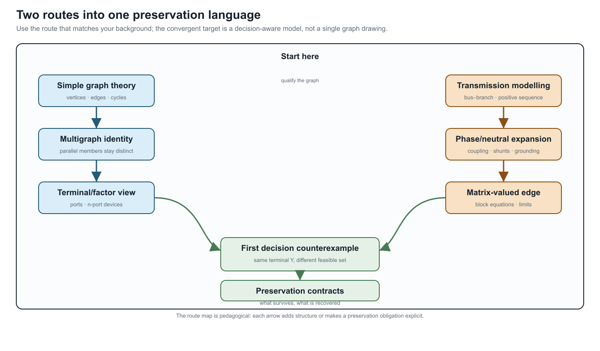

# [Reading guide: from simple graphs and transmission models to multiconductor networks](@id reading-guide-graph-and-transmission)

**Page status:** audience-specific route map; the formal definitions and
executable evidence remain in the linked foundation and case chapters.

This book has two common starting points. A graph reader brings vertices,
edges, incidence, cycles, and sparsity. A power-system reader brings a
balanced bus--branch model, often in positive sequence. Both are useful
specializations. Neither is the full multiconductor power-network model.

Choose a route below, then join the shared path at the four-wire relation and
the first decision counterexample.

## Two routes into one language

| Starting point | Familiar model | First qualification | Shared question |
|:--|:--|:--|:--|
| Simple graph theory | vertices, edges, paths, cycles, incidence | an electrical factor can be vector-valued, and a support cycle need not be a physical loop | which graph, coordinates, and identities are retained? |
| Balanced transmission modelling | one complex relation per bus pair, often positive sequence | phase/neutral coordinates, coupling, shunts, grounding, ports, and limits may have been collapsed | which assumptions and decision constraints make the specialization valid? |

## If you come from simple graph theory

Follow this short sequence:

1. **Edge → terminal relation.** A scalar branch may satisfy
   ``i_{\ell ij}=y_\ell(v_i-v_j)``. A four-wire factor instead maps ordered
   terminal spaces:
   ``\mathbf I_{\ell ij}=\mathbf Y_\ell(\mathbf U_i[\mathbf N_{\ell i}]-\mathbf U_j[\mathbf N_{\ell j}])``.
   The identity ``\ell`` and attachment triple ``\ell ij`` are not matrix
   coordinates.
2. **Vertex → terminal space.** A bus can own phase and neutral terminals, so
   one graph vertex may represent a block of variables. A dense block records
   coupling; it does not create one asset per nonzero entry.
3. **Simple projection → identified multigraph.** Parallel members retain
   separate ratings, states, owners, and outage decisions even when their
   unconstrained admittances add.
4. **Cycle → qualified cycle.** Member cycles, simple-quotient cycles,
   port--factor cycles, and scalar support cycles answer different questions.
5. **Edge → factor.** A three-winding transformer is one typed factor with
   three port bundles. A star or clique is a derived lowering target, not an
   automatic replacement.

Then read [Five-bus cycle spaces](@ref five-bus-cycle-spaces), [Five buses
through a multi-port lowering](@ref five-bus-transformer-lowering), [Two
topology levels and the nodal projection](@ref
two-level-topology-and-nodal-projection), and [Circuit formulations and the
lowering boundary](@ref circuit-formulations-and-lowering).

## If you come from balanced transmission modelling

Use this sequence to unpack the familiar model without discarding it:

1. **Positive sequence is a specialization.** Ask which balance, transposition,
   grounding, and frequency assumptions justify it for the study.
2. **Expand one edge first.** Move from scalar edge to four-wire matrix edge,
   then to a port--factor relation and a block nodal operator. At each step
   record added coordinates, coupling, shunts, terminal maps, and decisions.
3. **Requalify flow.** A lossy AC factor has terminal currents and powers;
   endpoint shunts and grounding can make the two terminal observations
   different. Stored orientation fixes signs, not operating direction.
4. **Keep eliminated quantities accountable.** Kron reduction can preserve a
   boundary voltage relation while removing neutral current, grounding, or
   protection constraints from the reduced problem unless they are recovered.
5. **Promote transformers to factors.** Multiwinding devices, connection maps,
   internal grounding, and controls may require a typed factor or tableau/MNA
   target rather than an ordinary branch.
6. **Treat radial language as conditional.** Upstream/downstream belongs to a
   selected active rooted tree; switching and meshing can invalidate it.

Then read [When the general model collapses](@ref positive-sequence-collapse),
[From conductor geometry to impedance fidelity](@ref
impedance-fidelity-ladder), [A first failure: heterogeneous parallel branches](@ref
first-failure-parallel-branches), and [Kron, Ward, and optimized network
equivalents](@ref kron-ward-opti-kron).

## The shared convergence point

Both routes meet at one preservation question:

> What does this representation preserve for the observation, constraint, and
> decision I care about?

The deliberately small counterexample is two identified parallel branches:
their terminal admittances can sum exactly while their individual current
limits produce a different feasible set. Continue with [Preservation
contracts](@ref preservation-contracts) and [Translation traps](@ref
translation-traps) whenever *edge*, *flow*, *radial*, or *equivalent* appears
without a qualifier.

The practical checklist is short: name the objects and index meanings; state
the coordinates and graph view; distinguish stored orientation from operating
transfer; and write the preservation target (behaviour, limits, decisions,
objectives, recovery, or provenance). This is enough to let both communities
share notation without treating either starting graph as the universal
ontology.
