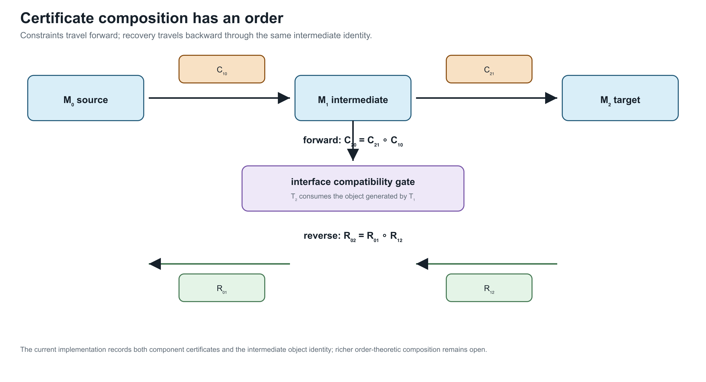

# [Certificate schema and composition](@id certificate-schema-composition)

**Page status:** versioned certificate schema and composition contract;
associativity and richer interface compatibility remain open.

A transformation result is useful only if downstream work can determine what
it means. Version 1.1.0 of the book's transformation-certificate interface is
defined by `schemas/transformation-certificate.schema.json`.

## Common interface

| Field | Role |
|:--|:--|
| `certificate_id`, `rule_id` | stable claim identity and applied rule |
| `classification` | exact normalization, exact compilation, exact behavioural reduction, inner restriction, outer relaxation, scenario approximation, or mixed |
| `source`, `target` | model categories and object identities |
| `interfaces` | typed source/target contracts for states, constraints, decisions, objectives, units, and boundary quantities |
| `typed_interfaces` | crosswalk from the certificate-local labels to the checked state-space/unit vocabulary |
| `preconditions` | conditions under which the classification holds |
| `preserves`, `forgets` | the semantic contract |
| `constraint_map` | forward transport of declared constraints |
| `recovery_map` | reconstruction of source quantities from target results |
| `provenance` | source-to-target lineage and implementation context |
| `evidence` | derivation data, witnesses, permutations, or computed results |

JSON-schema validity establishes a structural contract. It does not prove that
the reported classification or equations are true. Those remain claims that
need derivation, tests, and independent review.

## Sequential composition

Let exact transformations be

```math
\mathcal M_0\xrightarrow{T_1}\mathcal M_1
\xrightarrow{T_2}\mathcal M_2.
```

The implemented composition accepts the pair only when an object generated by
``T_1`` is explicitly consumed by ``T_2``. Constraint maps execute in the
forward order,

```math
C_{20}=C_{21}\circ C_{10},
```

whereas recovery maps execute in reverse order,

```math
R_{02}=R_{01}\circ R_{12}.
```

The composite retains the untouched sources of ``T_2``, the original sources
of ``T_1``, both component certificate identities, and the intermediate object
identity. Non-exact component rules are rejected for now because composing
inner, outer, and mixed approximations requires a more explicit order-theoretic
calculus.

Composition also carries the six interface contracts and, when present, the
typed crosswalk from the first source to the second target. This is a trace,
not yet a proof of compatibility: the
current rule records both component relations but still uses generated/source
object identity as its executable meeting check.



The intermediate identity is the meeting point: constraints compose forward, while recovery reverses the transformation order.

## Normalization followed by elimination

The executable example first normalizes ``\ell_2 b j`` from ``(n,a)`` to
``(a,n)`` and then eliminates the zero-injection junction between
``\ell_1 i b`` and the normalized element. The composed certificate records:

1. the permutation as the first forward step;
2. series constraint intersection as the second forward step;
3. junction recovery before inverse coordinate recovery; and
4. the unnormalized source identities ``\ell_1``, ``\ell_2``, and ``b``.

This is claim `TR-COMP-001`. The `experiments/generated` directory contains
both the composed normalization/series certificate and the standalone series
certificate.

## Version 1.1 boundary

Version 1.1 makes six interface categories mandatory. Each category records a
source list, a target list, and the relation between them. Empty lists are
allowed and meaningful: for example, a fixed-parameter leakage compilation
declares that it introduces no tap or investment decision. The fields are
typed by role but their individual entries are still prose rather than a
formal state-space or unit algebra. The optional `typed_interfaces` extension
now binds the generated certificates to
`experiments/generated/state-space-unit-witness.json`: it records the mapped
unit families, variable and boundary labels, state-domain IDs, and any unit
labels that remain unresolved. The build checker requires this attachment on
all sixteen public certificate artifacts, while the schema keeps it optional
for older external certificates.

The schema does not yet type uncertainty sets or prove that composed interface
relations are compatible. Nor does it establish associativity modulo
serialization. Those extensions should be driven by the grounding, switch,
and larger OPF case studies. Current Julia generators attach the crosswalk
through `TransformationContracts.attach_typed_interfaces`; the Python helper
is retained only for migration of older generated artifacts.

## Release-oriented semantic matrix

The generated
`experiments/generated/semantic-evaluator-matrix.json` binds each of the
sixteen public certificate artifacts to the Julia evaluator source, its
semantic test file, and the evaluator symbol or rule name. Each row checks
that source and target identities, typed unit coverage, the canonical state
space witness, evaluator provenance, and nonempty evidence are all present.
The package test matrix reads these rows in addition to validating the
certificate structure. This is a release traceability contract, not a claim
that all evaluators share one numerical backend: the rows intentionally span
package-independent algebra, BMOPFTools cross-checks, and JuMP/Ipopt cases.

The release gate additionally runs the public facade, typed state-space tests,
and this 16-certificate matrix from a separately instantiated package
checkout. The pinned result is recorded in
`experiments/generated/clean-package-matrix.json`; it is a package-isolation
check, not a claim that the full research fixture has no external dependency.
