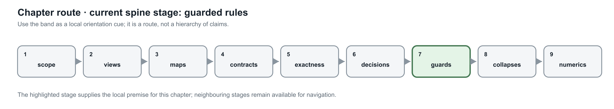
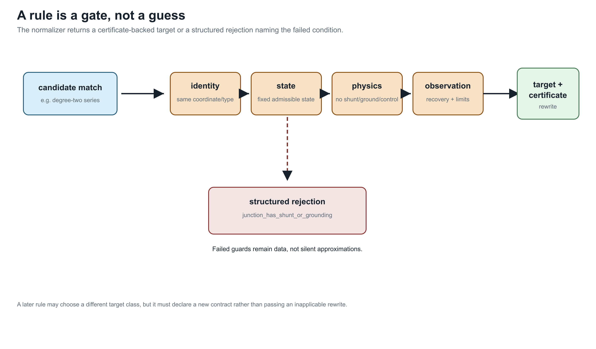

# Guarded normalization rules

**Page status:** candidate rule catalogue; individual rules require explicit certificates.

This chapter begins a catalogue of candidate rules. Each rule distinguishes
physical normalization from more general behavioral reduction.





The catalogue’s central operational rule is refusal with a structured reason when a guard fails; a candidate is never silently approximated.

## Canonical conductor coordinates

Before comparing or composing multiconductor elements, normalize:

- terminal orientation;
- conductor labels and ordering;
- phase and neutral identity;
- voltage and current reference directions;
- units and base quantities;
- matrix permutation under terminal relabeling.

For a conductor permutation matrix ``P``, a series impedance matrix transforms
as

```math
Z' = P Z P^\mathsf{T}.
```

Equality of raw matrices without equality of conductor coordinates is not a
valid equivalence test.

## Degree-two series elimination

Consider a middle connectivity object ``b`` joining two series-only
multiconductor elements:

```math
v_a-v_b=Z_1i,
\qquad
v_b-v_c=Z_2i.
```

If there is no injection or shunt at ``b``, Kirchhoff conservation gives a
common current and hence

```math
v_a-v_c=(Z_1+Z_2)i.
```

### Behavioral rule

The elimination is exact for the series terminal relation when:

1. conductor sets and coordinate systems are compatible;
2. the middle object has no current injection;
3. there is no grounding, shunt, tap, control, or measurement relation there;
4. neither segment participates in an external mutual-coupling factor that the
   replacement omits;
5. eliminated variables and any constraints can be recovered or are outside
   the observation contract.

Different line construction codes do **not** invalidate this algebraic series
equivalence.

### Physical line-merge rule

Replacing the segments by a longer instance of one physical line type is a
stronger rewrite. Proposed guards include:

- same construction/line code after explicit overrides;
- same conductor material, geometry, ordering and transposition regime;
- same parameter model and frequency basis;
- compatible rating semantics and thermal model;
- no splice, joint, location, protection, ownership or maintenance boundary
  that the target application must retain;
- no midspan fault or outage state that remains independently selectable;
- a line model class closed under length concatenation.

If these guards fail, the correct result may be a typed
`CompositeSeriesBranch` with segment provenance—not a homogeneous line.

### Neutral grounding counterexample

If the neutral at ``b`` is grounded through ``Y_g``, then

```math
i_1-i_2=Y_gv_{b,n},
```

so the two line currents are not identical. Schur elimination may still produce
an exact terminal two-port, but its shunt and cross-terminal terms generally do
not belong to the original homogeneous line class. The grounding location and
asset identity also disappear. This should reject physical merging even when a
behavioral reduction remains available.

### Line charging and distributed models

Two sections of the same exact distributed-parameter line can be concatenated
through their transmission matrices. Two independently formed nominal-``\pi``
approximations do not generally reduce to the naïve nominal-``\pi`` model
obtained by summing all displayed parameters. Their cascade is a general
two-port and requires a closure proof or controlled re-approximation.

## Constraint transformation for series elements

When exactly the same conductor current traverses both series elements and the
current-feasible sets are ``\mathcal C_1`` and ``\mathcal C_2``, the exact
equivalent set is

```math
\mathcal C_{\mathrm{eq}}=\mathcal C_1\cap\mathcal C_2.
```

For independent upper current magnitudes this becomes the componentwise
minimum. It does not automatically handle terminal-MVA limits, dynamic thermal
ratings, emergency durations, direction dependence, or temperature states.
Those constraints should either be lifted through recovered internal variables
or preserved as residual source constraints.

## Parallel recognition and aggregation

Parallel assets should first be recognized as a **bundle** without destroying
membership. For linear branches,

```math
i_{\mathrm{total}}=\sum_eY_e\Delta v,
```

but each branch still has

```math
i_e=Y_e\Delta v.
```

An aggregate electrical factor can coexist with the bundle if it stores the
individual flow-recovery map and constraints. Destructive replacement is valid
only for an observation and decision contract that cannot distinguish bundle
members.

This is stricter than the practical `MergeParallel` operation offered by
OpenDSS [OpenDSSReduction](@cite). OpenDSS's reduction tools are important
evidence of engineering demand, but also show why application-level procedures
should not silently define the canonical data semantics.

## Switch contraction

An ideal closed switch can identify its endpoint junctions for a fixed state.
The rule must be rejected or qualified when:

- the switch is lossy or has nonzero impedance;
- its status is a decision variable;
- switch flow is measured or limited;
- protection or operational procedures refer to the switch;
- alternative states must be studied from the same model.

The quotient should retain a membership map from each derived bus to all source
connectivity nodes and switches.

## Multiwinding transformer compilation

A multiwinding transformer is naturally a multiport factor. A two-port-only
target formulation may compile it into ideal two-winding transformers,
internal buses, impedance branches and shunts. This is a semantics-preserving
realization only if it preserves:

- winding voltage/current conventions;
- vector group, polarity and phase displacement;
- short-circuit impedance data consistency;
- magnetizing and no-load losses;
- taps and their control ownership;
- per-winding ratings and terminal constraints.

Round-trip tests should verify that the compiled network's terminal relation
matches the source device and that source-level decisions map uniquely to the
virtual objects.

## Rewrite-system questions

Local rules can overlap. Merging two line segments before compiling grounding,
for example, may produce a different intermediate graph than compiling the
ground first. A scientific normalization system must study:

- termination of repeated rewrites;
- critical pairs and confluence;
- uniqueness only up to typed isomorphism;
- canonical selection when several electrically equivalent minimal networks
  exist;
- preservation of provenance under rewrite composition.

Electrical network equivalence already shows that a unique minimal graph need
not exist: series, parallel and ``Y``--``\Delta`` transformations can relate
distinct critical networks with the same boundary response. The inverse-network
literature provides the appropriate caution [CurtisMorrow2000](@cite), while
algebraic graph transformation provides tools for typed rules, critical pairs
and confluence [Ehrig2006](@cite).
