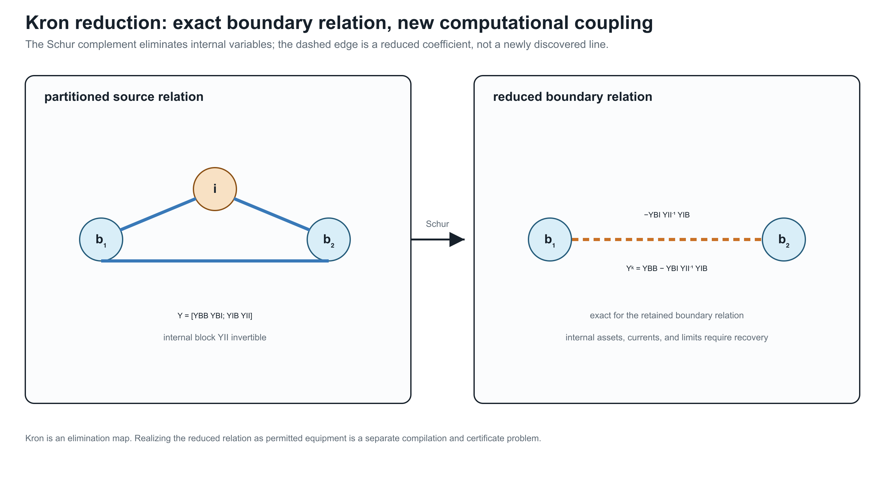

# [Kron, Ward, and optimized network equivalents](@id kron-ward-opti-kron)

**Page status:** scoped reduction definitions, audited literature synthesis,
and a package-independent Kron/Ward/scenario comparison; independent
mathematical review and source-faithful Opti-KRON implementation remain open.

## Three different questions

Kron reduction, Ward equivalents, and Opti-KRON are related, but they do not
make the same modelling choice:

```math
\boxed{
\begin{aligned}
\text{Kron: }&\text{which linear boundary relation results from elimination?}\\
\text{Ward: }&\text{how is the eliminated external system represented at the boundary?}\\
\text{Opti-KRON: }&\text{which nodes or clusters should be retained under an error objective?}
\end{aligned}}
```

All three require a declared source model, boundary, injection model, and
observation contract. None is inherently an asset-preserving transformation.

## Linear Kron reduction

Partition a linear nodal relation into retained boundary variables ``B`` and
eliminated internal variables ``I``:

```math
\begin{bmatrix}
\mathbf i_B\\
\mathbf i_I
\end{bmatrix}
=
\begin{bmatrix}
\mathbf Y_{BB}&\mathbf Y_{BI}\\
\mathbf Y_{IB}&\mathbf Y_{II}
\end{bmatrix}
\begin{bmatrix}
\mathbf v_B\\
\mathbf v_I
\end{bmatrix}.
```

**Proposition.** If ``\mathbf Y_{II}`` is invertible and ``\mathbf i_I`` is
fixed, then eliminating ``\mathbf v_I`` gives the exact affine boundary
relation

```math
\mathbf i_B
=\mathbf Y_{\mathrm K}\mathbf v_B
+\mathbf K_I\mathbf i_I,
```

where

```math
\mathbf Y_{\mathrm K}
=\mathbf Y_{BB}
-\mathbf Y_{BI}\mathbf Y_{II}^{-1}\mathbf Y_{IB},
\qquad
\mathbf K_I
=\mathbf Y_{BI}\mathbf Y_{II}^{-1}.
```

The eliminated voltages are recovered by

```math
\mathbf v_I
=\mathbf Y_{II}^{-1}
(\mathbf i_I-\mathbf Y_{IB}\mathbf v_B).
```

**Proof.** Solve the internal block equation for ``\mathbf v_I`` and
substitute it into the boundary block equation.

For zero internal injection this becomes

```math
\mathbf i_B=\mathbf Y_{\mathrm K}\mathbf v_B.
```

This is exact equality of a selected linear terminal relation. Schur
elimination can create dense coupling among neighbours of eliminated nodes,
and the resulting entries need not correspond to physical lines. Dörfler and
Bullo analyze the graph and loopy-Laplacian properties of this operation
[DorflerBullo2013](@cite). Closure inside a more restrictive dynamic or device
class requires additional physical assumptions [CaliskanTabuada2014](@cite).



The dashed boundary coupling is a reduced coefficient. It is exact for the retained linear boundary relation, but it is not by itself a physical asset with recoverable currents, limits, or outage identity.

Kron reduction does not by itself preserve:

- eliminated asset identity or topology;
- internal branch currents and limits unless recovery is retained;
- switching, outage, maintenance, or investment decisions;
- protection and failure dependencies;
- sparsity;
- nonlinear constant-power behaviour over arbitrary operating points.

The Schur complement first produces a reduced multiport relation. Realizing
that relation as a permitted collection of bus--branch devices is a separate
synthesis or compilation problem.

!!! warning "Decision-model consequence"

Eliminating a neutral voltage does not eliminate the neutral conductor's
current rating. If the source relation gives the neutral branch current as
``I_n=A_{nB}v_B+A_{nI}v_I`` and Kron recovery gives
``v_I=Y_{II}^{-1}(i_I-Y_{IB}v_B)``, then the reduced decision model must retain
the recovered constraint
``|A_{nB}v_B+A_{nI}Y_{II}^{-1}(i_I-Y_{IB}v_B)|leq\bar I_n`` (or its declared
multiconductor norm). The boundary Schur complement alone is not enough for
an OPF, hosting-capacity, protection, or contingency problem that observes
that neutral limit. The constraint may be omitted only when the neutral rating
is genuinely outside the observation set or is proved redundant by a separate
certificate.

## Typed multiconductor Kron reduction

In the multiconductor case, the symbols ``B`` and ``I`` denote direct sums of
typed terminal-coordinate spaces, not merely lists of scalar buses. Let

```math
\mathcal V_B=\bigoplus_{k\in B}\mathbb C^{n_k},
\qquad
\mathcal V_I=\bigoplus_{k\in I}\mathbb C^{n_k}.
```

Each port voltage is first aligned with its junction by its terminal map. If
``\mathbf N_q`` maps the ordered junction voltage into the ordered coordinates
of port ``q``, then

```math
\mathbf v_q=\mathbf N_q\mathbf U_{j(q)},
\qquad
\mathbf I_{j(q)}\mathrel{+}=
\mathbf N_q^{\mathsf H}\mathbf i_q.
```

The conjugate transpose in the current map is the power-dual action: it makes
``\mathbf v_q^{\mathsf H}\mathbf i_q`` agree with the corresponding junction
power pairing. The assembled nodal blocks in the preceding section are formed
only after these terminal maps have been applied. Consequently every product
``\mathbf Y_{BI}\mathbf Y_{II}^{-1}\mathbf Y_{IB}`` is a typed map
``\mathcal V_B\rightarrow\mathcal V_B``.

**Proposition (typed coordinate-covariant Kron reduction).** Suppose the
assembled linear multiconductor relation has
``\mathbf Y_{II}:\mathcal V_I\rightarrow\mathcal V_I`` invertible and the
internal injection ``\mathbf i_I`` is fixed data, independent of
``\mathbf v_I``. Let ``\mathbf T_B`` and ``\mathbf T_I`` be invertible
coordinate actions such that
``\mathbf T=\operatorname{diag}(\mathbf T_B,\mathbf T_I)`` respects the
retained/internal partition, with

```math
\mathbf v_B=\mathbf T_B\widetilde{\mathbf v}_B,
\qquad
\mathbf v_I=\mathbf T_I\widetilde{\mathbf v}_I,
\qquad
\widetilde{\mathbf i}_B=\mathbf T_B^{\mathsf H}\mathbf i_B,
\qquad
\widetilde{\mathbf i}_I=\mathbf T_I^{\mathsf H}\mathbf i_I.
```

Then Kron reduction before or after the coordinate change gives the same
boundary relation. Specifically,

```math
\widetilde{\mathbf Y}_{\mathrm K}
=
\mathbf T_B^{\mathsf H}\mathbf Y_{\mathrm K}\mathbf T_B,
```

and the affine internal-injection term transforms as

```math
\widetilde{\mathbf K}_I\widetilde{\mathbf i}_I
=
\mathbf T_B^{\mathsf H}\mathbf K_I\mathbf i_I.
```

The recovered internal voltage is coordinate consistent:

```math
\widetilde{\mathbf v}_I
=
\mathbf T_I^{-1}\mathbf Y_{II}^{-1}
(\mathbf i_I-\mathbf Y_{IB}\mathbf v_B).
```

**Proof.** The transformed blocks are

```math
\widetilde{\mathbf Y}_{XY}
=\mathbf T_X^{\mathsf H}\mathbf Y_{XY}\mathbf T_Y,
\qquad X,Y\in\{B,I\}.
```

Using

```math
(\mathbf T_I^{\mathsf H}\mathbf Y_{II}\mathbf T_I)^{-1}
=\mathbf T_I^{-1}\mathbf Y_{II}^{-1}\mathbf T_I^{-\mathsf H}
```

in the transformed Schur complement cancels the internal coordinate maps and
leaves ``\mathbf T_B^{\mathsf H}\mathbf Y_{\mathrm K}\mathbf T_B``. The same
substitution proves the affine and recovery identities.

The proposition covers phase permutations and other invertible port-coordinate
actions. Per-port block diagonality within ``\mathbf T_B`` or ``\mathbf T_I``
is an additional modelling restriction that keeps the action local to each
port; it is not needed by the covariance proof. A dense action within the
retained partition and a dense action within the internal partition satisfy the
same identities. What is excluded is a coordinate map that mixes retained and
internal variables, because then it changes the eliminated/observed partition.

The fixed-injection qualification is load-bearing. If an internal device has a
voltage-dependent law, for example
``\mathbf i_I(\mathbf v_I)=\overline{\mathbf S_I\oslash\mathbf v_I}``,
then ``\mathbf K_I\mathbf i_I(\mathbf v_I)`` is not a fixed affine term and
the proposition does not provide a voltage-independent boundary operator.
Such a device may still be eliminated with a nonlinear or state-dependent
implicit relation, but that is a different transformation contract.

A sequence-coordinate statement needs its transform convention
declared: with the usual non-unitary Fortescue matrix ``A``, applying the same
voltage and current coordinates gives the similarity action
``A^{-1}\mathbf Y A``; the power-dual convention above gives the congruence
action ``A^{\mathsf H}\mathbf Y A``. These coincide only under additional
normalization assumptions. Neither convention justifies dropping a conductor,
identifying a neutral with earth, or aggregating phases: those maps are not
invertible coordinate changes and require separate preservation claims.

**Corollary (reciprocity is convention-relative).** Kron reduction preserves
complex symmetry of a reciprocal nodal matrix in physical coordinates. A real
coordinate congruence ``T^{\mathsf T}\mathbf YT`` also preserves complex
symmetry. The power-dual action ``T^{\mathsf H}\mathbf YT`` preserves it when
``T`` is real (or under other explicit compatibility conditions), but not for
an arbitrary complex ``T``. Hermitian structure and complex symmetry are
distinct properties; the certificate must record which one is required and
which coordinate action is being used. Thus “Kron preserves reciprocity” and
“this complex coordinate representation remains symmetric” are separate
claims.

### Executable typed fixture

The first package-independent witness is recorded in
`experiments/generated/typed-kron-witness.json` and certified by
`experiments/generated/typed-kron-certificate.json`. It has three retained
two-conductor ports and one eliminated two-conductor port. The fixture checks
the reduced covariance residual, affine-injection covariance, internal-voltage
recovery, and source-current limit evaluation after applying complex
block-diagonal power-dual coordinate actions. It also checks dense actions
within the retained and internal partitions, confirming that per-port
block-diagonality is only a locality restriction. The reported residuals are
below ``2\times 10^{-15}`` for the boundary identity and below ``7\times10^{-17}``
for internal-state recovery; the fixture records the condition numbers of the
internal block and coordinate actions.

The witness evaluates a deliberately different constant-power internal
injection at the same recovered ``\mathbf v_I``. Its current differs materially
from the fixed datum, and the affine boundary term changes accordingly. This
is a scope diagnostic: it does not disprove nonlinear elimination, but prevents
the fixed-injection affine certificate from being reused for a voltage-
dependent device.

The same artifact records two target-library outcomes. The general reduced
multiport is reciprocal but its off-diagonal conductor blocks are not all
individually symmetric, so the direct line--shunt construction is rejected for
that restricted library. A separate admissible full-matrix, block-symmetric
line--shunt witness is stamped exactly, with residual below ``10^{-15}``, while
a diagonal-only line library is rejected. This is deliberately a positive and
negative realizability test, not a claim that every Kron-reduced multiport is a
physical bus--branch network.

The same witness now applies a deliberately narrower transformer-library test.
In this selected library, each winding block is required to be diagonal in the
declared conductor coordinates and the complete relation must remain reciprocal.
The coupled target above is rejected because at least one winding block is
dense; a companion target obtained by removing those cross-conductor entries is
accepted. This is a closure test for a restricted transformer vocabulary, not
an identification of turns ratios, leakage parameters, or grounding data.

### Direct running-network line witness

The canonical running fixture now has a direct typed-Kron check in
`experiments/generated/running-network-typed-kron-witness.json`. Line ``l_1``
is split into two equal four-conductor series sections, with the midpoint
retained as the internal block. Eliminating that midpoint reproduces the
original ``i_1``--``i_2`` line primitive to below ``10^{-11}`` and recovers the
midpoint voltage ``(U_{i_1}+U_{i_2})/2`` to the same tolerance. Terminal order,
bus identity, and the four-conductor boundary are retained explicitly.

This closes direct fixture coverage for a linear series line in the running
network. It does not extend the claim to shunt elimination, constant-power
loads, transformer internal states, or a nonlinear study model; those remain
separate map families in the coverage matrix.

The same artifact carries a deliberately tight neutral-limit witness. The
four-conductor midpoint is eliminated, but the recovered neutral current is
``(-0.0430252+0.0197760\,\mathrm i)`` p.u. on both half-sections. A declared
limit of ``0.0426173`` p.u. is therefore violated by this boundary point. The
test records that the current recovery is exact and that dropping the neutral
constraint would accept a point the source model rejects. This is claim
`TR-KRON-NEUTRAL-001`: a decision-preservation witness, not a claim about the
fixture's physical rating.

The companion
`experiments/generated/neutral-kron-independent-reproduction.json` reconstructs
the four-conductor impedance and midpoint recovery with a separate
standard-library complex solver. It matches both half-section neutral currents,
reproduces the exact recovery identity, and retains the deliberately violated
limit. The reproduction is still scoped to the linear series fixture; shunts,
nonlinear loads, and explicit earth-return factors require separate contracts.

The same witness now includes a midpoint neutral-to-reference shunt probe. The
shunt changes the recovered neutral current from the series-only value, adds a
reference-current term to the midpoint KCL, and retains a separate neutral
limit evaluation. Its KCL residual is below ``10^{-11}``, and the independent
reproduction checks the shunted currents as well as the series case. This is a
linear shunt-aware probe; nonlinear loads and explicit earth-return factors are
still outside the contract.

The next probe makes the earth-return coordinate explicit rather than treating
it as an unnamed reference. In `TR-KRON-NEUTRAL-002`, a synthetic five-conductor
``(a,b,c,n,e)`` series midpoint retains an earth terminal ``e`` and stamps a
midpoint neutral--earth bond. Kron recovery reports separate neutral and earth
currents, verifies their KCL equations with opposite bond-current signs, and
evaluates the neutral current limit on the recovered half-section. The companion
`experiments/generated/explicit-earth-kron-independent-reproduction.json` uses a
separate standard-library complex solver. This is deliberately a linear
structure-and-decision witness, not a standards-aligned grounding, protection,
or nonlinear earth-return model; collapsing ``e`` into ``n`` would erase the
observed bond-current relation.

The same artifact adds a two-grounding-point extension, `TR-KRON-NEUTRAL-003`.
A three-segment five-conductor chain has explicit internal points ``m_1`` and
``m_2``, each with its own neutral--earth bond. The recovered segment currents
verify separate neutral and earth KCL at both points, and both bond currents
remain observable after the two internal blocks are eliminated. This is the
smallest useful warning against replacing a distributed grounding structure by
one aggregate neutral constraint. The probe and its independent reproduction
remain synthetic linear evidence; nonlinear grounding, uncertain impedances,
and protection studies are outside scope.

Finally, `TR-KRON-NEUTRAL-004` holds the topology and terminal order fixed while
sweeping four declared pairs of grounding impedances. The recovered neutral
current changes across the cases, and a fixed ``0.028`` p.u. neutral limit
changes feasibility classification: the structural Kron and KCL checks remain
valid, but the decision observation does not. The generated sweep and its
standard-library reproduction therefore separate structure preservation from
parameter-dependent feasible-set preservation. This is a finite sensitivity
probe, not an uncertainty quantification or standards-aligned grounding study.

The next boundary is local state dependence. In `TR-KRON-NEUTRAL-005`, the
neutral--earth bond current is defined by an illustrative voltage-dependent law
``i_{ne}=y_0(1+\alpha|V_n-V_e|^2)(V_n-V_e)``. After an endpoint state shift, the
nominal bond map leaves a nonzero nonlinear residual and a different recovered
neutral current; a local Newton solve with the bond recomputed at the shifted
state restores the relation and re-evaluates the neutral limit. The independent
reproduction uses a separate finite-difference Newton implementation. This is
local synthetic evidence for state-conditioned recomputation, not a global
nonlinear grounding theorem, continuation result, uncertainty set, or
standards-aligned protection model.

The distributed version is also exercised locally in `TR-KRON-NEUTRAL-006`.
The three-segment chain has two voltage-dependent neutral--earth bonds. After
the same endpoint shift, freezing both nominal bond maps leaves a nonzero chain
residual and changes the recovered neutral currents on the three segments; a
two-point Newton solve with both maps recomputed restores the local relation.
The companion standard-library reproduction checks the midpoint values and
residuals. This remains local synthetic evidence: global continuation,
uncertainty sets, and standards-aligned grounding or protection models remain
open.

`TR-KRON-NEUTRAL-007` records a finite endpoint-state continuation of that
two-point chain at ``\lambda\in\{0,0.25,0.5,0.75,1\}``. Each state is solved
with both nonlinear bond maps recomputed; the five nonlinear residuals remain
small and the fixed ``0.05`` p.u. neutral limit changes classification along the
path. Reusing the nominal map fails away from ``\lambda=0``. The independent
reproduction checks every continuation row. This is a finite local path, not
adaptive/global continuation, uncertainty quantification, or a protection
study.

`TR-KRON-NEUTRAL-008` adds a local derivative certificate for the same
illustrative voltage-dependent neutral--earth bond law. At a declared base
state, the analytic real Jacobian is compared with the frozen nominal
coefficient after a state shift. The frozen map leaves a nonzero residual,
whereas the recomputed Jacobian gives the smaller local linearisation error;
the error decreases as the declared step is reduced. The generated
`experiments/generated/nonlinear-grounding-local-bound-witness.json` records
the Jacobian, residuals, step scales, and interpretation. This is a local
Taylor/conditioning check, not a global continuation theorem, a protection
model, or a standards-aligned grounding result.

The five-bus companion
`experiments/generated/five-bus-typed-kron-witness.json` covers the scalar
pendant case directly. Eliminating bus ``m`` through its sole incident line
``u`` gives the same retained ``Y``-bus as deleting that leaf line from the
graph, and the recovered boundary current matches the full nodal relation to
machine precision. This is claim `TR-KRON-FIVE-001`. Because the eliminated
block is a pendant scalar branch with no independent internal injection, this
does not generalize by itself to non-pendant eliminations, shunts, or retained
branch limits.

The same witness also eliminates the non-pendant bus ``\ell`` while retaining
``i,j,k,m``. Boundary-current recovery remains exact, but the Schur complement
creates retained support on ``j-m`` and ``k-m``. These are fill edges: they are
couplings in the reduced relation, not automatically new physical lines.
The recovered ``u``-branch current is exact as well, but a deliberately tight
declared ``u``-limit is violated by the recorded state. This is claim
`TR-KRON-FIVE-002` and is the small scalar analogue of the ordering, fill-in,
and retained-constraint consequences discussed later in the numerical chapter.

## Realizability is a second theorem

The reduced matrix always defines a general linear factor on the retained
ports. It need not define a conventional collection of lines. Realizability is
therefore relative to a target device library.

!!! warning "Power-system shorthand"
    A nonzero off-diagonal block in a reduced admittance is a boundary coupling,
    not automatically a physical line. Any line--shunt realization is a second
    construction whose asset meaning, limits, states, and provenance must be
    declared separately.

For a useful baseline, suppose all retained junctions use the same ordered
``c``-conductor coordinates and the target library permits:

1. one reciprocal full-matrix series primitive between any pair of retained
   junctions; and
2. one full-matrix shunt primitive at every retained junction.

Write the reduced admittance in ``c\times c`` blocks
``\mathbf Y^{\mathrm K}_{pq}``.

**Proposition (direct line--shunt realization).** If every off-diagonal block
obeys

```math
\mathbf Y^{\mathrm K}_{pq}
=\mathbf Y^{\mathrm K}_{qp}
=(\mathbf Y^{\mathrm K}_{pq})^{\mathsf T},
```

then the reduced relation has the exact complete-graph realization

```math
\mathbf Y^{\mathrm s}_{pq}=-\mathbf Y^{\mathrm K}_{pq},
\qquad
\mathbf Y^{\mathrm{sh}}_p
=\mathbf Y^{\mathrm K}_{pp}
-\sum_{q\ne p}\mathbf Y^{\mathrm s}_{pq}.
```

**Proof.** A reciprocal series primitive contributes
``-\mathbf Y^{\mathrm s}_{pq}`` to both off-diagonal blocks and
``\mathbf Y^{\mathrm s}_{pq}`` to both corresponding diagonal blocks.
Summing all pairwise stamps reproduces every off-diagonal block. The residual
shunt definition then reproduces each diagonal block. Thus the proposition is
an exact stamping identity in a library that permits full ``c\times c``
reciprocal blocks; it is not a claim that a smaller physical line library is
closed under Kron reduction. For ``N`` retained junctions the construction
uses ``N(N-1)/2`` pairwise series blocks plus ``N`` shunts.

This is an algebraic realization, not yet a physical line realization. A
passive line--shunt library imposes additional conditions such as

```math
\operatorname{He}(\mathbf Y^{\mathrm s}_{pq})\succeq0,
\qquad
\operatorname{He}(\mathbf Y^{\mathrm{sh}}_p)\succeq0,
```

along with its reciprocity, frequency, grounding, and parameterization rules.
A restricted diagonal or sequence-decoupled library imposes stronger closure
conditions. Ideal-transformer terminal maps can realize a broader class of
off-diagonal blocks, but then transformer ratios, winding coordinates,
grounding, and provenance become part of the target certificate. If none of
these libraries closes, retaining ``\mathbf Y_{\mathrm K}`` as one general
multiport factor is still exact.

Internal current and limit recovery is yet another layer. If a source branch
current has the affine form

```math
\mathbf I_\ell
=\mathbf A_{\ell B}\mathbf v_B
+\mathbf A_{\ell I}\mathbf v_I,
```

substitution of the voltage recovery map gives an exact affine boundary map
for ``\mathbf I_\ell``. Keeping that map permits source limits to be checked;
discarding it does not make limits on artificial reduced branches equivalent.

## Ward equivalents

The affine term

```math
\mathbf K_I\mathbf i_I
```

shows what a network equivalent must do when the eliminated region has
nonzero injections. A Ward-type equivalent combines the reduced boundary
admittance with equivalent boundary injections, shunts, or sources intended to
represent the external system in a power-flow study. Ward's original
construction explicitly approximates suppressed loads and generation as
constant currents, retains the tie terminals, replaces the eliminated network
by a boundary mesh, and places equivalent injections at those terminals
[Ward1949](@cite).

For a linear fixed-current source model, the affine relation above is exact.
For a constant-power AC model, however,

```math
\mathbf i_I(\mathbf v_I)
=\left(\mathbf S_I\oslash\mathbf v_I\right)^*,
```

where ``\oslash`` denotes componentwise division. The internal injection is
then voltage dependent, so replacing it by a fixed boundary source is not a
global exact reduction of the nonlinear feasible relation. Its validity must
instead be tied to an operating point, linearization, iteration, or scenario
domain.

The term *extended Ward* is not just another name for that base construction.
Monticelli and coauthors build an external equivalent for static security from
a single estimated operating state, address boundary-bus designation, and
discuss treatment of external shunts and generator-outage studies
[Monticelli1979](@cite). A Ward--PV construction instead retains external
generator buses after load-node elimination; the reduced Ward--PV model then
aggregates selected coherent generator groups [Machowski1988](@cite). These
targets preserve different state and control structure.

The resulting source taxonomy is:

- **classical Ward:** constant-current approximation followed by external-bus
  elimination and boundary-mesh/injection realization;
- **operating-state extended Ward:** a base-state-calibrated external
  equivalent with extra boundary, shunt, and contingency treatment;
- **Ward--PV:** retention of selected generator/PV structure before any
  subsequent coherent aggregation;
- **nonlinear or iterative Ward-type methods:** later constructions that
  update or fit the boundary source model over operating points and must state
  their own domain.

These are historically related, not mathematically interchangeable. In
particular, the exact affine result for fixed currents does not make a
base-state-calibrated AC equivalent globally exact for constant-power or
voltage-controlled devices.

## Opti-KRON

Opti-KRON adds a structural selection problem around a Kron-based electrical
reduction. An assignment matrix maps original nodes to retained supernodes;
the selection trades the degree of reduction against reproduction error for
declared voltage observations and operating scenarios. The three-phase work
also constrains phase availability and connectivity [Mokhtari2027](@cite).
A related extension identifies nodes to restore so that the final reduced
network recovers radiality [MokhtariRadial2025](@cite).

It is useful to factor the method conceptually as

```math
\text{optimized structural assignment}
+\text{Kron-based electrical reduction}
+\text{scenario observation metric}.
```

The Schur-complement step can be exact for its retained linear boundary
relation while the supernode representation of eliminated voltages is
approximate. The combined method is therefore not classified simply as
*exact Kron reduction*. Its certificate must record at least:

- the retained-node and assignment decision spaces;
- phase and connectivity guards;
- the operating scenarios used to evaluate voltage error;
- the voltage observation norm and bound;
- any radiality restoration;
- the source injections and controls represented in those scenarios;
- whether source constraints and decisions can be recovered.

Low voltage error over a scenario set does not alone prove equality of AC OPF
feasible sets, active limits, discrete decisions, or objective values. Those
are additional observation families requiring their own evidence.

!!! warning "Decision-model consequence"
    Scenario voltage accuracy answers one observation question. It is not a
    surrogate theorem for feasibility, active-limit, objective, or discrete
    decision accuracy.

## Classification in the book's transformation language

The classification depends on the complete construction, not on whether its
name contains *Kron*:

- **Zero-injection linear Kron:** from a linear nodal or multiport relation to
  its boundary relation. This is exact behavioural reduction; physical
  realization and internal constraints are not automatic.
- **Fixed-current affine Kron:** from a linear relation with fixed internal
  injections to an affine boundary relation. This is exact behavioural
  reduction for that source model, not for arbitrary voltage-dependent
  injections.
- **Ward equivalent:** from an external-system study model to a boundary
  network with equivalent injections. It may be exact, local, or approximate
  depending on the injection model; there is no assumed universal definition
  across Ward variants.
- **Opti-KRON:** from scenario data and a candidate topology to a selected
  reduced network. This is mixed structural optimization and scenario
  approximation; general decision equivalence is not automatic.
- **Radiality restoration:** from a nonradial reduced topology to one with
  selected nodes restored. This is structural postprocessing under its stated
  rule, not electrical or decision equivalence by itself.

These distinctions place each method relative to a preservation contract
before relating it to the book's local rewrite rules.

## Relation to local transformations

The guarded degree-two series rule is a special zero-injection elimination for
which the reduced relation remains inside a declared series-element family.
A star--mesh transformation is another local Schur-complement realization.
Parallel primitive summation is different: it combines factors sharing a
boundary but eliminates no bus. Redundant-limit removal is different again: it
is exact presolve on the constraints while the physical members remain.

This separation prevents every operation involving a smaller network from
being called Kron reduction.

## Open research boundary

### Executable comparison: exact, operating-point, and scenario-selected

The comparison artifact
`experiments/generated/kron-ward-scenario-comparison.json` uses four declared
scenarios and a shared observation contract for three targets. It records
boundary voltage and current, recovered internal voltage and current, the
source-current constraint margin, and the scenario objective together with the
selected structural decision. This prevents a sparse candidate from looking
successful merely because its boundary-current error was reported without the
state, constraint, or decision quantities that the study actually uses.

| Target | Construction | Result in the fixture |
| --- | --- | --- |
| exact Kron | recompute the affine boundary relation for each fixed internal injection | exact for every declared scenario |
| operating-point Ward | retain the exact reduced admittance but freeze the boundary injection at the base scenario | exact at the base point; relative current errors of about 1.5--3.3% off base |
| Opti-KRON-style target | select full, banded, or diagonal retained couplings using an explicit scenario error plus sparsity penalty | selects the banded target; this is scenario approximation, not decision equivalence |

The selection is intentionally small and transparent. It demonstrates the
classification boundary rather than reproducing a particular published
Opti-KRON implementation: the target candidates and penalty are declared in
the artifact, and the selected target is judged on the same observation family
as the alternatives. The result is claim `TR-KRON-002` and does not establish
global AC feasibility, objective, or control preservation.

The fixture now also exposes the boundary-support distinction directly. An
**extended Ward support target** retains the same base-calibrated reduced
admittance and fixed base injection, but supplies the explicit support term

```math
Delta mathbf i_B^{mathrm{support}}
  =mathbf K_I(mathbf i_I-mathbf i_I^{mathrm{base}}).
```

For the declared fixed-current linear fixture this support term makes the
target exact at every scenario, and its off-base norm is nonzero. That result
does not make the construction a globally exact AC Ward equivalent: it records
the additional boundary quantity that must be available, and the source model
under which it is valid. The generated comparison records these rows under
`extended_ward_rows` alongside the operating-point rows.

### Certified approximation chain

The next artifact composes the approximation vocabulary into a decision
test. In the same one-state fixture, the Ward target freezes the internal
injection at the base scenario. For a scenario injection mismatch
``\delta i_I=i_I^{\mathrm{base}}-i_I``, the exact linear maps give

```math
\delta i_I
\longmapsto
Y_{II}^{-1}\delta i_I
\longmapsto
K_I\delta i_I
\longmapsto
m=L-\lVert\widehat i_B\rVert,
```

where the middle term bounds recovered-state error, the next term bounds
boundary-current error, and ``m`` is the approximate current-limit margin. A
declared error bound ``e`` yields the same three-way test used in the
[numerical consequences chapter](@ref numerical-consequences): ``m>e`` is
certified feasible, ``m<-e`` is certified violated, and ``|m|\le e`` is
ambiguous.

The generated witness
`experiments/generated/certified-approximation-witness.json` reports this
chain for all four scenarios:

| Scenario | Approximate margin | Error bound | Classification |
| --- | ---: | ---: | --- |
| base | ``-0.09535`` | ``0`` | certified violated |
| high-load | ``0.02203`` | ``0.03430`` | ambiguous |
| low-voltage | ``0.12026`` | ``0.03028`` | certified feasible |
| internal-outage proxy | ``-0.07692`` | ``0.07498`` | certified violated |

This is claim `TR-KRON-003`. The normwise bound is exact for the declared
one-state linear fixture, so it demonstrates composition of the machinery,
not a general nonlinear or uncertainty-aware certification theorem. In
particular, the high-load row is intentionally ambiguous even though the
nominal Ward point satisfies the limit: the error interval crosses the
decision boundary.

### Scoped nonlinear AC probe

The generated `nonlinear-ward-witness.json` takes one deliberately small step
toward the AC case. Its eliminated state has a constant-power injection, so
the internal current is ``mathbf i_I(mathbf v_I)=overline{mathbf S/mathbf
v_I}`` and the exact state is found with a damped Newton solve. The Ward
target still freezes the base internal current. For each scenario the witness
reports the nonlinear residual at the Ward state, a local inverse-Jacobian
estimate, the direct boundary-current error, and the resulting local decision
classification:

| Scenario | Local result | What it demonstrates |
| --- | --- | --- |
| base | locally certified feasible | calibration is exact at the base point |
| small shift | locally certified feasible | the local estimate dominates the observed boundary-current error |
| large shift | local-bound ambiguous | nonlinear residual and the error interval grow away from calibration |

This is an exploratory numerical witness, not a theorem. The inverse-Jacobian
estimate is local, depends on the chosen Newton solution, and does not certify
global AC feasibility, bifurcation behaviour, parameter uncertainty, or KKT
preservation. A solver-exported Jacobian/KKT comparison remains a separate
roadmap item.

The current evidence leaves four implementation questions open:

1. executable realizability tests for selected line, shunt, transformer, and
   general-factor libraries;
2. recovery and constraint maps for internal currents, powers, and losses;
3. an executable small example comparing exact Kron, a Ward operating-point
   equivalent, and an Opti-KRON-style scenario approximation;
4. a decision experiment measuring feasibility, active constraints, and
   objective error in addition to voltage error;
5. extension of the certified-approximation chain to nonlinear AC residuals,
   uncertain parameters, and an independently derived error analysis beyond
   this scoped probe.
