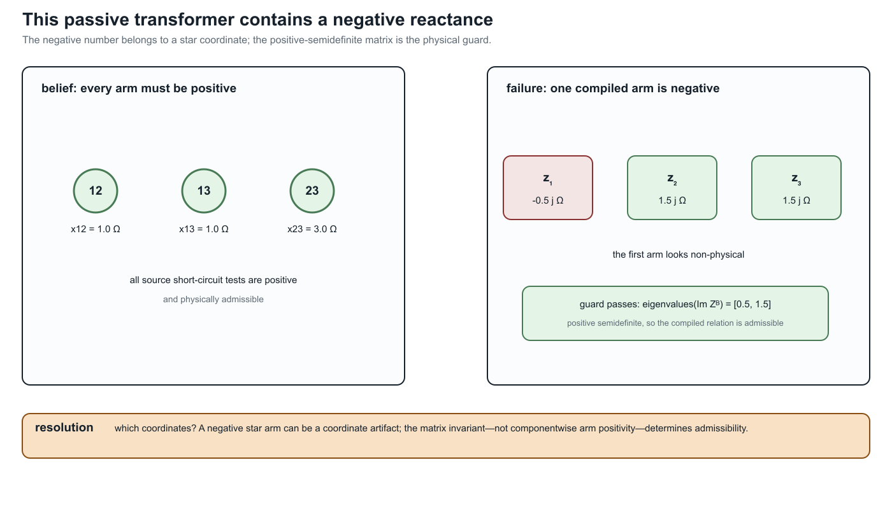

# [Multiwinding leakage reference compilation](@id multiwinding-leakage-reference-compilation)

**Page status:** exact reference-compilation construction with executable
round-trip evidence; independent transformer review remains open.

Pairwise short-circuit data are a compact source description of transformer
leakage, but they are not yet the matrix relation required by a
multiconductor network model. This chapter gives an exact compilation for an
arbitrary number of windings. It keeps winding identity, ratios, and limits
explicit and does not assume that the general result is a diagonal star.

## Source contract

Let transformer ``x`` have ordered windings

```math
\mathcal K_x=\{1,\ldots,n_x\},
```

The source provides nominal coil voltages ``v_k^{\mathrm{nom}}``, winding
resistances ``r_k``, current limits ``\overline i_k``, and a short-circuit
reactance ``x_{ij}^{\mathrm{sc}}`` for every unordered pair
``1\leq i<j\leq n_x``. It must identify the winding ``s`` whose voltage base
is used for those reactances.

The compilation may independently select any winding ``r\in\mathcal K_x`` as
its internal reference. Define

```math
N_k^{(r)}=\frac{v_k^{\mathrm{nom}}}{v_r^{\mathrm{nom}}},
\qquad
r_k^{(r)}=\frac{r_k}{(N_k^{(r)})^2},
\qquad
x_{ij}^{\mathrm{sc},(r)}
=x_{ij}^{\mathrm{sc},(s)}
 \left(\frac{v_r^{\mathrm{nom}}}{v_s^{\mathrm{nom}}}\right)^2,
```

and the pairwise impedance referred to the selected winding,

```math
z_{ij}^{\mathrm{sc},(r)}
=r_i^{(r)}+r_j^{(r)}+\mathrm j x_{ij}^{\mathrm{sc},(r)}.
```

The pair indices describe winding tests, not fictitious independent
two-winding transformers. Per-winding limits remain attached to ``k``.

```@raw latex
\newpage
```

## Exact reference coordinates

```@raw latex
\mbox{\strut}\par
```

Let ``p_r`` enumerate the windings in ``\mathcal K_x\setminus\{r\}`` without
changing their relative order. For nonreference windings ``i`` and ``j``, form

```math
\left[\mathbf Z_x^{\mathrm B,(r)}\right]_{p_r(i),p_r(j)}
=\frac{1}{2}\left(
z_{ri}^{\mathrm{sc},(r)}+z_{rj}^{\mathrm{sc},(r)}
-z_{ij}^{\mathrm{sc},(r)}
\right),
```

using ``z_{ii}^{\mathrm{sc},(r)}=0`` on the diagonal. This produces the full
``(n_x-1)\times(n_x-1)`` reference impedance matrix. Its off-diagonal entries
are generally nonzero and are essential when ``n_x>3``.

The construction is invertible on the declared pairwise data:

```math
z_{rj}^{\mathrm{sc},(r)}
=\left[\mathbf Z_x^{\mathrm B,(r)}\right]_{p_r(j),p_r(j)},
```

and, for ``i,j\ne r``,

```math
z_{ij}^{\mathrm{sc},(r)}
=\left[\mathbf Z_x^{\mathrm B,(r)}\right]_{p_r(i),p_r(i)}
 +\left[\mathbf Z_x^{\mathrm B,(r)}\right]_{p_r(j),p_r(j)}
 -2\left[\mathbf Z_x^{\mathrm B,(r)}\right]_{p_r(i),p_r(j)}.
```

Thus the compilation forgets none of the pairwise tests. It changes their
coordinates and exposes a matrix factor suitable for network assembly.

## External winding admittance

Let ``\mathbf C_x^{(r)}\in\mathbb R^{(n_x-1)\times n_x}`` have row
``p_r(i)`` equal to ``\mathbf e_r^\mathsf T-\mathbf e_i^\mathsf T``, and let
``\mathbf D_x^{(r)}=\operatorname{diag}(N_1^{(r)},\ldots,N_{n_x}^{(r)})``.
When ``\mathbf Z_x^{\mathrm B,(r)}`` is nonsingular, the leakage admittance in
the external winding coordinates is

```math
\mathbf Y_x^{\mathrm w}
=(\mathbf D_x^{(r)})^{-1}
 (\mathbf C_x^{(r)})^\mathsf T
 (\mathbf Z_x^{\mathrm B,(r)})^{-1}
 \mathbf C_x^{(r)}
 (\mathbf D_x^{(r)})^{-1}.
```

This is a compilation of the leakage relation. Wye/delta terminal-to-coil
incidence, terminal ordering, tap decisions, and network interconnection are
separate factors and must be composed explicitly.

## Reference-choice invariance

Changing ``r`` changes the impedance base, reference differences, and entries
of ``\mathbf Z_x^{\mathrm B,(r)}``. It does not change the external relation
in winding-own voltage and current coordinates:

```math
\mathbf Y_x^{\mathrm w,(r)}=\mathbf Y_x^{\mathrm w,(q)},
\qquad r,q\in\mathcal K_x.
```

This equality is the appropriate invariant. Comparing the internal ``Z_B``
matrices directly would be a coordinate error because they use different
impedance bases and reference-difference rows. The executable rule compiles
every possible ``r`` and compares the resulting external admittances.
For the running BMOPFTools fixture, the schema convention makes winding 1 the
source impedance reference ``s``; the generated certificate records that
interpretation separately from the selected compilation reference ``r``.

## Three windings are the special case

For ``n_x=3``, the familiar star/T arms are

```math
z_1=\tfrac12(z_{12}^{\mathrm{sc}}+z_{13}^{\mathrm{sc}}-z_{23}^{\mathrm{sc}}),
\quad
z_2=\tfrac12(z_{12}^{\mathrm{sc}}+z_{23}^{\mathrm{sc}}-z_{13}^{\mathrm{sc}}),
\quad
z_3=\tfrac12(z_{13}^{\mathrm{sc}}+z_{23}^{\mathrm{sc}}-z_{12}^{\mathrm{sc}}).
```

An individual arm reactance can be negative without invalidating the pairwise
test set. The implemented physical guard therefore checks positive
semidefiniteness of the symmetric matrix
``\operatorname{Im}(\mathbf Z_x^{\mathrm B,(r)})``; it does not impose a
componentwise nonnegative-arm rule. The executable tests include a valid
negative-arm case and a nearby non-PSD rejection.

The reader-facing witness makes the distinction concrete: three positive
pairwise tests ``(1.0,1.0,3.0)\ \Omega`` compile to a star with
``\operatorname{Im}(z_1)=-0.5\ \Omega`` and
``\lambda(\operatorname{Im}(Z_B))=(0.5,1.5)``. The negative entry is a
coordinate result, not a negative physical test. The generated evidence is
`negative_star_arm_witness` in
`experiments/generated/multiwinding-leakage-compilation-certificate.json`.



## Running transformer

For fixture transformer ``x_1``, all three referred winding resistances are
``0.38875225\ \Omega``. The compiled matrix is

```math
\mathbf Z_{x_1}^{\mathrm B}=
\begin{bmatrix}
0.7775045+\mathrm j4.665027 & 0.38875225+\mathrm j3.110018\\
0.38875225+\mathrm j3.110018 & 0.7775045+\mathrm j5.4425315
\end{bmatrix}\ \Omega.
```

Its reactance eigenvalues are approximately ``1.91956`` and ``8.18800``, and
the round trip recovers the three source reactances exactly to floating-point
tolerance. The corresponding star-arm reactances are ``3.110018``,
``1.555009``, and ``2.3325135\ \Omega``.

Repeating the compilation with each of the three windings as ``r`` gives
distinct matrices on the corresponding voltage bases. After mapping back to
winding-own coordinates, the largest entrywise difference among their
external admittance matrices is ``2.84\times10^{-14}\ \mathrm S``. The
certificate records this fixture-level invariance check.

The generated certificate `TR-XFMR-002` classifies this as an
`exact_compilation`. Its typed interfaces state that winding limits and
external coil quantities remain at the boundary, while reference-coordinate
states are introduced internally. The package-independent implementation and
positive, negative, incomplete-data, and four-winding tests live under
`experiments/transformations` and `experiments/test`.

## Decision-model boundary

The exactness claim concerns the fixed-parameter leakage relation and the
declared pairwise source data. A target optimization model is decision-exact
only if it also retains winding current limits, connection factors, tap or
phase-shift decisions, thermal states, and any objective terms indexed by the
original windings. The certificate retains the fixture's per-winding current
limits by identity; it does not claim to compile an adjustable tap model.

[Multiwinding terminal leakage assembly](@ref
multiwinding-terminal-leakage-assembly) performs the next exact composition:
it combines this coil-coordinate relation with grounded-wye and delta
connection factors while retaining a lifted coil-current constraint map.
